# Entity-Relationship Diagram

This ER diagram represents the database schema for the NGS360 API Server.

## Diagram

```mermaid
erDiagram
    %% ==========================================
    %% Authentication & User Management
    %% ==========================================
    
    User ||--o{ RefreshToken : "has"
    User ||--o{ OAuthProvider : "links to"
    User ||--o{ PasswordResetToken : "has"
    User ||--o{ EmailVerificationToken : "has"
    
    User {
        uuid id PK
        string email UK
        string username UK
        string hashed_password
        string full_name
        boolean is_active
        boolean is_verified
        boolean is_superuser
        datetime created_at
        datetime updated_at
        datetime last_login
        int failed_login_attempts
        datetime locked_until
    }
    
    RefreshToken {
        uuid id PK
        string username FK
        string token UK
        datetime expires_at
        datetime created_at
        boolean revoked
        datetime revoked_at
        string device_info
    }
    
    OAuthProvider {
        uuid id PK
        uuid user_id FK
        string provider_name
        string provider_user_id
        string access_token
        string refresh_token
        datetime token_expires_at
        datetime created_at
        datetime updated_at
    }
    
    PasswordResetToken {
        uuid id PK
        string username FK
        string token UK
        datetime expires_at
        datetime created_at
        boolean used
        datetime used_at
    }
    
    EmailVerificationToken {
        uuid id PK
        string username FK
        string token UK
        datetime expires_at
        datetime created_at
        boolean used
        datetime used_at
    }
    
    %% ==========================================
    %% Settings & Configuration
    %% ==========================================
    
    Setting {
        string key PK
        string value
        string name
        string description
        json tags
        datetime created_at
        datetime updated_at
    }
    
    Vendor {
        uuid id PK
        string vendor_id UK
        string name
        string description
        string bucket
    }
    
    %% ==========================================
    %% Sequencing Runs
    %% ==========================================
    
    SequencingRun ||--o{ SampleSequencingRun : "contains"
    
    SequencingRun {
        uuid id PK
        date run_date
        string machine_id
        int run_number
        string flowcell_id
        string experiment_name
        string run_folder_uri
        enum status
        string run_time
        string sequencing_platform
    }
    
    SampleSequencingRun {
        uuid id PK
        uuid sample_id FK
        uuid sequencing_run_id FK
        datetime created_at
        string created_by
    }
    
    %% ==========================================
    %% Projects & Samples
    %% ==========================================
    
    Project ||--o{ ProjectAttribute : "has"
    Project ||--o{ Sample : "contains"
    
    Project {
        uuid id PK
        string project_id UK
        string name
    }
    
    ProjectAttribute {
        uuid id PK
        uuid project_id FK
        string key
        string value
    }
    
    Sample ||--o{ SampleAttribute : "has"
    Sample ||--o{ FileSample : "associated with"
    Sample ||--o{ QCMetricSample : "has metrics"
    Sample ||--o{ SampleSequencingRun : "linked to runs"
    
    Sample {
        uuid id PK
        string sample_id
        string project_id FK
    }
    
    SampleAttribute {
        uuid id PK
        uuid sample_id FK
        string key
        string value
    }
    
    %% ==========================================
    %% Files System
    %% ==========================================
    
    File ||--o{ FileHash : "has"
    File ||--o{ FileTag : "tagged with"
    File ||--o{ FileSample : "linked to"
    File ||--o{ FileProject : "belongs to project"
    File ||--o{ FileSequencingRun : "belongs to run"
    File ||--o{ FileQCRecord : "belongs to qcrecord"
    File ||--o{ FileWorkflowRun : "belongs to workflow run"
    File ||--o{ FilePipeline : "belongs to pipeline"
    
    Project ||--o{ FileProject : "has files"
    SequencingRun ||--o{ FileSequencingRun : "has files"
    QCRecord ||--o{ FileQCRecord : "has files"
    WorkflowRun ||--o{ FileWorkflowRun : "has files"
    Pipeline ||--o{ FilePipeline : "has files"
    
    File {
        uuid id PK
        string uri
        string original_filename
        bigint size
        datetime created_on
        string created_by
        string source
        string storage_backend
    }
    
    FileHash {
        uuid id PK
        uuid file_id FK
        string algorithm
        string value
    }
    
    FileTag {
        uuid id PK
        uuid file_id FK
        string key
        string value
    }
    
    FileSample {
        uuid id PK
        uuid file_id FK
        uuid sample_id FK
        string role
    }
    
    FileProject {
        uuid id PK
        uuid file_id FK
        uuid project_id FK
        string role
    }
    
    FileSequencingRun {
        uuid id PK
        uuid file_id FK
        uuid sequencing_run_id FK
        string role
    }
    
    FileQCRecord {
        uuid id PK
        uuid file_id FK
        uuid qcrecord_id FK
        string role
    }
    
    FileWorkflowRun {
        uuid id PK
        uuid file_id FK
        uuid workflow_run_id FK
        string role
    }
    
    FilePipeline {
        uuid id PK
        uuid file_id FK
        uuid pipeline_id FK
        string role
    }
    
    %% ==========================================
    %% QC Metrics & Records
    %% ==========================================
    
    QCRecord ||--o{ QCRecordMetadata : "has"
    QCRecord ||--o{ QCMetric : "contains"
    
    QCRecord {
        uuid id PK
        datetime created_on
        string created_by
        string project_id
    }
    
    QCRecordMetadata {
        uuid id PK
        uuid qcrecord_id FK
        string key
        string value
    }
    
    QCMetric ||--o{ QCMetricValue : "has"
    QCMetric ||--o{ QCMetricSample : "associated with"
    
    QCMetric {
        uuid id PK
        uuid qcrecord_id FK
        string name
    }
    
    QCMetricValue {
        uuid id PK
        uuid qc_metric_id FK
        string key
        string value_string
        float value_numeric
        string value_type
    }
    
    QCMetricSample {
        uuid id PK
        uuid qc_metric_id FK
        uuid sample_id FK
        string role
    }
    
    %% ==========================================
    %% Workflows & Platforms
    %% ==========================================
    
    Platform ||--o{ WorkflowRegistration : "hosts"
    Platform ||--o{ WorkflowRun : "executes"
    
    Platform {
        string name PK
    }
    
    Workflow ||--o{ WorkflowAttribute : "has"
    Workflow ||--o{ WorkflowRegistration : "registered on"
    Workflow ||--o{ WorkflowRun : "has executions"
    
    Workflow {
        uuid id PK
        string name
        string version
        string definition_uri
        datetime created_at
        string created_by
    }
    
    WorkflowAttribute {
        uuid id PK
        uuid workflow_id FK
        string key
        string value
    }
    
    WorkflowRegistration {
        uuid id PK
        uuid workflow_id FK
        string engine FK
        string external_id
        datetime created_at
        string created_by
    }
    
    WorkflowRun ||--o{ WorkflowRunAttribute : "has"
    
    WorkflowRun {
        uuid id PK
        uuid workflow_id FK
        string engine FK
        string external_run_id
        datetime created_at
        string created_by
    }
    
    WorkflowRunAttribute {
        uuid id PK
        uuid workflow_run_id FK
        string key
        string value
    }
    
    %% ==========================================
    %% Batch Jobs
    %% ==========================================
    
    BatchJob {
        uuid id PK
        string name
        string command
        string user
        datetime submitted_on
        string aws_job_id
        string log_stream_name
        enum status
        boolean viewed
    }
```

## Table Descriptions

### Authentication & User Management

- **User**: Core user accounts with authentication credentials and profile information
- **RefreshToken**: Long-lived tokens for maintaining user sessions
- **OAuthProvider**: Links users to external OAuth providers (Google, GitHub, Microsoft, Corp)
- **PasswordResetToken**: Temporary tokens for password reset functionality
- **EmailVerificationToken**: Tokens for email address verification

### Settings & Configuration

- **Setting**: Application-level settings with key-value pairs
- **Vendor**: External vendor configurations (e.g., sequencing service providers)

### Sequencing Runs

- **SequencingRun**: Represents a sequencing run from Illumina or ONT platforms
- **SampleSequencingRun**: Junction table linking samples to sequencing runs (many-to-many)

### Projects & Samples

- **Project**: Research projects that contain samples
- **ProjectAttribute**: Key-value attributes for projects
- **Sample**: Biological samples within projects
- **SampleAttribute**: Key-value attributes for samples

### File System

- **File**: Core file entity supporting both uploads and external file references
- **FileHash**: Hash values for files (supports multiple algorithms: md5, sha256, etag)
- **FileTag**: Flexible key-value metadata tags for files
- **FileSample**: Many-to-many relationship between files and samples (supports roles for paired analysis)
- **FileProject**: Junction table linking files to projects (with optional role)
- **FileSequencingRun**: Junction table linking files to sequencing runs (with optional role)
- **FileQCRecord**: Junction table linking files to QC records (with optional role)
- **FileWorkflowRun**: Junction table linking files to workflow runs (with optional role)
- **FilePipeline**: Junction table linking files to pipelines (with optional role)

### QC Metrics & Records

- **QCRecord**: Main QC record entity - one per pipeline execution per project
- **QCRecordMetadata**: Pipeline-level metadata (pipeline name, version, configuration)
- **QCMetric**: Named groups of metrics within a QC record
- **QCMetricValue**: Individual metric key-value pairs (stores both string and numeric values)
- **QCMetricSample**: Associates samples with metrics (supports workflow-level, single-sample, and multi-sample metrics)

### Workflows & Platforms

- **Platform**: Registered workflow execution platforms (e.g., Arvados, SevenBridges)
- **Workflow**: Platform-agnostic workflow definitions
- **WorkflowAttribute**: Key-value attributes for workflows
- **WorkflowRegistration**: Platform-specific registrations of workflows (links workflow to platform)
- **WorkflowRun**: Execution records of workflows on specific platforms (provenance tracking)
- **WorkflowRunAttribute**: Key-value metadata for workflow runs

### Batch Jobs

- **BatchJob**: AWS Batch job submissions and status tracking

## Key Relationships

1. **Project → Sample**: One-to-many (a project contains multiple samples)
2. **Sample → FileSample → File**: Many-to-many (samples can have multiple files, files can belong to multiple samples)
3. **Sample → SampleSequencingRun → SequencingRun**: Many-to-many (samples can be in multiple runs, runs contain multiple samples)
4. **File → FileProject → Project**: Many-to-many (files can belong to projects via typed junction table)
5. **File → FileSequencingRun → SequencingRun**: Many-to-many (files can belong to sequencing runs)
6. **File → FileQCRecord → QCRecord**: Many-to-many (files can belong to QC records)
7. **File → FileWorkflowRun → WorkflowRun**: Many-to-many (files can belong to workflow runs)
8. **File → FilePipeline → Pipeline**: Many-to-many (files can belong to pipelines)
9. **QCRecord → QCMetric → QCMetricSample → Sample**: QC metrics are organized hierarchically and can be associated with samples
10. **User → Authentication Tokens**: One-to-many (users can have multiple active sessions and tokens)
11. **Workflow → WorkflowRegistration → Platform**: Many-to-many (workflows can be registered on multiple platforms)
12. **Workflow → WorkflowRun**: One-to-many (workflows have multiple execution instances)
13. **Platform → WorkflowRegistration**: One-to-many (platforms host multiple workflow registrations)
14. **Platform → WorkflowRun**: One-to-many (platforms execute multiple workflow runs)

## Unique Constraints

- **File**: `(uri, created_on)` - Enables file versioning
- **Sample**: `(sample_id, project_id)` - Sample IDs are unique within projects
- **FileProject**: `(file_id, project_id)` - Prevents duplicate file-project associations
- **FileSequencingRun**: `(file_id, sequencing_run_id)` - Prevents duplicate file-run associations
- **FileQCRecord**: `(file_id, qcrecord_id)` - Prevents duplicate file-qcrecord associations
- **FileWorkflowRun**: `(file_id, workflow_run_id)` - Prevents duplicate file-workflowrun associations
- **FilePipeline**: `(file_id, pipeline_id)` - Prevents duplicate file-pipeline associations
- **FileSample**: `(file_id, sample_id)` - Prevents duplicate file-sample associations
- **QCMetricSample**: `(qc_metric_id, sample_id)` - Prevents duplicate metric-sample associations
- **SampleSequencingRun**: `(sample_id, sequencing_run_id)` - Prevents duplicate sample-run associations
- **WorkflowRegistration**: `(workflow_id, engine)` - One registration per workflow per platform
- **ProjectAttribute**: `(project_id, key)` - One value per key per project
- **SampleAttribute**: `(sample_id, key)` - One value per key per sample

## Indexes

Key indexes are created on:
- Foreign key columns for join performance
- Searchable fields (email, username, project_id, sample_id, etc.)
- Unique constraint columns
- `qc_metric_id` and `sample_id` in QCMetricSample for efficient queries
- `qcrecord_id` and `name` in QCMetric for metric lookups

## Notable Features

### File Versioning
Files support versioning through the composite unique constraint on `(uri, created_on)`. The same file path can exist multiple times with different timestamps, enabling version history tracking.

### Sample-Run Association
The **SampleSequencingRun** junction table tracks which samples were processed in which sequencing runs, with audit fields (`created_at`, `created_by`) for provenance.

### Workflow Provenance
The workflow system supports full provenance tracking:
- **Workflow**: Platform-agnostic definition
- **WorkflowRegistration**: Links workflows to specific platforms (e.g., workflow X registered on Arvados)
- **WorkflowRun**: Records each execution with platform-specific external IDs and metadata

### Flexible Metadata
Multiple tables use key-value pairs for extensible metadata:
- ProjectAttribute, SampleAttribute, WorkflowAttribute, WorkflowRunAttribute
- QCRecordMetadata, QCMetricValue
- FileTag

### Multi-Sample Support
The system supports multi-sample analyses through role-based associations:
- **FileSample**: Files can be linked to multiple samples with roles (e.g., tumor/normal)
- **QCMetricSample**: Metrics can be associated with multiple samples with roles
