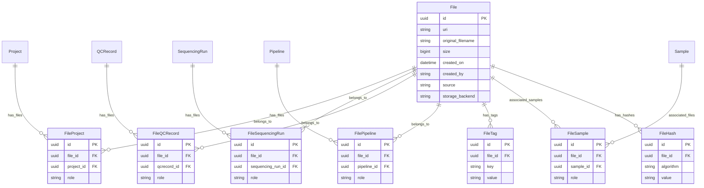

# Unified File Model

This document describes the unified file model architecture used throughout the API server for managing file metadata and associations.

## Overview

The API server uses a single, unified `File` model that supports:

- **File uploads**: Direct uploads to storage backends (S3, local, Azure, GCS)
- **External file references**: Metadata records for files stored externally (e.g., pipeline outputs)
- **Typed entity associations**: Files are linked to specific entity types via dedicated junction tables (FileProject, FileSequencingRun, FileQCRecord, FilePipeline)
- **Flexible sample associations with roles**: Support for tumor/normal, case/control, and other paired analysis patterns
- **Multi-algorithm hash storage**: MD5, SHA-256, S3 ETags, etc.
- **Flexible key-value tags**: Extensible metadata without schema changes

## Architecture

### Entity Relationship Diagram


```mermaid
erDiagram
    Project ||--o{ FileProject : has_files
    QCRecord ||--o{ FileQCRecord : has_files
    SequencingRun ||--o{ FileSequencingRun : has_files
    Pipeline ||--o{ FilePipeline : has_files

    Sample ||--o{ FileSample : associated_files

    File ||--o{ FileProject : belongs_to
    File ||--o{ FileSequencingRun : belongs_to
    File ||--o{ FileQCRecord : belongs_to
    File ||--o{ FilePipeline : belongs_to
    File ||--o{ FileTag : has_tags
    File ||--o{ FileSample : associated_samples
    File ||--o{ FileHash : has_hashes

    FileProject {
        uuid id PK
        uuid file_id FK
        uuid project_id FK
        string role
    }

    FileSequencingRun {
        uuid id PK
        uuid file_id FK
        uuid sequencing_run_id FK
        string role
    }

    FileQCRecord {
        uuid id PK
        uuid file_id FK
        uuid qcrecord_id FK
        string role
    }

    FilePipeline {
        uuid id PK
        uuid file_id FK
        uuid pipeline_id FK
        string role
    }

    File {
        uuid id PK
        string uri
        string original_filename
        bigint size
        datetime created_on
        string created_by
        string source
        string storage_backend
    }

    FileTag {
        uuid id PK
        uuid file_id FK
        string key
        string value
    }

    FileSample {
        uuid id PK
        uuid file_id FK
        uuid sample_id FK
        string role
    }

    FileHash {
        uuid id PK
        uuid file_id FK
        string algorithm
        string value
    }
```

## Database Schema

### file

Core file entity supporting both uploads and external references.

| Column | Type | Constraints | Description |
|--------|------|-------------|-------------|
| id | UUID | PK | Primary key |
| uri | VARCHAR(512) | NOT NULL | File location (s3://, file://, etc.) |
| original_filename | VARCHAR(255) | | Original filename (for uploads, before any renaming) |
| size | BIGINT | | File size in bytes |
| created_on | TIMESTAMP | NOT NULL | File creation/upload timestamp |
| created_by | VARCHAR(100) | | User who created/uploaded the file |
| source | VARCHAR(1024) | | Origin of file record (e.g., manifest URI that created this record) |
| storage_backend | VARCHAR(20) | | Storage type: LOCAL, S3, AZURE, GCS |

**Unique constraint**: `(uri, created_on)` - Enables file versioning where the same URI can have multiple versions differentiated by timestamp.

**Key concepts**:
- The `uri` field is the file location. The filename can be derived as `uri.split('/')[-1]`
- The `source` field tracks where the file *record* originated from (e.g., the manifest file that registered this file), not the file's storage location
- For uploads, `original_filename` preserves the user's filename before any collision-avoidance renaming
- `storage_backend` is primarily relevant for uploaded files; external references may leave this NULL

**Version queries**:
```sql
-- Latest version of a file
SELECT * FROM file WHERE uri = ? ORDER BY created_on DESC LIMIT 1

-- All versions of a file
SELECT * FROM file WHERE uri = ? ORDER BY created_on
```

### Typed Entity Junction Tables

Files are associated with entities through **typed junction tables** — one table per entity type. Each table has UUID foreign keys with `ON DELETE CASCADE` to both the file and the entity, plus an optional `role` column.

This replaces the previous polymorphic `fileentity` table which used `entity_type` + `entity_id` strings.

#### fileproject

| Column | Type | Constraints | Description |
|--------|------|-------------|-------------|
| id | UUID | PK | Primary key |
| file_id | UUID | FK → file.id, NOT NULL, ON DELETE CASCADE | File reference |
| project_id | UUID | FK → project.id, NOT NULL, ON DELETE CASCADE | Project reference |
| role | VARCHAR(50) | | Optional role (e.g., manifest, readme) |

**Unique constraint**: `(file_id, project_id)`

#### filesequencingrun

| Column | Type | Constraints | Description |
|--------|------|-------------|-------------|
| id | UUID | PK | Primary key |
| file_id | UUID | FK → file.id, NOT NULL, ON DELETE CASCADE | File reference |
| sequencing_run_id | UUID | FK → sequencingrun.id, NOT NULL, ON DELETE CASCADE | SequencingRun reference |
| role | VARCHAR(50) | | Optional role (e.g., samplesheet, metrics) |

**Unique constraint**: `(file_id, sequencing_run_id)`

#### fileqcrecord

| Column | Type | Constraints | Description |
|--------|------|-------------|-------------|
| id | UUID | PK | Primary key |
| file_id | UUID | FK → file.id, NOT NULL, ON DELETE CASCADE | File reference |
| qcrecord_id | UUID | FK → qcrecord.id, NOT NULL, ON DELETE CASCADE | QCRecord reference |
| role | VARCHAR(50) | | Optional role (e.g., output, report) |

**Unique constraint**: `(file_id, qcrecord_id)`

#### filepipeline

| Column | Type | Constraints | Description |
|--------|------|-------------|-------------|
| id | UUID | PK | Primary key |
| file_id | UUID | FK → file.id, NOT NULL, ON DELETE CASCADE | File reference |
| pipeline_id | UUID | FK → pipeline.id, NOT NULL, ON DELETE CASCADE | Pipeline reference |
| role | VARCHAR(50) | | Optional role (e.g., config, documentation) |

**Unique constraint**: `(file_id, pipeline_id)`

### filehash

Hash values for files (supports multiple algorithms per file).

| Column | Type | Constraints | Description |
|--------|------|-------------|-------------|
| id | UUID | PK | Primary key |
| file_id | UUID | FK → file.id, NOT NULL, ON DELETE CASCADE | Parent file |
| algorithm | VARCHAR(50) | NOT NULL | Hash algorithm (md5, sha256, etag) |
| value | VARCHAR(128) | NOT NULL | Hash value |

**Unique constraint**: `(file_id, algorithm)`

### filetag

Flexible key-value metadata for files.

| Column | Type | Constraints | Description |
|--------|------|-------------|-------------|
| id | UUID | PK | Primary key |
| file_id | UUID | FK → file.id, NOT NULL, ON DELETE CASCADE | Parent file |
| key | VARCHAR(255) | NOT NULL | Tag key |
| value | TEXT | NOT NULL | Tag value |

**Unique constraint**: `(file_id, key)`

**Standard tags**:
| Key | Values | Description |
|-----|--------|-------------|
| archived | true/false | Whether file is archived |
| public | true/false | Whether file is publicly accessible |
| description | (text) | Human-readable description |
| type | alignment, variant, expression, qc_report, etc. | File category |
| format | bam, vcf, fastq, csv, etc. | File format |

### filesample

Associates samples with a file via foreign key to the `sample` table (supports roles for paired analysis).

| Column | Type | Constraints | Description |
|--------|------|-------------|-------------|
| id | UUID | PK | Primary key |
| file_id | UUID | FK → file.id, NOT NULL, ON DELETE CASCADE | Parent file |
| sample_id | UUID | FK → sample.id, NOT NULL, ON DELETE CASCADE | Reference to sample record |
| role | VARCHAR(50) | | Optional role (tumor, normal, case, control) |

**Unique constraint**: `(file_id, sample_id)`

**Foreign keys**:
- `file_id` → `file.id` (ON DELETE CASCADE)
- `sample_id` → `sample.id` (ON DELETE CASCADE)

**Association patterns**:
- **Workflow-level file** (e.g., expression matrix): No FileSample entries
- **Single-sample file** (e.g., BAM file): One FileSample entry with `role=null`
- **Multi-sample file** (e.g., tumor/normal VCF): Multiple FileSample entries with roles

**Sample resolution**: When creating a file with sample associations, the service layer resolves each `sample_name` to a `sample.id` using [`resolve_or_create_sample()`](../api/samples/services.py:26). If no matching Sample record exists for the given `(sample_name, project_id)`, a stub Sample is auto-created with `SampleAttribute(key="auto_created_stub", value="true")`. See [Auto-Created Stub Samples](#auto-created-stub-samples).

## Sample Association Patterns

### Single-sample file (BAM)

```
File:
  uri: s3://bucket/Sample1.bam

FileQCRecord:
  qcrecord_id: <qcrecord_uuid>
  role: output

FileSample:
  sample_id: <sample_uuid>  (resolved from sample_name "Sample1")
  role: null  (single sample, no role needed)
```

### Tumor/Normal paired file (VCF)

```
File:
  uri: s3://bucket/Sample1_Sample2.somatic.vcf

FileQCRecord:
  qcrecord_id: <qcrecord_uuid>
  role: output

FileSample:
  - sample_id: <sample1_uuid>, role: tumor
  - sample_id: <sample2_uuid>, role: normal
```

### Workflow-level file (expression matrix)

```
File:
  uri: s3://bucket/expression_matrix.tsv

FileQCRecord:
  qcrecord_id: <qcrecord_uuid>
  role: output

FileSample: (none - workflow level output)
```

## API Endpoints

### Create a file

**POST /api/files**

Create a new file record (upload or reference).

**Request Body** (JSON):
```json
{
  "uri": "s3://bucket/path/sample1.bam",
  "original_filename": "my_sample.bam",
  "source": "s3://qc-outputs/pipeline-run-123/manifest.json",
  "size": 1234567890,
  "project_id": "P-12345",
  "qcrecord_id": "550e8400-e29b-41d4-a716-446655440000",
  "samples": [
    {"sample_name": "Sample1", "role": null}
  ],
  "hashes": {"md5": "abc123...", "sha256": "def456..."},
  "tags": {"type": "alignment", "format": "bam"}
}
```

**Notes**:
- `uri` is required and serves as the unique identifier
- `original_filename` is optional - only needed for uploads where the filename was renamed
- Filename can be derived from `uri.split('/')[-1]`
- `project_id` is **required** when `samples` are provided (used to resolve sample names to `sample.id` UUIDs). The validator raises an error if samples are provided without a `project_id`.
- Entity associations use typed fields: `project_id`, `sequencing_run_id`, `qcrecord_id`, `pipeline_id`

### Upload a file

**POST /api/files/upload** (multipart/form-data)

Upload a file directly. Exactly one entity field must be provided:

| Form Field | Type | Description |
|------------|------|-------------|
| file | File | The file to upload |
| project_id | string | Associate with a project |
| sequencing_run_id | string | Associate with a sequencing run |
| qcrecord_id | string | Associate with a QC record |
| pipeline_id | string | Associate with a pipeline |
| relative_path | string | Optional subdirectory path |

### Get file by ID

**GET /api/files/{id}**

Get file metadata by UUID.

### Get file by URI

**GET /api/files?uri={uri}**

Get file metadata by URI (URL-encoded).

### List files for an entity

**GET /api/files?entity_type=PROJECT&entity_id={id}**

List all files associated with a specific entity. Valid entity types: `PROJECT`, `RUN`, `SAMPLE`, `QCRECORD`, `PIPELINE`.

### Response format

```json
{
  "id": "550e8400-e29b-41d4-a716-446655440000",
  "uri": "s3://bucket/path/sample1.bam",
  "filename": "sample1.bam",
  "original_filename": "my_sample.bam",
  "size": 1234567890,
  "created_on": "2026-02-01T12:00:00Z",
  "created_by": "user@example.com",
  "source": "s3://qc-outputs/pipeline-run-123/manifest.json",
  "storage_backend": "S3",
  "associations": [
    {"entity_type": "PROJECT", "entity_id": "project-uuid", "role": null},
    {"entity_type": "QCRECORD", "entity_id": "qcrecord-uuid", "role": "output"}
  ],
  "samples": ["Sample1"],
  "hashes": [
    {"algorithm": "md5", "value": "abc123..."}
  ],
  "tags": [
    {"key": "type", "value": "alignment"}
  ]
}
```

The `associations` field is a flattened list derived from all typed junction tables, each with `entity_type`, `entity_id`, and `role`.

## Auto-Created Stub Samples

When a file or QC record references a `sample_name` that doesn't yet exist in the `sample` table for the given project, the system automatically creates a **stub Sample** record. This ensures referential integrity (the `filesample.sample_id` and `qcmetricsample.sample_id` foreign keys always point to valid records) without requiring samples to be pre-registered.

Stub samples are tagged with:
```
SampleAttribute(key="auto_created_stub", value="true")
```

This allows downstream processes to distinguish stubs from fully-registered samples and backfill metadata later.

**Resolution logic** (in [`resolve_or_create_sample()`](../api/samples/services.py:26)):
1. Look up `Sample` by `(sample_id=sample_name, project_id=project_id)`
2. If found → return its `id` (UUID)
3. If not found → create a stub Sample with the `auto_created_stub` attribute, flush to DB (without commit), and return its `id`

## Code Reference

### Models

The unified file model is defined in [`api/files/models.py`](../api/files/models.py):

- [`File`](../api/files/models.py:214) - Core file entity
- [`FileProject`](../api/files/models.py:108) - Project junction table
- [`FileSequencingRun`](../api/files/models.py:129) - SequencingRun junction table
- [`FileQCRecord`](../api/files/models.py:149) - QCRecord junction table
- [`FilePipeline`](../api/files/models.py:168) - Pipeline junction table
- [`FileHash`](../api/files/models.py:35) - Hash values
- [`FileTag`](../api/files/models.py:56) - Key-value tags
- [`FileSample`](../api/files/models.py:82) - Sample associations (FK → `sample.id`)

### Entity Association Tables

Each typed junction table has:
- `file_id` FK → `file.id` (ON DELETE CASCADE)
- Entity-specific FK (ON DELETE CASCADE)
- Optional `role` column
- Unique constraint on `(file_id, entity_id)`

| Table | Entity FK | Target Table |
|-------|-----------|--------------|
| FileProject | project_id | project |
| FileSequencingRun | sequencing_run_id | sequencingrun |
| FileQCRecord | qcrecord_id | qcrecord |
| FilePipeline | pipeline_id | pipeline |

### Helper Functions

- [`file_to_public()`](../api/files/models.py:619) - Convert File model to API response (aggregates all typed associations)
- [`file_to_summary()`](../api/files/models.py:670) - Convert File model to compact summary
- [`resolve_or_create_sample()`](../api/samples/services.py:26) - Resolve sample_name to sample.id UUID

## Cascade Deletes

All child tables cascade delete when the parent file is deleted:
- `file` → `fileproject`, `filesequencingrun`, `fileqcrecord`, `filepipeline`, `filehash`, `filetag`, `filesample`

Entity-side cascades also apply — deleting a project removes its `fileproject` rows, deleting a sequencing run removes its `filesequencingrun` rows, etc.

Additionally, `filesample` and `qcmetricsample` rows cascade delete when their referenced `sample` is deleted (via `ON DELETE CASCADE` on the `sample_id` FK).

When a QCRecord is deleted, its associated FileQCRecord entries are automatically deleted. The service layer also explicitly deletes the File records themselves (since QCRecord output files typically have no other entity associations).

## Integration with QCMetrics

The unified File model integrates with the QCMetrics system for storing pipeline output files. When creating a QCRecord via the `/api/v1/qcmetrics` endpoint, output files are automatically:

1. Created as File records
2. Associated with the QCRecord via FileQCRecord (typed junction table)
3. Linked to samples via FileSample (sample names resolved to `sample.id` UUIDs)
4. `project_id` is propagated from the QCRecord to nested FileCreate models automatically

See [`docs/QCMETRICS.md`](./QCMETRICS.md) for details on the QCMetrics API, or reference the QCMetrics routes at [`api/qcmetrics/routes.py`](../api/qcmetrics/routes.py).

## Migration from FileEntity

The typed junction tables replaced the polymorphic `fileentity` table in Phase 2 of the model migration. The migration ([`9427dcbe7514`](../alembic/versions/9427dcbe7514_replace_fileentity_with_typed_junction_.py)) handles data migration for existing `PROJECT` and `QCRECORD` entity associations. `RUN` entities require a separate migration script due to barcode-to-UUID resolution complexity.

**Why typed tables?** The polymorphic `fileentity` table used string `entity_type` + `entity_id` columns, which prevented database-level FK constraints. Typed junction tables provide:
- **Referential integrity**: Real FK constraints ensure entities exist
- **Cascade deletes**: Database handles cleanup automatically
- **Query performance**: Direct JOINs instead of filtered scans
- **Type safety**: Invalid entity references are impossible
