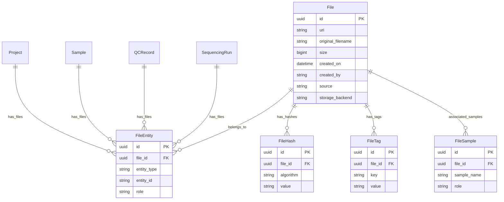

# Unified File Model

This document describes the unified file model architecture used throughout the API server for managing file metadata and associations.

## Overview

The API server uses a single, unified `File` model that supports:

- **File uploads**: Direct uploads to storage backends (S3, local, Azure, GCS)
- **External file references**: Metadata records for files stored externally (e.g., pipeline outputs)
- **Many-to-many entity associations**: Files can be linked to multiple entities (Projects, Runs, Samples, QCRecords)
- **Flexible sample associations with roles**: Support for tumor/normal, case/control, and other paired analysis patterns
- **Multi-algorithm hash storage**: MD5, SHA-256, S3 ETags, etc.
- **Flexible key-value tags**: Extensible metadata without schema changes

## Architecture

### Entity Relationship Diagram



## Database Schema

### file

Core file entity supporting both uploads and external references.

| Column | Type | Constraints | Description |
|--------|------|-------------|-------------|
| id | UUID | PK | Primary key |
| uri | VARCHAR(512) | NOT NULL | File location (s3://, file://, etc.) |
| original_filename | VARCHAR(255) | | Original filename (for uploads, before any renaming) |
| size | BIGINT | | File size in bytes |
| created_on | TIMESTAMP | NOT NULL | File creation/upload timestamp |
| created_by | VARCHAR(100) | | User who created/uploaded the file |
| source | VARCHAR(1024) | | Origin of file record (e.g., manifest URI that created this record) |
| storage_backend | VARCHAR(20) | | Storage type: LOCAL, S3, AZURE, GCS |

**Unique constraint**: `(uri, created_on)` - Enables file versioning where the same URI can have multiple versions differentiated by timestamp.

**Key concepts**:
- The `uri` field is the file location. The filename can be derived as `uri.split('/')[-1]`
- The `source` field tracks where the file *record* originated from (e.g., the manifest file that registered this file), not the file's storage location
- For uploads, `original_filename` preserves the user's filename before any collision-avoidance renaming
- `storage_backend` is primarily relevant for uploaded files; external references may leave this NULL

**Version queries**:
```sql
-- Latest version of a file
SELECT * FROM file WHERE uri = ? ORDER BY created_on DESC LIMIT 1

-- All versions of a file
SELECT * FROM file WHERE uri = ? ORDER BY created_on
```

### fileentity

Many-to-many junction table linking files to entities.

| Column | Type | Constraints | Description |
|--------|------|-------------|-------------|
| id | UUID | PK | Primary key |
| file_id | UUID | FK → file.id, NOT NULL, ON DELETE CASCADE | File reference |
| entity_type | VARCHAR(50) | NOT NULL | Entity type: PROJECT, RUN, SAMPLE, QCRECORD |
| entity_id | VARCHAR(100) | NOT NULL | Entity identifier |
| role | VARCHAR(50) | | Optional role (e.g., samplesheet, manifest, output) |

**Unique constraint**: `(file_id, entity_type, entity_id)`
**Index**: `(entity_type, entity_id)` - For efficient entity-based lookups

**Usage examples**:
- Sample sheet: `entity_type=RUN, entity_id=barcode, role=samplesheet`
- Pipeline output: `entity_type=QCRECORD, entity_id=uuid, role=output`
- Project manifest: `entity_type=PROJECT, entity_id=P-12345, role=manifest`

**Important**: Files attached to Samples or QCRecords should NOT also be linked to their parent Project via FileEntity. The project relationship can be traversed through Sample→Project or QCRecord→Project. Project-level FileEntity associations are reserved for standalone files (manifests, etc.) that aren't attached to any other entity.

### filehash

Hash values for files (supports multiple algorithms per file).

| Column | Type | Constraints | Description |
|--------|------|-------------|-------------|
| id | UUID | PK | Primary key |
| file_id | UUID | FK → file.id, NOT NULL, ON DELETE CASCADE | Parent file |
| algorithm | VARCHAR(50) | NOT NULL | Hash algorithm (md5, sha256, etag) |
| value | VARCHAR(128) | NOT NULL | Hash value |

**Unique constraint**: `(file_id, algorithm)`

### filetag

Flexible key-value metadata for files.

| Column | Type | Constraints | Description |
|--------|------|-------------|-------------|
| id | UUID | PK | Primary key |
| file_id | UUID | FK → file.id, NOT NULL, ON DELETE CASCADE | Parent file |
| key | VARCHAR(255) | NOT NULL | Tag key |
| value | TEXT | NOT NULL | Tag value |

**Unique constraint**: `(file_id, key)`

**Standard tags**:
| Key | Values | Description |
|-----|--------|-------------|
| archived | true/false | Whether file is archived |
| public | true/false | Whether file is publicly accessible |
| description | (text) | Human-readable description |
| type | alignment, variant, expression, qc_report, etc. | File category |
| format | bam, vcf, fastq, csv, etc. | File format |

### filesample

Associates samples with a file (supports roles for paired analysis).

| Column | Type | Constraints | Description |
|--------|------|-------------|-------------|
| id | UUID | PK | Primary key |
| file_id | UUID | FK → file.id, NOT NULL, ON DELETE CASCADE | Parent file |
| sample_name | VARCHAR(255) | NOT NULL | Sample identifier |
| role | VARCHAR(50) | | Optional role (tumor, normal, case, control) |

**Unique constraint**: `(file_id, sample_name)`

**Association patterns**:
- **Workflow-level file** (e.g., expression matrix): No FileSample entries
- **Single-sample file** (e.g., BAM file): One FileSample entry with `role=null`
- **Multi-sample file** (e.g., tumor/normal VCF): Multiple FileSample entries with roles

## Sample Association Patterns

### Single-sample file (BAM)

```
File:
  uri: s3://bucket/Sample1.bam

FileEntity:
  entity_type: QCRECORD
  entity_id: <qcrecord_uuid>
  
FileSample:
  sample_name: Sample1
  role: null  (single sample, no role needed)
```

### Tumor/Normal paired file (VCF)

```
File:
  uri: s3://bucket/Sample1_Sample2.somatic.vcf

FileEntity:
  entity_type: QCRECORD
  entity_id: <qcrecord_uuid>
  
FileSample:
  - sample_name: Sample1, role: tumor
  - sample_name: Sample2, role: normal
```

### Workflow-level file (expression matrix)

```
File:
  uri: s3://bucket/expression_matrix.tsv

FileEntity:
  entity_type: QCRECORD
  entity_id: <qcrecord_uuid>
  
FileSample: (none - workflow level output)
```

## API Endpoints

### Create a file

**POST /api/files**

Create a new file record (upload or reference).

**Request Body** (JSON):
```json
{
  "uri": "s3://bucket/path/sample1.bam",
  "original_filename": "my_sample.bam",
  "source": "s3://qc-outputs/pipeline-run-123/manifest.json",
  "size": 1234567890,
  "entities": [
    {"entity_type": "SAMPLE", "entity_id": "sample-uuid", "role": null},
    {"entity_type": "QCRECORD", "entity_id": "qcrecord-uuid", "role": "output"}
  ],
  "samples": [
    {"sample_name": "Sample1", "role": null}
  ],
  "hashes": {"md5": "abc123...", "sha256": "def456..."},
  "tags": {"type": "alignment", "format": "bam"}
}
```

**Notes**:
- `uri` is required and serves as the unique identifier
- `original_filename` is optional - only needed for uploads where the filename was renamed
- Filename can be derived from `uri.split('/')[-1]`

### Get file by ID

**GET /api/files/{id}**

Get file metadata by UUID.

### Get file by URI

**GET /api/files?uri={uri}**

Get file metadata by URI (URL-encoded).

### List files for an entity

**GET /api/files?entity_type=SAMPLE&entity_id={uuid}**

List all files associated with a specific entity.

### Response format

```json
{
  "id": "550e8400-e29b-41d4-a716-446655440000",
  "uri": "s3://bucket/path/sample1.bam",
  "filename": "sample1.bam",
  "original_filename": "my_sample.bam",
  "size": 1234567890,
  "created_on": "2026-02-01T12:00:00Z",
  "created_by": "user@example.com",
  "source": "s3://qc-outputs/pipeline-run-123/manifest.json",
  "storage_backend": "S3",
  "entities": [
    {"entity_type": "QCRECORD", "entity_id": "uuid", "role": "output"}
  ],
  "samples": [
    {"sample_name": "Sample1", "role": null}
  ],
  "hashes": [
    {"algorithm": "md5", "value": "abc123..."}
  ],
  "tags": [
    {"key": "type", "value": "alignment"}
  ]
}
```

## Code Reference

### Models

The unified file model is defined in [`api/files/models.py`](../api/files/models.py):

- [`File`](../api/files/models.py:148) - Core file entity
- [`FileEntity`](../api/files/models.py:117) - Entity associations
- [`FileHash`](../api/files/models.py:46) - Hash values
- [`FileTag`](../api/files/models.py:67) - Key-value tags
- [`FileSample`](../api/files/models.py:93) - Sample associations

### Entity Types

Available entity types for file associations (from [`FileEntityType`](../api/files/models.py:28)):

- `PROJECT` - Project-level files (manifests, etc.)
- `RUN` - Sequencing run files (sample sheets, etc.)
- `SAMPLE` - Sample-specific files
- `QCRECORD` - QC record output files

### Helper Functions

- [`file_to_public()`](../api/files/models.py:460) - Convert File model to API response
- [`file_to_summary()`](../api/files/models.py:494) - Convert File model to compact summary

## Cascade Deletes

All child tables cascade delete when the parent file is deleted:
- `file` → `fileentity`, `filehash`, `filetag`, `filesample`

When a QCRecord is deleted, its associated FileEntity entries are automatically deleted. The service layer also explicitly deletes the File records themselves (since QCRecord output files typically have no other entity associations).

## Integration with QCMetrics

The unified File model integrates with the QCMetrics system for storing pipeline output files. When creating a QCRecord via the `/api/v1/qcmetrics` endpoint, output files are automatically:

1. Created as File records
2. Associated with the QCRecord via FileEntity
3. Linked to samples via FileSample (if specified)

See [`docs/QCMETRICS.md`](./QCMETRICS.md) for details on the QCMetrics API (if available), or reference the QCMetrics routes at [`api/qcmetrics/routes.py`](../api/qcmetrics/routes.py).
