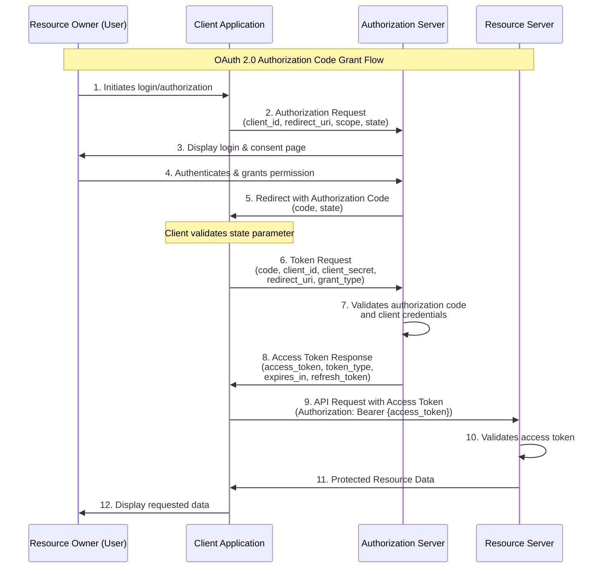

# OAuth 2.0 Authorization Code Grant Flow

## Flow Diagram

## Key Steps Explained

### 1. Authorization Request
Client redirects user to authorization server with parameters including:
- `client_id`: Identifier for the client application
- `redirect_uri`: Where to send the user after authorization
- `scope`: Requested permissions
- `state`: Random string for CSRF protection

### 2. User Authentication
Authorization server authenticates the user and requests consent for the requested permissions.

### 3. Authorization Code Grant
Upon approval, authorization server redirects back to client with an authorization code.

### 4. Token Exchange
Client exchanges the authorization code for an access token by making a back-channel request with client credentials. This request includes:
- `code`: The authorization code received
- `client_id`: Client identifier
- `client_secret`: Client secret (confidential)
- `redirect_uri`: Must match the original request
- `grant_type`: Set to "authorization_code"

### 5. Access Protected Resources
Client uses the access token to make authenticated API requests to the resource server.

## Security Features

- **State parameter**: Prevents CSRF (Cross-Site Request Forgery) attacks by ensuring the response matches the request
- **Authorization code**: Single-use, short-lived code exchanged over back-channel for enhanced security
- **Client authentication**: Client must prove its identity when exchanging code for token
- **Redirect URI validation**: Authorization server validates the redirect URI matches the registered value
- **HTTPS requirement**: All communication should occur over secure HTTPS connections

## Token Response

The access token response typically includes:
- `access_token`: The token used to access protected resources
- `token_type`: Usually "Bearer"
- `expires_in`: Token lifetime in seconds
- `refresh_token`: (Optional) Used to obtain new access tokens without user interaction
- `scope`: The actual scopes granted (may differ from requested)

## Use Cases

This flow is ideal for:
- Web applications with server-side components
- Applications that can securely store client credentials (confidential clients)
- Scenarios requiring the highest level of security

## Best Practices

1. Always use HTTPS for all OAuth communications
2. Implement and validate the `state` parameter
3. Store client secrets securely and never expose them in client-side code
4. Use short-lived authorization codes (typically 10 minutes or less)
5. Implement proper token storage and handling on the client
6. Validate all redirect URIs strictly
7. Consider implementing PKCE (Proof Key for Code Exchange) for additional security
