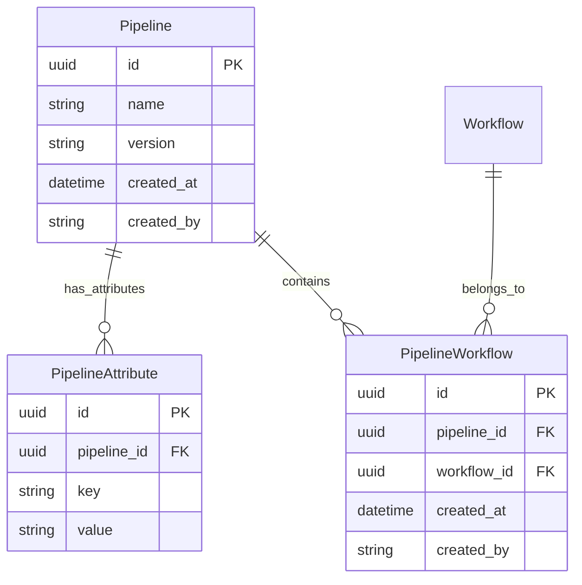

# Pipelines

This document describes the Pipeline system for organizing workflows into named, versioned collections.

## Overview

The Pipeline system provides:

- **Workflow grouping**: Organize related workflows into a named pipeline (e.g., "WGS Analysis Pipeline")
- **Flexible membership**: Add or remove workflows from a pipeline without affecting the workflows themselves
- **Key-value attributes**: Attach arbitrary metadata to pipelines without schema changes
- **Provenance**: All entities track `created_at` and `created_by` for audit trails
- **Pagination**: List endpoints support pagination with configurable sorting

## Architecture

### Entity Relationship Diagram



### Design Decisions

**Why a separate PipelineWorkflow junction table (not a direct FK)?**

The relationship between Pipeline and Workflow is many-to-many: a workflow can belong to multiple pipelines, and a pipeline can contain multiple workflows. The `PipelineWorkflow` junction table captures this with a unique constraint (`uq_pipeline_workflow`) preventing duplicate associations. See `plans/phase1-decisions-pipeline-workflow-relationships.md` for detailed rationale.

**Why no ordering in the junction table?**

Pipeline membership is currently unordered — the workflows in a pipeline are a **set**, not a sequence. This simplifies the initial implementation. If workflow ordering within a pipeline is needed in the future, a `position` column can be added to `PipelineWorkflow`.

**Relationship to Workflow Runs**

Pipelines are purely organizational. They do not directly affect how workflow runs are tracked. A pipeline groups workflows; each workflow independently manages its own runs. See [WORKFLOWS.md](./WORKFLOWS.md) for details on workflow runs.

## Database Models

### Pipeline

A named, versioned collection of workflows.

| Field | Type | Required | Description |
|-------|------|----------|-------------|
| `id` | UUID | auto | Primary key |
| `name` | string | yes | Human-readable pipeline name |
| `version` | string | no | Version string (e.g., `"1.0.0"`) |
| `created_at` | datetime | auto | UTC timestamp of creation |
| `created_by` | string | yes | Username of the creator |

### PipelineAttribute

Key-value metadata for pipelines.

| Field | Type | Required | Description |
|-------|------|----------|-------------|
| `id` | UUID | auto | Primary key |
| `pipeline_id` | UUID | yes | FK → `pipeline.id` |
| `key` | string | yes | Attribute name |
| `value` | string | yes | Attribute value |

**Constraints:** `UNIQUE(pipeline_id, key)` — one value per key per pipeline.

### PipelineWorkflow

Junction table linking workflows to pipelines. Each association records who created it and when.

| Field | Type | Required | Description |
|-------|------|----------|-------------|
| `id` | UUID | auto | Primary key |
| `pipeline_id` | UUID | yes | FK → `pipeline.id` |
| `workflow_id` | UUID | yes | FK → `workflow.id` |
| `created_at` | datetime | auto | UTC timestamp of association |
| `created_by` | string | yes | Username of the creator |

**Constraints:** `UNIQUE(pipeline_id, workflow_id)` — a workflow can only appear once per pipeline.

## API Endpoints

All pipeline endpoints require authentication. The authenticated user's username is recorded as `created_by`.

### Pipeline CRUD

#### Create a Pipeline

```
POST /pipelines
```

**Request Body:**

```json
{
  "name": "WGS Analysis Pipeline",
  "version": "2.0.0",
  "attributes": [
    {"key": "description", "value": "End-to-end whole genome sequencing analysis"},
    {"key": "department", "value": "genomics"}
  ],
  "workflow_ids": [
    "a1b2c3d4-...",
    "e5f6g7h8-..."
  ]
}
```

All fields except `name` are optional. `workflow_ids` associates existing workflows at creation time.

**Response** (`201 Created`):

```json
{
  "id": "p1p2p3p4-...",
  "name": "WGS Analysis Pipeline",
  "version": "2.0.0",
  "created_at": "2026-03-01T12:00:00Z",
  "created_by": "jdoe",
  "attributes": [
    {"key": "description", "value": "End-to-end whole genome sequencing analysis"},
    {"key": "department", "value": "genomics"}
  ],
  "workflows": [
    {"id": "a1b2c3d4-...", "name": "alignment-wf", "version": "1.0.0"},
    {"id": "e5f6g7h8-...", "name": "variant-calling-wf", "version": "2.1.0"}
  ]
}
```

#### List Pipelines (Paginated)

```
GET /pipelines?page=1&per_page=20&sort_by=name&sort_order=asc
```

**Response:**

```json
{
  "data": [
    {
      "id": "p1p2p3p4-...",
      "name": "WGS Analysis Pipeline",
      "version": "2.0.0",
      "created_at": "2026-03-01T12:00:00Z",
      "created_by": "jdoe",
      "attributes": [...],
      "workflows": [...]
    }
  ],
  "total_items": 5,
  "total_pages": 1,
  "current_page": 1,
  "per_page": 20,
  "has_next": false,
  "has_prev": false
}
```

#### Get Pipeline by ID

```
GET /pipelines/{pipeline_id}
```

Returns a single pipeline with its attributes and workflow summaries.

### Workflow Association

#### Add Workflow to Pipeline

```
POST /pipelines/{pipeline_id}/workflows?workflow_id={workflow_uuid}
```

The `workflow_id` is passed as a query parameter.

**Response** (`201 Created`):

```json
{
  "id": "junction-uuid-...",
  "message": "Workflow added to pipeline."
}
```

**Error** (`409 Conflict`): If the workflow is already in the pipeline.
**Error** (`404 Not Found`): If the pipeline or workflow does not exist.

#### Remove Workflow from Pipeline

```
DELETE /pipelines/{pipeline_id}/workflows/{workflow_id}
```

**Response:** `204 No Content`

**Error** (`404 Not Found`): If the association does not exist.

## Source Files

| File | Description |
|------|-------------|
| `api/pipeline/__init__.py` | Package marker |
| `api/pipeline/models.py` | SQLModel table definitions and Pydantic request/response schemas |
| `api/pipeline/services.py` | Business logic (create, list, add/remove workflow, response building) |
| `api/pipeline/routes.py` | FastAPI route handlers |
| `tests/api/test_pipeline_entity.py` | Pipeline CRUD and workflow association tests (13 tests) |
