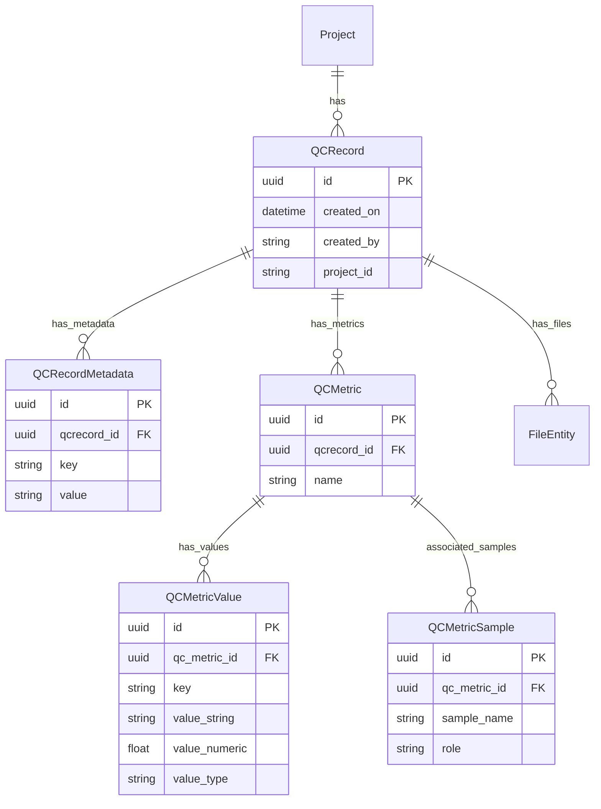

# QCMetrics API

This document describes the QCMetrics system for storing quality control metrics from bioinformatics pipeline executions.

## Overview

The QCMetrics system provides:

- **Flexible metric storage**: Workflow-level, single-sample, and paired-sample (tumor/normal) metrics
- **Type-preserving numeric values**: Store and query metrics with native numeric types
- **Output file tracking**: Integration with the unified [File model](./FILE_MODEL.md)
- **Versioning**: Multiple QC records per project with history preservation
- **Duplicate detection**: Automatic detection of equivalent records

## Architecture

### Entity Relationship Diagram



## Database Schema

### qcrecord

Main QC record entity - one per pipeline execution per project.

| Column | Type | Constraints | Description |
|--------|------|-------------|-------------|
| id | UUID | PK | Primary key |
| created_on | TIMESTAMP | NOT NULL | Record creation timestamp |
| created_by | VARCHAR(100) | NOT NULL | User who created the record |
| project_id | VARCHAR(50) | NOT NULL, INDEX | Associated project ID |

**Note**: No FK to Project table to allow QC records for projects not yet in the system.

### qcrecordmetadata

Key-value store for pipeline-level metadata (pipeline name, version, etc.).

| Column | Type | Constraints | Description |
|--------|------|-------------|-------------|
| id | UUID | PK | Primary key |
| qcrecord_id | UUID | FK → qcrecord.id, ON DELETE CASCADE | Parent QC record |
| key | VARCHAR(255) | NOT NULL | Metadata key |
| value | TEXT | NOT NULL | Metadata value |

**Unique constraint**: `(qcrecord_id, key)`

### qcmetric

A named group of metrics. Can be workflow-level, single-sample, or multi-sample.

| Column | Type | Constraints | Description |
|--------|------|-------------|-------------|
| id | UUID | PK | Primary key |
| qcrecord_id | UUID | FK → qcrecord.id, ON DELETE CASCADE, INDEX | Parent QC record |
| name | VARCHAR(255) | NOT NULL, INDEX | Metric group name |

**Note**: Multiple QCMetric rows with the same name are allowed within a QCRecord, differentiated by their sample associations. This supports per-sample metrics where each sample has its own set of QC values.

**Example**: An RNA-Seq pipeline run with 2 samples creates:

```
QCRecord (project_id="P-00000001")
├── QCMetric (id=1, name="sample_qc")  ← for human1
│   ├── QCMetricSample (sample_name="human1")
│   ├── QCMetricValue (key="QC_AlignedReads", value_numeric=1000000)
│   └── QCMetricValue (key="QC_FractionAligned", value_numeric=0.98)
│
├── QCMetric (id=2, name="sample_qc")  ← for human2 (same name, different sample)
│   ├── QCMetricSample (sample_name="human2")
│   ├── QCMetricValue (key="QC_AlignedReads", value_numeric=950000)
│   └── QCMetricValue (key="QC_FractionAligned", value_numeric=0.96)
│
└── QCMetric (id=3, name="pipeline_summary")  ← workflow-level (no samples)
    ├── QCMetricValue (key="total_samples", value_numeric=2)
    └── QCMetricValue (key="runtime_hours", value_numeric=4.5)
```

### qcmetricvalue

Key-value store for individual metric values. Supports dual storage for both string and numeric queries.

| Column | Type | Constraints | Description |
|--------|------|-------------|-------------|
| id | UUID | PK | Primary key |
| qc_metric_id | UUID | FK → qcmetric.id, ON DELETE CASCADE | Parent metric group |
| key | VARCHAR(255) | NOT NULL | Metric name |
| value_string | TEXT | NOT NULL | String representation (always populated) |
| value_numeric | FLOAT | NULL | Numeric value for int/float types |
| value_type | VARCHAR(10) | DEFAULT 'str' | Original type: "str", "int", "float" |

**Unique constraint**: `(qc_metric_id, key)`

**Type preservation**: When a numeric value is submitted (e.g., `{"reads": 50000000}`):
1. Stored as string in `value_string` for display/string matching
2. Stored as float in `value_numeric` for numeric queries (>, <, range, aggregations)
3. Tagged with `value_type` to restore original type on retrieval

### qcmetricsample

Associates samples with a metric group.

| Column | Type | Constraints | Description |
|--------|------|-------------|-------------|
| id | UUID | PK | Primary key |
| qc_metric_id | UUID | FK → qcmetric.id, ON DELETE CASCADE | Parent metric group |
| sample_name | VARCHAR(255) | NOT NULL, INDEX | Sample identifier |
| role | VARCHAR(50) | | Optional role (tumor, normal, case, control) |

**Unique constraint**: `(qc_metric_id, sample_name)`

**Sample association patterns**:
- **Workflow-level**: No entries (e.g., overall pipeline success rate)
- **Single sample**: One entry (e.g., Sample1 alignment rate)
- **Sample pair**: Two entries with roles (e.g., tumor=Sample1, normal=Sample2)

## API Endpoints

### Create QC Record

**POST /api/v1/qcmetrics**

**Authentication required**: Bearer token must be provided in the Authorization header.

The `created_by` field is automatically set from the authenticated user's username.

**Example curl command**:
```bash
curl -X POST "http://localhost:8000/api/v1/qcmetrics" \
  -H "Authorization: Bearer YOUR_ACCESS_TOKEN" \
  -H "Content-Type: application/json" \
  -d '{
    "project_id": "P-1234",
    "metadata": {
      "pipeline": "RNA-Seq",
      "version": "2.0.0"
    },
    "metrics": [
      {
        "name": "alignment_stats",
        "samples": [{"sample_name": "Sample1"}],
        "values": {"reads": 50000000, "alignment_rate": 95.5}
      }
    ]
  }'
```

**Request Body**:
```json
{
  "project_id": "P-1234",
  "metadata": {
    "pipeline": "RNA-Seq",
    "version": "2.0.0"
  },
  "metrics": [
    {
      "name": "alignment_stats",
      "samples": [{"sample_name": "Sample1"}],
      "values": {
        "reads": 50000000,
        "alignment_rate": 95.5,
        "reference_genome": "GRCh38"
      }
    },
    {
      "name": "somatic_variants",
      "samples": [
        {"sample_name": "Sample1", "role": "tumor"},
        {"sample_name": "Sample2", "role": "normal"}
      ],
      "values": {
        "snv_count": 15234,
        "tmb": 8.5
      }
    },
    {
      "name": "pipeline_summary",
      "values": {
        "total_samples": 48,
        "runtime_hours": 12.5
      }
    }
  ],
  "output_files": [
    {
      "uri": "s3://bucket/Sample1.bam",
      "size": 123456789,
      "samples": [{"sample_name": "Sample1"}],
      "hashes": {"md5": "abc123..."},
      "tags": {"type": "alignment"}
    }
  ]
}
```

**Response** (201 Created):
```json
{
  "id": "550e8400-e29b-41d4-a716-446655440000",
  "created_on": "2026-01-29T12:00:00Z",
  "created_by": "username",
  "project_id": "P-1234",
  "is_duplicate": false
}
```

### Get QC Record by ID

**GET /api/v1/qcmetrics/{id}**

**Response**:
```json
{
  "id": "550e8400-e29b-41d4-a716-446655440000",
  "created_on": "2026-01-29T12:00:00Z",
  "created_by": "username",
  "project_id": "P-1234",
  "metadata": [
    {"key": "pipeline", "value": "RNA-Seq"},
    {"key": "version", "value": "2.0.0"}
  ],
  "metrics": [
    {
      "name": "alignment_stats",
      "samples": [{"sample_name": "Sample1", "role": null}],
      "values": [
        {"key": "reads", "value": 50000000},
        {"key": "alignment_rate", "value": 95.5},
        {"key": "reference_genome", "value": "GRCh38"}
      ]
    }
  ],
  "output_files": [
    {
      "id": "660e8400-e29b-41d4-a716-446655440001",
      "uri": "s3://bucket/Sample1.bam",
      "filename": "Sample1.bam",
      "size": 123456789,
      "created_on": "2026-01-29T12:00:00Z",
      "samples": [{"sample_name": "Sample1", "role": null}],
      "hashes": [{"algorithm": "md5", "value": "abc123..."}],
      "tags": [{"key": "type", "value": "alignment"}]
    }
  ]
}
```

### Search QC Records (GET)

**GET /api/v1/qcmetrics/search**

Query parameters:
- `project_id`: Filter by project ID
- `latest`: If true (default), return only newest QCRecord per project
- Any metadata key: e.g., `pipeline=RNA-Seq`

**Example**:
```
GET /api/v1/qcmetrics/search?project_id=P-1234&pipeline=RNA-Seq&latest=true
```

### Search QC Records (POST)

**POST /api/v1/qcmetrics/search**

For advanced filtering:

```json
{
  "filter_on": {
    "project_id": "P-1234",
    "metadata": {
      "pipeline": "RNA-Seq"
    }
  },
  "page": 1,
  "per_page": 100,
  "latest": true
}
```

### Delete QC Record

**DELETE /api/v1/qcmetrics/{id}**

Deletes the QC record and all associated data (metadata, metrics, output files).

## Sample Association Patterns

### Single-sample metrics (alignment stats)

```json
{
  "name": "alignment_stats",
  "samples": [{"sample_name": "Sample1"}],
  "values": {
    "total_reads": 50000000,
    "mapped_reads": 48500000,
    "alignment_rate": 97.0
  }
}
```

### Paired-sample metrics (tumor/normal)

```json
{
  "name": "somatic_variants",
  "samples": [
    {"sample_name": "Sample1", "role": "tumor"},
    {"sample_name": "Sample2", "role": "normal"}
  ],
  "values": {
    "snv_count": 15234,
    "indel_count": 1523,
    "tmb": 8.5
  }
}
```

### Workflow-level metrics (no samples)

```json
{
  "name": "pipeline_summary",
  "values": {
    "total_samples_processed": 48,
    "samples_passed_qc": 46,
    "pipeline_runtime_hours": 12.5
  }
}
```

## Versioning

Multiple QC records per project are allowed (history is kept). The `created_on` timestamp differentiates versions.

**Latest version query pattern**:
```sql
SELECT DISTINCT ON (project_id) *
FROM qcrecord
WHERE <filters>
ORDER BY project_id, created_on DESC
```

## Duplicate Detection

When creating a QC record, the system checks if an equivalent record exists:
1. Query for existing records with same `project_id`
2. Compare metadata, metrics, and output_files
3. If equivalent, return existing record info with `is_duplicate: true`

## Cascade Deletes

All child tables cascade delete when parent is deleted:
- `qcrecord` → `qcrecordmetadata`, `qcmetric`
- `qcmetric` → `qcmetricvalue`, `qcmetricsample`

When a QCRecord is deleted:
1. FileEntity associations are automatically deleted (via CASCADE)
2. File records are explicitly deleted (service layer)

## Code Reference

### Models

Defined in [`api/qcmetrics/models.py`](../api/qcmetrics/models.py):

- [`QCRecord`](../api/qcmetrics/models.py:128) - Main QC record entity
- [`QCRecordMetadata`](../api/qcmetrics/models.py:25) - Pipeline metadata
- [`QCMetric`](../api/qcmetrics/models.py:97) - Metric group
- [`QCMetricValue`](../api/qcmetrics/models.py:45) - Individual metric values
- [`QCMetricSample`](../api/qcmetrics/models.py:73) - Sample associations

### Services

Business logic in [`api/qcmetrics/services.py`](../api/qcmetrics/services.py):

- Create QC record with duplicate detection
- Search and pagination
- Type preservation for numeric values

### Routes

API endpoints in [`api/qcmetrics/routes.py`](../api/qcmetrics/routes.py):

- `POST /api/v1/qcmetrics` - Create
- `GET /api/v1/qcmetrics/search` - Search (query params)
- `POST /api/v1/qcmetrics/search` - Search (JSON body)
- `GET /api/v1/qcmetrics/{id}` - Get by ID
- `DELETE /api/v1/qcmetrics/{id}` - Delete

## Integration with File Model

Output files from pipeline executions use the unified [File model](./FILE_MODEL.md). When creating a QCRecord:

1. File records are created with the provided metadata
2. FileEntity associations link files to the QCRecord
3. FileSample associations link files to samples (if specified)

See [FILE_MODEL.md](./FILE_MODEL.md) for details on the unified file model architecture.
