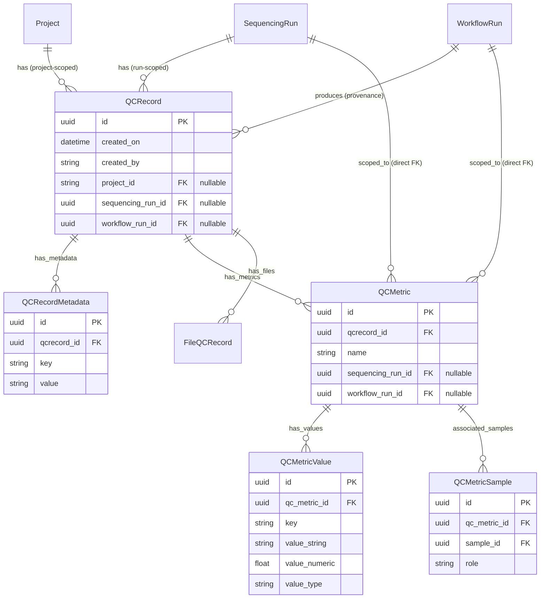

# QCMetrics API

This document describes the QCMetrics system for storing quality control metrics from bioinformatics pipeline executions.

## Overview

The QCMetrics system provides:

- **Flexible metric storage**: Workflow-level, single-sample, and paired-sample (tumor/normal) metrics
- **Type-preserving numeric values**: Store and query metrics with native numeric types
- **Dual scoping**: QCRecords scoped to a project (e.g., alignment QC) or a sequencing run (e.g., demux stats)
- **Entity association**: Scope metrics to sequencing runs and workflow executions via direct FKs
- **Barcode-friendly API**: Accept human-readable run barcodes in requests, resolve to UUIDs internally
- **Provenance tracking**: Optional `workflow_run_id` FK linking a QCRecord to the execution that produced it
- **Output file tracking**: Integration with the unified [File model](./FILE_MODEL.md)
- **Versioning**: Multiple QC records per scope (project or run) with history preservation
- **Duplicate detection**: Automatic detection of equivalent records per scope
- **Re-demux cleanup**: Run-scoped QCRecords are automatically deleted during re-demux cleanup

## Architecture

### Entity Relationship Diagram


```mermaid
erDiagram
    Project ||--o{ QCRecord : "has (project-scoped)"
    SequencingRun ||--o{ QCRecord : "has (run-scoped)"
    WorkflowRun ||--o{ QCRecord : "produces (provenance)"
    QCRecord ||--o{ QCRecordMetadata : has_metadata
    QCRecord ||--o{ QCMetric : has_metrics
    QCRecord ||--o{ FileQCRecord : has_files
    QCMetric ||--o{ QCMetricValue : has_values
    QCMetric ||--o{ QCMetricSample : associated_samples
    SequencingRun ||--o{ QCMetric : "scoped_to (direct FK)"
    WorkflowRun ||--o{ QCMetric : "scoped_to (direct FK)"

    QCRecord {
        uuid id PK
        datetime created_on
        string created_by
        string project_id FK "nullable"
        uuid sequencing_run_id FK "nullable"
        uuid workflow_run_id FK "nullable"
    }

    QCRecordMetadata {
        uuid id PK
        uuid qcrecord_id FK
        string key
        string value
    }

    QCMetric {
        uuid id PK
        uuid qcrecord_id FK
        string name
        uuid sequencing_run_id FK "nullable"
        uuid workflow_run_id FK "nullable"
    }

    QCMetricValue {
        uuid id PK
        uuid qc_metric_id FK
        string key
        string value_string
        float value_numeric
        string value_type
    }

    QCMetricSample {
        uuid id PK
        uuid qc_metric_id FK
        uuid sample_id FK
        string role
    }
```

## Database Schema

### qcrecord

Main QC record entity — one per pipeline execution per scope (project or sequencing run).

| Column | Type | Constraints | Description |
|--------|------|-------------|-------------|
| id | UUID | PK | Primary key |
| created_on | TIMESTAMP | NOT NULL | Record creation timestamp |
| created_by | VARCHAR(100) | NOT NULL | User who created the record |
| project_id | VARCHAR(50) | NULL, FK → project.project_id, INDEX | Project scope (mutually exclusive with sequencing_run_id) |
| sequencing_run_id | UUID | NULL, FK → sequencingrun.id, INDEX | Run scope (mutually exclusive with project_id) |
| workflow_run_id | UUID | NULL, FK → workflowrun.id, INDEX | Optional provenance link |

**CHECK constraint** `ck_qcrecord_scope`: Exactly one of `project_id` or `sequencing_run_id` must be non-NULL.

**Notes**:
- `project_id` is a FK with `RESTRICT` on delete — the project must exist, and deleting a project is blocked while QCRecords reference it.
- `sequencing_run_id` is a FK to `sequencingrun.id` for run-scoped records (e.g., demux stats). The API accepts a human-readable barcode string (`sequencing_run_barcode`), resolved to UUID at the service layer.
- `workflow_run_id` is an optional provenance FK — which WorkflowRun produced this data.

### qcrecordmetadata

Key-value store for pipeline-level metadata (pipeline name, version, etc.).

| Column | Type | Constraints | Description |
|--------|------|-------------|-------------|
| id | UUID | PK | Primary key |
| qcrecord_id | UUID | FK → qcrecord.id, ON DELETE CASCADE | Parent QC record |
| key | VARCHAR(255) | NOT NULL | Metadata key |
| value | TEXT | NOT NULL | Metadata value |

**Unique constraint**: `(qcrecord_id, key)`

### qcmetric

A named group of metrics with optional entity scoping via direct FKs.

| Column | Type | Constraints | Description |
|--------|------|-------------|-------------|
| id | UUID | PK | Primary key |
| qcrecord_id | UUID | FK → qcrecord.id, ON DELETE CASCADE, INDEX | Parent QC record |
| name | VARCHAR(255) | NOT NULL, INDEX | Metric group name |
| sequencing_run_id | UUID | NULL, FK → sequencingrun.id, INDEX | What run this metric is about |
| workflow_run_id | UUID | NULL, FK → workflowrun.id, INDEX | What execution this metric is about |

**Note**: Multiple QCMetric rows with the same name are allowed within a QCRecord, differentiated by their sample or entity associations. Entity scoping uses direct nullable FKs (no junction tables).

**Example**: An RNA-Seq pipeline run with 2 samples creates:

```
QCRecord (project_id="P-00000001")
├── QCMetric (id=1, name="sample_qc")  ← for human1
│   ├── QCMetricSample (sample_id=<uuid of human1>)
│   ├── QCMetricValue (key="QC_AlignedReads", value_numeric=1000000)
│   └── QCMetricValue (key="QC_FractionAligned", value_numeric=0.98)
│
├── QCMetric (id=2, name="sample_qc")  ← for human2 (same name, different sample)
│   ├── QCMetricSample (sample_id=<uuid of human2>)
│   ├── QCMetricValue (key="QC_AlignedReads", value_numeric=950000)
│   └── QCMetricValue (key="QC_FractionAligned", value_numeric=0.96)
│
└── QCMetric (id=3, name="pipeline_summary")  ← workflow-level (no samples)
    ├── QCMetricValue (key="total_samples", value_numeric=2)
    └── QCMetricValue (key="runtime_hours", value_numeric=4.5)
```

### qcmetricvalue

Key-value store for individual metric values. Supports dual storage for both string and numeric queries.

| Column | Type | Constraints | Description |
|--------|------|-------------|-------------|
| id | UUID | PK | Primary key |
| qc_metric_id | UUID | FK → qcmetric.id, ON DELETE CASCADE | Parent metric group |
| key | VARCHAR(255) | NOT NULL | Metric name |
| value_string | TEXT | NOT NULL | String representation (always populated) |
| value_numeric | FLOAT | NULL | Numeric value for int/float types |
| value_type | VARCHAR(10) | DEFAULT 'str' | Original type: "str", "int", "float" |

**Unique constraint**: `(qc_metric_id, key)`

**Type preservation**: When a numeric value is submitted (e.g., `{"reads": 50000000}`):
1. Stored as string in `value_string` for display/string matching
2. Stored as float in `value_numeric` for numeric queries (>, <, range, aggregations)
3. Tagged with `value_type` to restore original type on retrieval

### qcmetricsample

Associates samples with a metric group via FK to the `sample` table.

| Column | Type | Constraints | Description |
|--------|------|-------------|-------------|
| id | UUID | PK | Primary key |
| qc_metric_id | UUID | FK → qcmetric.id, ON DELETE CASCADE | Parent metric group |
| sample_id | UUID | FK → sample.id, INDEX | Resolved sample reference |
| role | VARCHAR(50) | NULL | Optional role (tumor, normal, case, control) |

**Unique constraint**: `(qc_metric_id, sample_id)`

Samples are resolved by `sample_name` in the request — the service layer looks up or auto-creates `Sample` records.

**Sample association patterns**:
- **Workflow-level**: No entries (e.g., overall pipeline success rate)
- **Single sample**: One entry (e.g., Sample1 alignment rate)
- **Sample pair**: Two entries with roles (e.g., tumor=Sample1, normal=Sample2)

> **Note**: The earlier junction tables `qcmetricsequencingrun` and `qcmetricworkflowrun` have been replaced by direct FK columns on `qcmetric`. This simplifies queries and eliminates extra JOINs.

## API Endpoints

### Create QC Record

**POST /api/v1/qcmetrics**

**Authentication required**: Bearer token must be provided in the Authorization header.

The `created_by` field is automatically set from the authenticated user's username.

**Scoping**: Provide exactly one of `project_id` (project-scoped) or `sequencing_run_barcode` (run-scoped).

**Request Body — project-scoped**:
```json
{
  "project_id": "P-1234",
  "workflow_run_id": "550e8400-e29b-41d4-a716-446655440099",
  "metadata": {
    "pipeline": "RNA-Seq",
    "version": "2.0.0"
  },
  "metrics": [
    {
      "name": "alignment_stats",
      "samples": [{"sample_name": "Sample1"}],
      "values": {"reads": 50000000, "alignment_rate": 95.5}
    }
  ],
  "output_files": [
    {
      "uri": "s3://bucket/Sample1.bam",
      "size": 123456789,
      "samples": [{"sample_name": "Sample1"}],
      "hashes": {"md5": "abc123..."},
      "tags": {"type": "alignment"}
    }
  ]
}
```

**Request Body — run-scoped (demux stats)**:
```json
{
  "sequencing_run_barcode": "240101_A00000_0001_FLOWCELLID",
  "metadata": {
    "pipeline": "bcl-convert",
    "version": "4.3"
  },
  "metrics": [
    {
      "name": "demux_summary",
      "values": {"total_reads": 800000000, "pf_reads": 750000000}
    }
  ]
}
```

**Fields**:
- `project_id` (conditional): Project ID — mutually exclusive with `sequencing_run_barcode`
- `sequencing_run_barcode` (conditional): Run barcode — mutually exclusive with `project_id`
- `workflow_run_id` (optional): UUID of the WorkflowRun that produced this QC data (provenance)
- `metadata` (optional): Key-value pairs for pipeline metadata
- `metrics` (optional): List of metric groups, each with:
  - `name` (required): Metric group name
  - `samples` (optional): Sample associations with optional roles
  - `sequencing_run_barcode` (optional): Barcode of SequencingRun this metric is about (auto-propagated from record level)
  - `workflow_run_id` (optional): UUID of WorkflowRun this metric is about
  - `values` (required): Metric key-value pairs (string, int, or float)
- `output_files` (optional): Files produced by the pipeline

**Response** (201 Created):
```json
{
  "id": "550e8400-e29b-41d4-a716-446655440000",
  "created_on": "2026-01-29T12:00:00Z",
  "created_by": "username",
  "project_id": "P-1234",
  "sequencing_run_id": null,
  "sequencing_run_barcode": null,
  "workflow_run_id": "550e8400-e29b-41d4-a716-446655440099",
  "is_duplicate": false
}
```

**Run-scoped response** (201 Created):
```json
{
  "id": "770e8400-e29b-41d4-a716-446655440000",
  "created_on": "2026-01-29T12:00:00Z",
  "created_by": "username",
  "project_id": null,
  "sequencing_run_id": "880e8400-e29b-41d4-a716-446655440001",
  "sequencing_run_barcode": "240101_A00000_0001_FLOWCELLID",
  "workflow_run_id": null,
  "is_duplicate": false
}
```

### Get QC Record by ID

**GET /api/v1/qcmetrics/{id}**

**Response**:
```json
{
  "id": "550e8400-e29b-41d4-a716-446655440000",
  "created_on": "2026-01-29T12:00:00Z",
  "created_by": "username",
  "project_id": "P-1234",
  "sequencing_run_id": null,
  "sequencing_run_barcode": null,
  "workflow_run_id": "550e8400-e29b-41d4-a716-446655440099",
  "metadata": [
    {"key": "pipeline", "value": "RNA-Seq"},
    {"key": "version", "value": "2.0.0"}
  ],
  "metrics": [
    {
      "name": "alignment_stats",
      "samples": [{"sample_name": "Sample1", "role": null}],
      "sequencing_run_id": null,
      "sequencing_run_barcode": null,
      "workflow_run_id": null,
      "values": [
        {"key": "reads", "value": 50000000},
        {"key": "alignment_rate", "value": 95.5}
      ]
    }
  ],
  "output_files": [
    {
      "id": "660e8400-e29b-41d4-a716-446655440001",
      "uri": "s3://bucket/Sample1.bam",
      "filename": "Sample1.bam",
      "size": 123456789,
      "created_on": "2026-01-29T12:00:00Z",
      "samples": [{"sample_name": "Sample1", "role": null}],
      "hashes": [{"algorithm": "md5", "value": "abc123..."}],
      "tags": [{"key": "type", "value": "alignment"}]
    }
  ]
}
```

### Search QC Records (GET)

**GET /api/v1/qcmetrics/search**

Query parameters:
- `project_id`: Filter by project ID (project-scoped records)
- `sequencing_run_barcode`: Filter by run barcode (run-scoped records)
- `workflow_run_id`: Filter by provenance (which WorkflowRun produced the data)
- `sequencing_run_id`: Filter by sequencing run UUID (record or metric level)
- `latest`: If true (default), return only newest QCRecord per scope (project or run)
- `page`, `per_page`: Pagination

**Examples**:
```
GET /api/v1/qcmetrics/search?project_id=P-1234&latest=true
GET /api/v1/qcmetrics/search?sequencing_run_barcode=240101_A00000_0001_XYZ
GET /api/v1/qcmetrics/search?workflow_run_id=<uuid>&latest=false
GET /api/v1/qcmetrics/search?sequencing_run_id=<uuid>
```

### Search QC Records (POST)

**POST /api/v1/qcmetrics/search**

For advanced filtering:

```json
{
  "filter_on": {
    "project_id": "P-1234",
    "sequencing_run_barcode": "240101_A00000_0001_FLOWCELLID",
    "workflow_run_id": "550e8400-e29b-41d4-a716-446655440099",
    "metadata": {
      "pipeline": "RNA-Seq"
    }
  },
  "page": 1,
  "per_page": 100,
  "latest": true
}
```

### Delete QC Record

**DELETE /api/v1/qcmetrics/{id}**

Deletes the QC record and all associated data (metadata, metrics, entity associations, output files).

## Entity Association Patterns

### Single-sample metrics (alignment stats)

```json
{
  "name": "alignment_stats",
  "samples": [{"sample_name": "Sample1"}],
  "values": {
    "total_reads": 50000000,
    "mapped_reads": 48500000,
    "alignment_rate": 97.0
  }
}
```

### Paired-sample metrics (tumor/normal)

```json
{
  "name": "somatic_variants",
  "samples": [
    {"sample_name": "Sample1", "role": "tumor"},
    {"sample_name": "Sample2", "role": "normal"}
  ],
  "values": {
    "snv_count": 15234,
    "indel_count": 1523,
    "tmb": 8.5
  }
}
```

### Workflow-level metrics (no samples)

```json
{
  "name": "pipeline_summary",
  "values": {
    "total_samples_processed": 48,
    "samples_passed_qc": 46,
    "pipeline_runtime_hours": 12.5
  }
}
```

### Sequencing run–scoped metrics (demux stats)

```json
{
  "name": "demux_stats",
  "sequencing_run_barcode": "240101_A00000_0001_FLOWCELLID",
  "values": {
    "total_clusters": 500000000,
    "pct_q30": 92.5,
    "pct_pf": 95.1
  }
}
```

### Workflow run–scoped metrics (execution metrics)

```json
{
  "name": "execution_metrics",
  "workflow_run_id": "550e8400-e29b-41d4-a716-446655440099",
  "values": {
    "runtime_hours": 3.5,
    "peak_memory_gb": 16,
    "cpu_hours": 28
  }
}
```

### Mixed scoping (sample + run in same QCRecord)

A project-scoped QCRecord can contain metrics with entity scoping:

```json
{
  "project_id": "P-1234",
  "workflow_run_id": "550e8400-...-446655440099",
  "metrics": [
    {
      "name": "demux_stats",
      "sequencing_run_barcode": "240101_A00000_0001_XYZ",
      "values": {"total_clusters": 500000000}
    },
    {
      "name": "per_sample_yield",
      "samples": [{"sample_name": "SampleA"}],
      "sequencing_run_barcode": "240101_A00000_0001_XYZ",
      "values": {"reads": 25000000, "pct_q30": 95.3}
    }
  ]
}
```

### Run-scoped QCRecord (demux stats, no project)

A QCRecord scoped directly to a sequencing run. The `sequencing_run_barcode` auto-propagates to all metrics:

```json
{
  "sequencing_run_barcode": "240101_A00000_0001_FLOWCELLID",
  "metadata": {"pipeline": "bcl-convert", "version": "4.3"},
  "metrics": [
    {
      "name": "lane1_stats",
      "values": {"reads": 200000000, "pct_q30": 93.1}
    },
    {
      "name": "lane2_stats",
      "values": {"reads": 300000000, "pct_q30": 94.2}
    }
  ]
}
```

## Versioning

Multiple QC records per scope are allowed (history is kept). The `created_on` timestamp differentiates versions.

- **Project-scoped**: grouped by `project_id`
- **Run-scoped**: grouped by `sequencing_run_id`

The `latest=true` search parameter returns only the newest record per scope key.

## Duplicate Detection

When creating a QC record, the system checks if an equivalent record exists:
1. Query for existing records in the same scope (`project_id` or `sequencing_run_id`)
2. Compare metadata keys and values
3. If equivalent, return existing record info with `is_duplicate: true`

## Cascade Deletes

All child tables cascade delete when parent is deleted:
- `qcrecord` → `qcrecordmetadata`, `qcmetric`
- `qcmetric` → `qcmetricvalue`, `qcmetricsample`

When a QCRecord is deleted:
1. All child rows (metrics, samples, values) cascade automatically
2. FileQCRecord associations are automatically deleted (via CASCADE)
3. File records are explicitly deleted (service layer)

## Re-demux Cleanup

When `DELETE /api/v1/runs/{barcode}/samples` is called (re-demux cleanup),
run-scoped QCRecords for that sequencing run are automatically deleted along
with their associated files, metadata, and metrics. The response includes a
`qcrecords_deleted` count.

## Code Reference

### Models

Defined in [`api/qcmetrics/models.py`](../api/qcmetrics/models.py):

- [`QCRecord`](../api/qcmetrics/models.py:142) — Main QC record (project_id or sequencing_run_id + workflow_run_id)
- [`QCRecordMetadata`](../api/qcmetrics/models.py:25) — Pipeline metadata
- [`QCMetric`](../api/qcmetrics/models.py:97) — Metric group (with direct sequencing_run_id and workflow_run_id FKs)
- [`QCMetricValue`](../api/qcmetrics/models.py:45) — Individual metric values
- [`QCMetricSample`](../api/qcmetrics/models.py:73) — Sample associations

### Services

Business logic in [`api/qcmetrics/services.py`](../api/qcmetrics/services.py):

- Barcode → UUID resolution for sequencing runs
- Create QC record with scope validation, duplicate detection, and FK validation
- Auto-propagation of `sequencing_run_barcode` from record to metrics
- Search with filtering by `project_id`, `sequencing_run_barcode`, `workflow_run_id`, `sequencing_run_id`, metadata
- Type preservation for numeric values
- Pagination with scope-aware `latest` filtering

### Routes

API endpoints in [`api/qcmetrics/routes.py`](../api/qcmetrics/routes.py):

- `POST /api/v1/qcmetrics` — Create (project-scoped or run-scoped)
- `GET /api/v1/qcmetrics/search` — Search (query params: `project_id`, `sequencing_run_barcode`, `workflow_run_id`, `sequencing_run_id`, `latest`)
- `POST /api/v1/qcmetrics/search` — Search (JSON body)
- `GET /api/v1/qcmetrics/{id}` — Get by ID
- `DELETE /api/v1/qcmetrics/{id}` — Delete

## Integration with File Model

Output files from pipeline executions use the unified [File model](./FILE_MODEL.md). When creating a QCRecord:

1. File records are created with the provided metadata
2. FileQCRecord junction rows link files to the QCRecord
3. FileSample associations link files to samples (if specified)

See [FILE_MODEL.md](./FILE_MODEL.md) for details on the unified file model architecture.
