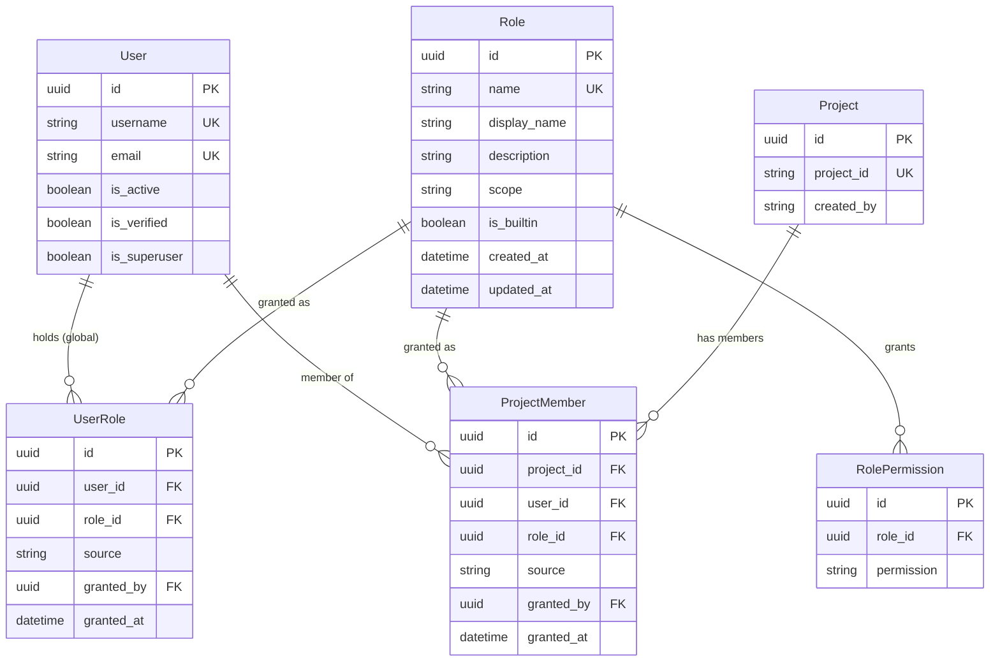

# Role-Based Access Control

This document specifies the requirements and design for role-based access control (RBAC) in the NGS360 API, covering the permission model, its enforcement, and the phased rollout required to introduce it without breaking existing consumers.

## Overview

NGS360 today has authentication but effectively no authorization. RBAC provides:

- **Least privilege**: A closed catalog of `resource:action` permissions, grouped into named roles, replacing the single `is_superuser` boolean
- **Two grant scopes**: Global roles for platform resources (runs, workflows, vendors, settings) and per-project roles for project-owned data (samples, QC records, files)
- **Auditable grants**: Every assignment records who granted it, when, and by what mechanism
- **A safe rollout path**: A dry-run mode that logs denials without enforcing them, so the permission model can be validated against real production traffic before it starts rejecting requests
- **Machine identities**: First-class service accounts with narrowly scoped API keys, replacing the current practice of integrations borrowing a human's credentials

### Current state

The measurements below are the baseline this design is written against. Regenerate them before implementation begins; the counts are current as of this document.

| Metric | Value |
|--------|-------|
| Total API routes | 116 (111 feature routes + 5 OAuth) |
| Routes with **no** authentication | 84 |
| — of those, legitimately public (login, register, password reset, OAuth handshake) | 11 |
| — **routes that must be closed** | **73** |
| Routes gated by `is_superuser` | 4 |
| Distinct permissions today | 1 (`users.is_superuser`) |
| Membership / role / permission tables | 0 |

Progress against that baseline is tracked by `tests/test_route_coverage.py`, which asserts both numbers so a change to either is visible in review rather than incidental. **Currently 69 routes await closure and 41 carry a guard** — see *Closing `PUT /jobs/{job_id}`* and *Closing the migrated reads*.

Routers with **zero** authentication references: `actions` (5 routes), `jobs` (6), `manifest` (3), `platforms` (3), `samples` (3), `search` (1), `vendors` (5). Partially open: `runs` (13/16 open), `project` (9/16), `workflow` (9/13), `files` (7/9), `qcmetrics` (4/5), `pipeline` (3/5), `settings` (2/3).

The four `is_superuser`-gated routes are `DELETE /projects/{project_id}/samples/{sample_id}` (`api/project/routes.py:400`), `PATCH /files/{file_id}` (`api/files/routes.py:264`), `DELETE /files/{file_id}` (`api/files/routes.py:290`), and `PUT /settings/{key}` (`api/settings/routes.py:55`).

> **Resolved ahead of this design.** `PUT /api/v1/settings/{key}` was unauthenticated in production — it writes `DATA_BUCKET_URI`, `RESULTS_BUCKET_URI`, `DEMUX_WORKFLOW_CONFIGS_BUCKET_URI`, and `MANIFEST_VALIDATION_LAMBDA`, the values determining where the platform reads and writes data and which Lambda it invokes. Closed as a standalone hotfix in [#361](https://github.com/NGS360/APIServer/pull/361) rather than waiting for the rollout below; it now requires `CurrentSuperuser`. Reads (`GET /settings`, `GET /settings/{key}`) remain open and are still in scope for Phase 1d.

## Architecture

### The three grant planes

Authorization is **grant-only**: a permission is either granted by some plane or it is denied. There are no deny rules.

| Plane | Carrier | Applies to |
|-------|---------|------------|
| Break-glass | `users.is_superuser` | Everything; short-circuits ahead of all role evaluation |
| Global | `user_role` — additive, a user may hold several | Platform resources, and project-scopable permissions across *all* projects |
| Project | `project_member` — exactly one role per user per project | That project's data only |

Both planes draw on **one shared permission vocabulary**. The permission string is scope-agnostic; the *grant* carries the scope. `sample:create` held via a global role means "in any project"; held via a project role it means "in this project". This avoids maintaining a parallel `project_sample:*` vocabulary and makes moving a permission between planes a policy decision rather than a code change.

### Entity Relationship Diagram



### Design Decisions

**Why are permissions defined in code, not in a database table?**

The permission catalog is a closed `StrEnum` in `api/rbac/permissions.py`. Roles are database rows; permissions are not.

A permission only means something if some route calls `require_permission()` with it. A `permission` table therefore cannot describe capability — it can only describe intent, and an admin who invents `project:archive` in the table gets a permission that silently does nothing forever. Conversely, a typo in a code-level check (`require_permission("settings:update")` against a catalog entry of `setting:update`) makes a route permanently unreachable with no error anywhere; as an enum member, the same typo fails at import.

The editability people actually want is **role** editability, and that is fully preserved: roles are rows, `role_permission` is a table, and admins compose arbitrary custom roles from the catalog through the API.

**Why no wildcards?**

Wildcards are permitted when *defining* a role in code (`ALL_PERMISSIONS = frozenset(Permission)`) and never evaluated at check time. A role holding `workflow:*` silently acquires `workflow:purge` the day someone adds it — a role gaining a permission with nobody deciding. With enumerated permissions, widening a role requires editing `ROLE_DEFINITIONS`, which appears in code review. Checks are also O(1) set membership rather than glob matching per request.

**Why grant-only, with no deny rules?**

Deny rules require a precedence lattice, and once one exists, answering "why can this user do X?" means evaluating the whole rule set rather than taking a set union. Every requirement encountered here ("this user must not see project P") is expressible by not granting. Account-level suspension is already handled by `is_active` / `is_verified` in `get_current_active_user`.

**Why does a global role grant access to all projects?**

Because the data model forces it. Three cases have no path to a project:

- `SequencingRun` reaches projects only through `SampleSequencingRun → Sample → Project`, many-to-many. A single flowcell legitimately spans projects, so a demux operator cannot be a member of every project on it.
- `BatchJob` has no project column at all — only `user: str` and a free-text `command`.
- The pipeline writeback path (`POST /qcmetrics`, `POST /files`) runs as a service account that cannot be enrolled in every project whose results it writes.

Without a global escape hatch, either demultiplexing breaks or the service account gets auto-enrolled in every project — a worse, less auditable version of the same grant. So global roles *may* carry project-scopable permissions, and when they do they apply everywhere. Permissions marked global-only are rejected from project roles at role-creation time.

**Why does `member` ship able to read every project?**

The default role holds *global* `project:read`, `sample:read`, `qcrecord:read` and `file:read`. This deliberately preserves today's "any authenticated user can read anything" behaviour while writes become membership-gated.

`file:download` is **not** among them, and the distinction is load-bearing — see *Project-scoped downloads*. Reads stay global; downloading does not, because `has_in_project` short-circuits on a global grant, so a `member` holding global `file:download` made the project check on `GET /files/download-url` vacuous.

The alternative — shipping read isolation and enforcement together — means one change that both rejects writes and empties every list view, with no way to separate the two if something goes wrong. Instead, tightening reads later is a **role edit through the admin API**: remove those five permissions from `member`. No deploy, no config flag, no second code path to test, and reversible in one API call. This is the primary reason the design allows global roles to carry project-scopable permissions.

**Why does `project_member` reference `project.id` and not `project.project_id`?**

`Project` carries both a UUID surrogate key (`id`) and a string business key (`project_id`, e.g. `P-20260731-0001`), and existing foreign keys are split between them: `Sample.project_id` and `QCRecordMetadata.project_id` reference the string, while `FileProject.project_id` — the most recently added join table — references the UUID.

Membership uses the UUID:

- `get_validated_project` already loads the entire `Project` row before any permission check runs, so `project.id` is in hand at zero cost. Using the string key saves no lookup.
- `project_id` is user-visible and will eventually be renamed. A rename would either be rejected by the foreign key or cascade through it — either way, someone is debugging authorization during a rename.
- Authorization tables should reference immutable surrogate keys.

The consequence to design around: the permission dependency must run *after* `get_validated_project`. FastAPI's dependency graph handles this automatically because `require_project_permission` declares `ProjectDep` as a sub-dependency.

**Why two assignment tables instead of one polymorphic `role_assignment`?**

A single `role_assignment(user_id, role_id, scope_type, scope_id)` table generalizes to future scope types, but cannot carry a real foreign key to `project`, invites `scope_type` string typos, and needs a partial unique index that MySQL does not support. Separately, "who is on this project" is a product concept with a UI screen behind it, not merely an authorization artifact. Two tables.

**Why are global grants additive but project grants exclusive?**

Global roles compose meaningfully — `member` plus `service_account` is a legitimate combination. The three project roles are a total order (`project_viewer` ⊂ `project_contributor` ⊂ `project_owner`), so stacking them adds nothing but ambiguity in the UI. Hence `UNIQUE(project_id, user_id)`. If additive project roles are ever needed, relaxing the constraint to `UNIQUE(project_id, user_id, role_id)` requires no resolver changes — it already unions.

**A note on naming.** The schema already uses `role` as a column name with an unrelated meaning: `FileProject.role` holds values like `"samplesheet"`, and `FileSample.role` holds `"tumor"` / `"normal"`. Throughout this design, an RBAC role is always the `role` table or a `role_id` column. The existing columns are untouched.

## Permission Catalog

57 permissions across 18 resources. **Scope** is `G` for global-only (may not appear in a project role) or `P` for project-scopable (may appear in either plane). **Risk** indicates blast radius, for the benefit of anyone composing a custom role.

### Project-owned data

| Permission | Scope | Risk | Routes |
|------------|-------|------|--------|
| `project:read` | P | low | `GET /projects`, `/projects/{id}`, `/projects/search`, `/projects/attributes` |
| `project:create` | G | low | `POST /projects` |
| `project:update` | P | low | `PUT /projects/{id}`, `PATCH /projects/{id}` |
| `project:delete` | P | high | *reserved — no route today* |
| `project:manage_members` | P | medium | `GET/POST/PATCH/DELETE /projects/{id}/members` (new) |
| `project:submit_action` | P | **high** | `POST /projects/{id}/actions/submit` — spends AWS Batch |
| `project:ingest` | P | **high** | `POST /projects/{id}/ingest` — spends AWS Batch, writes S3 |
| `sample:read` | P | low | `GET /projects/{id}/samples`, `GET/POST /samples/search` |
| `sample:create` | P | low | `POST /projects/{id}/samples`, `/samples/upload`, `/samples/bulk` |
| `sample:update` | P | low | `PUT /projects/{id}/samples/{sample_id}` |
| `sample:delete` | P | medium | `DELETE /projects/{id}/samples/{sample_id}` |
| `qcrecord:read` | P | low | `GET /qcmetrics/{id}`, `GET/POST /qcmetrics/search` |
| `qcrecord:create` | P | low | `POST /qcmetrics` |
| `qcrecord:delete` | P | medium | `DELETE /qcmetrics/{id}` |
| `file:read` | P | low | `GET /files`, `/files/{id}`, `/files/{id}/versions` |
| `file:download` | P | medium | `GET /files/download-url` — checked against the projects the URI resolves to; `GET /files/download` (still unguarded, and therefore still a bypass) |
| `file:create` | P | low | `POST /files`, `POST /files/upload` |
| `file:update` | P | low | `PATCH /files/{id}` |
| `file:delete` | P | high | `DELETE /files/{id}` |

### Platform resources

These have no path to a project (see *Design Decisions*), so they are global-only.

| Permission | Scope | Risk | Routes |
|------------|-------|------|--------|
| `run:read` | G | low | `GET /runs`, `/runs/search`, `/runs/{id}`, `/{id}/samplesheet`, `/{id}/metrics`, `/{id}/samples`, `/runs/demultiplex`, `/runs/demultiplex/{workflow_id}` |
| `run:create` | G | low | `POST /runs` |
| `run:update` | G | medium | `PUT /runs/{id}`, `POST /runs/{id}/samplesheet` |
| `run:associate` | G | medium | `POST /runs/{id}/samples`, `DELETE /runs/{id}/samples`, `DELETE /runs/{id}/samples/{sample_id}` |
| `run:demux` | G | **high** | `POST /runs/demultiplex` — spends compute, deletes run-scoped QC records |
| `job:read` | G | low | `GET /jobs` (filtered to own), `/jobs/{id}`, `/{id}/log`, `/{id}/log/paginated`; also `PUT /jobs/{id}` when the payload sets only `viewed` |
| `job:read_all` | G | medium | Removes the "own jobs" filter from `GET /jobs` |
| `job:submit` | G | **high** | `POST /jobs` |
| `job:update` | G | medium | `PUT /jobs/{id}` when the payload sets `status` or `log_stream_name` — writeback; service accounts only |
| `workflow:read` | G | low | All `GET /workflows/...` |
| `workflow:create` | G | medium | `POST /workflows`, `POST /workflows/{id}/versions` |
| `workflow:update` | G | **high** | `PUT /workflows/{id}/aliases/{alias}` — repointing `production` changes what executes |
| `workflow:delete` | G | medium | `DELETE /workflows/{id}/aliases/{alias}` |
| `workflow:deploy` | G | high | `POST` / `DELETE .../deployments` |
| `pipeline:read` | G | low | `GET /pipelines`, `/pipelines/{id}` |
| `pipeline:create` | G | low | `POST /pipelines` |
| `pipeline:update` | G | medium | `POST` / `DELETE /pipelines/{id}/workflows/...` |
| `platform:read` | G | low | `GET /platforms`, `/platforms/{name}` |
| `platform:create` | G | medium | `POST /platforms` |
| `vendor:read` | G | low | `GET /vendors`, `/vendors/{id}` |
| `vendor:create` | G | low | `POST /vendors` |
| `vendor:update` | G | low | `PUT /vendors/{id}` |
| `vendor:delete` | G | medium | `DELETE /vendors/{id}` |
| `setting:read` | G | medium | `GET /settings`, `GET /settings/{key}` |
| `setting:update` | G | **critical** | `PUT /settings/{key}` — controls bucket URIs and the validation Lambda ARN |

### Cross-cutting and infrastructure

| Permission | Scope | Risk | Routes |
|------------|-------|------|--------|
| `manifest:read` | G | medium | `GET /manifest` — accepts an arbitrary S3 prefix |
| `manifest:upload` | G | **high** | `POST /manifest` — arbitrary S3 write |
| `manifest:validate` | G | medium | `POST /manifest/validate` |
| `file:browse` | G | **high** | `GET /files/list` — arbitrary S3 prefix listing |
| `action:read` | G | low | `GET /actions/configs`, `/options`, `/platforms`, `/types` |
| `action:validate` | G | low | `POST /actions/config/validate` |
| `search:query` | G | low | `GET /search` and the `*/search` read endpoints |
| `chat:use` | G | medium | `POST /chat`, `/chat/stream`, `GET /chat/threads/{id}` |
| `user:read` | G | low | `GET /users/search` |
| `user:manage` | G | **high** | New admin user endpoints (activate, verify, set superuser) |
| `role:read` | G | low | `GET /rbac/permissions`, `/rbac/roles`, `/rbac/users/{u}/roles` |
| `role:manage` | G | **critical** | `POST` / `PATCH` / `DELETE /rbac/roles`, global role grant and revoke |
| `system:reindex` | G | high | `POST /projects/search`, `POST /runs/search`, `POST /qcmetrics/search`, `POST /samples/reindex` |

**`manifest:*` and `file:browse` are deliberately global-only.** Those endpoints accept an arbitrary S3 URI, so they cannot be project-scoped without a URI-to-project resolver, which does not exist. This is a known gap, listed under *Non-Goals*.

**Note the reindex route shapes.** `POST /projects/search`, `POST /runs/search`, and `POST /qcmetrics/search` trigger *reindexing*, not searching — the read counterparts are the `GET` verbs on the same paths. `POST /samples/reindex` is named consistently. All four map to `system:reindex`, not to `search:query`.

### Catalog definition

```python
# api/rbac/permissions.py
from dataclasses import dataclass
from enum import StrEnum
from typing import Literal


class Permission(StrEnum):
    PROJECT_READ = "project:read"
    PROJECT_CREATE = "project:create"
    PROJECT_UPDATE = "project:update"
    PROJECT_DELETE = "project:delete"
    PROJECT_MANAGE_MEMBERS = "project:manage_members"
    PROJECT_SUBMIT_ACTION = "project:submit_action"
    PROJECT_INGEST = "project:ingest"
    SAMPLE_READ = "sample:read"
    # ... 57 members total


Risk = Literal["low", "medium", "high", "critical"]


@dataclass(frozen=True, slots=True)
class PermissionSpec:
    resource: str
    description: str
    project_scopable: bool
    risk: Risk


CATALOG: dict[Permission, PermissionSpec] = {
    Permission.PROJECT_READ: PermissionSpec(
        "project", "View project metadata and attributes", True, "low"),
    Permission.SETTING_UPDATE: PermissionSpec(
        "setting", "Change platform settings (bucket URIs, Lambda ARNs)", False, "critical"),
    # ...
}

PROJECT_SCOPABLE = frozenset(p for p, s in CATALOG.items() if s.project_scopable)
ALL_PERMISSIONS = frozenset(Permission)
```

A unit test asserting `set(CATALOG) == set(Permission)` prevents the enum and the metadata from drifting apart.

## Role Catalog

Roles are database rows so that administrators can compose custom ones. The **builtin** roles listed here have their permission sets declared in code (`api/rbac/roles.py`) and re-derived on each deploy, so adding a permission to a builtin role is a reviewable code change.

### Global roles

| Role | Purpose | Permissions |
|------|---------|-------------|
| `member` | Default for every authenticated user | `action:read`, `platform:read`, `vendor:read`, `workflow:read`, `pipeline:read`, `run:read`, `job:read`, `job:submit`, `setting:read`, `search:query`, `chat:use`, `user:read`, `project:create`, plus the transitional global reads: `project:read`, `sample:read`, `qcrecord:read`, `file:read`. **Not** `file:download` |
| `lab_manager` | Sequencing core — registers runs, demultiplexes, ingests vendor deliveries | `member` + `run:create`, `run:update`, `run:associate`, `run:demux`, `manifest:read`, `manifest:upload`, `manifest:validate`, `file:browse`, `file:create`, `file:update`, `sample:create`, `sample:update`, `qcrecord:create`, `project:ingest`, `job:read_all` |
| `platform_admin` | Owns the executable catalog and platform configuration | `member` + `platform:create`, `vendor:create`, `vendor:update`, `vendor:delete`, `workflow:create`, `workflow:update`, `workflow:delete`, `workflow:deploy`, `pipeline:create`, `pipeline:update`, `action:validate`, `setting:update`, `system:reindex`, `job:read_all`, `job:update` |
| `service_account` | Machine writeback — pipeline results and Batch job-status updates only (**not** MCP, which acts as the invoking user) | `project:read`, `run:read`, `run:update`, `sample:read`, `sample:create`, `qcrecord:create`, `file:create`, `file:update`, `job:read_all`, `job:update` |
| `auditor` | Compliance, QA, read-only agents | Every `*:read` permission, plus `file:download`, `search:query`, `role:read` |
| `admin` | Platform administrator | `ALL_PERMISSIONS`, recomputed at each sync so new permissions are picked up automatically |

### Project roles

| Role | Permissions |
|------|-------------|
| `project_viewer` | `project:read`, `sample:read`, `qcrecord:read`, `file:read`, `file:download` |
| `project_contributor` | `project_viewer` + `project:update`, `sample:create`, `sample:update`, `sample:delete`, `qcrecord:create`, `qcrecord:delete`, `file:create`, `file:update`, `file:delete`, `project:submit_action`, `project:ingest` |
| `project_owner` | `project_contributor` + `project:manage_members`, `project:delete` |

### Why this set, and how to evaluate additions

`member` plus `admin` alone would reproduce today's problem with extra steps: every run registration, workflow alias change, and settings edit funnelling through the same two people. `service_account` must be separate from any human role because it needs `job:update` — the ability to write another user's job status, which no human role should hold and which cannot be expressed as "the owner can update it", since the AWS Batch poller is not the owner.

The rule for future requests: **a new global role is justified only if it adds a write permission on a global (non-project) resource.** Personas that differ only in *which projects* they touch — bioinformatician, PI, sequencing tech, external collaborator — are already expressed by project membership. Adding a global role per persona would re-implement project scoping in the global plane, which is exactly what this design avoids. Requests like "contributor without delete" are real, and they are served by custom roles, which is the reason roles are database rows.

The three project roles are the minimum lattice separating *see*, *change*, and *control who sees and changes*. Fewer collapses two of those; more is site policy rather than platform policy.

## Database Schema

Four new tables in `api/rbac/models.py`. All primary and foreign keys are `sa.Uuid()`, matching the existing schema. New model modules **must** be added to the import block in `alembic/env.py`, or autogenerate will propose dropping these tables.

### role

| Field | Type | Required | Description |
|-------|------|----------|-------------|
| `id` | UUID | auto | Primary key |
| `name` | string(64) | yes | Stable identifier, e.g. `project_owner` |
| `display_name` | string(128) | yes | Human-readable label for the UI |
| `description` | string(512) | no | What the role is for |
| `scope` | enum | yes | `global` or `project` |
| `is_builtin` | boolean | auto | Seeded role; cannot be renamed or deleted, and its permission set is re-derived from code on each sync |
| `created_at` | datetime | auto | UTC |
| `updated_at` | datetime | auto | UTC |

**Constraints:** `UNIQUE(name)`, indexed. `scope` indexed.

### role_permission

| Field | Type | Required | Description |
|-------|------|----------|-------------|
| `id` | UUID | auto | Primary key |
| `role_id` | UUID | yes | FK → `role.id`, `ON DELETE CASCADE` |
| `permission` | string(64) | yes | Value of a `Permission` enum member |

**Constraints:** `UNIQUE(role_id, permission)` — prevents duplicate grants within a role. `role_id` indexed. Writes validate `permission` against `Permission`, and reject non-`PROJECT_SCOPABLE` permissions on a `scope=project` role, with `422`.

### user_role

Global role grant. Additive — a user may hold several.

| Field | Type | Required | Description |
|-------|------|----------|-------------|
| `id` | UUID | auto | Primary key |
| `user_id` | UUID | yes | FK → `users.id`, `ON DELETE CASCADE` |
| `role_id` | UUID | yes | FK → `role.id`, `ON DELETE CASCADE` |
| `source` | enum | auto | Stored as the member name: `MANUAL`, `BOOTSTRAP`, `MIGRATION`, or `DIRECTORY` |
| `granted_by` | UUID | no | FK → `users.id`; null for automated grants |
| `granted_at` | datetime | auto | UTC |

**Constraints:** `UNIQUE(user_id, role_id)`. Both FK columns indexed.

### project_member

Project-scoped role grant. Exactly one role per user per project.

| Field | Type | Required | Description |
|-------|------|----------|-------------|
| `id` | UUID | auto | Primary key |
| `project_id` | UUID | yes | FK → `project.id`, `ON DELETE CASCADE` |
| `user_id` | UUID | yes | FK → `users.id`, `ON DELETE CASCADE` |
| `role_id` | UUID | yes | FK → `role.id`, `ON DELETE RESTRICT` — a role in use cannot be deleted |
| `source` | enum | auto | Stored as the member name: `MANUAL`, `BOOTSTRAP`, `MIGRATION`, or `DIRECTORY` |
| `granted_by` | UUID | no | FK → `users.id` |
| `granted_at` | datetime | auto | UTC |

**Constraints:** `UNIQUE(project_id, user_id)` — one role per user per project. `project_id` and `user_id` indexed.

### Why the `source` column ships in v1

Nothing in v1 sets `source` to `directory`. It exists so that a future AD or LDAP group-sync job can reconcile *only the rows it owns*, deleting stale directory-derived grants without touching grants an administrator made by hand. Adding the column later would require a backfill that guesses at provenance it no longer has.

### Index coverage

The two hot queries are `user_role WHERE user_id` (covered by its index) and `project_member WHERE user_id AND project_id` (covered by the unique constraint). The project-visibility query, `project_member WHERE user_id`, is covered by the `user_id` index. No additional indexes are required.

### Schema conventions this design deliberately does not follow

Two inconsistencies exist in the current schema and are **not** propagated:

- `refresh_tokens`, `password_reset_tokens`, and `email_verification_tokens` reference `users.username`, while `oauth_providers` and `api_keys` reference `users.id`. All four new tables reference `users.id`.
- Every business table records its actor as a plain `created_by: str` holding a username, with no foreign key. The new tables use a real `granted_by` FK to `users.id`.

**`users.username` must be treated as immutable.** `UserUpdate` (`api/auth/models.py:202`) currently declares it mutable. No route exposes that today, but if one ever does, a rename would silently orphan every `created_by` string in the schema *and* break the three token tables that reference `users.username`. Renaming must be either removed from the model or implemented as an explicit, fully-cascading operation.

## Resolution Semantics

```
effective(user, permission, project=None) -> bool

  1. user.is_superuser                                    -> ALLOW   (break-glass)
  2. permission in global_permissions(user)               -> ALLOW
  3. project is not None and
     permission in project_permissions(user, project.id)  -> ALLOW
  4. otherwise                                            -> DENY

  global_permissions(user)          = union of role.permissions over user_role(user)
  project_permissions(user, pid)    = permissions of the single role in
                                      project_member(user, pid), or the empty set
```

There is no precedence between the global and project planes because there are no denies — they union. `is_superuser` short-circuits ahead of both.

### Defaults and specific cases

**A user with no roles gets nothing.** Every permission-gated endpoint returns 403. Only the always-open set works: `GET /`, `GET /api/health`, `POST /auth/register`, `/auth/login`, `/auth/refresh`, `/auth/logout`, the password-reset and email-verification routes, `GET /auth/oauth/providers`, `/auth/oauth/{provider}/authorize`, `/auth/oauth/{provider}/callback`, `GET /auth/me`, and the caller's own API-key CRUD.

**New users are auto-granted `member`.** A brand-new corporate-SSO user landing on a wall of 403s generates one support ticket per user. The grant happens at both creation sites — `register_user` (`api/auth/services.py`) and `find_or_create_oauth_user` (`api/auth/oauth2_service.py`) — through a single shared `assign_default_roles()`, with the role name read from `DEFAULT_USER_ROLE` (default `member`; empty string disables). `member` is deliberately harmless: it can read catalogs and create its own projects.

**`POST /projects` grants the creator `project_owner` in the same transaction as the project insert.** Without this, a user creates a project they immediately cannot administer. This applies equally to project creation via MCP.

> **This requirement went unimplemented until 2026-08-29, and the gap is worth recording.** `create_project` set `created_by` and inserted no membership row. Because the ownership backfill (`c3a81d47e56f`) covered every project that existed when it ran, only projects created *afterwards* were affected — and they had **no members at all**, not even their creator. Nothing failed, because nothing was being enforced.
>
> It surfaced in the first clean production dry-run window, as the largest single source of `would_deny` from a real user: somebody downloading FASTQs out of a project created two days earlier, refused because nobody was a member of it. `f7a2c9e14b60` backfills the gap.
>
> Two things generalise from it. **A documented requirement is not an implemented one** — the design said this plainly for weeks and the code never did it. And **dry-run found it, which is what dry-run is for**: under `enforce` this would have arrived as a user unable to reach their own data, and the population was growing with every project created.

**`is_superuser` remains outside the role system.** It is break-glass: if a bad `role:manage` edit strips `role:manage` from `admin`, superusers are the way back in. It is set only via `BOOTSTRAP_ADMIN_USERNAMES` or an explicit `user:manage` operation, never used for routine access, and `GET /auth/me` surfaces both it and the user's roles so nobody has to wonder why a permission appears to work. Startup logs a warning if the superuser count exceeds a configured threshold.

## Enforcement

### Dependency chain

```
oauth2_scheme
  → get_current_user            (existing: JWT or ngs360_ API key)
  → get_current_active_user     (existing: is_active and is_verified)
  → load_authz                  (new: resolves global permissions once per request)
  → require_permission(...)             (global plane)
  → require_project_permission(...)     (project plane; composes with ProjectDep)
```

Layering *below* `get_current_user` matters: the existing API-key path and the existing test dependency overrides both continue to work untouched. Because `get_current_user` already re-loads the `User` row from the database on every request, roles live in the database with **no JWT format change** — the token stays `{sub, exp, iat, type}` and revocation takes effect immediately.

### The authorization context

```python
# api/rbac/deps.py
@dataclass
class AuthzContext:
    user_id: uuid.UUID
    username: str
    is_superuser: bool
    global_permissions: frozenset[str]
    _session: Session
    _project_cache: dict[uuid.UUID, frozenset[str]] = field(default_factory=dict)

    def has(self, perm: Permission) -> bool:
        """Global-plane check."""
        return self.is_superuser or perm in self.global_permissions

    def has_in_project(self, perm: Permission, project_id: uuid.UUID) -> bool:
        """Global grant OR project-role grant."""
        return self.has(perm) or perm in self._project_permissions(project_id)

    def visible_project_ids(
        self, perm: Permission = Permission.PROJECT_READ
    ) -> set[uuid.UUID] | None:
        """None means unrestricted — the caller must not add a WHERE clause."""
        if self.has(perm):
            return None
        return set(self._session.exec(
            select(ProjectMember.project_id)
            .join(RolePermission, RolePermission.role_id == ProjectMember.role_id)
            .where(ProjectMember.user_id == self.user_id,
                   RolePermission.permission == perm)
        ).all())


AuthzDep = Annotated[AuthzContext, Depends(load_authz)]
```

### The guard factories

```python
def require_permission(*perms: Permission, mode: Literal["all", "any"] = "all"):
    """Global-plane guard. Returns the AuthzContext so routes can reuse it."""
    def _dep(authz: AuthzDep) -> AuthzContext:
        check = all if mode == "all" else any
        if not check(authz.has(p) for p in perms):
            raise HTTPException(status.HTTP_403_FORBIDDEN, detail=...)
        return authz
    return _dep


def require_project_permission(*perms: Permission, mode: Literal["all", "any"] = "all"):
    """Project-plane guard. Returns the Project, so it is a drop-in for ProjectDep."""
    def _dep(project: ProjectDep, authz: AuthzDep) -> Project:
        check = all if mode == "all" else any
        if not check(authz.has_in_project(p, project.id) for p in perms):
            raise HTTPException(status.HTTP_403_FORBIDDEN, detail=...)
        return project
    return _dep
```

Because `require_project_permission` **returns the `Project`**, every existing `/projects/{project_id}/...` route converts by replacing `ProjectDep` with one annotated alias — the handler body is untouched:

```python
# api/project/routes.py — before
@router.put("/{project_id}")
def update_project(session: SessionDep, project: ProjectDep, body: ProjectUpdate): ...

# after
ProjectWrite = Annotated[Project, Depends(require_project_permission(Permission.PROJECT_UPDATE))]

@router.put("/{project_id}")
def update_project(session: SessionDep, project: ProjectWrite, body: ProjectUpdate): ...
```

For global checks where the handler does not need the context, the dependency goes in the decorator:

```python
# api/settings/routes.py
@router.put("/{key}", dependencies=[Depends(require_permission(Permission.SETTING_UPDATE))])
def update_setting(session: SessionDep, key: str, body: SettingUpdate) -> Setting: ...
```

### Authentication is the default, not an opt-in

Auditing 116 routes by hand will miss one, and every route added afterwards starts life unauthenticated — which is precisely how the current state arose. Instead, authentication is applied at router registration:

```python
# main.py
AUTHENTICATED = [Depends(get_current_active_user)]

for r in (actions_router, chat_router, files_router, jobs_router, manifest_router,
          project_router, qcmetrics_router, runs_router, samples_router, search_router,
          settings_router, vendors_router, workflow_router, pipeline_router,
          platforms_router, users_router):
    app.include_router(r, prefix=API_PREFIX, dependencies=AUTHENTICATED)

# auth_router and oauth_router keep their existing public registration
```

Router-level dependencies are additive and cannot be overridden per route, so only the weakest common requirement — authentication — belongs there; permission checks layer on per route. This closes all 73 remaining open routes in one change and makes "forgot to protect the new route" structurally impossible.

### One route, two privileges: the requirement can come from the payload

`PUT /jobs/{job_id}` is the case that forced this, and it is worth stating as a pattern because it will recur. The route carries two operations behind one method:

- the Omics and Batch event Lambdas write `status` and `log_stream_name` back as a job progresses — machine writeback, `job:update`
- the web UI sends `{"viewed": true}` when a user opens a job from the notifications dropdown — something every signed-in user does

`member` holds `job:read` and `job:submit` but deliberately **not** `job:update`, which is the one permission no human role gets (§4). A single route-level guard on `job:update` would therefore have refused an ordinary click. Production traffic on the day the route was closed makes the scale concrete: 87 machine writebacks alongside 17 requests from 7 distinct users, all of them the UI marking a job viewed.

So the guard resolves the permission from the request body, then hands the result to the same `decide()` the `require_permission` factories use:

```python
WRITEBACK_FIELDS = frozenset({"status", "log_stream_name"})

def require_job_update(request: Request, authz: AuthzDep,
                       job_update: BatchJobUpdate) -> AuthzContext:
    supplied = set(job_update.model_dump(exclude_unset=True))
    permission = (Permission.JOB_UPDATE if WRITEBACK_FIELDS & supplied
                  else Permission.JOB_READ)
    decide(request, authz.has(permission), (permission,), scope=None)
    return authz

require_job_update.rbac_permissions = (Permission.JOB_UPDATE, Permission.JOB_READ)
require_job_update.rbac_plane = "global"
```

Four things make this safe rather than a special case that rots:

- **A dependency may declare the same body model as the handler.** FastAPI parses it once, the handler still receives it, and the OpenAPI `requestBody` stays a `$ref` to `BatchJobUpdate` — so the generated frontend client does not move and no consumer has to change.
- **The field set is matched against `model_dump(exclude_unset=True)`, which is exactly what `update_batch_job` persists.** The check cannot drift from the write, and naming a writeback field requires the permission even when the value sent is `null`.
- **The stricter requirement wins on a mixed payload**, or adding `viewed` to a body becomes a way to downgrade the check.
- **It goes through `decide()`.** A bespoke guard that enforced correctly but skipped the recorder would be invisible to the dry-run data and the deny-rate alarms — the instrument the whole rollout is steered by. Both permissions are tagged on the closure so route introspection sees both branches rather than whichever one was hardcoded.

The alternative — splitting `viewed` onto its own route — is cleaner in isolation but needs a frontend change and a client regeneration to land before the API can enforce, which trades a self-contained change for a cross-repo sequencing dependency. Worth doing if a third operation ever appears on this route.

### Project-scoped downloads

The requirement: a caller with no permission on a project must not be able to download its files. That was **not** what the system did — `GET /files/download-url` was guarded on the global plane and `member` held `file:download`, so any authenticated user could download any file in the product by URI.

Scoping it needs a URI resolved to a project, which an earlier revision of this document said was impossible. It was not: `fileproject`, `filesample` and `filesequencingrun` all exist. `api/files/scope.py` uses them.

**Two strategies, and the order between them is the policy.**

| Association | Resolves to | Why |
|---|---|---|
| `fileproject` | those projects | The file's own project. Strict — no widening |
| `filesample` | the sample's project | A sample belongs to exactly one project |
| `filesequencingrun` | **every** project the run touches | Permissive, by decision |

Run files are permissive because a flowcell is a shared artifact: demux statistics and samplesheets belong to the run rather than to one of the projects on it, and requiring a separate grant would produce one request per person per flowcell. The reach is the run's projects, not everyone — a caller who is a member of no project on the run is still refused.

**Direct associations are tried first, and that ordering is the policy rather than an implementation detail.** A file both in a project and on a run resolves *strictly*, through its project. Letting the run path widen it would silently convert the strict case into the permissive one, which is the specific regression `test_a_project_association_wins_over_the_run` exists to catch.

**A URI with no association, but under a project id in a bucket we own, is inferred to belong to that project.** Added after production measurement rather than designed in: of 75 unresolvable download attempts in one window, **63 were pipeline output** — zUMIs count matrices, multiqc reports, WES variant calls — written to `<results-bucket>/<project-id>/…` and never registered as `File` rows. Those are the scientific product. Refusing them refuses the most legitimate traffic the endpoint carries.

Two constraints are what make this a fallback rather than a hole, and both are asserted by tests that fail if either is removed:

- **Only `DATA_BUCKET_URI` and `RESULTS_BUCKET_URI` count.** The guard decides whether to mint a presigned URL against the API's own credentials, so inferring a project from *any* bucket would let a member of project X reach any object whose key contains that id, anywhere the API's role can read.
- **A project id must be a whole path segment and must exist.** Otherwise anyone able to name a file could claim a project by embedding its id in the filename.

Inference runs **after** every real association, so a registered file under another project's prefix still belongs to its registered project — the record is better evidence than the location. It is reported as its own origin, `path`, so the share of access granted by convention rather than by record stays visible and can be watched shrinking as pipelines start registering their outputs.

The honest reading: this trades a measurable amount of rigour for not breaking scientists, and it is reversible — when pipeline outputs are registered, the `path` origin count goes to zero and the fallback can be removed.

**A URI resolving to nothing even then falls back to the global `file:download` permission.** "This file belongs to no project" is not evidence of permission, so `member` — which no longer holds it — is refused; `lab_manager`, `auditor`, `admin` and superusers do hold it, so cross-project operation over raw storage still works. `has_in_project` honours a global grant, which is why those roles are unaffected by any of the above. That set is small on purpose and asserted as a closed set in the tests.

`lab_manager` needed `file:download` restored explicitly after it left `member`, since it derives from it. Without that, the sequencing core could browse and upload but not download, which is not a coherent role.

**The control is incomplete while `GET /files/download` stays open.** That route answers the same question with no guard at all, so every refusal above is walkable around by changing the URL. It closes when the compute fleet on it migrates — until then this is defence in depth, not a boundary, and `TestTheOldRouteIsTheBypass` asserts the bypass so the dependency is visible in CI rather than only in review.

Two consequences worth stating:

- **The download fleet's service account will need *global* `file:download`**, not project memberships — it reads across dozens of projects. That deliberately exempts it from project scoping, which is the documented rationale for global roles carrying project-scopable permissions.
- **Reads are unaffected.** `file:read`, `project:read`, `sample:read` and `qcrecord:read` stay global. A user can still *see* that a file exists in a project they are not on; they cannot fetch its bytes.

### List endpoints filter rows; they do not return 403

`GET /projects`, `GET /projects/search`, `GET /qcmetrics/search`, `GET /files`, `GET /samples/search`, `GET /jobs`, and `GET /search` must return a *narrower list*, not a denial. This is expressed as a scope dependency yielding plain data, so the service layer keeps its existing convention of receiving primitives rather than `User` objects:

```python
ProjectScopeDep = Annotated[set[uuid.UUID] | None, Depends(project_scope())]

@router.get("")
def get_projects(session: SessionDep, scope: ProjectScopeDep, page: int = 1, ...):
    return services.get_projects(session, visible_project_ids=scope, page=page, ...)
```

```python
# api/project/services.py
def get_projects(session, *, visible_project_ids: set[uuid.UUID] | None = None, ...):
    stmt = select(Project)
    if visible_project_ids is not None:
        if not visible_project_ids:
            return ProjectsPublic(data=[], total_items=0, ...)
        stmt = stmt.where(Project.id.in_(visible_project_ids))
```

**Filtering must happen in the SQL `WHERE` clause, never on the page slice after the fact.** `ProjectsPublic` returns `total_items`, `total_pages`, and `has_next`; post-filtering a page produces pages of 3, 7, and 0 rows at `per_page=20` and a `has_next` that lies. The same applies to `/runs`, `/files`, and `/qcmetrics`.

For `GET /jobs` the analogous filter is on username, since `BatchJob.user` is a username string:

```python
user_filter = None if authz.has(Permission.JOB_READ_ALL) else authz.username
```

### OpenSearch-backed search is a known v1 limitation

`GET /search`, `GET /projects/search`, `GET /runs/search`, `GET /samples/search`, and `GET /qcmetrics/search` query OpenSearch, which knows nothing about `project_member`. The options are to index an ACL field and push a `terms` filter into the query — correct pagination and totals, but requiring a full reindex and making grant changes eventually consistent — or to post-filter hits, which breaks `total` and page sizes.

**v1 decision:** database-backed list endpoints get row filtering; **search remains global-read behind `search:query`**. This is a deliberate, time-boxed compromise, not an oversight. Note also that the runs index has no project field at all, so run search would remain global even after an ACL index lands.

### Query cost

- **One global-permission query per request.** FastAPI caches sub-dependency results per request keyed on the callable, and every `require_permission(...)` closure depends on the same `load_authz` function object, so it executes once even when a route stacks several permission checks. `request.state.authz` provides a second layer for code reaching the resolver outside the dependency graph.
- **At most one project-permission query per distinct project per request**, memoized in `_project_cache`.
- **Worst case is two additional indexed SELECTs per request.** For comparison, `authenticate_api_key` already performs a write and a `COMMIT` on every API-key request.
- **No cross-request caching in v1.** A process-level TTL cache makes revocation lag by the TTL, and across multiple Elastic Beanstalk instances that lag is nondeterministic. Deferred.

## Bootstrap and Administration

### Replacing "first user registered wins" *(done 2026-09-01)*

Implemented as `BOOTSTRAP_ADMIN_USERNAMES`, with `scripts/promote_superuser.py` as the path for accounts that already exist.

Three details are the design:

- **Creation only.** Adding a username later does not promote an existing account on next login. A configuration change should not silently grant superuser to someone who already holds a session.
- **Empty means nobody.** There is deliberately no fallback to first-user-wins, because a fallback that restores the unsafe behaviour whenever the variable is unset is the same bug with an extra step. The consequence is that a fresh deployment has no administrator until one is promoted — which is why the script exists.
- **One function, both sites.** `register_user` and `find_or_create_oauth_user` each carried their own copy of the old rule. They now call `is_bootstrap_admin`; a security decision duplicated in two files is one that will eventually differ between them, which is how the old rule survived in two copies.

`promote_superuser.py` refuses to remove the last superuser without `--force`, because nothing else can grant it back: the admin API is itself guarded by `CurrentSuperuser`, so a database with no superuser cannot produce one through the API. That script is also the only supported way to take the flag *off* someone, which matters for offboarding.


The current bootstrap grants `is_superuser` to whoever registers first, and is duplicated at `api/auth/services.py:132-137` and `api/auth/oauth2_service.py:463-468`. It has three defects:

1. **It is a race.** Two concurrent registrations against a multi-instance deployment both observe an empty `users` table and both become superusers; `SELECT ... LIMIT 1` under `READ COMMITTED` offers no protection.
2. **It is a privilege-escalation path on any empty database** — a restored-but-unseeded environment hands admin to whoever registers first.
3. **It is duplicated**, so the two copies can drift.

Both blocks are deleted and replaced by `assign_default_roles(session, user)` in `api/rbac/services.py`, called from both creation sites. It grants `DEFAULT_USER_ROLE`, and additionally grants `admin` and sets `is_superuser` if the username appears in `BOOTSTRAP_ADMIN_USERNAMES` (`source='bootstrap'`). A `scripts/grant_role.py` CLI provides break-glass access, following the style of the existing `scripts/reindex.py`.

### Configuration

New computed fields in `core/config.py`, following the established `_get_config_value` pattern (environment variable → AWS Secrets Manager → default):

| Setting | Default | Purpose |
|---------|---------|---------|
| `ENVIRONMENT` | `dev` | `dev`, `staging`, or `prod`. **Does not exist today** — tiers are currently distinguished only by which Elastic Beanstalk environment is deployed to. Nothing else here can be tier-gated until it exists. |
| `RBAC_MODE` | `dry_run`, then `enforce` | `off`, `dry_run`, or `enforce`. See below. |
| `DEFAULT_USER_ROLE` | `member` | Role auto-granted at user creation; empty disables |
| `BOOTSTRAP_ADMIN_USERNAMES` | *(empty)* | Comma-separated usernames granted `admin` + `is_superuser` at creation |

### Admin API

New router `api/rbac/routes.py` at `/api/v1/rbac`:

| Method | Path | Permission |
|--------|------|------------|
| GET | `/rbac/permissions` | `role:read` — returns the catalog with resource, description, risk, and scopability |
| GET | `/rbac/roles` | `role:read` |
| POST | `/rbac/roles` | `role:manage` |
| GET | `/rbac/roles/{name}` | `role:read` |
| PATCH | `/rbac/roles/{name}` | `role:manage` — permission set only; builtin roles reject rename and scope change |
| DELETE | `/rbac/roles/{name}` | `role:manage` — `409` if builtin or if assignments exist |
| GET | `/rbac/users/{username}/roles` | `role:read` |
| POST | `/rbac/users/{username}/roles` | `role:manage` |
| DELETE | `/rbac/users/{username}/roles/{role_name}` | `role:manage` |

Project membership lives on the project router so that owners can self-serve:

| Method | Path | Permission |
|--------|------|------------|
| GET | `/projects/{project_id}/members` | `project:read` (project-scoped) |
| POST | `/projects/{project_id}/members` | `project:manage_members` |
| PATCH | `/projects/{project_id}/members/{username}` | `project:manage_members` |
| DELETE | `/projects/{project_id}/members/{username}` | `project:manage_members` |

And, required by the SPA so it can decide which controls to render rather than rendering everything and absorbing 403s:

| Method | Path | Auth |
|--------|------|------|
| GET | `/auth/me/permissions` | Authenticated |

```json
{
  "is_superuser": false,
  "global_roles": ["member", "lab_manager"],
  "global_permissions": ["project:read", "run:create", "run:demux", "..."],
  "projects": [
    { "project_id": "P-20260731-0001", "role": "project_owner",
      "permissions": ["project:read", "project:update", "project:manage_members"] }
  ]
}
```

### Guardrails

- The last `project_owner` cannot be removed from a project (`409`).
- A `scope=project` role cannot be assigned through the global endpoint, or vice versa (`400`).
- A user cannot revoke their own `role:manage` if they are the last non-superuser holder (`409`).
- Toggling `is_superuser` requires `user:manage` **and** superuser — never `role:manage` alone.
- Both `/rbac/*` reads and writes are themselves audited; enumerating who has access is worth recording.

## Rollout

Phase 1 — closing the 73 remaining open routes — is the highest-value security work, but it is **not one pull request**. It spans five consumer systems, two of which currently send no credential at all. Shipping it as a single change is the most likely way this project gets rolled back.

| Phase | Content | Breaking | Done when |
|-------|---------|----------|-----------|
| **0** | ~~Automatic migration on deploy~~ — **withdrawn**; migrations are applied out of band, see *Prerequisite: applying migrations*; ~~add `ENVIRONMENT`~~; ~~JSON logging + request-ID middleware~~; ~~identity logging on the open routes~~ ([#372](https://github.com/NGS360/APIServer/pull/372)); ~~enable CloudWatch log streaming~~ (`StreamLogs`, per environment — see *Tier A*) | No | 7 days of production logs exist and can answer "which open routes received anonymous traffic, from which user agents and IPs" |
| **1a** | Create service-account users and API keys; land and deploy consumer changes **while the endpoints are still open** | No | Every check in *The criterion for closing a route* passes, in all three tiers |
| **1b** | Close destructive and configuration writes: every `DELETE` (`PUT /settings/{key}` already done in [#361](https://github.com/NGS360/APIServer/pull/361)) | **Yes** | Deployed to prod; no 401 spike from unknown callers |
| **1c** | Close remaining writes; stop honouring client-supplied `created_by`. **First closure landed: `PUT /jobs/{job_id}`** — see *Closing PUT /jobs/{job_id}* below | **Yes** | As above |
| **1d** | Close reads | **Yes** | CI asserts every route not in `PUBLIC_ROUTES` returns 401 unauthenticated; *The criterion for closing a route* passes over 7 days |
| **2** | RBAC schema, catalog seeding, resolver, `/auth/me` permission fields. **No route behaviour change** | No | Catalog present in all three tiers; resolution-matrix test passes; the diff touches no route's authorization |
| **3** | Membership backfill; admin API guarded by the existing `CurrentSuperuser` (no chicken-and-egg) | No | Admins can grant and revoke; the "projects with no member" report is empty or explicitly signed off |
| **4** | `require_permission` wired onto routes with `RBAC_MODE=dry_run` | No | 14 days in production dry-run, with every distinct `(principal, permission, route)` denial either resolved by a grant or explicitly accepted |
| **5** | `RBAC_MODE=enforce`, dev → staging → prod | **Yes** | 30 days in production enforce with no rollback |
| **6** | Row-level read filtering and pagination | **Yes** | Pagination tests pass; list totals reflect membership |
| **7** | Frontend permission gating, MCP 403 handling, access reporting | No | — |

**Phase 0 is not optional.** There is no request-logging middleware today, and therefore no inventory of who calls the 73 remaining open routes. Skipping it means discovering consumers from a production outage. It uses `optional_current_user` (already present at `api/auth/deps.py:163`), which returns `None` rather than raising — zero behaviour change, but the caller's identity becomes available for logging.

Each breaking wave deploys dev → soak → staging → soak → prod.

### First production inventory, 2026-08-05

Two hours of prod traffic once log streaming was enabled, then twelve. This is the measurement the phase exists to produce, and it narrows phase 1 considerably:

| Caller | User agent | Requests / 12h | Routes |
|---|---|---|---|
| Airflow, three environments | `python-requests/2.31-2.32` | 1,330 each | `GET /api/v1/projects`, `GET /api/v1/samples/search` |
| Batch event Lambda | `python-requests/2.33.1` | 197 | `PUT /api/v1/jobs/{job_id}` |
| two browsers | Mozilla | 9 and 7 | incl. `GET /api/v1/files/download` |

Observations that change the plan:

- **Anonymous traffic is concentrated, not diffuse.** The design assumed consumer discovery across 73 open routes; in practice four routes carry all of it and every other open endpoint saw zero anonymous requests. Phase 1d is a much smaller problem than budgeted.
- **The three Airflow hosts behave identically** — the same request counts and routes, differing only in `requests` minor version — so they are one integration deployed three times rather than three separate clients.
- **The Batch event Lambda writes job status**, and its traffic did not appear in the first two-hour sample at all. That is the concrete argument for the seven-day window: periodic callers are invisible in short ones.
- **Browsers made anonymous calls**, concentrated on `files/download`. Measured over six days in production: 19 distinct browser IPs, all anonymous. That is not a missing service account and cannot be fixed by issuing one.

  `GET /files/download` answers with a **307 to a presigned S3 URL**, so the UI uses it as a plain link. A browser following a link cannot attach an `Authorization` header, which means the route cannot be given a permission guard without returning 401 to every download in the product -- and `RBAC_MODE=dry_run` does not soften that, because authentication is resolved before any mode check.

  The fix is `GET /files/download-url`, which returns the same URL as JSON and *is* guarded. It was originally guarded on the global plane, on the grounds that the parameter is an arbitrary S3 URI and nothing maps a URI to a project. **That was wrong** — `fileproject`, `filesample` and `filesequencingrun` all exist, so the mapping was available all along; it is now used, and the guard is per project (see *Project-scoped downloads*). `file:browse` remains genuinely global-only, because a browse request names a prefix rather than a file. The frontend fetches it with its token, then navigates to S3 itself. No security property changes: the bytes already bypass the API today, because the redirect sends the browser to that same URL.

  Sequencing: the new endpoint ships first and is additive. `GET /files/download` closes only once browser traffic on it reaches zero, which is checkable in the access log. `member` no longer holds `file:download`, so the migration does need project membership or one of the cross-project roles.
- Authenticated traffic in the same window was **4,442 requests by API key** and, at that hour, no JWT traffic at all — the SPA is human-driven, so sampling outside working hours says nothing about it.

#### The Airflow callers, identified

The three anonymous `python-requests` callers are **Airflow servers — one each for dev, UAT and prod — and all three call the *production* NGS360 API.** Worth confirming that is intentional: it means non-production Airflow environments read production project data.

Each issues **exactly 221 requests per hour, every hour, indefinitely**. That is a complete pagination of the project list: 11,040 projects at `per_page=50` is 221 pages. Three environments therefore generate ~663 requests/hour, roughly 15,900 a day, entirely to re-read a dataset that changes slowly.

Consequences for this design:

- **They are GET-only, so they block phase 1d, not 1b or 1c.** Closing writes does not touch them.
- **They need read credentials in the production tier specifically** — all three, including the dev and UAT instances. Under the model below, `auditor` fits (every call is a read), or a narrower custom role holding just `project:read` and `sample:read`.
- Because the volume is a fixed hourly scan rather than user-driven traffic, a single denied hour is unmistakable in the logs: the count drops from 221 to 0. That makes them the easiest consumer to verify after cutover.

**A separate efficiency gap, worth fixing regardless of RBAC.** `Project.last_modified` is maintained on every update, but `GET /api/v1/projects` accepts only `page`, `per_page`, `sort_by` and `sort_order` — there is no `modified_after` filter, so a full scan is the only option the API offers. Exposing one would reduce this from 221 requests an hour to approximately one, and would remove most of the load that closing this route has to keep working.

### The criterion for closing a route

Every closure so far has been justified by one query — *this route received no anonymous traffic*. That query is necessary and **not sufficient**, and each of the checks below was added because the previous version of this list let something through.

Run all six. A route is closable only when every one passes.

**1. `auth_method = "none"` is zero.** The original check. Note that **one request is not zero**: `GET /files/download` carried 323,785 authenticated requests against a single anonymous one, and that one was a live `python-requests` consumer sharing a host with another unmigrated caller, not noise.

**2. The window has no log gaps.** Check `AWS/Logs` `IncomingLogEvents` for the log group across the window before trusting a zero. Production silently stopped shipping logs twice in August, once for ~108 hours, and an absent log looks exactly like an absent caller — see *Tier A*. This is what the log-ingestion alarms exist to prevent recurring.

**3. `auth_valid = false` is zero.** A credential that is *present but invalid* succeeds today only because the route is open, and will 401 the moment it closes. This traffic is **invisible to check 1**, because `auth_method` reports the credential the caller offered, not whether it worked. Measured in one clean window, production carried over 9,000 such requests. `/auth/refresh` is the documented exception: the middleware decodes the bearer as an access token and fails, while the endpoint validates a refresh token, so `false` there is expected.

**4. For API-key callers, validate the key out of band.** `auth_valid` is `null` for API keys by design — `_resolve_principal` deliberately does no database lookup — so on an open route the log proves only that a key was *presented*, never that it was *valid*. Resolve its `key_prefix` in that tier's database and confirm the row is active, unrevoked and unexpired. `key_prefix` is 12 characters (`ngs360_` plus five) while the log records eight past the prefix, so truncate before matching, and use `=` rather than `LIKE` because `_` is a wildcard.

**5. Identify the authenticated principals and confirm they hold what the guard will require.** Zero anonymous traffic says nothing about whether the guard is the right one. `PUT /jobs/{job_id}` was fully authenticated and still would have refused every ordinary user, because the web UI uses it to mark a job viewed and `member` does not hold `job:update`. Check the permission against the roles the real callers actually have.

**6. Know whether each caller can survive a 401.** A browser can: the SPA does 401 → single-flight refresh → retry (`src/lib/interceptors.ts`), so a momentarily expired access token is invisible to the user. A `python-requests` script cannot — it has no refresh path and simply fails. The same `auth_valid = false` count therefore means something different depending on the user agent, so break it down rather than totalling it.

Checks 3 and 4 postdate the closures recorded below; both were reconstructed for those routes rather than applied prospectively.

### Closing `PUT /jobs/{job_id}`, 2026-08-18

The first route to leave the backlog, taking it from **73 to 72**. Worth recording in full because it is the template for every closure that follows.

**What made it closable.** The route had exactly one anonymous caller left, the Omics run event processor, and that Lambda had been *able* to authenticate for months — its code read a `NGS360_API_TOKEN` and sent it as a header, but the token was never configured, so it sent nothing. Fixing the deploy tooling (see the Omics repository) put the key in place. Verified across all three tiers before touching the route:

| Tier | Authenticated | Anonymous |
|---|---|---|
| dev | 185 + 184 by API key | 0 |
| staging | 184 by API key | 0 |
| prod | 87 by API key, 17 by JWT | 0 |

Dev's last anonymous request landed 7 hours *before* the Omics stack update, so the cutover is a clean break rather than an intermittent caller happening to be quiet. Prod had seen none in the full 11 days of available logs.

**The check that mattered.** A twenty-hour window is not evidence on its own — a caller that runs weekly is invisible in it, which is the lesson the Batch event Lambda already taught (it did not appear in the first two-hour sample at all). Both queries were re-run over the longest window the logs cover, and the gap left by the 08-17 log-streaming outage is stated rather than papered over.

**What the closure exposed.** Guarding the route revealed that it serves the web UI as well as the Lambdas — see *One route, two privileges* above. This is the general shape of the risk in Phase 1c: a route whose anonymous traffic has gone to zero can still carry authenticated traffic from a principal that will fail the permission check. **Checking `auth_method = "none"` proves the route can be closed; it says nothing about whether the guard you are about to attach is the right one.** The second query — what authenticated callers use the route, and what permissions they hold — is a separate and equally necessary step.

### Closing the migrated reads, 2026-08-23

Airflow finished adopting its API key, which took the last anonymous caller off the highest-volume read in the product. Three routes closed together, **72 to 69**. Measured over the clean log window:

| Route | Authenticated | Anonymous | Guard |
|---|---|---|---|
| `GET /projects` | 61,938 | **0** | `project:read` |
| `GET /projects/attributes` | 983 | **0** | `project:read` |
| `GET /samples/search` | 12 | **0** | `sample:read` |

The Airflow key was confirmed out of band per check 4: it belongs to `svc-rdc`, and the row is active, unrevoked and unexpired. `svc-rdc` holds `auditor`, which carries every read, so both permissions below are covered.

All three take the **global** plane. None carries a project in its path, and `member` holds global `project:read` and `sample:read` specifically so the pre-RBAC "any authenticated user can read anything" behaviour survives the closure; narrowing *which* rows come back is Phase 6, and belongs in the SQL `WHERE` rather than in a guard that can only answer yes or no.

**Two candidates were deliberately left open.** Both looked ready on a casual glance and were not:

| Route | Anonymous | Caller |
|---|---|---|
| `GET /files/download` | **1** | `python-requests`, from the same host as the `GET /files/list` caller |
| `GET /projects/search` | **9** | `python-requests`, unowned |

`GET /files/download` is the instructive one. It carries 323,785 authenticated requests against a single anonymous one — 0.0003% — and it is tempting to read that as noise. It is not: it is a live consumer that would start receiving 401s, and it shares a host with the unmigrated `files/list` caller, so it is one script rather than a stray. **One request is not zero.** The same standard is what made the two closures above safe.

Both remaining anonymous callers are `python-requests` from hosts nobody has claimed. Identifying their owners is now the whole of the Phase 1d discovery work.

`POST /samples/search` shares a path with a closed route but stays open on purpose: it saw no traffic at all in the window, which makes it one of the zero-traffic routes rather than a migrated one. Those close on their own evidence, once a clean 30-day window exists.

### Verified Phase 1 blockers

Two consumers call the API with no credential whatsoever. Both are confirmed in source and both must be fixed in Phase 1a:

- **`GA4GH-WES-API-Service/src/wes_service/services/workflow_submission_service.py:174`** — `await client.get(f"{api_url}/api/v1/workflows/{workflow_id}")` with no headers. Recommended fix: forward the caller's bearer token, which WES has already validated, rather than a service key. This preserves per-user authorization for free.
- ~~**`NGS360-ETL/load_json_to_db.py:989-992`**~~ — four bare `requests.post()` calls to the reindex endpoints. **No longer a blocker:** the ETL was a one-off load and is not running.

The same WES service validates every bearer token against `GET /api/v1/auth/me` and caches the token-to-username mapping (`src/wes_service/core/security.py`). Two consequences: `/auth/me`'s `username` field is a load-bearing contract, and role revocation is **not** immediate for WES. Bound that cache to five minutes or less and document the delay.

### Enforcement mode

`RBAC_MODE` gates *authorization* only:

```python
@computed_field
@property
def RBAC_MODE(self) -> str:
    """off | dry_run | enforce. Invalid values fail CLOSED."""
    default = "enforce" if self.ENVIRONMENT == "dev" else "dry_run"
    value = self._get_config_value("RBAC_MODE", default=default).strip().lower()
    if value not in ("off", "dry_run", "enforce"):
        return "enforce"          # a typo must never mean "off"
    if value == "off" and self.ENVIRONMENT == "prod":
        return "dry_run"          # "off" is unreachable in prod
    return value
```

Four properties matter:

- **Invalid values fail closed.** `RBAC_MODE=enforced` must not silently disable authorization.
- **The default tightens in code, not in configuration.** The literal moves from `dry_run` to `enforce` in the Phase 5 release, so an environment that never sets the variable ends up enforcing. This is the actual antidote to a kill switch left on — the switch decays toward safe.
- **`off` is unreachable in production**, clamped to `dry_run`.
- **`RBAC_MODE` must not move into the database `Setting` table**, even though `plans/db-backed-settings-migration.md` proposes migrating configuration there. A `PUT /settings/RBAC_MODE` that disables authorization is self-defeating. Add it to that plan's bootstrap-only list.

**There is deliberately no runtime kill switch for authentication.** Such a switch would mean shipping code capable of serving `PUT /settings/{key}` unauthenticated in production on a single `eb setenv` typo. Phase 0's logging already provides everything a dry-run authentication mode would, without the hazard. Authentication closure is code-gated and deployed per tier. The one escape hatch is an `AUTH_OPEN_ROUTES` allowlist of route *names*, empty by default, with a startup error if it is non-empty in production.

**Dry-run behaviour.** Resolve the decision, stash it on `request.state`, and emit exactly one `event=rbac.decision` log line per request — not one per dependency — carrying `decision`, `mode`, `permission`, `scope`, `principal`, `auth_method`, `route_name`, `method`, `path`, `request_id`, and `client_app`. In non-production tiers, also return an `X-RBAC-Decision` header so developers see denials without opening CloudWatch.

Dry-run necessarily lets a should-be-denied write succeed. That is acceptable for reads and ordinary writes, but a small `ALWAYS_ENFORCE` set hard-denies even in dry-run: `PUT /settings/{key}`, every `DELETE`, and all role-grant routes. These have near-zero legitimate traffic, so there is no discovery value in dry-running them and real damage potential in doing so.

**Operational hygiene.** Log a startup banner at ERROR when `RBAC_MODE=dry_run` and `ENVIRONMENT=prod`. Alarm in CloudWatch if production still reports `dry_run` past the cutover date. Expose `GET /api/v1/rbac/status` (authenticated) returning `{environment, rbac_mode, permission_count, seeded_at}` so "is it actually on?" is a two-second question — and keep mode off the public `/api/health`.

**Rollback is `eb setenv RBAC_MODE=dry_run`** — roughly one to three minutes, no deploy, no migration. Note that `get_settings()` is `lru_cache`d, so this takes effect via the worker restart that an Elastic Beanstalk environment-property change triggers; it is not a hot toggle. This, not `alembic downgrade`, is the rollback path.

## Migration

### Prerequisite: applying migrations

**Migrations are applied out of band, by an operator with a privileged credential.** They are deliberately *not* run by the deploy.

The `.ebextensions` hook added in [#363](https://github.com/NGS360/APIServer/pull/363) and repaired in [#371](https://github.com/NGS360/APIServer/pull/371) has been removed, because it could never have worked for a revision that changes the schema. Alembic takes its URL from `SQLALCHEMY_DATABASE_URI`, which is the application's own credential, and that user is granted `SELECT, INSERT, UPDATE, DELETE` only. Any DDL fails:

```
(1142, "CREATE command denied to user ... for table 'role'")
```

That privilege split is correct and worth keeping: the application runtime should not hold `DROP TABLE`. The hook was simply built on the wrong credential. Rather than granting the runtime DDL rights — on a project whose premise is least privilege — migrations move to an explicit operator step.

**Why this was not caught earlier, and it matters for how claims here are read.** The hook was verified in all three tiers, but every run was a no-op: `upgrade head` with nothing to apply. That exercised connectivity, environment parsing, virtualenv resolution and Secrets Manager, and never once executed DDL. An earlier revision of this document said the mechanism was "now known to work rather than assumed to". It was known to *connect*, not to *migrate*. A no-op migration cannot validate a migration path.

#### The procedure

Per tier, **before** deploying code that depends on the new schema:

```bash
# With a credential holding CREATE/ALTER/DROP/INDEX/REFERENCES on the schema
SQLALCHEMY_DATABASE_URI=<privileged-uri> alembic upgrade head
SQLALCHEMY_DATABASE_URI=<privileged-uri> alembic current   # confirm
```

Then deploy. The ordering matters in one direction only: because every revision is additive, old code runs happily against the new schema, so migrating first is always safe. Deploying first is not.

#### The safety this gives up, and what replaces it

Automation guaranteed the schema and the code moved together. Removing it means nothing structurally prevents deploying code that expects a table the database does not have.

`core/schema_version.py` makes that visible instead of preventing it. At startup the applied revision is compared with the newest revision in `alembic/versions`, and a mismatch is logged at ERROR:

```
SCHEMA MISMATCH: database is at revision <applied> but this code expects <expected>.
Endpoints touching newly added tables or columns will fail.
```

Logged rather than fatal, deliberately: refusing to start would turn a forgotten migration into a full outage, whereas the real failure mode is partial — most endpoints keep working and the ones touching new tables return 500s. A CloudWatch alarm on that message closes the loop, and is cheap given the structured logging from phase 0.

The check also reports a diverged migration history (multiple alembic heads), which has no single expected schema.

#### Properties that still hold for every RBAC revision

- **Additive-only revisions remain mandatory.** Old code now meets the new schema by construction, since migrating precedes deploying.
- **MySQL DDL is not transactional.** A revision failing halfway leaves partial state with no rollback, which is why the RBAC revisions are split into independent units rather than one.
- **`alembic downgrade` is not the rollback plan.** See *Rollback* below.
- **`drop_index` before `drop_table` does not work on MySQL.** InnoDB requires an index on a foreign key's referencing column and refuses to drop it while the constraint exists (error 1553). `DROP TABLE` removes the indexes anyway, so the calls are both unnecessary and illegal. SQLite reproduces neither behaviour, so a SQLite round-trip passes while proving nothing — see [#379](https://github.com/NGS360/APIServer/issues/379).

### Revision ordering

Four revisions, not one. MySQL DDL is not transactional, so a revision that fails halfway leaves partial state with no rollback.

| # | Revision | Contents | Downgrade |
|---|----------|----------|-----------|
| 1 | `b7c4e19f2a83` *(done)* | `role`, `role_permission`, `user_role`, `project_member`. Additive only. | Drop tables — safe |
| 2 | `c3a81d47e56f` *(done)* | `INSERT ... SELECT` guarded by `NOT EXISTS`; idempotent; every row tagged `source='MIGRATION'` | Delete only `source='MIGRATION'` rows |
| 3 | *(deferred)* | Shell users for backfill targets. Blocked on the duplicate-user hazard below; the first-user fallback removes the urgency. | Delete only rows tagged `source='MIGRATION'` |
| 4 | *(deferred)* | Unique constraints and indexes. **Ship in a later release than the rest.** | Drop them |

**`source` is written as `'MIGRATION'`, uppercase.** `GrantSource.MIGRATION` has the value `"migration"`, but SQLAlchemy's `Enum` persists the member *name*, so the column is `enum('MANUAL','BOOTSTRAP','MIGRATION','DIRECTORY')` and every row the ORM writes holds the uppercase form. Lowercase in raw SQL happens to work only because the column collation is case-insensitive; on a binary collation the `INSERT` would fail and the downgrade would silently match nothing, stranding the rows it was meant to remove.

Because migrations run before promotion, `leader_only`, with no blue/green deployment, there is always a window in which **old code runs against the new schema on every instance**. Every revision must therefore be backward-compatible with the previous application version: additive only, no `NOT NULL` on existing tables, constraints deferred a release.

### Catalog seeding: at startup, not in a migration

The permission catalog is code derived from the route table, and it will change on most feature pull requests. Putting it in migrations means a new Alembic revision per new permission, which guarantees drift within two sprints. Instead, `sync_rbac_catalog()` runs in `core/lifespan.py` alongside the existing `sync_env_to_settings()`. Rollback is automatic: deploying old code restores the old catalog.

Three implementation requirements:

- **All four Gunicorn workers run lifespan.** `sync_env_to_settings()` is already racy but benign; catalog seeding is not. Take a MySQL advisory lock — `SELECT GET_LOCK('ngs360_rbac_seed', 10)` — around the seed.
- **Never `DELETE`.** Seeding upserts `role` and `role_permission` rows for `is_builtin` roles only. Admin-created roles and *all* grants are never touched. Removing a permission from the catalog in code marks it inactive; a delete would cascade grants away.
- **Fail startup on seed failure when enforcing.** `sync_env_to_settings()` currently swallows exceptions with a warning; for RBAC that is wrong, because an empty catalog plus `enforce` is a site-wide 403. If `RBAC_MODE=enforce` and the catalog is empty, refuse to start — failing `/api/health` and letting the load balancer pull the instance is far better than serving an outage as 403s.

#### The cost of that choice: the migration chain is not self-sufficient

Seeding at startup has a consequence this document did not originally state. Two revisions are data migrations that resolve roles **by name**:

| Revision | Needs |
|---|---|
| `b7c4e19f2a83` | — (creates `role`, `role_permission`) |
| `c3a81d47e56f` | roles `project_owner`, `project_contributor` |
| `e5f92c1b7d34` | roles `member`, `admin` |

The catalog those names live in is written by the application, not by a migration. So on a database that has never had the API pointed at it, `alembic upgrade head` **fails partway**:

```
RuntimeError: role 'project_owner' is missing. The catalog is seeded at
application startup -- start the API against this database before migrating.
```

The three deployed tiers never hit this, because the app had been running against them for months before those revisions landed. It bites anywhere the database starts empty: a new tier, a restored snapshot, or CI. The working order is an interleave:

```bash
alembic upgrade b7c4e19f2a83                  # up to the RBAC tables
python3 scripts/seed_rbac_catalog.py --yes    # what startup would have done
alembic upgrade head                          # the two backfills
```

`scripts/seed_rbac_catalog.py` exists for that middle step — it calls the same `sync_rbac_catalog()` the application does, so there is no second implementation to drift. Confirmed against MySQL 8.0: with the interleave the chain reaches head, `alembic check` reports no drift, and every revision downgrades cleanly to base.

Two things follow. First, **provisioning a new environment is a documented three-step procedure, not `alembic upgrade head`** — worth knowing before someone stands up a fourth tier. Second, renaming a builtin role in `roles.py` without editing the revision that looks it up breaks every fresh database while leaving all three running tiers healthy; `tests/test_seed_rbac_catalog_script.py` asserts those four names still exist so the rename fails in the ordinary test suite rather than in CI's MySQL job.

### Membership backfill

`Project.created_by` is the obvious ownership source and the wrong one. It is a free-text username with no foreign key, and revision `49e7d06e7eb4` populated it from `projectattribute` keys `('createby','createdby','businessowner','Business Owner')` — where the `'Business Owner'` arm compares a literal containing a space and a capital against `LOWER(key)` and therefore **never matches** — falling back to the literal `'unknown'`.

An earlier draft of this document claimed that historical `created_by` is dominated by a handful of bulk loaders appearing on large numbers of projects they did not own. **Measurement against production does not support that.** The distribution is long-tailed: the single most frequent value accounts for 5.4% of projects, with no concentration at the head. The real problem with `created_by` is coverage, not skew — it resolves to an existing user for only **24.4%** of projects, against roughly **48%** for the owner attributes. That is why attributes are preferred, and the conclusion is unchanged even though the reasoning was wrong.

Production figures, measured 2026-08-09:

| Measure | Count |
|---|---|
| Projects | 11,043 |
| Users | 216 |
| Projects carrying a `businessowner` attribute | 10,798 |
| Distinct owner values across the ownership attributes | 1,608 |
| — of which resolve to an existing user | 131 |
| — which would need a shell user created | 1,477 |

Coverage is limited by the `users` table, not by attribute quality: users only exist after first login, so most recorded owners have no row to point at. Creating ~946 shell users for the username-shaped values was considered and deliberately deferred — see the duplicate-user hazard below, which makes shell creation actively unsafe until `find_or_create_oauth_user` can claim them.

Precedence, applied per project (implemented in revision `c3a81d47e56f`):

1. `projectattribute` where `LOWER(key)` ∈ {`businessowner`, `business owner`, `dataowner`, `data owner`} → `project_owner`
2. `LOWER(key)` ∈ {`ngsanalyst`, `ngs analyst`, `tbioanalyst`, `tbio analyst`, `createby`, `createdby`} → `project_contributor`
3. `project.created_by`, if it is not `'unknown'` and steps 1–2 produced no owner → `project_owner`
4. Otherwise → adopted by the **first user in the `users` table** by `created_at`

Matching is `LOWER(TRIM(value))` against `LOWER(users.username)`. Values that are not usernames (display names, `"Unknown"`) fall through to step 4 rather than being silently dropped. Where several owner attributes resolve, `MIN(user id)` picks one so a re-run cannot land on a different person; the others become contributors via step 2.

**Step 4 adopts rather than reports, because a project with no owner is a project nobody can administer** — and on this data that would have been most of them, making it the single largest source of support tickets after the enforce cutover. Under the original "first user registered wins" bootstrap the first user is the account holding `is_superuser`, so the adopter is a real person who can already administer anything. Resolving it from the database rather than from configuration means each tier adopts its own first user and no username is baked into the migration history. It is looked up only if steps 1–3 leave something unowned, so a fresh database — CI, a new tier, a local container — migrates cleanly.

`admin` holds global `project:manage_members`, so an administrator can reassign adopted projects afterwards.

Also backfilled: every user with `is_superuser = 1` receives the global `admin` role; every other active user receives `DEFAULT_USER_ROLE`. `is_superuser` and `get_current_superuser` are retained for at least two releases as the break-glass path when RBAC data proves wrong.

### The duplicate-user hazard, which must be fixed before any backfill

`find_or_create_oauth_user` (`api/auth/oauth2_service.py:438-461`) matches existing users **by email only**, then resolves username collisions by appending a counter. If the backfill creates a shell `users` row for `jdoe` without that person's exact corporate email, then when they sign in via SSO the email lookup misses, a second row is created, and they become `jdoe1` — a distinct identity with zero grants, while every membership row stays attached to the orphan. This fails silently and will happen to **every** backfilled user.

Two changes, the first required:

- **Required:** after the email lookup misses, match case-insensitively on `username` and *claim* an unclaimed shell row (`hashed_password IS NULL` and no linked `OAuthProvider`) rather than creating a duplicate, backfilling the SSO email at claim time.
- **Best effort:** resolve username to corporate email through the already-configured LDAP path (`api/users/ldap_service.py`) when creating shells, so the email match succeeds directly.

The username-deduplication loop is a pre-existing bug — two identities for one person — that RBAC makes actively dangerous, because one of them holds the grants.

### Rollback

**`alembic downgrade` is not the rollback plan.** In-place deploys, no blue/green, and non-transactional MySQL DDL make downgrading a live production schema a data-loss risk. The rollback is `eb setenv RBAC_MODE=dry_run`, followed by a forward fix — granting the missing role — rather than a redeploy.

`downgrade()` must still be written and exercised in CI (`alembic upgrade head && alembic downgrade -1 && alembic upgrade head`) as a development convenience and as a correctness check on each revision.

## Consumer Requirements

| Consumer | Required change | Owner | Blocking |
|----------|-----------------|-------|----------|
| **GA4GH WES** | Forward the caller's bearer token on `GET /workflows/{id}`; bound the `/auth/me` token cache to ≤5 min | `GA4GH-WES-API-Service` | **1c/1d** |
| **Airflow (dev, UAT, prod)** | Read credentials in the **production** tier for all three; `auditor` or a `project:read`/`sample:read` role. GET-only, so writes are unaffected | Airflow owners | **1d** |
| **Frontend SPA** | Route-loader error boundaries; permission-based gating; regenerate the API client. **Blocking: move downloads onto `GET /files/download-url`** (see below) | `NGS360/frontend-ui` | **1d** for downloads, 5 for the rest |
| **File-download compute fleet** | Move off a personal API key onto a service account holding `file:download`, `file:browse`, `sample:read`. **The `file:browse` grant must land before `GET /files/list` closes**, not with it | fleet owner | **1d** |
| **`APIServer/scripts/*`** | Admin-only; add an `--operator` argument writing one audit row per run | this repo | 3 |

**Not consumers of this rollout.** The NGS360-ETL was a one-off load script and no longer runs — nothing to migrate, no credential to issue. The MCP server and NGS360-Agent are **downstream of RBAC, not blockers on it**: they are deliberately not deployed until the model below is finished, and will be built against it rather than migrated onto it. The dependency runs the other way round from every row in the table above.

### Automations on a person's credentials

The goal at the top of this document — service accounts "replacing the current practice of integrations borrowing a human's credentials" — has a largest instance worth stating concretely, because it shapes two of the remaining closures.

**A compute fleet of roughly 25 hosts runs on one regular user's personal API key.** Its entire surface, over one clean log window:

| Route | Requests |
|---|---|
| `GET /files/download` | 323,785 |
| `GET /files/list` | 3,378 |
| `GET /projects/{id}/samples` | ~5,000, across dozens of historical projects |

All reads, all successful. Three things follow.

**The account is a regular user, not a superuser, so RBAC does constrain it.** That is the good case: a personal *superuser* credential would short-circuit every permission check ahead of the resolver, and `enforce` would constrain the traffic not at all. But being constrained means the permissions have to actually line up, and one does not:

> `member` holds `sample:read`. It does **not** hold `file:browse` (only `lab_manager` and `admin` carry it) and, since downloads became project-scoped, no longer holds `file:download` either.

Every user holds `member` from the bootstrap backfill and nothing more. So the moment `GET /files/list` is closed and guarded on `file:browse`, this fleet receives 403 on all 3,378 of those calls. **The grant has to land before that closure, not alongside it** — this is check 5 of *The criterion for closing a route*, and it is the first time that check has been applied before a closure rather than reconstructed after one.

**The right role is a narrow custom one:** exactly `file:download`, `file:browse`, `sample:read`. The two off-the-shelf candidates are both wrong in instructive ways. `auditor` grants 18 permissions where 3 are needed, and includes `search:query`, which reaches ACL-unaware OpenSearch — the specific gap recorded under *OpenSearch-backed search is a known v1 limitation*. `lab_manager` is the obvious fit for `file:browse` and also carries `run:create`, `run:demux`, `sample:create` and `project:ingest`, none of which a download fleet has any use for.

**Why a service account rather than leaving the person's key in place**, given RBAC now constrains it either way: revocation cannot be done independently of that person's own access, the fleet dies silently if they change roles or leave, and every one of those 327,000 requests is attributed to a human who did not make them — which makes the access log useless for exactly the question it exists to answer.

A related consumer on an adjacent subnet was found sending an **expired JWT** on the same two file routes — 1,340 requests reported as `auth_method: jwt` while `auth_valid` was `false`, succeeding only because the routes are open. It is effectively anonymous on all of its traffic and invisible to a query that filters on `auth_method` alone. That discovery is what added check 3 to the closure criterion.

### MCP server: per-user tokens, decided

**The MCP server is not deployed, and it will carry the calling user's own auth token rather than a shared credential.** That is the right answer and it is now settled, so the trade-off analysis an earlier revision of this document carried — weighing a shared service account against per-user passthrough — no longer applies.

The reasoning that pointed the other way was migration burden: `ngs360_mcp_server/server.py` constructs a single `NGS360Client` at server start from `NGS360_API_TOKEN`, shared by all 82 tools, so threading a per-request identity through them looked expensive relative to issuing one service-account key. With nothing deployed there is no migration to weigh, and building it per-user from the start avoids the problems a shared key would have created:

- **No identity collapse.** A shared key makes every agent request the same principal, so project-scoped permissions would have meant nothing for MCP traffic — the single largest hole a shared credential would have punched in this design.
- **No confused deputy.** Authorization is evaluated against the human who invoked the tool, not against a service identity acting on their behalf.
- **No attribution compromise.** The `on_behalf_of` audit-context field an earlier revision proposed is unnecessary: the acting user *is* the principal, so the audit trail is accurate rather than approximate.
- **No API-key scoping needed for this case.** Key-level permission narrowing was recommended largely to bound a shared MCP key. Without one, it reverts to a genuine v2 item (see *Non-Goals*).

Consequences for the rest of this design: MCP needs no service account, so `service_account` is justified only by the remaining machine writeback paths — pipeline results and Batch job-status updates — and should not be granted to anything else without a specific reason.

**Still required, and independent of the identity model:** the MCP client calls `raise_for_status()` with no handling anywhere in the package. A 403 surfaces as an `httpx.HTTPStatusError` traceback inside a tool result, and a model will retry it. Map 401 and 403 to a structured, explicitly **non-retryable** tool error — *"Permission denied: {detail}. Not retryable — ask the user to request access to {scope}."* An agent looping on denied writes is a real and expensive failure mode. Per-user tokens make this *more* likely to fire, not less, since different users will legitimately get different answers from the same tool.

### Service accounts

Two notes that will otherwise cost someone an afternoon, for whichever machine identities do end up existing:

- A service-account user must be created with **both** `is_active` and `is_verified` true, or its API key fails on every route using `get_current_active_user`.
- `authenticate_api_key` writes `last_used_at` and **commits on every request** (`api/auth/deps.py:57`). That is write amplification independent of RBAC and deserves its own ticket — throttle to once per N minutes.

### Frontend

`src/lib/error-utils.ts` already classifies 403 ("You don't have access to this"), and `fetchWithAuth` correctly does **not** retry it — only 401 triggers a refresh. The real gaps are elsewhere:

- Route **loaders** using `ensureQueryData` in `beforeLoad` throw into router error boundaries rather than the form-level `classifyError` paths. Each route's `errorComponent` needs auditing.
- UI gating is `is_superuser`-only (`src/routes/_auth.admin.route.tsx`). Replace with a permission check, keeping `is_superuser` as an implicit allow.
- Hide, rather than disable, actions the user lacks; add an inline access-denied state for read pages.
- `src/client/` is generated from `/openapi.json` via `@hey-api/openapi-ts`, whose config points at the docker-compose service, so regeneration requires the new API server running locally. The backend merges first.

Note the deployment coupling: `deploy.sh` builds the SPA into `APIServer/static/` and ships it in the same `eb deploy --staged` artifact. Frontend and backend are one deployment. That makes releases atomic, but it also means there is no frontend-only hotfix, and every UI fix pays the migration-running deploy path. Keep UI gating advisory so a stale UI is cosmetic, never a security hole — the server is the enforcement point.

### API contract

**Additive only.** `roles` and `permissions` on `GET /auth/me`; a new `GET /auth/me/permissions`; `my_permissions` on the project detail response; the `/rbac/*` router. `UserPublic.username` must be preserved — WES reads it on every authenticated request.

Project-scoped permissions are **not** inlined into `/auth/me`; with a five-figure project count the payload is unbounded. They belong on the project detail response.

**403 response body:** keep `detail` a plain string. The frontend's `extractDetail` accepts a string or an array of `{msg}` objects; a dict would silently fall through to generic copy. Structure goes in sibling keys:

```json
{
  "detail": "Missing permission: project:update on project P-20260731-0001",
  "required_permission": "project:update",
  "scope": "project:P-20260731-0001"
}
```

**403 versus 404:** return **404 for reads of resources the caller cannot see**, and **403 for writes or actions on resources they can see**. NGS360 project identifiers are semantically meaningful, so existence disclosure matters. This choice determines what every test asserts and what the UI renders, so it must be settled before Phase 4.

**`POST /files/upload` `created_by`:** accepted-and-ignored from Phase 1c with a deprecation header, so the generated client keeps compiling; removed in Phase 5.

## Testing

### Why the existing suite will fail

`tests/conftest.py` overrides `get_current_user` with a `User(...)` constructed **on every call** and never inserted into the test database. Each request therefore sees a different `uuid4` matching no row, so every database-backed role lookup returns nothing and every `require_permission` denies. Roughly 32 test modules under `tests/api/` are affected.

### Required changes, in order

1. **Refactor first.** `client_fixture`, `superuser_client_fixture`, and `unauthenticated_client_fixture` are near-identical 40-line blocks. Collapse them onto one `_make_client(session, user=None)` helper *before* adding RBAC, or the duplication becomes eightfold.
2. **Persist the fixture users.** Create real `User` rows in the `session` fixture and have the override close over the persisted instance, built once rather than per call. This is fixture-internal and requires no test-module edits.
3. **Give the default `client` a legacy-equivalent role** whose permission set is exactly what the pre-RBAC API allowed an authenticated user to do. Existing tests then pass unchanged. This is both how the rewrite of 32 modules is avoided *and* a precise executable specification of the old behaviour.
4. **Pin the mode.** Set `RBAC_MODE=enforce` in `isolate_test_environment` so tests always exercise the strict path. The existing `reset_settings_cache` fixture clears the `lru_cache` per test, so per-test `monkeypatch.setenv` still works for dry-run cases.
5. Add a parametrizable `client_as(global_roles=..., project_roles=...)` factory rather than more fixture copies.

Budget for genuinely touching five to ten modules where tests relied on unauthenticated access — `tests/api/test_settings.py` was the first such case and was already migrated to the `superuser_client` fixture in [#361](https://github.com/NGS360/APIServer/pull/361), which is a worked example of the pattern — not all 32.

### Required new coverage

| Test | What it protects |
|------|------------------|
| **Permission-resolution matrix** | Table-driven over `(global_roles, project_roles, is_superuser, key_scope, permission, scope)`. Pure function, no HTTP. Highest value per line. |
| **Route-coverage guard** | Assert every route is either in a hardcoded `PUBLIC_ROUTES` list or carries an authentication dependency. Fails CI the moment someone adds a route without deciding — this is what prevents drift back to 73 open routes. **Do not walk `app.routes` naively:** this FastAPI version does not flatten included routers, so `app.routes` holds 18 `_IncludedRouter` wrappers and only 2 real `APIRoute` objects (`/` and `/api/health`). A guard written that way inspects two routes, passes, and protects nothing. Recurse via each wrapper's `effective_route_contexts()`, whose entries pair the inner route with its fully-qualified path — the same traversal `core/middleware.py` uses to resolve `route_name`. |
| **Unauthenticated-closure regression** | Parametrized over every non-public route: `unauthenticated_client` must get **401**, not 200 and not 500. |
| **Negative 403 tests** | Per permission family; assert status, that `detail` is a string, and that `required_permission` is present. |
| **Cross-project isolation** | A member of P1 gets 403 or 404 on every project-scoped route for P2. |
| **Pagination under filtering** | Create 25 projects, make the user a member of 7, assert `total_items == 7`, page 1 returns 7 rows, `has_next is False`. Catches post-filtering directly. |
| **Dry-run semantics** | A would-be-denied request returns 2xx and emits exactly one denial log line; an `ALWAYS_ENFORCE` route returns 403 even in dry-run. |
| **Seeding idempotence** | Run `sync_rbac_catalog()` twice; row counts stable; a manually created role and a manual grant both survive. |
| **Migration round-trip** | Upgrade, backfill, assert every project has an owner, downgrade, assert only `source='MIGRATION'` rows were removed, upgrade again and assert the same result. Requires MySQL — see issue #379. |
| **Superuser break-glass** | Still bypasses every check. |
| **`/auth/me` contract** | `username` present and a string — WES depends on it. |

## Audit Logging

### Tier A — structured logs (Phase 0, mandatory, no schema)

Implemented in [#372](https://github.com/NGS360/APIServer/pull/372): `core/logger.py` emits one JSON object per line (`LOG_FORMAT=text` for local work) and `core/middleware.py` adds `RequestContextMiddleware`.

Fields emitted per request, all under `event: "http.request"`: `timestamp`, `level`, `logger`, `environment`, `request_id`, `method`, `path`, `route_name`, `status`, `duration_ms`, `client_ip`, `user_agent`, `client_app`, `principal`, `auth_method`, `auth_valid`. Phase 4 adds `rbac_mode`, `rbac_decision`, `required_permission` and `scope` to the same line.

**Log streaming is opt-in and must be enabled per environment.** Elastic Beanstalk does *not* ship instance stdout to CloudWatch by default — an earlier revision of this document claimed it does, and that was wrong. Without it these lines sit in `/var/log/web.stdout.log` on the instance, are rotated away, and are lost when an instance is replaced, so the inventory below cannot be built at all. Enable it in `NGS360-APIServer.yaml` on each `AWS::ElasticBeanstalk::Environment` resource:

```yaml
- Namespace: aws:elasticbeanstalk:cloudwatch:logs
  OptionName: StreamLogs
  Value: true
- Namespace: aws:elasticbeanstalk:cloudwatch:logs
  OptionName: DeleteOnTerminate    # false: logs must outlive the instance
  Value: false
- Namespace: aws:elasticbeanstalk:cloudwatch:logs
  OptionName: RetentionInDays      # 7 is the floor for the inventory
  Value: 30
```

Put this on the environment resources rather than the shared `SharedALBConfigTemplate`, for two reasons: it allows a staged rollout (dev first), and Elastic Beanstalk applies a configuration template at environment *creation*, so editing the template afterwards does not reliably reconfigure environments that already exist. No IAM change is needed — the instance role's `AWSElasticBeanstalkWebTier` grants `CreateLogStream`/`PutLogEvents`, and the service role's `AWSElasticBeanstalkService` grants `CreateLogGroup`/`PutRetentionPolicy`.

The log group is `/aws/elasticbeanstalk/<environment-name>/var/log/web.stdout.log`.

Three properties worth knowing before querying these logs:

- **Messages are syslog-prefixed, so JSON field discovery does not work.** Elastic Beanstalk ships stdout through syslog, which prepends a header:

  ```
  Aug  5 03:05:04 ip-172-25-131-11 web[12047]: {"timestamp": "...", "event": "http.request", ...}
  ```

  CloudWatch Logs Insights auto-extracts JSON fields only when the *entire* message is JSON, so `filter event = "http.request"` matches nothing. Extract fields with `parse` instead. This query is verified working:

  ```
  filter @message like /"event": "http.request"/
  | parse @message '"route_name": "*"' as route_name
  | parse @message '"auth_method": "*"' as auth_method
  | parse @message '"status": *,' as status
  | stats count() as requests by route_name, auth_method, status
  | sort requests desc
  ```

  Add `| filter auth_method = "none"` to isolate the anonymous traffic that gates phase 1.

- **The principal is claimed, not validated.** It comes from the credential itself — a bearer JWT decoded locally for its `sub`, or an API key's non-secret prefix — with no database lookup, so the middleware adds no query to any request. A caller presenting an expired or revoked token still reports its subject, which is the more useful reading for an inventory whose purpose is finding consumers before endpoints close; `auth_valid` distinguishes the cases. Full key values are never logged.

- **`route_name` is the path template, `path` is the concrete URL.** Aggregate on `route_name`, or every project id becomes its own bucket. `/api/health` is excluded entirely, since the load balancer polls it every few seconds.

One caveat when reading the results: `GET /` and other non-API paths are served by nginx from `static/`, and never reach the application, so they do not appear here at all. Only `/api/`, `/docs`, `/redoc` and `/openapi.json` are proxied to the app (see `.platform/nginx/conf.d/elasticbeanstalk/`). An endpoint's absence from this log means it was not called *through the application* — not necessarily that nobody requested that URL.

Interpreting `auth_method` is the point of the exercise. A currently-open route showing `auth_method: jwt` is being called with credentials the server does not yet require, so closing it is low risk. A route showing `auth_method: none` needs its caller identified first — that is the phase 1a work.

This is not only audit — it is the instrument that makes the rollout safe. Without it, Phase 0's blast-radius measurement and Phase 4's denial punch-list are both impossible.

### Tier B — durable `audit_log` table (Phase 3/4)

Mutations and grants only, never every request. Columns: `id`, `occurred_at`, `request_id`, `actor_user_id`, `actor_username`, `auth_method`, `api_key_id`, `action`, `object_type`, `object_id`, `project_id`, `outcome`, `reason`, `source_ip`, `client_app`, `changes` (JSON, changed fields only).

An earlier revision included an `on_behalf_of` column. It existed only to record the human behind a shared MCP credential; with MCP acting as the invoking user the actor *is* that human, so the column would never be populated and is dropped. Add it back only if genuine delegation is ever introduced.

Minimum event set:

- Every role and membership grant or revoke
- Authentication events: login success and failure, API key created, revoked, and first used, password change
- `PUT /settings/{key}` — every write, with before and after values
- Every `DELETE` across the API
- Project create, update, and patch; vendor create, update, and delete; job submit
- Every **denied** authorization decision — Tier A covers allows; denials go to the table so administrators can answer "why did this fail" without CloudWatch access

**Transaction policy:** grants and settings writes are audited in the **same transaction** as the mutation, so an audit failure aborts the grant. Bulk data writes are best-effort after commit, so an audit failure does not break a 200-file upload.

**Retention:** `audit_log` grows without bound on MySQL. A partitioning or archival plan — or at minimum a row-count alarm — is required before enabling the write-heavy events.

Deferred: read auditing, an audit UI, tamper-evidence, and S3 archival.

## Operations

### Answering the two questions that matter

Both as first-class endpoints rather than ad-hoc SQL, so they stay correct as the model evolves:

- `GET /api/v1/rbac/projects/{project_id}/access` → for each principal: user, role, `source` (`direct`, `global`, or `superuser`), `granted_by`, `granted_at`, effective permissions. **This must include the implicit paths** — global roles, superusers, service accounts — or the answer is wrong in the dangerous direction.
- `GET /api/v1/rbac/users/{username}/access` → global roles, project memberships, effective permission set, active API keys and their scopes, last activity.

Both are audited. A read-only script wrapper provides break-glass when the API is itself the broken thing.

**There must be exactly one resolver function.** Effective permissions are a union of four inputs (superuser, global roles, project role, intersected with any API-key scope). That union is computed in one place and called by `require_permission`, by `/auth/me`, and by both reporting endpoints. Reimplementing it in the reporting path is how "who can access project X" starts lying — and it will lie during an incident, which is the only time anyone asks.

### Detecting over-tight permissions

- CloudWatch metric filter on `event=rbac.decision decision=deny`, dimensioned by `route_name` and `principal`; alarm on rate spikes after each cutover.
- A dashboard of the top 20 `(principal, permission, route)` denial tuples over 24 hours. During Phase 4 this *is* the punch list.
- **Any denial for a service account should be zero.** Alarm on the first one — it is a misconfiguration, not user error. Note this does not cover MCP traffic, which authenticates as the invoking user and will legitimately see denials.
- 401 rate on newly closed routes after each Phase 1 wave: the "consumer we forgot" signal.
- A gauge of users holding zero roles. It should trend to zero; anything else means new users are landing without access.

### Detecting over-broad permissions

- Count of `admin` role holders and `is_superuser = 1` rows; alarm on any increase.
- Active API keys; keys with no expiry; keys unused for more than 90 days.
- Grants made by non-administrators or outside business hours.
- A weekly report of any permission held by more than a threshold share of users — such a permission is either doing nothing and should be folded into the base role, or is a mistake.
- Projects with an unusually large membership, and projects whose only member came from the backfill fallback.
- A gauge of `rbac_mode` per tier, alarming if production is not `enforce` past the cutover date.

## Known Gaps and Open Issues

These are limitations of the design or pre-existing problems that RBAC interacts with. They are recorded here rather than left implicit.

1. ~~**`PUT /api/v1/settings/{key}` is unauthenticated in production today.**~~ **Resolved** in [#361](https://github.com/NGS360/APIServer/pull/361) — now requires `CurrentSuperuser`. `GET /settings` and `GET /settings/{key}` remain open, pending Phase 1d.
2. **Actor-field spoofing must be fixed alongside Phase 1c, or RBAC is theatre.** `POST /files/upload` accepts `created_by` as a client-supplied form field (`api/files/routes.py:89`), and `FileCreate` / `FileUpdate` accept it on the JSON paths. Once authenticated, these must be overwritten from the principal server-side. The ownership backfill depends on provenance that is currently caller-asserted.
3. **No offboarding path.** With local database assignment and no directory sync, grants only accumulate: a departed employee retains roles, memberships, and API keys indefinitely. An access-control system with no revocation path is weaker than the honest absence of one. v1 requires at minimum a periodic job reporting users no longer resolvable in LDAP — the plumbing already exists (`LDAP_ENABLED=true` in staging and prod, `api/users/ldap_service.py`) — even if it only produces a report.
4. **Direct-database bypass channels.** `ngs360-sql-langgraph-agent` runs natural-language SQL across the whole schema; `APIServer/scripts/*` and the ETL write directly to the database and S3. API-level RBAC is a partial control while these exist, and they also bypass the audit trail. Named owners and a follow-up are required; least-privilege database users are the mechanism.
5. **OpenSearch is not ACL-aware**, so the five `*/search` endpoints remain global-read behind `search:query` in v1. The runs index has no project field at all, so run search stays global even after an ACL index lands.
6. **`manifest:*` and `file:browse` cannot be project-scoped** without an S3-URI-to-project resolver.
7. **`is_superuser` and the `admin` role are two sources of truth.** This is unavoidable if break-glass is retained, and it should be. Mitigated by policy — `is_superuser` is set only via `BOOTSTRAP_ADMIN_USERNAMES` or `user:manage`, never used for routine access — and by surfacing both on `GET /auth/me`.
8. **Settings must never hold secrets.** `Setting.value` is a plaintext column, and `setting:read` is in `member`. Either remove `setting:read` from `member` (check the UI's need for bucket URIs first) or treat "no secrets in settings" as a standing constraint.
9. **Environment credential hygiene.** `staging.env` and `prod.env` are present in the working tree containing live RDS and OpenSearch passwords. Not caused by RBAC, but an access-control design that ignores credential handling is incomplete; these belong in Secrets Manager, which the configuration layer already supports.

## Non-Goals

Deliberately out of scope for v1:

| Item | Rationale / future shape |
|------|--------------------------|
| Deny or negative permissions | Grant-only by design; precedence lattices are unauditable |
| ABAC, time-bounded grants, approval workflows | No requirement; `granted_at` is present if expiry is added later |
| Sub-project ACLs (per-sample, per-file) | The project is the finest authorization grain; `File.is_public` is unchanged |
| AD / LDAP group-to-role sync | **Not precluded** — add `role_group_mapping` plus a sync job touching only `source='directory'` rows. The `source` column and the existing `LDAP_*` configuration are the hooks. |
| SSO-claim-driven roles, JWT scope claims | The token stays `{sub, exp, iat, type}`. `get_current_user` reloads the user per request, so database roles need no token change and revocation is immediate. |
| Full RBAC change history | v1 records current state (`granted_by`, `granted_at`) only. **Known gap: revocations leave no trace** until the Tier B audit table lands. |
| Cross-request permission caching | Needs explicit invalidation across Elastic Beanstalk instances |
| API-key permission scopes | Was proposed mainly to bound a shared MCP key; with MCP on per-user tokens there is no such key, so this is a plain v2 item. Semantics if revisited: intersection only, never expansion |
| Project-scoping the S3 passthrough endpoints | Requires a URI-to-project resolver |
| Run-scoped or vendor-scoped roles | The two-table schema is deliberately not polymorphic; a third scope means a third table |
| Admin UI for role management | API only in v1 |
| Rate limiting, per-role quotas | Unrelated concern |

## Source Files

| File | Description |
|------|-------------|
| `api/rbac/permissions.py` | `Permission` enum, `PermissionSpec`, `CATALOG`, `PROJECT_SCOPABLE`, `ALL_PERMISSIONS` |
| `api/rbac/roles.py` | `ROLE_DEFINITIONS` — builtin global and project roles with their permission sets |
| `api/rbac/models.py` | `Role`, `RolePermission`, `UserRole`, `ProjectMember`, `RoleScope`, `GrantSource` |
| `api/rbac/deps.py` | `AuthzContext`, `load_authz`, `require_permission()`, `require_project_permission()`, `project_scope()` |
| `api/rbac/services.py` | The single resolver, `assign_default_roles()`, `sync_rbac_catalog()`, role and membership CRUD |
| `api/rbac/routes.py` | `/rbac/permissions`, `/rbac/roles`, `/rbac/users/{u}/roles`, `/rbac/status`, access reporting |
| `api/auth/deps.py` | Unchanged; `load_authz` layers onto `get_current_active_user` |
| `api/auth/services.py` | Remove the "first user wins" block; call `assign_default_roles()` |
| `api/auth/oauth2_service.py` | Remove the duplicate bootstrap; claim unclaimed shell users by username |
| `api/auth/routes.py` | `GET /auth/me` gains `roles` and `permissions`; new `GET /auth/me/permissions` |
| `api/project/deps.py` | `ProjectDep` becomes a sub-dependency of `require_project_permission` |
| `api/project/routes.py` | Membership endpoints; `ProjectDep` replaced by permission-carrying aliases |
| `main.py` | `RequestContextMiddleware` (done); router registration with default authentication; `rbac_router` |
| `core/config.py` | `ENVIRONMENT`, `LOG_FORMAT` (both done); `RBAC_MODE`, `DEFAULT_USER_ROLE`, `BOOTSTRAP_ADMIN_USERNAMES` |
| `core/lifespan.py` | `sync_rbac_catalog()` with an advisory lock and a fail-closed startup assertion |
| `core/logger.py` | JSON formatter (`LOG_FORMAT=text` for local work); replaces the root handler so gunicorn/uvicorn do not duplicate lines |
| `core/middleware.py` | `RequestContextMiddleware`: request id, principal resolution with no DB access, structured access log |
| `alembic/env.py` | Import the new RBAC models |
| `alembic/versions/b7c4e19f2a83_add_rbac_tables.py` | The four tables (done) |
| `alembic/versions/c3a81d47e56f_backfill_project_ownership.py` | Membership backfill, with the first user adopting what cannot be resolved (done) |
| *(deferred)* | Shell users for backfill targets — blocked on the duplicate-user hazard |
| *(deferred)* | Constraints and indexes, one release later |
| `core/schema_version.py` | Startup comparison of applied vs expected alembic revision; logs a mismatch loudly, since migrations are applied out of band |
| `scripts/grant_role.py` | Break-glass role assignment CLI |
| `tests/conftest.py` | Consolidated client fixtures, persisted users, `client_as()` factory |
| `tests/api/test_rbac_resolution.py` | Permission-resolution matrix |
| `tests/api/test_rbac_enforcement.py` | Negative 403 tests, cross-project isolation, dry-run semantics |
| `tests/test_route_coverage.py` | Route-coverage guard and unauthenticated-closure regression |
