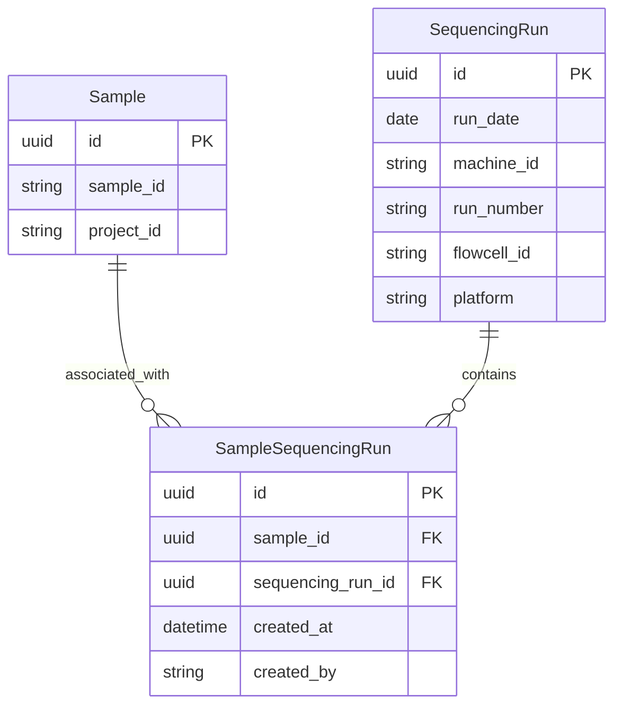

# Sample ↔ Sequencing Run Associations

This document describes the junction model that links Samples to Sequencing Runs, enabling tracking of which samples were sequenced on which runs.

## Overview

The Sample-Run association provides:

- **Many-to-many linking**: A sample can appear on multiple sequencing runs, and a run can contain multiple samples
- **Provenance**: Each association records who created it and when
- **Duplicate prevention**: A unique constraint prevents the same sample from being associated with the same run twice
- **Barcode-based lookup**: Runs are identified by their barcode (e.g., `240315_A00001_0001_BHXXXXXXX`) in the API, resolved internally to UUIDs

## Architecture

### Entity Relationship Diagram



### Design Decisions

**Why a separate junction table?**

The relationship between samples and runs is inherently many-to-many. A sample may be re-sequenced across multiple runs for coverage depth, and each run contains many samples. The `SampleSequencingRun` junction table models this cleanly with a unique constraint preventing duplicate associations.

**Why barcode-based API, not UUID?**

The run barcode (e.g., `240315_A00001_0001_BHXXXXXXX`) is the human-readable identifier used by sequencing operators. The API accepts barcodes for run identification, and the service layer resolves them to internal UUIDs. This is consistent with the existing run endpoints (`GET /runs/{run_barcode}`, etc.).

**SequencingRun.platform column**

A new nullable `platform` column was added to `SequencingRun` to record the sequencing platform (e.g., `"Illumina"`, `"ONT"`). This is additive and does not affect existing data.

## Database Model

### SampleSequencingRun

| Field | Type | Required | Description |
|-------|------|----------|-------------|
| `id` | UUID | auto | Primary key |
| `sample_id` | UUID | yes | FK → `sample.id` |
| `sequencing_run_id` | UUID | yes | FK → `sequencingrun.id` |
| `created_at` | datetime | auto | UTC timestamp of association |
| `created_by` | string | yes | Username of the creator |

**Constraints:** `UNIQUE(sample_id, sequencing_run_id)` — prevents duplicate associations.

## API Endpoints

All endpoints require authentication. The authenticated user's username is recorded as `created_by`.

These endpoints are nested under the existing `/runs` router.

### Associate Sample with Run

```
POST /runs/{run_barcode}/samples
```

**Request Body:**

```json
{
  "sample_id": "a1b2c3d4-..."
}
```

**Response** (`201 Created`):

```json
{
  "id": "...",
  "sample_id": "a1b2c3d4-...",
  "sequencing_run_id": "e5f6g7h8-...",
  "created_at": "2026-03-01T12:00:00Z",
  "created_by": "jdoe"
}
```

**Error** (`409 Conflict`): If the sample is already associated with this run.
**Error** (`404 Not Found`): If the run barcode or sample ID does not exist.

### List Samples for a Run

```
GET /runs/{run_barcode}/samples
```

**Response** (`200 OK`):

```json
[
  {
    "id": "...",
    "sample_id": "a1b2c3d4-...",
    "sequencing_run_id": "e5f6g7h8-...",
    "created_at": "2026-03-01T12:00:00Z",
    "created_by": "jdoe"
  }
]
```

**Error** (`404 Not Found`): If the run barcode does not exist.

### Remove Sample from Run

```
DELETE /runs/{run_barcode}/samples/{sample_id}
```

**Response:** `204 No Content`

**Error** (`404 Not Found`): If the association does not exist.

## Source Files

| File | Description |
|------|-------------|
| `api/runs/models.py` | `SampleSequencingRun` table definition, `SampleSequencingRunCreate` and `SampleSequencingRunPublic` schemas |
| `api/runs/services.py` | `associate_sample_with_run()`, `get_samples_for_run()`, `remove_sample_from_run()` |
| `api/runs/routes.py` | Route handlers under `/runs/{run_barcode}/samples` |
| `tests/api/test_sample_run_association.py` | Association endpoint tests (9 tests) |
