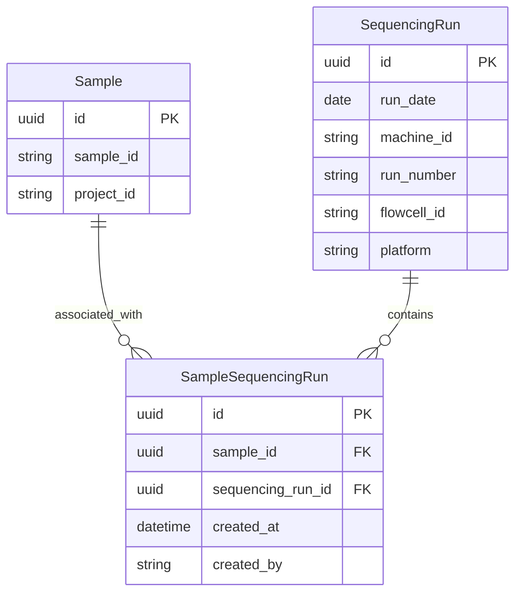

# Sample ↔ Sequencing Run Associations

This document describes the junction model that links Samples to Sequencing Runs, enabling tracking of which samples were sequenced on which runs.

## Overview

The Sample-Run association provides:

- **Many-to-many linking**: A sample can appear on multiple sequencing runs, and a run can contain multiple samples
- **Provenance**: Each association records who created it and when
- **Duplicate prevention**: A unique constraint prevents the same sample from being associated with the same run twice
- **Barcode-based lookup**: Runs are identified by their barcode (e.g., `240315_A00001_0001_BHXXXXXXX`) in the API, resolved internally to UUIDs

## Architecture

### Entity Relationship Diagram



### Design Decisions

**Why a separate junction table?**

The relationship between samples and runs is inherently many-to-many. A sample may be re-sequenced across multiple runs for coverage depth, and each run contains many samples. The `SampleSequencingRun` junction table models this cleanly with a unique constraint preventing duplicate associations.

**Why barcode-based API, not UUID?**

The run barcode (e.g., `240315_A00001_0001_BHXXXXXXX`) is the human-readable identifier used by sequencing operators. The API accepts barcodes for run identification, and the service layer resolves them to internal UUIDs. This is consistent with the existing run endpoints (`GET /runs/{run_barcode}`, etc.).

**SequencingRun.platform column**

A new nullable `platform` column was added to `SequencingRun` to record the sequencing platform (e.g., `"Illumina"`, `"ONT"`). This is additive and does not affect existing data.

## Database Model

### SampleSequencingRun

| Field | Type | Required | Description |
|-------|------|----------|-------------|
| `id` | UUID | auto | Primary key |
| `sample_id` | UUID | yes | FK → `sample.id` |
| `sequencing_run_id` | UUID | yes | FK → `sequencingrun.id` |
| `created_at` | datetime | auto | UTC timestamp of association |
| `created_by` | string | yes | Username of the creator |

**Constraints:** `UNIQUE(sample_id, sequencing_run_id)` — prevents duplicate associations.

## API Endpoints

All endpoints require authentication. The authenticated user's username is recorded as `created_by`.

### Project-Side Sample Creation (with optional run association)

These endpoints are nested under the `/projects` router and combine sample creation with run association in a single request.

#### Create Single Sample

```
POST /projects/{project_id}/samples
```

**Request Body:**

```json
{
  "sample_id": "Sample_001",
  "run_barcode": "240315_A00001_0001_BHXXXXXXX",
  "attributes": [
    { "key": "tissue", "value": "liver" }
  ]
}
```

The `run_barcode` and `attributes` fields are optional. When `run_barcode` is provided, a `SampleSequencingRun` association is created in the same transaction — eliminating the need for a separate `POST /runs/{barcode}/samples` call.

**Response** (`200 OK`):

```json
{
  "sample_id": "Sample_001",
  "project_id": "PRJ-0042",
  "attributes": [
    { "key": "tissue", "value": "liver" }
  ],
  "run_barcode": "240315_A00001_0001_BHXXXXXXX"
}
```

**Error** (`404 Not Found`): If `run_barcode` is provided but no matching run exists.
**Error** (`400 Bad Request`): If duplicate attribute keys are provided.

#### Bulk Create Samples

```
POST /projects/{project_id}/samples/bulk
```

Creates multiple samples in a single atomic transaction. All database writes succeed or the entire batch is rolled back.

**Request Body:**

```json
{
  "samples": [
    {
      "sample_id": "Sample_001",
      "run_barcode": "240315_A00001_0001_BHXXXXXXX",
      "attributes": [{ "key": "tissue", "value": "liver" }]
    },
    {
      "sample_id": "Sample_002",
      "run_barcode": "240315_A00001_0001_BHXXXXXXX"
    },
    {
      "sample_id": "Sample_003"
    }
  ]
}
```

Each item's `run_barcode` and `attributes` are optional. Items without `run_barcode` create samples only; items with `run_barcode` also create `SampleSequencingRun` associations.

**Idempotency:** If a sample already exists in the project (same `sample_id` + `project_id`), the existing row is reused rather than duplicated. Similarly, if a sample↔run association already exists, it is counted but not re-created. This makes the endpoint safe for retries and re-demux scenarios.

**Response** (`200 OK`):

```json
{
  "project_id": "PRJ-0042",
  "samples_created": 2,
  "samples_existing": 1,
  "associations_created": 2,
  "associations_existing": 0,
  "items": [
    {
      "sample_id": "Sample_001",
      "sample_uuid": "a1b2c3d4-...",
      "project_id": "PRJ-0042",
      "created": true,
      "run_barcode": "240315_A00001_0001_BHXXXXXXX"
    },
    {
      "sample_id": "Sample_002",
      "sample_uuid": "e5f6g7h8-...",
      "project_id": "PRJ-0042",
      "created": true,
      "run_barcode": "240315_A00001_0001_BHXXXXXXX"
    },
    {
      "sample_id": "Sample_003",
      "sample_uuid": "i9j0k1l2-...",
      "project_id": "PRJ-0042",
      "created": true,
      "run_barcode": null
    }
  ]
}
```

**Pre-validation errors (entire batch rejected):**

| Status | Condition |
|--------|-----------|
| `422 Unprocessable Entity` | Duplicate `sample_id` values within the request |
| `422 Unprocessable Entity` | Any `run_barcode` not found in the database |
| `400 Bad Request` | Duplicate attribute keys on any single sample |

### Run-Side Association Endpoints

These endpoints are nested under the existing `/runs` router.

### Associate Sample with Run

```
POST /runs/{run_barcode}/samples
```

**Request Body:**

```json
{
  "sample_id": "a1b2c3d4-..."
}
```

**Response** (`201 Created`):

```json
{
  "id": "...",
  "sample_id": "a1b2c3d4-...",
  "sequencing_run_id": "e5f6g7h8-...",
  "created_at": "2026-03-01T12:00:00Z",
  "created_by": "jdoe"
}
```

**Error** (`409 Conflict`): If the sample is already associated with this run.
**Error** (`404 Not Found`): If the run barcode or sample ID does not exist.

### List Samples for a Run

```
GET /runs/{run_barcode}/samples
```

**Response** (`200 OK`):

```json
[
  {
    "id": "...",
    "sample_id": "a1b2c3d4-...",
    "sequencing_run_id": "e5f6g7h8-...",
    "created_at": "2026-03-01T12:00:00Z",
    "created_by": "jdoe"
  }
]
```

**Error** (`404 Not Found`): If the run barcode does not exist.

### Remove Sample from Run

```
DELETE /runs/{run_barcode}/samples/{sample_id}
```

**Response:** `204 No Content`

**Error** (`404 Not Found`): If the association does not exist.

### Clear All Samples for a Run (Re-demux Cleanup)

```
DELETE /runs/{run_barcode}/samples
```

This bulk endpoint is designed for the **re-demultiplexing scenario**: when a sequencing run is re-demultiplexed (e.g., after correcting a wrong project ID on the samplesheet), the batch job calls this endpoint to clean up stale data before creating new samples and associations.

**Cleanup Steps (in order):**

1. **Delete run-level File records** — All `File` rows whose `FileEntity` links them to this run (`entity_type=RUN`) are deleted. Cascade deletes remove associated `FileEntity`, `FileHash`, `FileTag`,tests/conftest.py and `FileSample` rows. The corresponding S3 objects are assumed to already be deleted by the batch job.

2. **Remove all SampleSequencingRun associations** — Every `SampleSequencingRun` row for this run is deleted.

3. **Smart-cascade delete orphaned Samples** — For each sample that was associated with the run, the service checks whether the sample still has any remaining ties:
   - Other `SampleSequencingRun` associations (i.e., the sample appears on another run)
   - `FileSample` links (i.e., the sample has files not from this run)
   - `QCMetricSample` links (i.e., the sample has QC data)

   If **none** of these exist, the sample is considered orphaned and is deleted along with its `SampleAttribute` rows and its OpenSearch index entry. If **any** ties remain, the sample is preserved.

**Response** (`200 OK`):

```json
{
  "run_barcode": "240315_A00001_0001_BHXXXXXXX",
  "associations_removed": 5,
  "files_deleted": 12,
  "samples_deleted": 4,
  "samples_preserved": 1
}
```

**Error** (`404 Not Found`): If the run barcode does not exist.

**Typical Caller:** The demultiplexing batch job, immediately before re-creating samples and associations for the corrected samplesheet.

## Source Files

| File | Description |
|------|-------------|
| `api/samples/models.py` | `Sample`, `SampleCreate` (with optional `run_barcode`), `SamplePublic`, `BulkSampleCreateRequest`, `BulkSampleItemResponse`, `BulkSampleCreateResponse` |
| `api/samples/services.py` | `bulk_create_samples()` — atomic batch creation with idempotent resolve-or-create logic |
| `api/project/services.py` | `add_sample_to_project()` — single-sample creation with optional run association |
| `api/project/routes.py` | Route handlers for `POST /projects/{pid}/samples` and `POST /projects/{pid}/samples/bulk` |
| `api/runs/models.py` | `SampleSequencingRun` table, `SampleSequencingRunCreate`, `SampleSequencingRunPublic`, and `RunSampleCleanupResponse` schemas |
| `api/runs/services.py` | `associate_sample_with_run()`, `get_samples_for_run()`, `remove_sample_from_run()`, `clear_samples_for_run()` |
| `api/runs/routes.py` | Route handlers under `/runs/{run_barcode}/samples` |
| `api/search/services.py` | `delete_document_from_index()` — removes sample entries from OpenSearch on cleanup |
| `tests/api/test_bulk_samples.py` | Single-sample run_barcode enrichment and bulk endpoint tests (22 tests) |
| `tests/api/test_sample_run_association.py` | Run-side association and cleanup endpoint tests (17 tests) |
