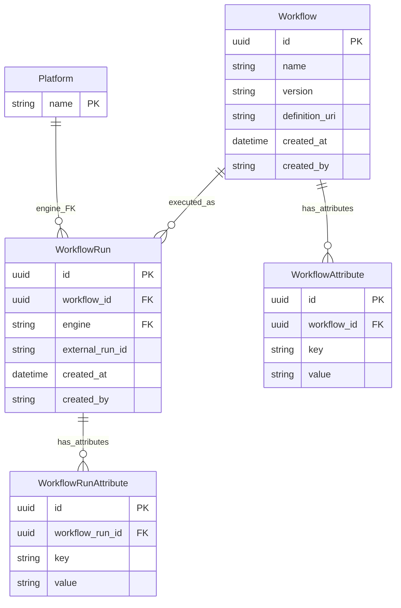

# Workflows & Runs

This document describes the Workflow system for defining and tracking executions of bioinformatics workflows across multiple compute platforms.

## Overview

The Workflow system provides:

- **Platform-agnostic workflow definitions**: Define a workflow once with a name, version, and definition URI (e.g., a WDL/CWL/Nextflow file)
- **Execution provenance**: Record workflow runs with engine-specific run IDs and key-value attributes for file/QC provenance tracking
- **Audit trails**: All entities track `created_at` and `created_by`

## Architecture

### Entity Relationship Diagram



### Design Decisions

**Why separate WorkflowRun from BatchJob?**

`WorkflowRun` tracks the execution of a workflow definition at the domain level, while `BatchJob` tracks infrastructure-level job submission (AWS Batch). A single `WorkflowRun` might correspond to a `BatchJob`, or it might be tracked externally (e.g., in Arvados). This separation keeps the domain model clean.

**Why no WorkflowRegistration?**

This repository previously included a `WorkflowRegistration` entity that represented a workflow's registration on an external execution platform (linking a `Workflow` to a `Platform` with a platform-specific identifier). It was decided in [issue #188](https://github.com/cbio/APIServer/issues/188) that tracking platform registrations is beyond the necessary scope of this repository — that information is stored exclusively in the GA4GH WES implementation.

## Database Models

### Workflow

The core entity. Represents a platform-agnostic workflow definition.

| Field | Type | Required | Description |
|-------|------|----------|-------------|
| `id` | UUID | auto | Primary key |
| `name` | string | yes | Human-readable workflow name |
| `version` | string | no | Semantic version (e.g., `"1.2.0"`) |
| `definition_uri` | string | yes | URI to the workflow definition file (WDL, CWL, Nextflow, etc.) |
| `created_at` | datetime | auto | UTC timestamp of creation |
| `created_by` | string | yes | Username of the creator |

### WorkflowAttribute

Key-value metadata for workflows. Extensible without schema changes.

| Field | Type | Required | Description |
|-------|------|----------|-------------|
| `id` | UUID | auto | Primary key |
| `workflow_id` | UUID | yes | FK → `workflow.id` |
| `key` | string | yes | Attribute name |
| `value` | string | yes | Attribute value |

### Platform

A registered workflow execution engine. Single-column reference table — the `name` is the PK. Must be created before workflow runs can reference a given engine.

| Field | Type | Required | Description |
|-------|------|----------|-------------|
| `name` | string | yes | Primary key — e.g., `"Arvados"`, `"SevenBridges"` |

### WorkflowRun

Provenance record linking a workflow to an external execution. Status tracking is handled by a separate execution service; this table stores the identifier for file and QC metric provenance. The `engine` column is a FK to `platform.name`.

| Field | Type | Required | Description |
|-------|------|----------|-------------|
| `id` | UUID | auto | Primary key |
| `workflow_id` | UUID | yes | FK → `workflow.id` |
| `engine` | string | yes | FK → `platform.name` |
| `external_run_id` | string | yes | External run/job ID on the platform |
| `created_at` | datetime | auto | UTC timestamp of creation |
| `created_by` | string | yes | Username of the creator |

### WorkflowRunAttribute

Key-value metadata for workflow runs (e.g., input parameters, output paths).

| Field | Type | Required | Description |
|-------|------|----------|-------------|
| `id` | UUID | auto | Primary key |
| `workflow_run_id` | UUID | yes | FK → `workflowrun.id` |
| `key` | string | yes | Attribute name |
| `value` | string | yes | Attribute value |

## API Endpoints

All workflow endpoints require authentication. The authenticated user's username is recorded as `created_by`.

### Workflow CRUD

#### Create a Workflow

```
POST /workflows
```

**Request Body:**

```json
{
  "name": "variant-calling-wf",
  "version": "2.1.0",
  "definition_uri": "s3://workflows/variant-calling.wdl",
  "attributes": [
    {"key": "category", "value": "genomics"},
    {"key": "author", "value": "bioinformatics-team"}
  ]
}
```

**Response** (`201 Created`):

```json
{
  "id": "a1b2c3d4-...",
  "name": "variant-calling-wf",
  "version": "2.1.0",
  "definition_uri": "s3://workflows/variant-calling.wdl",
  "created_at": "2026-03-01T12:00:00Z",
  "created_by": "jdoe",
  "attributes": [
    {"key": "category", "value": "genomics"},
    {"key": "author", "value": "bioinformatics-team"}
  ]
}
```

#### List Workflows

```
GET /workflows?page=1&per_page=20&sort_by=name&sort_order=asc
```

Returns a list of `WorkflowPublic` objects with their attributes.

#### Get Workflow by ID

```
GET /workflows/{workflow_id}
```

Returns a single workflow with attributes.

### WorkflowRun Endpoints

#### Create a Run

```
POST /workflows/{workflow_id}/runs
```

**Request Body:**

```json
{
  "workflow_id": "a1b2c3d4-...",
  "engine": "Arvados",
  "external_run_id": "zzzzz-xvhdp-run123",
  "attributes": [
    {"key": "sample_id", "value": "sample-001"},
    {"key": "input_bam", "value": "s3://data/sample-001.bam"}
  ]
}
```

**Response** (`201 Created`):

```json
{
  "id": "...",
  "workflow_id": "a1b2c3d4-...",
  "workflow_name": "variant-calling-wf",
  "engine": "Arvados",
  "external_run_id": "zzzzz-xvhdp-run123",
  "created_at": "2026-03-01T14:00:00Z",
  "created_by": "jdoe",
  "attributes": [
    {"key": "sample_id", "value": "sample-001"},
    {"key": "input_bam", "value": "s3://data/sample-001.bam"}
  ]
}
```

#### List Runs (Paginated)

```
GET /workflows/{workflow_id}/runs?page=1&per_page=20&sort_by=created_at&sort_order=desc
```

**Response:**

```json
{
  "data": [ ... ],
  "total_items": 42,
  "total_pages": 3,
  "current_page": 1,
  "per_page": 20,
  "has_next": true,
  "has_prev": false
}
```

#### Get Run by ID

```
GET /workflow-runs/{run_id}
```

Note: This uses a top-level `/workflow-runs` path (not nested under a workflow) for convenience.

## Source Files

| File | Description |
|------|-------------|
| `api/platforms/models.py` | Platform table model and schemas |
| `api/platforms/services.py` | Platform CRUD services |
| `api/platforms/routes.py` | Platform endpoint handlers |
| `api/workflow/models.py` | Workflow/Run table definitions and schemas |
| `api/workflow/services.py` | Workflow business logic (create, list, engine validation) |
| `api/workflow/routes.py` | Workflow endpoint handlers |
| `tests/api/test_platforms.py` | Platform CRUD tests |
| `tests/api/test_workflows.py` | Workflow CRUD tests |
| `tests/api/test_workflow_runs.py` | Workflow run endpoint tests (incl. engine validation) |
