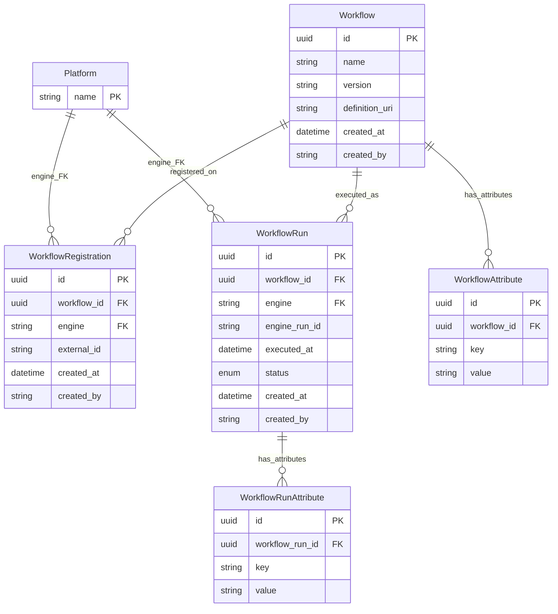
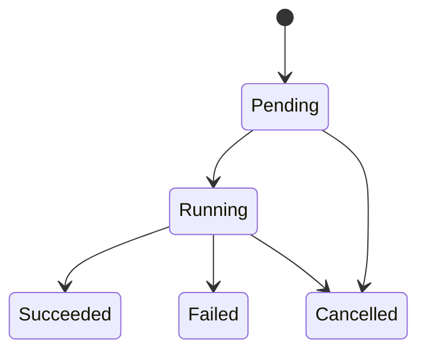

# Workflows, Registrations & Runs

This document describes the Workflow system for defining, registering, and tracking executions of bioinformatics workflows across multiple compute platforms.

## Overview

The Workflow system provides:

- **Platform-agnostic workflow definitions**: Define a workflow once with a name, version, and definition URI (e.g., a WDL/CWL/Nextflow file)
- **Cross-platform registration**: Register the same workflow on multiple execution engines (Arvados, SevenBridges, AWS Batch, etc.)
- **Execution tracking**: Record workflow runs with status lifecycle, engine-specific run IDs, and key-value attributes
- **Provenance**: All entities track `created_at` and `created_by` for audit trails

## Architecture

### Entity Relationship Diagram



### Design Decisions

**Why separate Workflow and WorkflowRegistration?**

A workflow definition (the WDL/CWL file) is conceptually the same regardless of which platform it runs on. The `Workflow` table captures this identity. The `WorkflowRegistration` table captures where and how a workflow is deployed — its engine-specific external identifier. This means:

- The same workflow can be registered on Arvados *and* SevenBridges without duplication
- Removing one platform registration doesn't delete the workflow or its run history
- A unique constraint (`uq_workflow_engine`) ensures only one registration per workflow per engine

**Why separate WorkflowRun from BatchJob?**

`WorkflowRun` tracks the execution of a workflow definition at the domain level, while `BatchJob` tracks infrastructure-level job submission (AWS Batch). A single `WorkflowRun` might correspond to a `BatchJob`, or it might be tracked externally (e.g., in Arvados). This separation keeps the domain model clean.

## Database Models

### Workflow

The core entity. Represents a platform-agnostic workflow definition.

| Field | Type | Required | Description |
|-------|------|----------|-------------|
| `id` | UUID | auto | Primary key |
| `name` | string | yes | Human-readable workflow name |
| `version` | string | no | Semantic version (e.g., `"1.2.0"`) |
| `definition_uri` | string | yes | URI to the workflow definition file (WDL, CWL, Nextflow, etc.) |
| `created_at` | datetime | auto | UTC timestamp of creation |
| `created_by` | string | yes | Username of the creator |

### WorkflowAttribute

Key-value metadata for workflows. Extensible without schema changes.

| Field | Type | Required | Description |
|-------|------|----------|-------------|
| `id` | UUID | auto | Primary key |
| `workflow_id` | UUID | yes | FK → `workflow.id` |
| `key` | string | yes | Attribute name |
| `value` | string | yes | Attribute value |

### Platform

A registered workflow execution engine. Single-column reference table — the `name` is the PK. Must be created before workflows can be registered or run on a given engine.

| Field | Type | Required | Description |
|-------|------|----------|-------------|
| `name` | string | yes | Primary key — e.g., `"Arvados"`, `"SevenBridges"` |

### WorkflowRegistration

Platform-specific registration of a workflow. One workflow can have at most one registration per engine. The `engine` column is a FK to `platform.name`.

| Field | Type | Required | Description |
|-------|------|----------|-------------|
| `id` | UUID | auto | Primary key |
| `workflow_id` | UUID | yes | FK → `workflow.id` |
| `engine` | string | yes | FK → `platform.name` |
| `external_id` | string | yes | Workflow identifier on the external platform |
| `created_at` | datetime | auto | UTC timestamp of creation |
| `created_by` | string | yes | Username of the creator |

**Constraints:** `UNIQUE(workflow_id, engine)` — one registration per engine per workflow.

### WorkflowRun

Execution record of a workflow. Tracks status and engine-specific run IDs. The `engine` column is a FK to `platform.name`.

| Field | Type | Required | Description |
|-------|------|----------|-------------|
| `id` | UUID | auto | Primary key |
| `workflow_id` | UUID | yes | FK → `workflow.id` |
| `engine` | string | yes | FK → `platform.name` |
| `engine_run_id` | string | no | External run/job ID on the platform |
| `executed_at` | datetime | auto | When the run was initiated |
| `status` | enum | yes | One of: `PENDING`, `RUNNING`, `SUCCEEDED`, `FAILED`, `CANCELLED` |
| `created_at` | datetime | auto | UTC timestamp of creation |
| `created_by` | string | yes | Username of the creator |

### WorkflowRunAttribute

Key-value metadata for workflow runs (e.g., input parameters, output paths).

| Field | Type | Required | Description |
|-------|------|----------|-------------|
| `id` | UUID | auto | Primary key |
| `workflow_run_id` | UUID | yes | FK → `workflowrun.id` |
| `key` | string | yes | Attribute name |
| `value` | string | yes | Attribute value |

## API Endpoints

All workflow endpoints require authentication. The authenticated user's username is recorded as `created_by`.

### Workflow CRUD

#### Create a Workflow

```
POST /workflows
```

**Request Body:**

```json
{
  "name": "variant-calling-wf",
  "version": "2.1.0",
  "definition_uri": "s3://workflows/variant-calling.wdl",
  "attributes": [
    {"key": "category", "value": "genomics"},
    {"key": "author", "value": "bioinformatics-team"}
  ]
}
```

**Response** (`201 Created`):

```json
{
  "id": "a1b2c3d4-...",
  "name": "variant-calling-wf",
  "version": "2.1.0",
  "definition_uri": "s3://workflows/variant-calling.wdl",
  "created_at": "2026-03-01T12:00:00Z",
  "created_by": "jdoe",
  "attributes": [
    {"key": "category", "value": "genomics"},
    {"key": "author", "value": "bioinformatics-team"}
  ],
  "registrations": []
}
```

#### List Workflows

```
GET /workflows?page=1&per_page=20&sort_by=name&sort_order=asc
```

Returns a list of `WorkflowPublic` objects with their attributes and registrations.

#### Get Workflow by ID

```
GET /workflows/{workflow_id}
```

Returns a single workflow with attributes and registrations.

### WorkflowRegistration Endpoints

#### Register Workflow on Platform

```
POST /workflows/{workflow_id}/registrations
```

**Request Body:**

```json
{
  "engine": "Arvados",
  "external_id": "zzzzz-7fd4e-abc123def456"
}
```

> **Note:** The `engine` value must match a registered Platform `name`. Create platforms first via `POST /platforms`.

**Response** (`201 Created`):

```json
{
  "id": "...",
  "workflow_id": "a1b2c3d4-...",
  "engine": "Arvados",
  "external_id": "zzzzz-7fd4e-abc123def456",
  "created_at": "2026-03-01T12:05:00Z",
  "created_by": "jdoe"
}
```

**Errors:**
- `400 Bad Request` — Engine is not a registered platform.
- `409 Conflict` — A registration for the same engine already exists.

#### List Registrations

```
GET /workflows/{workflow_id}/registrations
```

Returns all platform registrations for a workflow.

#### Delete Registration

```
DELETE /workflows/{workflow_id}/registrations/{registration_id}
```

**Response:** `204 No Content`

### WorkflowRun Endpoints

#### Create a Run

```
POST /workflows/{workflow_id}/runs
```

**Request Body:**

```json
{
  "workflow_id": "a1b2c3d4-...",
  "engine": "arvados",
  "engine_run_id": "zzzzz-xvhdp-run123",
  "status": "Running",
  "attributes": [
    {"key": "sample_id", "value": "sample-001"},
    {"key": "input_bam", "value": "s3://data/sample-001.bam"}
  ]
}
```

**Response** (`201 Created`):

```json
{
  "id": "...",
  "workflow_id": "a1b2c3d4-...",
  "workflow_name": "variant-calling-wf",
  "engine": "arvados",
  "engine_run_id": "zzzzz-xvhdp-run123",
  "executed_at": "2026-03-01T14:00:00Z",
  "status": "Running",
  "created_at": "2026-03-01T14:00:00Z",
  "created_by": "jdoe",
  "attributes": [
    {"key": "sample_id", "value": "sample-001"},
    {"key": "input_bam", "value": "s3://data/sample-001.bam"}
  ]
}
```

#### List Runs (Paginated)

```
GET /workflows/{workflow_id}/runs?page=1&per_page=20&sort_by=created_at&sort_order=desc
```

**Response:**

```json
{
  "data": [ ... ],
  "total_items": 42,
  "total_pages": 3,
  "current_page": 1,
  "per_page": 20,
  "has_next": true,
  "has_prev": false
}
```

#### Get Run by ID

```
GET /workflow-runs/{run_id}
```

Note: This uses a top-level `/workflow-runs` path (not nested under a workflow) for convenience.

#### Update Run

```
PUT /workflow-runs/{run_id}
```

**Request Body** (partial update — either or both fields):

```json
{
  "status": "Succeeded",
  "engine_run_id": "zzzzz-xvhdp-run123-completed"
}
```

**Response:** Updated `WorkflowRunPublic` object.

## Status Lifecycle



Valid status values: `Pending`, `Running`, `Succeeded`, `Failed`, `Cancelled`.

## Source Files

| File | Description |
|------|-------------|
| `api/platforms/models.py` | Platform table model and schemas |
| `api/platforms/services.py` | Platform CRUD services |
| `api/platforms/routes.py` | Platform endpoint handlers |
| `api/workflow/models.py` | Workflow/Registration/Run table definitions and schemas |
| `api/workflow/services.py` | Workflow business logic (create, list, update, engine validation) |
| `api/workflow/routes.py` | Workflow endpoint handlers |
| `tests/api/test_platforms.py` | Platform CRUD tests |
| `tests/api/test_workflows.py` | Workflow CRUD tests |
| `tests/api/test_workflow_registrations.py` | Registration endpoint tests (incl. engine validation) |
| `tests/api/test_workflow_runs.py` | Workflow run endpoint tests (incl. engine validation) |
