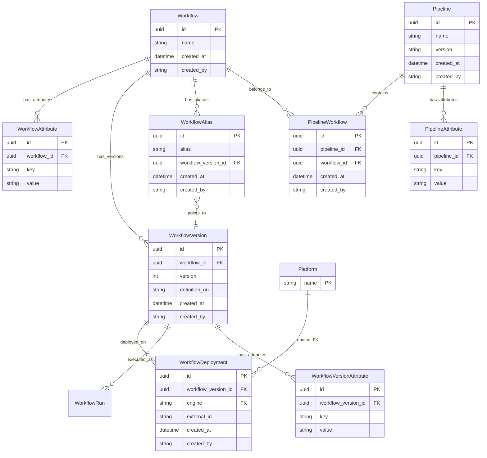

# Workflows, Pipelines & Execution Provenance

This document describes the Workflow and Pipeline systems — how workflows are defined, versioned, deployed on compute platforms, executed, and organised into named collections.

## Overview

The system provides:

- **Platform-agnostic workflow identity**: Define a workflow once by name
- **Versioning**: Each version carries its own `definition_uri` (WDL/CWL/Nextflow file) and semantic version string
- **Aliases**: Assign an alias to a specific version, e.g. `production` or `development` — like AWS Lambda aliases
- **Cross-platform deployment**: Register a specific workflow version on multiple execution engines (Arvados, SevenBridges, AWS Batch, etc.)
- **Pipeline grouping**: Organise related workflows into named groups called pipelines
- **Flexible metadata**: Key-value attributes on workflows and pipelines
- **Provenance**: All entities track `created_at` and `created_by` for audit trails
- **Pagination**: List endpoints support pagination with configurable sorting

## Architecture

### Entity Relationship Diagram



### Design Decisions

**Why separate Workflow and WorkflowVersion?**

A workflow definition evolves over time. The `Workflow` table captures the logical identity (e.g., "Alignment") while `WorkflowVersion` captures each revision with its own version string and definition URI. This means:

- Creating a new version doesn't create a new workflow — it adds a row to `WorkflowVersion`
- All runs across all versions of the same workflow are aggregable via `WorkflowVersion.workflow_id`
- Pipelines reference the logical workflow, not a specific version

**Why a separate alias table?**

Aliases like `production` and `development` let teams mark which version should be used without hardcoding version strings. The `WorkflowAlias` table stores a free-text alias name with a `UNIQUE(workflow_id, alias)` constraint — each workflow can have at most one pointer per alias name. Moving an alias is an upsert, providing an audit trail of who changed it and when.

**Why do WorkflowDeployment and WorkflowRun point to WorkflowVersion?**

You register and execute a *specific version* of a workflow. Different versions may have different external IDs on the same platform. The FK to `workflowversion.id` captures this precisely. You can still navigate to the parent workflow via `WorkflowVersion.workflow_id`.

**Why separate WorkflowRun from BatchJob?**

`WorkflowRun` tracks the execution of a workflow version at the domain level, while `BatchJob` tracks infrastructure-level job submission (AWS Batch). A single `WorkflowRun` might correspond to a `BatchJob`, or it might be tracked externally (e.g., in Arvados). This separation keeps the domain model clean.

**Why a separate PipelineWorkflow junction table (not a direct FK)?**

The relationship between Pipeline and Workflow is many-to-many: a workflow can belong to multiple pipelines, and a pipeline can contain multiple workflows. The `PipelineWorkflow` junction table captures this with a unique constraint (`uq_pipeline_workflow`) preventing duplicate associations. See `plans/phase1-decisions-pipeline-workflow-relationships.md` for detailed rationale.

**Why no ordering in the junction table?**

Pipeline membership is currently unordered — the workflows in a pipeline are a **set**, not a sequence. This simplifies the initial implementation. If workflow ordering within a pipeline is needed in the future, a `position` column can be added to `PipelineWorkflow`.

**Pipelines are version-agnostic**

Pipelines are purely organisational — a pipeline references workflows, not specific workflow versions. They do not directly affect how workflow versions are deployed on platforms or how runs are tracked. A pipeline groups workflows; each workflow independently manages its own versions, aliases, deployments, and runs.

## Database Models

### Workflow

The core identity entity. Represents a platform-agnostic workflow.

| Field | Type | Required | Description |
|-------|------|----------|-------------|
| `id` | UUID | auto | Primary key |
| `name` | string | yes | Human-readable workflow name |
| `created_at` | datetime | auto | UTC timestamp of creation |
| `created_by` | string | yes | Username of the creator |

### WorkflowAttribute

Key-value metadata for workflows. Extensible without schema changes.

| Field | Type | Required | Description |
|-------|------|----------|-------------|
| `id` | UUID | auto | Primary key |
| `workflow_id` | UUID | yes | FK → `workflow.id` |
| `key` | string | yes | Attribute name |
| `value` | string | yes | Attribute value |

### WorkflowVersion

A versioned definition of a workflow.

| Field | Type | Required | Description |
|-------|------|----------|-------------|
| `id` | UUID | auto | Primary key |
| `workflow_id` | UUID | yes | FK → `workflow.id` |
| `version` | string | yes | Semantic version string (e.g., `"2.1.0"`) |
| `definition_uri` | string | yes | URI to the workflow definition file (WDL, CWL, Nextflow, etc.) |
| `created_at` | datetime | auto | UTC timestamp |
| `created_by` | string | yes | Username of the creator |

**Constraints:** `UNIQUE(workflow_id, version)` — no duplicate version strings per workflow.

### WorkflowAlias

Named pointer to a specific workflow version.

| Field | Type | Required | Description |
|-------|------|----------|-------------|
| `id` | UUID | auto | Primary key |
| `workflow_id` | UUID | yes | FK → `workflow.id` — scopes the alias |
| `alias` | string | yes | Free-text alias name (e.g. `production`, `staging`) |
| `workflow_version_id` | UUID | yes | FK → `workflowversion.id` |
| `created_at` | datetime | auto | UTC timestamp |
| `created_by` | string | yes | Username who set the alias |

**Constraints:** `UNIQUE(workflow_id, alias)` — one alias pointer per workflow per alias name.

### Platform

A registered workflow execution engine. Single-column reference table — the `name` is the PK. Must be created before workflows can be deployed or run on a given engine.

| Field | Type | Required | Description |
|-------|------|----------|-------------|
| `name` | string | yes | Primary key — e.g., `"Arvados"`, `"SevenBridges"` |

### WorkflowDeployment

Platform-specific deployment of a workflow version. The `engine` column is a FK to `platform.name`.

| Field | Type | Required | Description |
|-------|------|----------|-------------|
| `id` | UUID | auto | Primary key |
| `workflow_version_id` | UUID | yes | FK → `workflowversion.id` |
| `engine` | string | yes | FK → `platform.name` |
| `external_id` | string | yes | Workflow identifier on the external platform |
| `created_at` | datetime | auto | UTC timestamp of creation |
| `created_by` | string | yes | Username of the creator |

**Constraints:** `UNIQUE(workflow_version_id, engine)` — one deployment per engine per version.

### WorkflowRun

Provenance record linking a workflow version to an external execution. The `engine` column is a FK to `platform.name`.

| Field | Type | Required | Description |
|-------|------|----------|-------------|
| `id` | UUID | auto | Primary key |
| `workflow_version_id` | UUID | yes | FK → `workflowversion.id` |
| `engine` | string | yes | FK → `platform.name` |
| `external_run_id` | string | yes | External run/job ID on the platform |
| `created_at` | datetime | auto | UTC timestamp of creation |
| `created_by` | string | yes | Username of the creator |

### WorkflowRunAttribute

Key-value metadata for workflow runs (e.g., input parameters, output paths).

| Field | Type | Required | Description |
|-------|------|----------|-------------|
| `id` | UUID | auto | Primary key |
| `workflow_run_id` | UUID | yes | FK → `workflowrun.id` |
| `key` | string | yes | Attribute name |
| `value` | string | yes | Attribute value |

### Pipeline

A named, versioned collection of workflows.

| Field | Type | Required | Description |
|-------|------|----------|-------------|
| `id` | UUID | auto | Primary key |
| `name` | string | yes | Human-readable pipeline name |
| `version` | string | no | Version string (e.g., `"1.0.0"`) |
| `created_at` | datetime | auto | UTC timestamp of creation |
| `created_by` | string | yes | Username of the creator |

### PipelineAttribute

Key-value metadata for pipelines.

| Field | Type | Required | Description |
|-------|------|----------|-------------|
| `id` | UUID | auto | Primary key |
| `pipeline_id` | UUID | yes | FK → `pipeline.id` |
| `key` | string | yes | Attribute name |
| `value` | string | yes | Attribute value |

**Constraints:** `UNIQUE(pipeline_id, key)` — one value per key per pipeline.

### PipelineWorkflow

Junction table linking workflows to pipelines. Each association records who created it and when.

| Field | Type | Required | Description |
|-------|------|----------|-------------|
| `id` | UUID | auto | Primary key |
| `pipeline_id` | UUID | yes | FK → `pipeline.id` |
| `workflow_id` | UUID | yes | FK → `workflow.id` |
| `created_at` | datetime | auto | UTC timestamp of association |
| `created_by` | string | yes | Username of the creator |

**Constraints:** `UNIQUE(pipeline_id, workflow_id)` — a workflow can only appear once per pipeline.

## API Endpoints

All endpoints require authentication. The authenticated user's username is recorded as `created_by`.

### Workflow CRUD

#### Create a Workflow

```
POST /workflows
```

**Request Body:**

```json
{
  "name": "variant-calling-wf",
  "attributes": [
    {"key": "category", "value": "genomics"},
    {"key": "author", "value": "bioinformatics-team"}
  ]
}
```

**Response** (`201 Created`):

```json
{
  "id": "a1b2c3d4-...",
  "name": "variant-calling-wf",
  "created_at": "2026-03-01T12:00:00Z",
  "created_by": "jdoe",
  "attributes": [
    {"key": "category", "value": "genomics"},
    {"key": "author", "value": "bioinformatics-team"}
  ],
  "versions": [],
  "aliases": []
}
```

#### List Workflows

```
GET /workflows?page=1&per_page=20&sort_by=name&sort_order=asc
```

Returns a list of workflows with their attributes, version summaries, and aliases.

#### Get Workflow by ID

```
GET /workflows/{workflow_id}
```

Returns a single workflow with attributes, version summaries, and aliases.

### WorkflowVersion Endpoints

#### Create a Version

```
POST /workflows/{workflow_id}/versions
```

**Request Body:**

```json
{
  "version": "2.1.0",
  "definition_uri": "s3://workflows/variant-calling-v2.1.cwl"
}
```

**Response** (`201 Created`):

```json
{
  "id": "v1v2v3v4-...",
  "workflow_id": "a1b2c3d4-...",
  "version": "2.1.0",
  "definition_uri": "s3://workflows/variant-calling-v2.1.cwl",
  "created_at": "2026-03-01T12:05:00Z",
  "created_by": "jdoe",
  "deployments": []
}
```

**Errors:**
- `404 Not Found` — Workflow does not exist.
- `409 Conflict` — Version string already exists for this workflow.

#### List Versions

```
GET /workflows/{workflow_id}/versions
```

Returns all versions of a workflow, ordered by creation date (newest first).

#### Get Version by ID

```
GET /workflows/{workflow_id}/versions/{version_id}
```

Returns a single version with its deployments.

### WorkflowAlias Endpoints

#### Set/Update an Alias

```
PUT /workflows/{workflow_id}/aliases/{alias}
```

Where `{alias}` is `production` or `development`.

**Request Body:**

```json
{
  "workflow_version_id": "v1v2v3v4-..."
}
```

**Response** (`200 OK`):

```json
{
  "id": "...",
  "workflow_id": "a1b2c3d4-...",
  "alias": "production",
  "workflow_version_id": "v1v2v3v4-...",
  "version": "2.1.0",
  "created_at": "2026-03-01T12:10:00Z",
  "created_by": "jdoe"
}
```

Moving an alias (e.g., changing production from v2.0 to v2.1) is an upsert — same endpoint, new version ID.

**Errors:**
- `404 Not Found` — Workflow or version not found.
- `422 Unprocessable Content` — Invalid alias value.

#### List Aliases

```
GET /workflows/{workflow_id}/aliases
GET /workflows/{workflow_id}/aliases?alias=production
```

Returns aliases for a workflow. Optional query parameter:

| Param | Type | Required | Description |
|-------|------|----------|-------------|
| `alias` | `str` | no | Filter to a specific alias (e.g. `production`) |

When `alias` is provided, the response contains 0 or 1 elements.

#### Delete Alias

```
DELETE /workflows/{workflow_id}/aliases/{alias}
```

**Response:** `204 No Content`

### WorkflowDeployment Endpoints

#### List Deployments (Workflow-Level, with Filters)

```
GET /workflows/{workflow_id}/deployments
GET /workflows/{workflow_id}/deployments?alias=production
GET /workflows/{workflow_id}/deployments?engine=Arvados
GET /workflows/{workflow_id}/deployments?alias=production&engine=Arvados
```

List deployments across all versions of a workflow. Optional query parameters allow server-side filtering:

| Param | Type | Required | Description |
|-------|------|----------|-------------|
| `alias` | `str` | no | Resolve alias to its version, return only that version's deployments |
| `engine` | `str` | no | Filter by engine/platform name |

**Behavior matrix:**

| alias | engine | Result |
|-------|--------|--------|
| omitted | omitted | All deployments across all versions |
| `production` | omitted | All deployments for the production version |
| omitted | `Arvados` | All Arvados deployments across all versions |
| `production` | `Arvados` | The single Arvados deployment for production (0 or 1 items) |

**Response** (`200 OK`):

```json
[
  {
    "id": "...",
    "workflow_version_id": "v1v2v3v4-...",
    "engine": "Arvados",
    "external_id": "zzzzz-7fd4e-abc123def456",
    "created_at": "2026-03-01T12:05:00Z",
    "created_by": "jdoe"
  }
]
```

**Errors:**
- `404 Not Found` — Workflow does not exist, or `alias` is specified but not set for this workflow.

#### Deploy Version on Platform (Nested Under Version)

Deployments can also be created and managed under a specific version.

```
POST /workflows/{workflow_id}/versions/{version_id}/deployments
```

**Request Body:**

```json
{
  "engine": "Arvados",
  "external_id": "zzzzz-7fd4e-abc123def456"
}
```

> **Note:** The `engine` value must match a registered Platform `name`. Create platforms first via `POST /platforms`.

**Response** (`201 Created`):

```json
{
  "id": "...",
  "workflow_version_id": "v1v2v3v4-...",
  "engine": "Arvados",
  "external_id": "zzzzz-7fd4e-abc123def456",
  "created_at": "2026-03-01T12:05:00Z",
  "created_by": "jdoe"
}
```

**Errors:**
- `400 Bad Request` — Engine is not a registered platform.
- `409 Conflict` — A deployment for the same engine already exists for this version.

#### List Deployments (Version-Level)

```
GET /workflows/{workflow_id}/versions/{version_id}/deployments
GET /workflows/{workflow_id}/versions/{version_id}/deployments?engine=Arvados
```

Returns platform deployments for a version. Optional query parameter:

| Param | Type | Required | Description |
|-------|------|----------|-------------|
| `engine` | `str` | no | Filter by engine/platform name |

#### Delete Deployment

```
DELETE /workflows/{workflow_id}/versions/{version_id}/deployments/{deployment_id}
```

**Response:** `204 No Content`

### WorkflowRun Endpoints

#### Create a Run

```
POST /workflows/{workflow_id}/runs
```

**Request Body:**

```json
{
  "workflow_version_id": "v1v2v3v4-...",
  "engine": "Arvados",
  "external_run_id": "zzzzz-xvhdp-run123",
  "attributes": [
    {"key": "sample_id", "value": "sample-001"},
    {"key": "input_bam", "value": "s3://data/sample-001.bam"}
  ]
}
```

**Response** (`201 Created`):

```json
{
  "id": "...",
  "workflow_version_id": "v1v2v3v4-...",
  "workflow_name": "variant-calling-wf",
  "workflow_version": "2.1.0",
  "engine": "Arvados",
  "external_run_id": "zzzzz-xvhdp-run123",
  "created_at": "2026-03-01T14:00:00Z",
  "created_by": "jdoe",
  "attributes": [
    {"key": "sample_id", "value": "sample-001"},
    {"key": "input_bam", "value": "s3://data/sample-001.bam"}
  ]
}
```

#### List Runs (Paginated)

```
GET /workflows/{workflow_id}/runs?page=1&per_page=20&sort_by=created_at&sort_order=desc
```

Lists runs across all versions of the workflow.

**Response:**

```json
{
  "data": [ ... ],
  "total_items": 42,
  "total_pages": 3,
  "current_page": 1,
  "per_page": 20,
  "has_next": true,
  "has_prev": false
}
```

#### Get Run by ID

```
GET /workflow-runs/{run_id}
```

Note: This uses a top-level `/workflow-runs` path (not nested under a workflow) for convenience.

### Pipeline CRUD

#### Create a Pipeline

```
POST /pipelines
```

**Request Body:**

```json
{
  "name": "WGS Analysis Pipeline",
  "version": "2.0.0",
  "attributes": [
    {"key": "description", "value": "End-to-end whole genome sequencing analysis"},
    {"key": "department", "value": "genomics"}
  ],
  "workflow_ids": [
    "a1b2c3d4-...",
    "e5f6g7h8-..."
  ]
}
```

All fields except `name` are optional. `workflow_ids` associates existing workflows at creation time.

**Response** (`201 Created`):

```json
{
  "id": "p1p2p3p4-...",
  "name": "WGS Analysis Pipeline",
  "version": "2.0.0",
  "created_at": "2026-03-01T12:00:00Z",
  "created_by": "jdoe",
  "attributes": [
    {"key": "description", "value": "End-to-end whole genome sequencing analysis"},
    {"key": "department", "value": "genomics"}
  ],
  "workflows": [
    {"id": "a1b2c3d4-...", "name": "alignment-wf"},
    {"id": "e5f6g7h8-...", "name": "variant-calling-wf"}
  ]
}
```

#### List Pipelines (Paginated)

```
GET /pipelines?page=1&per_page=20&sort_by=name&sort_order=asc
```

**Response:**

```json
{
  "data": [
    {
      "id": "p1p2p3p4-...",
      "name": "WGS Analysis Pipeline",
      "version": "2.0.0",
      "created_at": "2026-03-01T12:00:00Z",
      "created_by": "jdoe",
      "attributes": [...],
      "workflows": [...]
    }
  ],
  "total_items": 5,
  "total_pages": 1,
  "current_page": 1,
  "per_page": 20,
  "has_next": false,
  "has_prev": false
}
```

#### Get Pipeline by ID

```
GET /pipelines/{pipeline_id}
```

Returns a single pipeline with its attributes and workflow summaries.

### Pipeline ↔ Workflow Association

#### Add Workflow to Pipeline

```
POST /pipelines/{pipeline_id}/workflows?workflow_id={workflow_uuid}
```

The `workflow_id` is passed as a query parameter.

**Response** (`201 Created`):

```json
{
  "id": "junction-uuid-...",
  "message": "Workflow added to pipeline."
}
```

**Error** (`409 Conflict`): If the workflow is already in the pipeline.
**Error** (`404 Not Found`): If the pipeline or workflow does not exist.

#### Remove Workflow from Pipeline

```
DELETE /pipelines/{pipeline_id}/workflows/{workflow_id}
```

**Response:** `204 No Content`

**Error** (`404 Not Found`): If the association does not exist.

## Source Files

| File | Description |
|------|-------------|
| `api/platforms/models.py` | Platform table model and schemas |
| `api/platforms/services.py` | Platform CRUD services |
| `api/platforms/routes.py` | Platform endpoint handlers |
| `api/workflow/models.py` | Workflow/Version/Alias/Deployment/Run table definitions and schemas |
| `api/workflow/services.py` | Workflow business logic (create, list, version/alias CRUD, engine validation) |
| `api/workflow/routes.py` | Workflow endpoint handlers |
| `api/pipeline/models.py` | Pipeline/PipelineAttribute/PipelineWorkflow tables and schemas |
| `api/pipeline/services.py` | Pipeline business logic (create, list, add/remove workflow, response building) |
| `api/pipeline/routes.py` | Pipeline endpoint handlers |
| `tests/api/test_platforms.py` | Platform CRUD tests |
| `tests/api/test_workflows.py` | Workflow CRUD tests |
| `tests/api/test_workflow_versions.py` | Version CRUD tests |
| `tests/api/test_workflow_aliases.py` | Alias CRUD tests |
| `tests/api/test_workflow_deployments.py` | Deployment endpoint tests (incl. engine validation) |
| `tests/api/test_workflow_runs.py` | Workflow run endpoint tests (incl. engine validation) |
| `tests/api/test_pipeline_entity.py` | Pipeline CRUD and workflow association tests (13 tests) |
