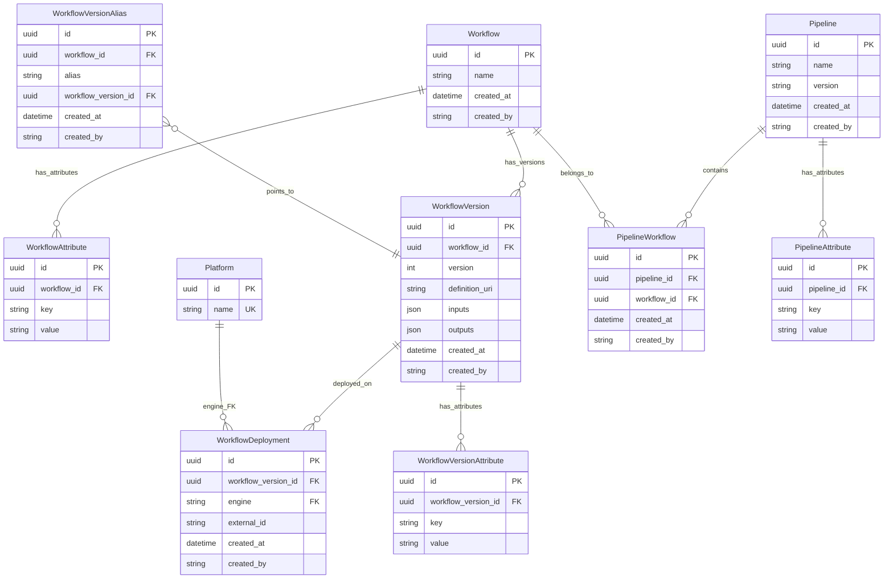

# Workflows & Pipelines

This document describes the Workflow and Pipeline systems — how workflows are defined, versioned, deployed on compute platforms, and organised into named collections.

## Table of Contents

- [Workflows \& Pipelines](#workflows--pipelines)
  - [Table of Contents](#table-of-contents)
  - [Overview](#overview)
  - [Architecture](#architecture)
    - [Entity Relationship Diagram](#entity-relationship-diagram)
    - [Design Decisions](#design-decisions)
  - [Database Models](#database-models)
    - [Workflow](#workflow)
    - [WorkflowAttribute](#workflowattribute)
    - [WorkflowVersion](#workflowversion)
    - [WorkflowVersionAttribute](#workflowversionattribute)
    - [WorkflowVersionAlias](#workflowversionalias)
    - [Platform](#platform)
    - [WorkflowDeployment](#workflowdeployment)
    - [Pipeline](#pipeline)
    - [PipelineAttribute](#pipelineattribute)
    - [PipelineWorkflow](#pipelineworkflow)
  - [API Endpoints](#api-endpoints)
    - [Workflow CRUD](#workflow-crud)
    - [WorkflowVersion Endpoints](#workflowversion-endpoints)
    - [WorkflowVersionAlias Endpoints](#workflowversionalias-endpoints)
    - [WorkflowDeployment Endpoints](#workflowdeployment-endpoints)
    - [Deployment across platforms](#deployment-across-platforms)
    - [Deploying to AWS HealthOmics](#deploying-to-aws-healthomics)
    - [Pipeline CRUD](#pipeline-crud)
    - [Pipeline ↔ Workflow Association](#pipeline--workflow-association)
  - [Use Cases](#use-cases)
    - [Onboarding a new workflow](#onboarding-a-new-workflow)
    - [Releasing a new revision](#releasing-a-new-revision)
    - [Running a workflow](#running-a-workflow)
    - [Configuring a pipeline launcher](#configuring-a-pipeline-launcher)
    - [Discovering a version's parameters](#discovering-a-versions-parameters)
  - [Source Files](#source-files)

## Overview

The system provides:

- **Platform-agnostic workflow identity**: Define a workflow once by name
- **Versioning**: Each version carries its own `definition_uri` (WDL/CWL/Nextflow file) and auto-increment version number.  semantic version string can be associated using an attribute on the workflow version.
- **Input/output descriptors**: A version can record its parameter signature (`inputs`/`outputs`) so callers can discover what a workflow takes and produces without parsing the definition file
- **Aliases**: Assign an alias to a specific version, e.g. `production` or `development` — like AWS Lambda aliases
- **Cross-platform deployment**: Register a specific workflow version on multiple execution engines (Arvados, SevenBridges, AWS HealthOmics, etc.). For AWS HealthOmics the API server can perform the registration itself — see [Deploying to AWS HealthOmics](#deploying-to-aws-healthomics)
- **Pipeline grouping**: Organise related workflows into named groups called pipelines
- **Flexible metadata**: Key-value attributes on workflows and pipelines
- **Provenance**: All entities track `created_at` and `created_by` for audit trails
- **Pagination**: List endpoints support pagination with configurable sorting

## Architecture

### Entity Relationship Diagram


```mermaid
erDiagram
    Workflow ||--o{ WorkflowAttribute : has_attributes
    Workflow ||--o{ WorkflowVersion : has_versions

    WorkflowVersion ||--o{ WorkflowDeployment : deployed_on
    WorkflowVersion ||--o{ WorkflowVersionAttribute : has_attributes

    WorkflowVersionAlias }o--|| WorkflowVersion : points_to

    Platform ||--o{ WorkflowDeployment : engine_FK

    Pipeline ||--o{ PipelineWorkflow : contains
    Workflow ||--o{ PipelineWorkflow : belongs_to
    Pipeline ||--o{ PipelineAttribute : has_attributes

    Platform {
        uuid id PK
        string name UK
    }

    Workflow {
        uuid id PK
        string name
        datetime created_at
        string created_by
    }

    WorkflowAttribute {
        uuid id PK
        uuid workflow_id FK
        string key
        string value
    }

    WorkflowVersion {
        uuid id PK
        uuid workflow_id FK
        int version
        string definition_uri
        json inputs
        json outputs
        datetime created_at
        string created_by
    }

    WorkflowVersionAttribute {
        uuid id PK
        uuid workflow_version_id FK
        string key
        string value
    }

    WorkflowVersionAlias {
        uuid id PK
        uuid workflow_id FK
        string alias
        uuid workflow_version_id FK
        datetime created_at
        string created_by
    }

    WorkflowDeployment {
        uuid id PK
        uuid workflow_version_id FK
        string engine FK
        string external_id
        datetime created_at
        string created_by
    }

    Pipeline {
        uuid id PK
        string name
        string version
        datetime created_at
        string created_by
    }

    PipelineAttribute {
        uuid id PK
        uuid pipeline_id FK
        string key
        string value
    }

    PipelineWorkflow {
        uuid id PK
        uuid pipeline_id FK
        uuid workflow_id FK
        datetime created_at
        string created_by
    }
```

### Design Decisions

**Why separate Workflow and WorkflowVersion?**

A workflow definition evolves over time. The `Workflow` table captures the logical identity (e.g., "Alignment") while `WorkflowVersion` captures each revision with its own version string and definition URI. This means:

- Creating a new version doesn't create a new workflow — it adds a row to `WorkflowVersion`
- Pipelines reference the logical workflow, not a specific version

**Why a separate alias table?**

Aliases like `production` and `development` let teams mark which version should be used without hardcoding version strings. The `WorkflowVersionAlias` table stores a free-text alias name with a `UNIQUE(workflow_id, alias)` constraint — each workflow can have at most one pointer per alias name. Moving an alias is an upsert, recording who changed it last — though not when, since `created_at` is not refreshed on a move.

**Why does WorkflowDeployment point to WorkflowVersion?**

You register and execute a *specific version* of a workflow on a platform. Different versions may have different external IDs on the same platform. The FK to `workflow_version.id` captures this precisely. You can still navigate to the parent workflow via `WorkflowVersion.workflow_id`.

**Why a separate PipelineWorkflow junction table (not a direct FK)?**

The relationship between Pipeline and Workflow is many-to-many: a workflow can belong to multiple pipelines, and a pipeline can contain multiple workflows. The `PipelineWorkflow` junction table captures this with a unique constraint (`uq_pipeline_workflow`) preventing duplicate associations. See `plans/phase1-decisions-pipeline-workflow-relationships.md` for detailed rationale.

**Why no ordering in the junction table?**

Pipeline membership is currently unordered — the workflows in a pipeline are a **set**, not a sequence. This simplifies the initial implementation. If workflow ordering within a pipeline is needed in the future, a `position` column can be added to `PipelineWorkflow`.

**Pipelines are version-agnostic**

Pipelines are purely organisational — a pipeline references workflows, not specific workflow versions. They do not directly affect how workflow versions are deployed on platforms. A pipeline groups workflows; each workflow independently manages its own versions, aliases, and deployments.

For instance - a WES pipeline could be composed of an alignment workflow, a variant calling workflow, and a variant annotation workflow; updating the version of a tool in the alignment workflow would increment the version, but the high-level pipeline (and the workflows that comprise it) remains unchanged, while the workflow versions and deployments to platforms would be updated. The updated workflow version could be tested under a "Dev" alias, and then promoted to "Prod" once testing is complete.

## Database Models

### Workflow

The core identity entity. Represents a platform-agnostic workflow.

| Field | Type | Required | Description |
|-------|------|----------|-------------|
| `id` | UUID | auto | Primary key |
| `name` | string | yes | Human-readable workflow name |
| `created_at` | datetime | auto | UTC timestamp of creation |
| `created_by` | string | yes | Username of the creator |

### WorkflowAttribute

Key-value metadata for workflows. Extensible without schema changes.

| Field | Type | Required | Description |
|-------|------|----------|-------------|
| `id` | UUID | auto | Primary key |
| `workflow_id` | UUID | yes | FK → `workflow.id` |
| `key` | string | yes | Attribute name |
| `value` | string | yes | Attribute value |

### WorkflowVersion

A versioned definition of a workflow.

| Field | Type | Required | Description |
|-------|------|----------|-------------|
| `id` | UUID | auto | Primary key |
| `workflow_id` | UUID | yes | FK → `workflow.id` |
| `version` | int | yes | auto-incremented numerical value for a workflow |
| `definition_uri` | string | yes | URI to the workflow definition file (WDL, CWL, Nextflow, etc.). Either `s3://…` or `ngs360://<file-id>` |
| `inputs` | JSON | no | List of input parameter descriptors (see below) |
| `outputs` | JSON | no | List of output parameter descriptors (see below) |
| `created_at` | datetime | auto | UTC timestamp |
| `created_by` | string | yes | Username of the creator |

**Constraints:** `UNIQUE(workflow_id, version)` — version numbers are unique within a workflow. The next number is computed as `MAX(version) + 1`, taken under `SELECT … FOR UPDATE` on PostgreSQL/MySQL so concurrent creates cannot collide.

#### Input & output descriptors

`inputs` and `outputs` are JSON arrays on the `workflowversion` row — no separate table. Each entry describes one parameter:

| Field | Type | Applies to | Description |
|-------|------|------------|-------------|
| `id` | string | both | Parameter name as it appears in the definition |
| `type` | string | both | CWL type string, e.g. `"File"`, `"string?"`, `"File[]"` |
| `required` | bool | inputs | Pre-computed by the caller so consumers need not re-parse `type` |
| `doc` | string | both | Optional description |
| `default` | any | inputs | Optional default value |

Callers derive `required` themselves: a `?` suffix, a `["null", T]` union, or a present `default` each imply `required: false`. Both fields are nullable, distinguishing "not recorded" (`null`) from "recorded as empty" (`[]`).

### WorkflowVersionAttribute

Key-value metadata for workflow versions. Extensible without schema changes.

| Field | Type | Required | Description |
|-------|------|----------|-------------|
| `id` | UUID | auto | Primary key |
| `workflow_version_id` | UUID | yes | FK → `workflowversion.id` |
| `key` | string | yes | Attribute name |
| `value` | string | yes | Attribute value |

### WorkflowVersionAlias

Named pointer to a specific workflow version.

| Field | Type | Required | Description |
|-------|------|----------|-------------|
| `id` | UUID | auto | Primary key |
| `workflow_id` | UUID | yes | FK → `workflow.id` — scopes the alias |
| `alias` | string | yes | Free-text alias name (e.g. `production`, `staging`) |
| `workflow_version_id` | UUID | yes | FK → `workflowversion.id` |
| `created_at` | datetime | auto | UTC timestamp |
| `created_by` | string | yes | Username who set the alias |

**Constraints:** `UNIQUE(workflow_id, alias)` — one alias pointer per workflow per alias name.

### Platform

A registered workflow execution engine. A reference table — where `name` is the unique. Must be created before workflows can be deployed or run on a given engine.

| Field | Type | Required | Description |
|-------|------|----------|-------------|
| `id` | UUID | auto | Primary key |
| `name` | string | yes | Unique — e.g., `"Arvados"`, `"SevenBridges"`, `"AWS HealthOmics (us-east-1)"`, `"AWS HealthOmics (eu-central-1)"` |

### WorkflowDeployment

Platform-specific deployment of a workflow version. The `engine` column is a FK to `platform.name`.

| Field | Type | Required | Description |
|-------|------|----------|-------------|
| `id` | UUID | auto | Primary key |
| `workflow_version_id` | UUID | yes | FK → `workflowversion.id` |
| `engine` | string | yes | FK → `platform.name` |
| `external_id` | string | yes | Workflow identifier on the external platform |
| `created_at` | datetime | auto | UTC timestamp of creation |
| `created_by` | string | yes | Username of the creator |

**Constraints:** `UNIQUE(workflow_version_id, engine)` — one deployment per engine per version.

### Pipeline

A named, versioned collection of workflows.

| Field | Type | Required | Description |
|-------|------|----------|-------------|
| `id` | UUID | auto | Primary key |
| `name` | string | yes | Human-readable pipeline name |
| `version` | string | no | Version string (e.g., `"1.0.0"`) |
| `created_at` | datetime | auto | UTC timestamp of creation |
| `created_by` | string | yes | Username of the creator |

### PipelineAttribute

Key-value metadata for pipelines.

| Field | Type | Required | Description |
|-------|------|----------|-------------|
| `id` | UUID | auto | Primary key |
| `pipeline_id` | UUID | yes | FK → `pipeline.id` |
| `key` | string | yes | Attribute name |
| `value` | string | yes | Attribute value |

**Constraints:** `UNIQUE(pipeline_id, key)` — one value per key per pipeline.

### PipelineWorkflow

Junction table linking workflows to pipelines. Each association records who created it and when.

| Field | Type | Required | Description |
|-------|------|----------|-------------|
| `id` | UUID | auto | Primary key |
| `pipeline_id` | UUID | yes | FK → `pipeline.id` |
| `workflow_id` | UUID | yes | FK → `workflow.id` |
| `created_at` | datetime | auto | UTC timestamp of association |
| `created_by` | string | yes | Username of the creator |

**Constraints:** `UNIQUE(pipeline_id, workflow_id)` — a workflow can only appear once per pipeline.

## API Endpoints

All endpoints require authentication. The authenticated user's username is recorded as `created_by`.

### Workflow CRUD

#### Create a Workflow

```
POST /api/v1/workflows
```

**Request Body:**

```json
{
  "name": "variant-calling-wf",
  "attributes": [
    {"key": "category", "value": "genomics"},
    {"key": "author", "value": "bioinformatics-team"}
  ]
}
```

**Response** (`201 Created`):

```json
{
  "id": "a1b2c3d4-...",
  "name": "variant-calling-wf",
  "created_at": "2026-03-01T12:00:00Z",
  "created_by": "jdoe",
  "attributes": [
    {"key": "category", "value": "genomics"},
    {"key": "author", "value": "bioinformatics-team"}
  ],
  "versions": [],
  "aliases": []
}
```

#### List Workflows

```
GET /api/v1/workflows?page=1&per_page=20&sort_by=name&sort_order=asc
```

Returns a list of workflows with their attributes, version summaries, and aliases.

#### Get Workflow by ID

```
GET /api/v1/workflows/{workflow_id}
```

Returns a single workflow with attributes, version summaries, and aliases.

### WorkflowVersion Endpoints

#### Create a Version

```
POST /api/v1/workflows/{workflow_id}/versions
```

**Request Body:**

```json
{
  "definition_uri": "s3://workflows/variant-calling-v2.1.cwl",
  "attributes": [
    {"key": "git_commit", "value": "abcd1234"},
    {"key": "semantic_version", "value": "v1.2.3"}
  ],
  "inputs": [
    {"id": "reads", "type": "File[]", "required": true, "doc": "Input FASTQs"},
    {"id": "sample_id", "type": "string", "required": true},
    {"id": "min_depth", "type": "int?", "required": false, "default": 10}
  ],
  "outputs": [
    {"id": "vcf", "type": "File", "doc": "Called variants"}
  ]
}
```

Only `definition_uri` is required. `attributes`, `inputs` and `outputs` are all optional; `version` is assigned by the server and cannot be supplied.

**Response** (`201 Created`):

```json
{
  "id": "v1v2v3v4-...",
  "workflow_id": "a1b2c3d4-...",
  "version": 1,
  "definition_uri": "s3://workflows/variant-calling-v2.1.cwl",
  "created_at": "2026-03-01T12:05:00Z",
  "created_by": "jdoe",
  "deployments": [],
  "attributes": [
    {"key": "git_commit", "value": "abcd1234"},
    {"key": "semantic_version", "value": "v1.2.3"}
  ],
  "inputs": [
    {"id": "reads", "type": "File[]", "required": true, "doc": "Input FASTQs", "default": null},
    {"id": "sample_id", "type": "string", "required": true, "doc": null, "default": null},
    {"id": "min_depth", "type": "int?", "required": false, "doc": null, "default": 10}
  ],
  "outputs": [
    {"id": "vcf", "type": "File", "doc": "Called variants"}
  ]
}
```

**Errors:**
- `400 Bad Request` — `workflow_id` is not a valid UUID, or `attributes` contains duplicate keys.
- `404 Not Found` — Workflow does not exist.

#### List Versions

```
GET /api/v1/workflows/{workflow_id}/versions
```

Returns all versions of a workflow, ordered by creation date (newest first).

#### Get Version by Number

```
GET /api/v1/workflows/{workflow_id}/versions/{version_num}
```

Returns a single version with its deployments, attributes, inputs and outputs. The `{version_num}` is the integer version number (e.g. `1`, `2`, `3`).

**Errors:**
- `404 Not Found` — Workflow does not exist, or the workflow has no such version number.

### WorkflowVersionAlias Endpoints

#### Set/Update an Alias

```
PUT /api/v1/workflows/{workflow_id}/aliases/{alias}
```

Where `{alias}` is any free-text alias name (e.g. `production`, `development`, `staging`).

**Request Body:**

```json
{
  "version_num": 2
}
```

The `version_num` is the integer version number of the target workflow version within this workflow.

**Response** (`200 OK`):

```json
{
  "id": "...",
  "workflow_id": "a1b2c3d4-...",
  "alias": "production",
  "workflow_version_id": "v1v2v3v4-...",
  "version": 2,
  "created_at": "2026-03-01T12:10:00Z",
  "created_by": "jdoe"
}
```

Moving an alias (e.g., changing production from version 1 to version 2) is an upsert — same endpoint, new version number.

**Errors:**
- `404 Not Found` — Workflow or version not found.
- `422 Unprocessable Content` — Invalid request body.

#### List Aliases

```
GET /api/v1/workflows/{workflow_id}/aliases
GET /api/v1/workflows/{workflow_id}/aliases?alias=production
```

Returns aliases for a workflow. Optional query parameter:

| Param | Type | Required | Description |
|-------|------|----------|-------------|
| `alias` | `str` | no | Filter to a specific alias (e.g. `production`) |

When `alias` is provided, the response contains 0 or 1 elements.

#### Delete Alias

```
DELETE /api/v1/workflows/{workflow_id}/aliases/{alias}
```

**Response:** `204 No Content`

### WorkflowDeployment Endpoints

#### List Deployments (Workflow-Level, with Filters)

```
GET /api/v1/workflows/{workflow_id}/deployments
GET /api/v1/workflows/{workflow_id}/deployments?alias=production
GET /api/v1/workflows/{workflow_id}/deployments?engine=Arvados
GET /api/v1/workflows/{workflow_id}/deployments?alias=production&engine=Arvados
```

List deployments across all versions of a workflow. Optional query parameters allow server-side filtering:

| Param | Type | Required | Description |
|-------|------|----------|-------------|
| `alias` | `str` | no | Resolve alias to its version, return only that version's deployments |
| `engine` | `str` | no | Filter by engine/platform name |

**Behavior matrix:**

| alias | engine | Result |
|-------|--------|--------|
| omitted | omitted | All deployments across all versions |
| `production` | omitted | All deployments for the production version |
| omitted | `Arvados` | All Arvados deployments across all versions |
| `production` | `Arvados` | The single Arvados deployment for production (0 or 1 items) |

**Response** (`200 OK`):

```json
[
  {
    "id": "...",
    "workflow_version_id": "v1v2v3v4-...",
    "engine": "Arvados",
    "external_id": "zzzzz-7fd4e-abc123def456",
    "created_at": "2026-03-01T12:05:00Z",
    "created_by": "jdoe"
  }
]
```

**Errors:**
- `404 Not Found` — Workflow does not exist, or `alias` is specified but not set for this workflow.

#### Deploy Version on Platform (Nested Under Version)

Deployments can also be created and managed under a specific version.

```
POST /api/v1/workflows/{workflow_id}/versions/{version_num}/deployments
```

The `{version_num}` is the integer version number (e.g. `1`, `2`, `3`).

**Request Body:**

```json
{
  "engine": "Arvados",
  "external_id": "zzzzz-7fd4e-abc123def456"
}
```

| Field | Type | Required | Description |
|-------|------|----------|-------------|
| `engine` | `str` | yes | Must match a registered Platform `name` |
| `external_id` | `str` | conditional | The workflow's identifier on the target platform. Required for every engine **except** `AWSHealthOmics (us-east)`, where omitting it makes the API server perform the registration and record the resulting ARN — see [Deploying to AWS HealthOmics](#deploying-to-aws-healthomics) |

> **Note:** The `engine` value must match a registered Platform `name`. Create platforms first via `POST /api/v1/platforms`.

**Response** (`201 Created`):

```json
{
  "id": "...",
  "workflow_version_id": "v1v2v3v4-...",
  "engine": "Arvados",
  "external_id": "zzzzz-7fd4e-abc123def456",
  "created_at": "2026-03-01T12:05:00Z",
  "created_by": "jdoe"
}
```

**Errors:**
- `400 Bad Request` — Engine is not a registered platform, or `external_id` was omitted for an engine that requires it.
- `404 Not Found` — Version number does not exist for this workflow.
- `409 Conflict` — A deployment for the same engine already exists for this version.

Omics registration adds further failure modes — see [Deploying to AWS HealthOmics](#deploying-to-aws-healthomics).

#### List Deployments (Version-Level)

```
GET /api/v1/workflows/{workflow_id}/versions/{version_num}/deployments
GET /api/v1/workflows/{workflow_id}/versions/{version_num}/deployments?engine=Arvados
```

Returns platform deployments for a version. The `{version_num}` is the integer version number. Optional query parameter:

| Param | Type | Required | Description |
|-------|------|----------|-------------|
| `engine` | `str` | no | Filter by engine/platform name |

#### Delete Deployment

```
DELETE /api/v1/workflows/{workflow_id}/versions/{version_num}/deployments/{deployment_id}
```

**Response:** `204 No Content`

Deleting the row removes NGS360's record of the deployment. It does **not** deregister anything on the external platform — an Omics workflow version created by this API outlives the deployment row that tracked it.

### Deployment across platforms

A deployment answers one question: *if I want to run this version on that platform, what do I call it there?* The answer is `external_id`, and NGS360 treats it as an opaque string — it never parses or validates it, so its shape is whatever the target platform uses:

| Platform | `external_id` is | Example |
|----------|------------------|---------|
| `Arvados` | An Arvados workflow UUID | `xngs1-7fd4e-j2eyxizc6y4jb0q` |
| `SevenBridges` | An app id, `owner/project/app` | `bristol-myers-squibb/wes-reference/wes-postalignment-tn` |
| `AWSHealthOmics (us-east)` | A workflow/version ARN | `arn:aws:omics:us-east-1:<acct>:workflow/1234567/version/3` |

Because the `Platform` table is just a name registry, any engine can become a deployment target — add the row, then record deployments against it. No code change is needed to support a new platform.

**For every engine except `AWSHealthOmics (us-east)`, NGS360 does not talk to the platform at all.** You register the workflow there using that platform's own tooling, then record the identifier it gave you. Deployment is bookkeeping: it makes the catalog able to answer the question above, and nothing more. This means a deployment row can drift from reality — if an Arvados workflow is deleted on Arvados, the NGS360 row still claims it is deployed. Only HealthOmics has a path where the API server performs the registration itself, described next.

**Consumers may support only a subset of platforms.** The catalog being platform-agnostic does not make every deployment reachable from every client. The GA4GH WES service, for example, considers only `AWSHealthOmics (us-east)` deployments when resolving a workflow to run, so a version deployed solely on Arvados is fully catalogued but not launchable through WES. See [Running a workflow](#running-a-workflow).

### Deploying to AWS HealthOmics

For every engine other than `AWSHealthOmics (us-east)`, deployment is pure bookkeeping: you register the workflow on the platform yourself and hand NGS360 the resulting `external_id`.

For `AWSHealthOmics (us-east)` you may instead **omit** `external_id`. The API server then registers the workflow on Omics on your behalf, by invoking a Lambda that packs the CWL and calls the Omics API, and stores the ARN it returns as the deployment's `external_id`.

#### What the server does

1. **Picks the action.** It looks for any prior deployment of *this workflow* (any version) on the same engine. If there is none, the Lambda is called with `action: "create_workflow"`. If there is one, the Omics workflow id is parsed out of that deployment's ARN and the Lambda is called with `action: "create_workflow_version"`, using the NGS360 version number as the Omics version name. So the first deploy creates the Omics workflow and later deploys add versions to it.
2. **Resolves the definition to S3.** `definition_uri` must resolve to an `s3://` path. `s3://…` is used as-is; `ngs360://<file-id>` is looked up in the `file` table and its `uri` used, provided that file is S3-backed. Any other scheme is rejected.
3. **Attaches tags.** The version attributes `git_commit`, `git_repo` and `git_ref` are forwarded as Omics tags — this allowlist only; every other attribute stays in NGS360's database. The server also always adds `ngs360_env`, set from the `ENVIRONMENT` setting, so each Omics resource records which NGS360 tier registered it.

#### Configuration

| Setting | Default | Description |
|---------|---------|-------------|
| `OMICS_REGISTER_WORKFLOW_LAMBDA` | none | Name of the registration Lambda. Must be set for auto-registration to work. |
| `OMICS_REGISTER_LAMBDA_READ_TIMEOUT` | `300` | Seconds to wait for the Lambda. Registrations are observed at 60–90s and scale with definition size, so botocore's 60s default is deliberately overridden. Boto retries are disabled because Omics registration is not idempotent. |

#### Additional errors

| Status | Cause |
|--------|-------|
| `400 Bad Request` | `definition_uri` has an unsupported scheme, or names an `ngs360://` file that is not S3-backed |
| `502 Bad Gateway` | The Lambda reported a failure — most often an invalid CWL definition that Omics rejected |
| `504 Gateway Timeout` | The Lambda did not respond within the read timeout |
| `401` / `403` / `404` / `500` | Deployment-time misconfiguration: missing AWS credentials, no IAM access to the Lambda, wrong or unset `OMICS_REGISTER_WORKFLOW_LAMBDA` |

**On a `504`, do not assume the deployment failed.** The registration has very likely completed on AWS while the timeout aborted this request before the `WorkflowDeployment` row was committed, leaving NGS360 and Omics out of step. Check with:

```
aws omics list-workflow-versions --workflow-id <omics-workflow-id>
```

If the version is already there, record it by calling this endpoint again with an explicit `external_id` — do not redeploy.

### Pipeline CRUD

#### Create a Pipeline

```
POST /api/v1/pipelines
```

**Request Body:**

```json
{
  "name": "WGS Analysis Pipeline",
  "version": "2.0.0",
  "attributes": [
    {"key": "description", "value": "End-to-end whole genome sequencing analysis"},
    {"key": "department", "value": "genomics"}
  ],
  "workflow_ids": [
    "a1b2c3d4-...",
    "e5f6g7h8-..."
  ]
}
```

All fields except `name` are optional. `workflow_ids` associates existing workflows at creation time.

**Response** (`201 Created`):

```json
{
  "id": "p1p2p3p4-...",
  "name": "WGS Analysis Pipeline",
  "version": "2.0.0",
  "created_at": "2026-03-01T12:00:00Z",
  "created_by": "jdoe",
  "attributes": [
    {"key": "description", "value": "End-to-end whole genome sequencing analysis"},
    {"key": "department", "value": "genomics"}
  ],
  "workflows": [
    {"id": "a1b2c3d4-...", "name": "alignment-wf"},
    {"id": "e5f6g7h8-...", "name": "variant-calling-wf"}
  ]
}
```

#### List Pipelines (Paginated)

```
GET /api/v1/pipelines?page=1&per_page=20&sort_by=name&sort_order=asc
```

**Response:**

```json
{
  "data": [
    {
      "id": "p1p2p3p4-...",
      "name": "WGS Analysis Pipeline",
      "version": "2.0.0",
      "created_at": "2026-03-01T12:00:00Z",
      "created_by": "jdoe",
      "attributes": [...],
      "workflows": [...]
    }
  ],
  "total_items": 5,
  "total_pages": 1,
  "current_page": 1,
  "per_page": 20,
  "has_next": false,
  "has_prev": false
}
```

#### Get Pipeline by ID

```
GET /api/v1/pipelines/{pipeline_id}
```

Returns a single pipeline with its attributes and workflow summaries.

### Pipeline ↔ Workflow Association

#### Add Workflow to Pipeline

```
POST /api/v1/pipelines/{pipeline_id}/workflows?workflow_id={workflow_uuid}
```

The `workflow_id` is passed as a query parameter.

**Response** (`201 Created`):

```json
{
  "id": "junction-uuid-...",
  "message": "Workflow added to pipeline."
}
```

**Error** (`409 Conflict`): If the workflow is already in the pipeline.
**Error** (`404 Not Found`): If the pipeline or workflow does not exist.

#### Remove Workflow from Pipeline

```
DELETE /api/v1/pipelines/{pipeline_id}/workflows/{workflow_id}
```

**Response:** `204 No Content`

**Error** (`404 Not Found`): If the association does not exist.

## Use Cases

These walk through the order calls are made in and the fields that matter at each step; full request and response bodies are in [API Endpoints](#api-endpoints) above.

This API is the workflow **catalog** — the system of record for what a workflow is, which versions exist, and where each version is registered. It does not execute anything. Its job ends by handing a client an `external_id`, which the client passes to an execution engine.

One consequence is worth stating up front: **this API never picks a version for you.** Every endpoint here takes an explicit `version_num` or an explicit `?alias=`. The convenience of "just give me the current one" belongs to clients, and the rules they apply are described in [Running a workflow](#running-a-workflow).

> **Which id do I use?** These responses contain several identifiers and only some are accepted back as input, which is a common source of confusion.
>
> - **To run a workflow, use the workflow id** (`workflow.id`) — optionally suffixed with an alias or version number. Never a version id, a deployment id, or an `external_id`.
> - **To address a version, use its number, not its UUID.** Version ids are returned inside version summaries, alias responses and deployment responses, but no endpoint anywhere accepts one. Version numbers are small integers starting at 1 and scoped to their workflow, so `version 3` only means something alongside a workflow id.
> - **Platforms are referenced by name** (`platform.name`) in the `engine` field. `platform.id` exists but the workflow API never uses it.
> - **A deployment id is only good for deleting that deployment.** It addresses nothing else.
> - **`external_id` is normally an output** — you read it to learn what a version is called on its platform. You supply it only when you registered the workflow there yourself. The GA4GH WES service calls this same value the **engine id**.
>
> Unrelated despite the similar look: an `ngs360://<file-id>` inside a `definition_uri` is a **file** id from the files API.

### Onboarding a new workflow

Getting a workflow from nothing to runnable. The order matters: a platform cannot be a deployment target until it is registered, and a version is not runnable until it has been deployed.

1. **Register the platform** — `POST /api/v1/platforms` with `{"name": "Arvados"}`. One-time per engine; skip if it already exists. Since names are compared as literal strings, call `GET /api/v1/platforms` first rather than guessing the spelling.
2. **Create the workflow identity** — `POST /api/v1/workflows` with a `name` and any workflow-level `attributes`. This creates the logical workflow only. It has no definition yet and nothing to run.
3. **Add the first version** — `POST /api/v1/workflows/{workflow_id}/versions` with `definition_uri`, plus ideally `inputs`/`outputs` and a `git_commit` attribute. The server assigns `version: 1`; version numbers cannot be chosen.
4. **Deploy that version** — `POST /api/v1/workflows/{workflow_id}/versions/1/deployments` with `engine` and `external_id`. This is the step that makes the version runnable, by recording what the version is called on that platform.
5. **Point an alias at it** — `PUT /api/v1/workflows/{workflow_id}/aliases/development` with `{"version_num": 1}`, so callers can say `development` instead of hardcoding `1`.

Verify with `GET /api/v1/workflows/{workflow_id}`, which returns the workflow, its version summaries with deployments nested inside each, and its resolved aliases — all in one response.

**Expected behavior to know:**

- Version numbers are server-assigned, start at 1, and increment per workflow. They are never reused and cannot be skipped or back-filled.
- There are no update or delete endpoints for workflows or versions. Once created, a version is permanent and its `definition_uri` cannot be changed — publishing a correction means publishing a new version.
- Steps 4 and 5 are independent. An alias can point at a version that was never deployed anywhere; the catalog will happily report it and the client resolving it will fail at the deployment lookup.

### Releasing a new revision

The everyday path: a tool changed, the definition was updated, and the revision needs to reach production without disturbing what is currently running.

1. **Add the new version** — `POST /api/v1/workflows/{workflow_id}/versions`. The server returns the next number, say `version: 3`. Existing versions are untouched, and whatever `production` points at keeps serving traffic.
2. **Deploy it** — `POST /api/v1/workflows/{workflow_id}/versions/3/deployments`. Still invisible to anyone resolving by alias.
3. **Expose it for testing** — `PUT /api/v1/workflows/{workflow_id}/aliases/development` with `{"version_num": 3}`. Callers resolving `development` now get version 3; `production` is unchanged.
4. **Promote** — once testing passes, `PUT /api/v1/workflows/{workflow_id}/aliases/production` with `{"version_num": 3}`. Same call as step 3 with a different alias name: setting an alias is an upsert, so this re-points `production` rather than erroring or creating a second row.

**Rolling back** is step 4 with the previous number — `{"version_num": 2}`. Nothing is deleted or re-created, the old version's deployment is still there to be pointed at, and the rollback costs one call.

> **Alias rows do not record when an alias was last moved.** An upsert updates `workflow_version_id` and `created_by`, but leaves `created_at` at the time the alias was *first* created. So the row tells you who most recently moved it, while its timestamp refers to an unrelated earlier event. Do not read `created_at` on an alias as the promotion time, and do not expect a history of past moves — only the current pointer is stored.

**Expected behavior to know:**

- Aliases are free text and scoped per workflow. `production` on one workflow is unrelated to `production` on another, and a workflow can carry as many aliases as you like — one per name.
- Deleting an alias removes only the pointer. Versions and deployments are untouched; clients resolving that alias start failing, which is the point.
- Deleting a deployment removes NGS360's record only. It does not deregister anything on the platform.

### Running a workflow

Clients do not run workflows from this API directly — they resolve a workflow reference into an engine-specific id, then submit. The GA4GH WES service is the main client, and the rules below are its resolution behavior, which is where "give me the current version" actually lives.

A client is given a workflow reference in the form:

```
<ngs360-workflow-id>[:<alias-or-version>]
```

It then performs a single `GET /api/v1/workflows/{workflow_id}` — forwarding the caller's bearer token — and does all selection client-side from that one response. This is why versions nest their deployments and why aliases carry a resolved `version` number: one request has to contain everything needed to resolve a reference.

**Resolution rules:**

| Reference | Resolves to |
|-----------|-------------|
| `a1b2c3d4-…` | The **highest version number** — the newest version, deployed or not |
| `a1b2c3d4-…:production` | The version the `production` alias points at |
| `a1b2c3d4-…:3` | Version number 3 exactly |

The suffix is matched as an **alias name first**, and only tried as a version number if no alias matches. An alias named `3` would therefore shadow version 3. Avoid numeric alias names.

Having picked a version, the client selects that version's `AWSHealthOmics (us-east)` deployment and uses its `external_id` as the engine id. The `UNIQUE(workflow_version_id, engine)` constraint means there is at most one to choose from.

**Failure modes, all surfaced before anything is submitted:**

| Situation | What the client reports |
|-----------|------------------------|
| The workflow has no versions | No versions found for this workflow |
| The suffix matches no alias and no version number | Specified alias/version not found |
| The resolved version has no HealthOmics deployment | That alias/version has no deployment in `AWSHealthOmics (us-east)` |
| More than one `:` in the reference | Malformed reference |

The last two are the common ones in practice, and they are catalog problems rather than client bugs: the first means somebody promoted an alias to a version that was never deployed, the second means somebody deployed to Arvados only.

**Provenance.** Because a bare reference means "latest" and an alias can be re-pointed, the same reference can resolve differently tomorrow. The WES service therefore records the version number it actually resolved against each run, so a completed run always names the exact version it used even after the alias has moved on. If you need a reference that cannot drift at all, pin it with an explicit version number.

### Configuring a pipeline launcher

A launcher runs a multi-step pipeline, submitting one workflow per step. Rather than hardcoding engine ids, it keeps a config table mapping each logical step to a workflow identifier per platform:

```python
PIPELINE_PLATFORM_CONFIG = {
    "Arvados": {
        "per_sample_alignment_workflow": "xngs1-7fd4e-j2eyxizc6y4jb0q",
        "variant_calling_workflow": "xngs1-7fd4e-en27tugzznohf5t",
    },
    "SevenBridges": {
        "per_sample_alignment_workflow": "my-org/pipeline-refs/alignment",
        "variant_calling_workflow": "my-org/pipeline-refs/postalignment",
    },
    "NGS360": {
        "per_sample_alignment_workflow": "7bb40bed-45a7-4e9b-9249-6c7ecbd2d261",
        "variant_calling_workflow": "b9cf910c-4e2c-4005-9e5b-10c00f5e0065",
    },
}
```

The difference between the blocks is the point. For Arvados and SevenBridges the launcher stores **native platform identifiers**, so the config has to be hand-edited on every release, and each entry is pinned to one revision on one platform. For NGS360 it stores the **workflow UUID** and lets the catalog resolve the rest — one stable id per step, with the version chosen at submission time.

That makes the reference format a release-policy decision:

| Config stores | Behavior | Use when |
|---------------|----------|----------|
| `<workflow-id>` | Picks up the newest version automatically, with no config change | Development, or pipelines that should always track the newest build |
| `<workflow-id>:production` | Follows whatever has been promoted; changes when someone promotes | Production pipelines, so releasing is an alias move rather than a config edit and a redeploy |
| `<workflow-id>:3` | Pinned forever | Reproducing a past analysis, or validated pipelines that must not move |

The middle row is the one worth designing for: the launcher config stops changing per release, and promoting a revision becomes a single `PUT` on an alias, reviewable and reversible, instead of a config edit shipped through the launcher's own release process.

### Discovering a version's parameters

To build a submission payload without parsing the definition file, read the version and use its `inputs`:

```
GET /api/v1/workflows/{workflow_id}/versions/{version_num}
```

Each entry carries `id`, `type`, `required` and an optional `default`, so a caller can validate a payload — or render a form — straight from the response, without interpreting the CWL type string. A `null` `inputs` means the signature was never recorded for that version, which is not the same as a workflow that takes no inputs (`[]`).

## Source Files

| File | Description |
|------|-------------|
| `api/platforms/models.py` | Platform table model and schemas |
| `api/platforms/services.py` | Platform CRUD services |
| `api/platforms/routes.py` | Platform endpoint handlers |
| `api/workflow/models.py` | Workflow/Version/Alias/Deployment table definitions and schemas |
| `api/workflow/services.py` | Workflow business logic (create, list, version/alias CRUD, engine validation, Omics registration) |
| `api/workflow/routes.py` | Workflow endpoint handlers |
| `api/pipeline/models.py` | Pipeline/PipelineAttribute/PipelineWorkflow tables and schemas |
| `api/pipeline/services.py` | Pipeline business logic (create, list, add/remove workflow, response building) |
| `api/pipeline/routes.py` | Pipeline endpoint handlers |
| `tests/api/test_platforms.py` | Platform CRUD tests |
| `tests/api/test_workflows.py` | Workflow CRUD tests |
| `tests/api/test_workflow_versions.py` | Version CRUD tests |
| `tests/api/test_workflow_aliases.py` | Alias CRUD tests |
| `tests/api/test_workflow_deployments.py` | Deployment endpoint tests (incl. engine validation) |
| `tests/api/test_pipeline_entity.py` | Pipeline CRUD and workflow association tests |
| `tests/api/test_pipelines.py` | Pipeline endpoint tests |
