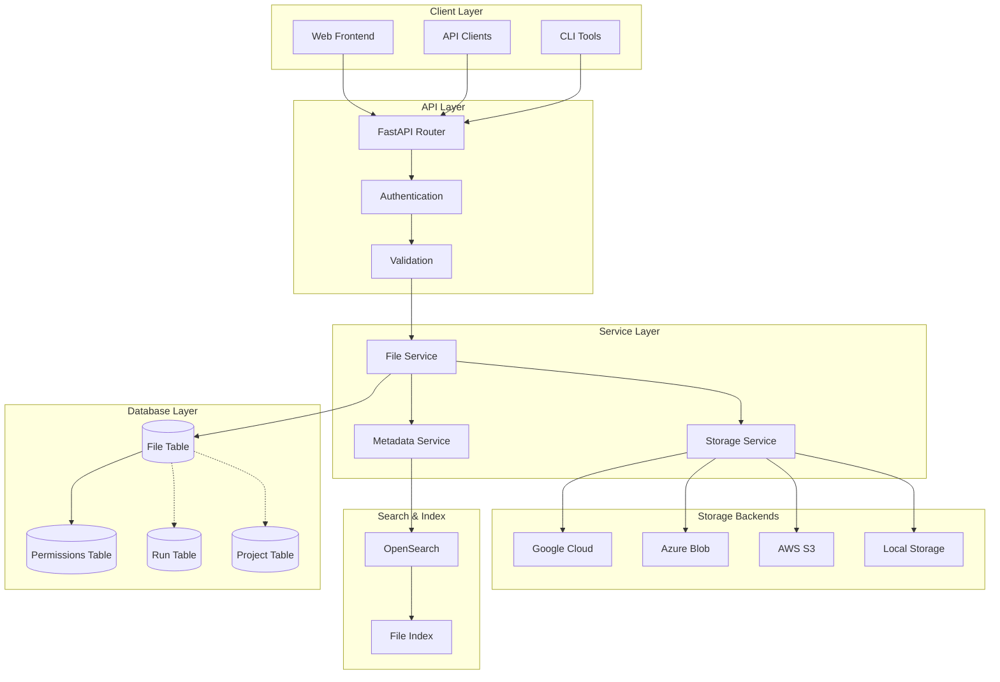
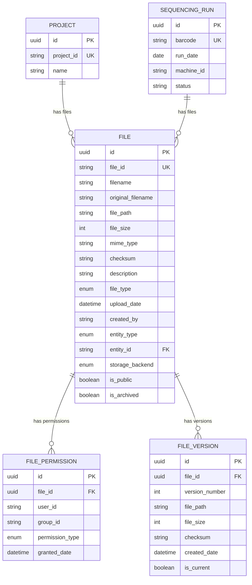
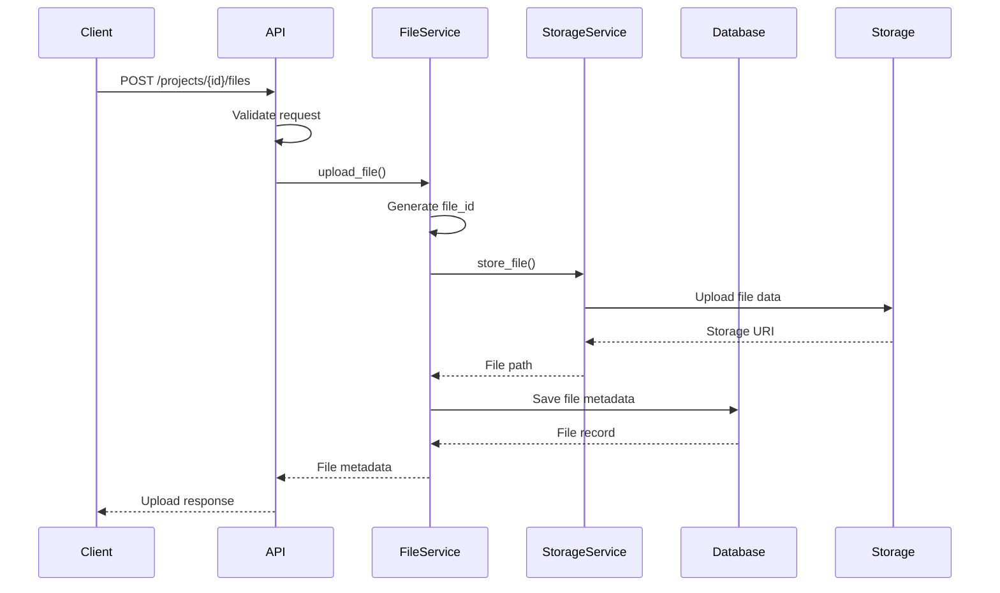
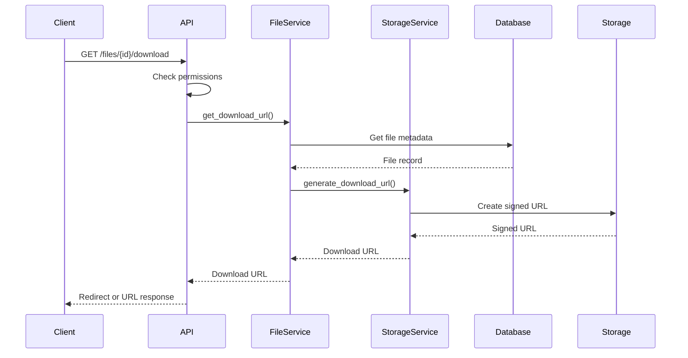
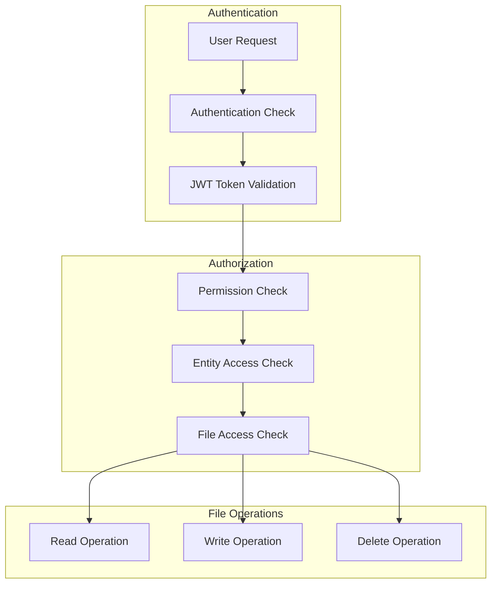

# Files API Architecture Diagram

## System Architecture Overview



## Data Model Relationships



## API Endpoint Structure

```mermaid
graph LR
    subgraph "Generic File Operations"
        A[GET /files] --> A1[List all files]
        B[POST /files] --> B1[Upload file]
        C[GET /files/{id}] --> C1[Get file metadata]
        D[PUT /files/{id}] --> D1[Update metadata]
        E[DELETE /files/{id}] --> E1[Delete file]
        F[GET /files/{id}/download] --> F1[Download file]
    end

    subgraph "Project File Operations"
        G[GET /projects/{id}/files] --> G1[List project files]
        H[POST /projects/{id}/files] --> H1[Upload to project]
        I[GET /projects/{id}/files/{file_id}] --> I1[Get project file]
    end

    subgraph "Run File Operations"
        J[GET /runs/{barcode}/files] --> J1[List run files]
        K[POST /runs/{barcode}/files] --> K1[Upload to run]
        L[GET /runs/{barcode}/files/{file_id}] --> L1[Get run file]
    end

    subgraph "Bulk Operations"
        M[POST /files/bulk-upload] --> M1[Upload multiple]
        N[DELETE /files/bulk-delete] --> N1[Delete multiple]
    end
```

## File Upload Flow



## File Download Flow



## Storage Strategy

```mermaid
graph TB
    subgraph "File Organization"
        ROOT[Storage Root]
        ROOT --> PROJECTS[/projects/]
        ROOT --> RUNS[/runs/]
        
        PROJECTS --> PROJ_ID[/{project_id}/]
        RUNS --> RUN_ID[/{run_barcode}/]
        
        PROJ_ID --> PROJ_TYPE[/{file_type}/]
        RUN_ID --> RUN_TYPE[/{file_type}/]
        
        PROJ_TYPE --> PROJ_DATE[/{year}/{month}/]
        RUN_TYPE --> RUN_DATE[/{year}/{month}/]
        
        PROJ_DATE --> PROJ_FILE[/{file_id}_{filename}]
        RUN_DATE --> RUN_FILE[/{file_id}_{filename}]
    end

    subgraph "Storage Backends"
        LOCAL_FS[Local Filesystem]
        AWS_S3[AWS S3]
        AZURE_BLOB[Azure Blob Storage]
        GCP_STORAGE[Google Cloud Storage]
    end

    PROJ_FILE -.-> LOCAL_FS
    PROJ_FILE -.-> AWS_S3
    PROJ_FILE -.-> AZURE_BLOB
    PROJ_FILE -.-> GCP_STORAGE

    RUN_FILE -.-> LOCAL_FS
    RUN_FILE -.-> AWS_S3
    RUN_FILE -.-> AZURE_BLOB
    RUN_FILE -.-> GCP_STORAGE
```

## Security and Access Control



This architecture provides:

1. **Scalable Design**: Supports multiple storage backends and can handle large file volumes
2. **Flexible Associations**: Files can be linked to any entity type (projects, runs, future entities)
3. **Rich Metadata**: Comprehensive file information and categorization
4. **Security**: Multi-layered permission system
5. **Performance**: Efficient querying and caching strategies
6. **Extensibility**: Easy to add new file types, storage backends, and features