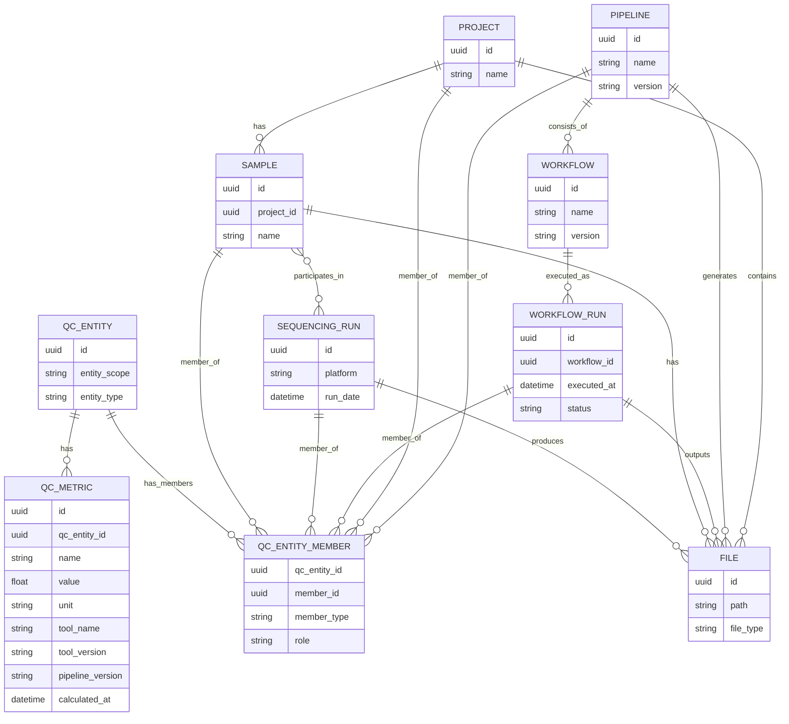

# Entities and Relationships Discussion
A Project can have Sample(s)

A Sample is associated with exactly 1 project
A Sample can contain files from more than 1 sequencing run
A Sample can have QCMetrics associated with it.

A SequencingRun produces/generates files associated with Samples
A SequencingRun can contain Samples from 1 or more Projects
A SequencingRun can have QCMetrics associated with it.

Workflow - A directed graph of steps to transform data (e.g. CWL or Nextflow workflow)
WorkflowRun - An execution of a workflow (user executed, platform executed on, inputs, outputs, etc)
WorkflowRun can have QCMetrics associated with it.

Pipeline - Consists of 1 or more workflows to transform inputs to outputs associated with some business logic.

QCMetric - A QCMetric is a structured, versioned measurement that quantitatively evaluates quality attributes of a biological or computational artifact, produced at a defined processing stage and scoped to a specific entity (e.g., SequencingRun, Sample, WorkflowRun).

We need to represent QCMetrics that are produced/associated with more than 1 sample, e.g. TMB (from a WGS tumor/normal pair) -
A QCMetric is a structured quantitative measurement generated at a defined processing stage and scoped to a QCEntity, where a QCEntity may represent one or more domain entities participating in the measurement.

File - Can be associated with any of these top-level entities.

 

 _Originally posted by @golharam in [#149](https://github.com/NGS360/APIServer/issues/149#issuecomment-3947229010)_