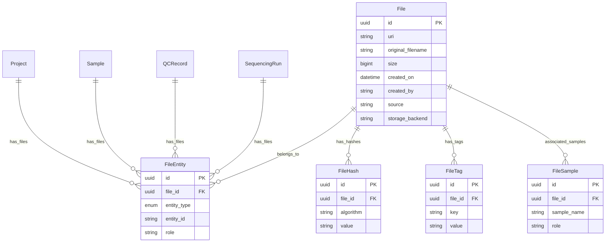

# File Model Unification Plan

## Overview

Merge the existing `File` (upload-focused) and `FileRecord` (reference-focused) models into a unified `File` model that supports:
- Both file uploads and external file references
- Many-to-many relationships with any entity type
- Flexible sample associations with roles
- Multi-algorithm hash storage
- Flexible key-value tags instead of hardcoded flags

## Current State Analysis

### Original File Model (api/files/models.py)

**Purpose**: Track uploaded files (primarily run sample sheets)

| Field | Type | Purpose |
|-------|------|---------|
| id | UUID | Primary key |
| file_id | VARCHAR(100) | Human-readable identifier |
| filename | VARCHAR(255) | Display filename |
| original_filename | VARCHAR(255) | Original upload filename |
| file_path | VARCHAR(1024) | Storage path/URI |
| file_size | INTEGER | Size in bytes |
| mime_type | VARCHAR(100) | Content type |
| checksum | VARCHAR(64) | SHA-256 hash |
| description | VARCHAR(1024) | File description |
| upload_date | TIMESTAMP | Upload timestamp |
| created_by | VARCHAR(100) | User identifier |
| entity_type | ENUM | PROJECT or RUN |
| entity_id | VARCHAR(100) | Parent entity ID |
| storage_backend | ENUM | LOCAL, S3, AZURE, GCS |
| is_public | BOOLEAN | Public access flag |
| is_archived | BOOLEAN | Archive status |
| relative_path | VARCHAR(1024) | Subdirectory path |

**Usage**: `/api/files` endpoints for uploads, run sample sheets

### FileRecord Model (api/filerecord/models.py)

**Purpose**: Track external file references (pipeline outputs)

| Field | Type | Purpose |
|-------|------|---------|
| id | UUID | Primary key |
| entity_type | ENUM | QCRECORD or SAMPLE |
| entity_id | UUID | Parent entity ID |
| uri | VARCHAR(1024) | File URI (s3://) |
| size | BIGINT | File size in bytes |
| created_on | TIMESTAMP | File creation timestamp |

**Supporting Tables**:
- `FileRecordHash`: Multiple hash algorithms per file
- `FileRecordTag`: Flexible key-value metadata
- `FileRecordSample`: Sample associations with roles

## Design Decisions

### 1. Many-to-Many Entity Associations

**Decision**: Replace single `entity_type`/`entity_id` with a junction table `FileEntity`

**Rationale**: A file can belong to multiple entities - e.g., a somatic VCF file belongs to:
- The QCRecord that produced it
- Multiple Samples via FileSample (tumor/normal roles)

**Note on Project associations**: Files should NOT be redundantly linked to a Project when they're already associated with a Sample or QCRecord, since that relationship can be traversed. Project-level `FileEntity` associations are reserved for standalone project files (e.g., manifests) that aren't attached to any other entity.

### 2. Flexible Tags Instead of Hardcoded Flags

**Decision**: Remove `is_archived`, `is_public` columns; use `FileTag` table

**Rationale**: 
- More flexible - can add any tag without schema changes
- Consistent with FileRecord approach
- Examples: `archived=true`, `public=true`, `type=samplesheet`

### 3. Multi-Algorithm Hash Support

**Decision**: Use `FileHash` junction table instead of single `checksum` column

**Rationale**: Different systems use different hash algorithms (MD5, SHA-256, S3 ETag)

### 4. Sample Associations with Roles

**Decision**: Keep `FileSample` table for sample associations

**Rationale**: Needed for bioinformatics workflows (tumor/normal, case/control)

### 5. Unified URI Field

**Decision**: Rename `file_path` to `uri` for consistency

**Rationale**: 
- Works for S3 URIs, local paths, and other storage systems
- Clearer semantics

### 6. Source Tracking

**Decision**: Add `source` freeform text field

**Rationale**: Track where the file record originated from - e.g., the manifest or system that created it. This is NOT the file location (that's `uri`), but rather the source document/system that created this record (e.g., "s3://qc-outputs/pipeline-run-123/manifest.json").

---

## Proposed Unified Schema

### Entity Relationship Diagram



### Table Definitions

---

#### 1. file

Core file entity supporting both uploads and external references.

| Column | Type | Constraints | Description |
|--------|------|-------------|-------------|
| id | UUID | PK | Primary key |
| uri | VARCHAR(512) | NOT NULL | File location (s3://, file://, etc.) |
| original_filename | VARCHAR(255) | | Original filename (for uploads, before any renaming) |
| size | BIGINT | | File size in bytes |
| created_on | TIMESTAMP | NOT NULL | File creation/upload timestamp |
| created_by | VARCHAR(100) | | User who created/uploaded the file |
| source | VARCHAR(1024) | | File origin - freeform text describing where file came from |
| storage_backend | VARCHAR(20) | | Storage type: LOCAL, S3, AZURE, GCS |

**Unique constraint**: (uri, created_on)

**Note**: URI length is limited to 512 characters due to MySQL's InnoDB index key length limit (3072 bytes with utf8mb4 encoding). This is sufficient for typical S3 URIs.

**Notes**:
- `uri + created_on`: Composite unique constraint enables versioning. Same file path can exist multiple times with different timestamps, representing different versions of the file.
- `uri`: The file location serves as the storage path. The filename can be derived as `uri.split('/')[-1]`. API lookups can be done by UUID, or by URI (returns latest version by default).
- **Version queries**:
  - Latest version: `WHERE uri = ? ORDER BY created_on DESC LIMIT 1`
  - All versions: `WHERE uri = ? ORDER BY created_on`
- `source`: URI pointing to where the file record originated from - e.g., "s3://bucket/manifests/2026-01-15/import.csv", "s3://qc-outputs/pipeline-run-123/manifest.json". This is NOT the file location (that's `uri`), but rather the source document/system that created this record.
- `original_filename`: Only populated for uploads - preserves the user's original filename before any system renaming (e.g., adding prefixes for collision avoidance)
- `storage_backend`: Only relevant for uploaded files; NULL for external references
- `mime_type` removed - can be derived from filename extension when needed via utility function

---

#### 2. fileentity

Many-to-many junction table linking files to entities.

| Column | Type | Constraints | Description |
|--------|------|-------------|-------------|
| id | UUID | PK | Primary key |
| file_id | UUID | FK → file.id, NOT NULL, ON DELETE CASCADE | File reference |
| entity_type | VARCHAR(50) | NOT NULL | Entity type: PROJECT, RUN, SAMPLE, QCRECORD |
| entity_id | VARCHAR(100) | NOT NULL | Entity identifier |
| role | VARCHAR(50) | | Optional role (e.g., samplesheet, manifest, output) |

**Unique constraint**: (file_id, entity_type, entity_id)
**Index**: (entity_type, entity_id)

**Examples**:
- Sample sheet: entity_type=RUN, entity_id=barcode, role=samplesheet
- Pipeline output: entity_type=QCRECORD, entity_id=uuid, role=output
- Project manifest (standalone): entity_type=PROJECT, entity_id=P-12345, role=manifest

**Important**: Files attached to Samples or QCRecords should NOT also be linked to their parent Project via FileEntity. The project relationship can be traversed through the Sample→Project or QCRecord→Project relationships. Project-level FileEntity associations are only for standalone files (manifests, etc.) that have no other entity association.

---

#### 3. filehash

Hash values for files (supports multiple algorithms).

| Column | Type | Constraints | Description |
|--------|------|-------------|-------------|
| id | UUID | PK | Primary key |
| file_id | UUID | FK → file.id, NOT NULL, ON DELETE CASCADE | Parent file |
| algorithm | VARCHAR(50) | NOT NULL | Hash algorithm (md5, sha256, etag) |
| value | VARCHAR(128) | NOT NULL | Hash value |

**Unique constraint**: (file_id, algorithm)

---

#### 4. filetag

Flexible key-value metadata for files.

| Column | Type | Constraints | Description |
|--------|------|-------------|-------------|
| id | UUID | PK | Primary key |
| file_id | UUID | FK → file.id, NOT NULL, ON DELETE CASCADE | Parent file |
| key | VARCHAR(255) | NOT NULL | Tag key |
| value | TEXT | NOT NULL | Tag value |

**Unique constraint**: (file_id, key)

**Standard Tags**:
- `archived`: true/false
- `public`: true/false
- `description`: file description
- `type`: alignment, variant, expression, qc_report, etc.
- `format`: bam, vcf, fastq, csv, etc.

---

#### 5. filesample

Associates samples with a file (supports roles for paired analysis).

| Column | Type | Constraints | Description |
|--------|------|-------------|-------------|
| id | UUID | PK | Primary key |
| file_id | UUID | FK → file.id, NOT NULL, ON DELETE CASCADE | Parent file |
| sample_name | VARCHAR(255) | NOT NULL | Sample identifier |
| role | VARCHAR(50) | | Optional role (tumor, normal, case, control) |

**Unique constraint**: (file_id, sample_name)

---

## Implementation Strategy

### Context

- **Status**: ✅ **COMPLETED** - Unified File model and QCMetrics tables have been created and migrated to MySQL
- **Migration**: `f1a2b3c4d5e6_add_qcmetrics_and_filerecord_tables.py` transforms existing `file` table to unified schema and creates QCMetrics tables
- **Data source**: File records will be loaded via ETL from Elasticsearch (SamplesDB and QCMetrics indices)

### Implementation Steps

1. **Update `api/files/models.py`** - Replace with unified File model and supporting models (FileEntity, FileHash, FileTag, FileSample)
2. **Remove `api/filerecord/`** module entirely
3. **Update `api/qcmetrics/models.py`** - Import file models from `api.files.models`
4. **Update `api/qcmetrics/services.py`** - Use unified File model for output_files
5. **Update `api/files/services.py`** - Adapt for new schema (entity associations, tags, hashes)
6. **Update `api/files/routes.py`** - New API endpoints for unified model
7. **Update `alembic/versions/f1a2b3c4d5e6_add_qcmetrics_and_filerecord_tables.py`** - Replace FileRecord tables with unified File tables
8. **Update `alembic/versions/d2f9d7f4163d_add_file_table.py`** - Remove or merge into the QCMetrics migration
9. **Update `alembic/env.py`** - Update model imports

---

## API Changes

### Updated Endpoints

#### POST /api/files
Create a new file (upload or reference)

**Request Body** (multipart/form-data or JSON):
```json
{
  "uri": "s3://bucket/path/sample1.bam",
  "original_filename": "my_sample.bam",
  "source": "s3://qc-outputs/pipeline-run-123/manifest.json",
  "size": 1234567890,
  "entities": [
    {"entity_type": "SAMPLE", "entity_id": "sample-uuid", "role": null},
    {"entity_type": "QCRECORD", "entity_id": "qcrecord-uuid", "role": "output"}
  ],
  "samples": [
    {"sample_name": "Sample1", "role": null}
  ],
  "hashes": {"md5": "abc123...", "sha256": "def456..."},
  "tags": {"type": "alignment", "format": "bam"}
}
```

**Notes**:
- `uri` is required and serves as the unique identifier
- `original_filename` is optional - only needed for uploads where the filename was renamed
- Filename can be derived from `uri.split('/')[-1]`

#### GET /api/files/{id}
Get file metadata by UUID

#### GET /api/files?uri={uri}
Get file metadata by URI (URL-encoded)

**Response**:
```json
{
  "id": "550e8400-e29b-41d4-a716-446655440000",
  "uri": "s3://bucket/path/sample1.bam",
  "original_filename": "my_sample.bam",
  "size": 1234567890,
  "created_on": "2026-02-01T12:00:00Z",
  "created_by": "user@example.com",
  "source": "s3://qc-outputs/pipeline-run-123/manifest.json",
  "storage_backend": "S3",
  "entities": [
    {"entity_type": "QCRECORD", "entity_id": "uuid", "role": "output"}
  ],
  "samples": [
    {"sample_name": "Sample1", "role": null}
  ],
  "hashes": [
    {"algorithm": "md5", "value": "abc123..."}
  ],
  "tags": [
    {"key": "type", "value": "alignment"}
  ]
}
```

#### GET /api/files?entity_type=SAMPLE&entity_id={uuid}
List files for an entity

---

## Implementation Checklist

### Models
- [x] Update `api/files/models.py` with unified File, FileEntity, FileHash, FileTag, FileSample models
- [x] Update Pydantic request/response models (FileCreate, FilePublic, etc.)
- [x] Remove `api/filerecord/` module (was never created - FileRecord was designed but not implemented)

### Database Migration
- [x] Update `alembic/versions/f1a2b3c4d5e6_add_qcmetrics_and_filerecord_tables.py` to create unified tables
- [x] Keep `alembic/versions/d2f9d7f4163d_add_file_table.py` (creates original file table; unified migration transforms it)
- [x] Update `alembic/env.py` model imports

### Service Layer
- [ ] Update `api/files/services.py` for new schema
- [x] Update `api/qcmetrics/services.py` to use unified File model
- [ ] Add helper functions for creating files with entities/tags/hashes/samples

### Routes
- [ ] Update `api/files/routes.py` for new API
- [x] Update `api/qcmetrics/models.py` imports

### Testing
- [ ] Update `tests/api/test_files.py`
- [ ] Update `tests/api/test_files_create.py`
- [x] Update `tests/api/test_qcmetrics.py`
- [ ] Add tests for multi-entity associations
- [ ] Add tests for sample associations with roles

### Documentation
- [x] Update `plans/qcmetrics_migration.md` to reference unified File model

---

## Fields Removed/Changed

### From Original File Model

| Field | Status | Reason |
|-------|--------|--------|
| file_id | Removed | URI serves as human-readable unique identifier |
| filename | Removed | Derived from `uri.split('/')[-1]` |
| entity_type | → FileEntity table | Many-to-many support |
| entity_id | → FileEntity table | Many-to-many support |
| checksum | → FileHash table | Multi-algorithm support |
| mime_type | Removed | Can derive from filename extension when needed |
| description | → FileTag table | Flexible metadata |
| is_archived | → FileTag table | Flexible tags |
| is_public | → FileTag table | Flexible tags |
| relative_path | Removed | Redundant with URI |
| file_path | → uri | Renamed for clarity |
| upload_date | → created_on | Renamed for consistency |
| file_size | → size | Simplified |

### From FileRecord Model

| Field | Status | Reason |
|-------|--------|--------|
| entity_type | → FileEntity table | Many-to-many support |
| entity_id | → FileEntity table | Many-to-many support |

---

## Risks and Mitigations

1. **Increased Query Complexity**
   - Risk: Junction tables require joins for common queries
   - Mitigation: Proper indexing, helper functions in service layer

2. **Performance Impact**
   - Risk: Many-to-many relationships can slow queries
   - Mitigation: Index on (entity_type, entity_id) in fileentity table, (file_id) in all child tables

3. **ETL Complexity**
   - Risk: ETL from Elasticsearch must handle new schema
   - Mitigation: Design ETL to create proper entity associations, use source field to track origin
