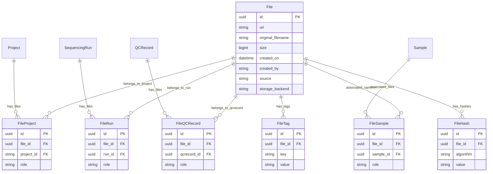

# FileSample vs FileEntity(entity_type=SAMPLE) — Design Analysis

## 1. Problem Statement

The current schema has **two tables** that can represent a Sample → File relationship:

1. **`filesample`** — a dedicated junction table with typed FK to `sample.id`
2. **`fileentity`** — a generic polymorphic junction table, where `entity_type=SAMPLE` is one of the enum values

This creates confusion about which pathway is authoritative for the file↔sample relationship. More broadly, `fileentity` uses a **stringly-typed polymorphic pattern** (`entity_type` + `entity_id` VARCHAR) that lacks database-level referential integrity for *all* entity types, not just samples.

## 2. Current State of `fileentity`

### Entity PK Types (heterogeneous)

| Entity | PK column | Natural key used as `entity_id` | FK possible? |
|--------|-----------|---------------------------------|--------------|
| `Project` | `id` UUID | `project_id` str, e.g., `P-12345` | ✅ FK → `project.project_id` (unique) |
| `SequencingRun` | `id` UUID | `barcode` — a **computed property**, not a column | ❌ No column to FK to |
| `QCRecord` | `id` UUID | `str(uuid)` | ✅ FK → `qcrecord.id` (with type cast) |
| `Sample` | `id` UUID | Never used in `FileEntity` | ✅ Already handled by `FileSample` |

### How `entity_id` is populated today

- **QCMetrics path** (`api/qcmetrics/services.py:219`): `entity_id=str(entity_id)` — casts UUID to string
- **File upload path** (`api/files/services.py:227`): `entity_id=file_upload.entity_id` — passes through from API input
- **File create path** (`api/files/services.py:87`): `entity_id=entity_input.entity_id` — passes through from API input

### Validation

`_validate_entity_exists()` at `api/files/services.py:425` validates entities exist at the **service layer**, but the DB has no FK constraint. If the referenced entity is deleted, orphaned `fileentity` rows remain with dangling `entity_id` strings.

## 3. Comparison: `filesample` vs `fileentity(entity_type=SAMPLE)`

### `filesample` (dedicated junction table)

| Aspect | Detail |
|--------|--------|
| **Schema** | `file_id` (UUID FK → `file.id`), `sample_id` (UUID FK → `sample.id`), `role` (varchar) |
| **FK integrity** | ✅ Proper FK constraints to both `file` and `sample` tables |
| **ORM relationships** | ✅ Bidirectional: `File.samples`, `FileSample.sample`, `Sample.file_samples` |
| **Role semantics** | **Biological** — tumor, normal, case, control |
| **Created by** | `create_file()` in `api/files/services.py:112`, `_create_file_for_qcrecord()` in `api/qcmetrics/services.py:243`, `_create_metric()` in `api/qcmetrics/services.py:147` |
| **Read by** | `file_to_public()` in `api/files/models.py:469`, `file_to_summary()` in `api/files/models.py:503`, `_qcrecord_to_public()` in `api/qcmetrics/services.py:450` |
| **Multi-sample support** | ✅ Multiple rows per file with distinct roles — e.g., tumor/normal VCF |

### `fileentity` with `entity_type=SAMPLE`

| Aspect | Detail |
|--------|--------|
| **Schema** | `file_id` (UUID FK → `file.id`), `entity_type` (varchar), `entity_id` (varchar — stringly-typed), `role` (varchar) |
| **FK integrity** | ❌ No FK constraint to `sample.id` — `entity_id` is just a string, validated at service layer only |
| **ORM relationships** | None to `Sample` — only back to `File` |
| **Role semantics** | **Organizational** — samplesheet, manifest, output |
| **Created by** | **Nobody** — zero code paths create a `FileEntity` row with `entity_type=SAMPLE` |
| **Read by** | `list_files_by_entity()` in `api/files/services.py:365` (generic query), `_validate_entity_exists()` in `api/files/services.py:461` (exists but never triggered) |
| **Multi-sample support** | Awkward — each sample would be a separate `entity_id` string row |

## 4. Key Findings

1. **`FileEntity(entity_type=SAMPLE)` is never actually created anywhere in the codebase.** The `FileEntityType.SAMPLE` enum value exists in `api/files/models.py:37`, and `_validate_entity_exists()` at `api/files/services.py:461` handles it, but no code path ever produces a `FileEntity` row with `entity_type=SAMPLE`.

2. **`FileSample` is the actively-used pathway** — it is how files get linked to samples in both the file endpoint and QCMetrics pipeline.

3. **The `role` field means completely different things** on each table:
   - `FileSample.role` = biological roles: tumor, normal, case, control
   - `FileEntity.role` = organizational roles: output, manifest, samplesheet

4. **We recently added proper FK integrity** to `FileSample` — migrating `sample_name` (varchar) → `sample_id` (UUID FK → `sample.id`). Consolidating into `FileEntity` would revert to stringly-typed references with no DB-level FK enforcement.

5. **The polymorphic pattern in `fileentity` has no FK integrity for ANY entity type** — not just samples. A deleted Project, Run, or QCRecord leaves orphaned `fileentity` rows with dangling `entity_id` strings.

## 5. Options

### Option A: Remove `SAMPLE` from `FileEntityType` — keep `FileSample` and `FileEntity`

- Remove `SAMPLE` from the `FileEntityType` enum in `api/files/models.py:37`
- Remove the `SAMPLE` branch from `_validate_entity_exists()` in `api/files/services.py:461`
- No data migration needed — no rows exist with `entity_type=SAMPLE`
- `FileSample` remains the **single, authoritative** path for file↔sample relationships
- `FileEntity` continues to serve `PROJECT`, `RUN`, `QCRECORD` without FK integrity

**Pros:**
- Eliminates the specific sample redundancy
- Tiny change — ~10 lines across 2 files, no migration
- No existing data or code depends on `FileEntity(SAMPLE)`

**Cons:**
- Does not address the broader problem: `FileEntity` still has no FK integrity for projects, runs, or QC records
- `entity_id` remains stringly-typed for all remaining entity types

### Option B: Remove `FileSample`, use only `FileEntity(entity_type=SAMPLE)`

- ❌ **Loses the FK constraint** we just built in migration `2a06fb0eebbb`
- ❌ Loses bidirectional ORM relationships (`Sample.file_samples`, `FileSample.sample`)
- ❌ Reverts to stringly-typed `entity_id` with no DB referential integrity
- ❌ Overloads `role` for both organizational and biological semantics
- ❌ Multi-sample paired analysis (tumor/normal VCF) becomes awkward
- Would require a data migration to move existing `filesample` rows into `fileentity`

### Option C: Keep both, document the distinction

- Both exist for future flexibility
- Risk of ongoing confusion — two ways to express "file relates to sample"
- `FileEntity(entity_type=SAMPLE)` remains dead code indefinitely
- Requires clear documentation to prevent future developers from using the wrong pathway

### Option D: Replace `FileEntity` entirely with dedicated typed junction tables ⭐

Extend the `FileSample` pattern to all entity types: create `FileProject`, `FileRun`, and `FileQCRecord` tables, each with proper FK constraints. Drop the polymorphic `fileentity` table entirely.

#### Proposed new tables

**`fileproject`** — associates files with projects

| Column | Type | Constraints | Description |
|--------|------|-------------|-------------|
| `id` | UUID | PK | Primary key |
| `file_id` | UUID | FK → `file.id`, ON DELETE CASCADE | Parent file |
| `project_id` | VARCHAR | FK → `project.project_id`, ON DELETE CASCADE | Parent project |
| `role` | VARCHAR(50) | nullable | Organizational role: manifest, report, etc. |

- **Unique constraint**: `(file_id, project_id)`
- **FK target**: `project.project_id` (string, unique) — matches how callers identify projects today

**`filerun`** — associates files with sequencing runs

| Column | Type | Constraints | Description |
|--------|------|-------------|-------------|
| `id` | UUID | PK | Primary key |
| `file_id` | UUID | FK → `file.id`, ON DELETE CASCADE | Parent file |
| `run_id` | UUID | FK → `sequencingrun.id`, ON DELETE CASCADE | Parent run |
| `role` | VARCHAR(50) | nullable | Organizational role: samplesheet, etc. |

- **Unique constraint**: `(file_id, run_id)`
- **FK target**: `sequencingrun.id` (UUID) — the actual PK
- **Note**: `SequencingRun.barcode` is a computed property, not a stored column. A FK-backed table must reference `id`, not barcode. Service layer can resolve barcode → id as needed (same pattern as `resolve_or_create_sample` resolves sample_name → id).

**`fileqcrecord`** — associates files with QC records

| Column | Type | Constraints | Description |
|--------|------|-------------|-------------|
| `id` | UUID | PK | Primary key |
| `file_id` | UUID | FK → `file.id`, ON DELETE CASCADE | Parent file |
| `qcrecord_id` | UUID | FK → `qcrecord.id`, ON DELETE CASCADE | Parent QC record |
| `role` | VARCHAR(50) | nullable | Organizational role: output, etc. |

- **Unique constraint**: `(file_id, qcrecord_id)`
- **FK target**: `qcrecord.id` (UUID) — the actual PK

**`filesample`** — already exists, unchanged

| Column | Type | Constraints | Description |
|--------|------|-------------|-------------|
| `id` | UUID | PK | Primary key |
| `file_id` | UUID | FK → `file.id`, ON DELETE CASCADE | Parent file |
| `sample_id` | UUID | FK → `sample.id`, ON DELETE CASCADE | Parent sample |
| `role` | VARCHAR(50) | nullable | Biological role: tumor, normal, etc. |

#### Proposed ERD

#### Analysis

**Pros:**
- ✅ **Full FK integrity** — every file↔entity association is backed by a real FK constraint. No orphaned references possible.
- ✅ **Cascade deletes work correctly** — deleting a Project cascades to `fileproject` rows; deleting a Run cascades to `filerun` rows. Today, deleting a Project or Run leaves orphaned `fileentity` rows.
- ✅ **Typed columns** — `run_id` is UUID, `project_id` is string, `qcrecord_id` is UUID. No more casting everything to `entity_id` VARCHAR and losing type information.
- ✅ **ORM relationships** — each junction table can have bidirectional SQLAlchemy relationships (e.g., `Project.files`, `File.projects`, `SequencingRun.files`, `File.runs`). Today, navigating from a Project to its files requires a raw query through `fileentity` with string matching.
- ✅ **Eliminates the `FileEntityType` enum entirely** — no more polymorphic dispatch; each relationship type has its own model class.
- ✅ **Eliminates the `_validate_entity_exists()` polymorphic dispatcher** — each service function works with the specific model it needs.
- ✅ **Consistent pattern** — `FileSample` already proves this pattern works well. Extending it to the other entity types is natural.
- ✅ **Better query performance** — joins on typed UUID/string FK columns vs. `WHERE entity_type = ? AND entity_id = ?` string matching.
- ✅ **Self-documenting schema** — the table name tells you what it links (fileproject, filerun, etc.) without needing to know the polymorphic convention.

**Cons / Considerations:**
- ⚠️ **`SequencingRun.barcode` is computed, not stored** — `barcode` is a Python `@property` derived from `run_date`, `run_time`, `machine_id`, `run_number`, `flowcell_id`. There is no `barcode` column to FK to. The `filerun` table must FK to `sequencingrun.id` (UUID). Callers that reference runs by barcode will need to resolve barcode → UUID first, similar to how `resolve_or_create_sample()` resolves sample_name → UUID.
- ⚠️ **`list_files_by_entity()` becomes multiple functions** — the current generic `list_files_by_entity(entity_type, entity_id)` query joins a single `fileentity` table. With dedicated tables, this becomes `list_files_by_project()`, `list_files_by_run()`, `list_files_by_qcrecord()`. The route handler would dispatch based on query params. This is arguably *better* — each function is simpler and type-safe.
- ⚠️ **`File.entities` relationship on the model is replaced** — today `File.entities` is a single list. With the new design, `File` would have separate relationships: `File.projects` (via FileProject), `File.runs` (via FileRun), `File.qcrecords` (via FileQCRecord), `File.samples` (via FileSample, already exists). The public response model would aggregate these.
- ⚠️ **Migration required** — existing `fileentity` data must be migrated to the three new tables, then `fileentity` dropped.
- ⚠️ **More tables** — 4 junction tables instead of 1. But each is small, simple, and self-documenting.
- ⚠️ **`create_file()` API change** — the `entities` list in `FileCreate` currently accepts `[{entity_type, entity_id, role}]` objects. This would change to separate fields or a different input structure. Alternatively, the input format could be preserved and dispatched internally.

#### Addressing the `SequencingRun.barcode` problem

The barcode issue is the most significant design consideration. Two sub-options:

**D1: FK to `sequencingrun.id` (UUID)**
- `filerun.run_id` → `sequencingrun.id`
- Service layer resolves barcode → UUID when creating associations
- Matches how `FileSample` resolves `sample_name` → `sample.id`
- Consistent pattern across all junction tables

**D2: Add a stored `barcode` column to `sequencingrun` with a unique constraint**
- `filerun.run_barcode` → `sequencingrun.barcode`
- Requires schema change to `sequencingrun` table (add + populate + unique index)
- More natural for callers who always reference runs by barcode
- Risks: barcode is derived from multiple fields — storing it introduces potential consistency issues if the constituent fields change

**Recommendation: D1** — FK to `sequencingrun.id` UUID. The barcode → UUID resolution is a one-time lookup at association creation time, and it is consistent with the `FileSample` pattern.

## 6. Recommendation

**Option D** is the optimal design for a system still under active development. It:

1. Provides **full referential integrity** at the database level for all file↔entity relationships
2. Enables **cascade deletes** that actually work (today, deleting a Project does NOT cascade to its `fileentity` rows)
3. Creates a **consistent, self-documenting schema** — four typed junction tables instead of one polymorphic table
4. **Eliminates the `FileEntityType` enum** and polymorphic dispatch entirely
5. Follows the **pattern already proven** by `FileSample`

The additional complexity of 4 tables vs 1 is minimal and well worth the data integrity guarantees. Since the application is still under development, now is the right time to make this structural improvement before the polymorphic pattern becomes deeply entrenched.

## 7. Implementation Steps (Option D)

### Step 1: Create new model classes

**File:** `api/files/models.py`

Add `FileProject`, `FileRun`, `FileQCRecord` model classes with proper FK constraints and bidirectional relationships.

### Step 2: Update `File` model relationships

**File:** `api/files/models.py`

Replace `File.entities` with `File.projects`, `File.runs`, `File.qcrecords` relationships.

### Step 3: Update `FileCreate` input model

**File:** `api/files/models.py`

Either:
- Replace the `entities: List[EntityInput]` field with `project_ids`, `run_ids`, `qcrecord_ids`
- Or keep a backward-compatible input format and dispatch internally

### Step 4: Update `FilePublic` / `FileSummary` response models

**File:** `api/files/models.py`

Update response serialization to aggregate associations from the new tables.

### Step 5: Update `create_file()` service

**File:** `api/files/services.py`

Create rows in `FileProject`, `FileRun`, or `FileQCRecord` instead of `FileEntity`.

### Step 6: Update `create_file_upload()` service

**File:** `api/files/services.py`

Same as step 5 for the upload path.

### Step 7: Replace `list_files_by_entity()` with typed functions

**File:** `api/files/services.py`

Replace the single polymorphic function with `list_files_by_project()`, `list_files_by_run()`, `list_files_by_qcrecord()`. Update routes accordingly.

### Step 8: Remove `_validate_entity_exists()`

**File:** `api/files/services.py`

No longer needed — FK constraints handle existence validation at the DB level.

### Step 9: Update QCMetrics services

**File:** `api/qcmetrics/services.py`

Update `_create_file_for_qcrecord()` to create `FileQCRecord` rows instead of `FileEntity` rows.

### Step 10: Update routes

**File:** `api/files/routes.py`

Update `list_files` endpoint to dispatch to typed query functions based on query parameters.

### Step 11: Remove `FileEntity`, `FileEntityType`, `EntityInput`, `EntityPublic`

**File:** `api/files/models.py`

Remove the polymorphic model class, enum, and associated input/output models.

### Step 12: Alembic migration

Create migration to:
1. Create `fileproject`, `filerun`, `fileqcrecord` tables
2. Migrate existing `fileentity` data into the appropriate new tables
3. Drop `fileentity` table

### Step 13: Update `alembic/env.py`

Add new model imports.

### Step 14: Update documentation

**File:** `docs/FILE_MODEL.md`

Rewrite architecture section to reflect the new schema.

### Step 15: Update tests

Verify and update any tests that reference `FileEntity`, `FileEntityType`, or `EntityInput`.

## 8. Files Changed Summary (Option D)

| File | Change |
|------|--------|
| `api/files/models.py` | Add `FileProject`, `FileRun`, `FileQCRecord`; update `File` relationships; update create/response models; remove `FileEntity`, `FileEntityType`, `EntityInput`, `EntityPublic` |
| `api/files/services.py` | Update `create_file()`, `create_file_upload()`; replace `list_files_by_entity()` with typed functions; remove `_validate_entity_exists()` |
| `api/files/routes.py` | Update `list_files` endpoint dispatch |
| `api/qcmetrics/services.py` | Update `_create_file_for_qcrecord()` to use `FileQCRecord` |
| `alembic/env.py` | Add new model imports |
| `alembic/versions/` | New migration: create 3 tables, migrate data, drop `fileentity` |
| `docs/FILE_MODEL.md` | Rewrite architecture section |
| `tests/` | Update any tests referencing `FileEntity` or `FileEntityType` |
