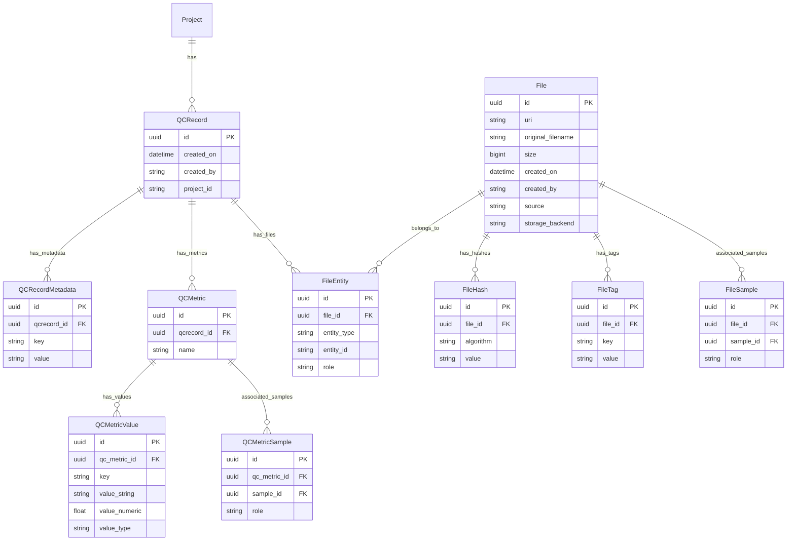

# QCMetrics Migration Plan

> **Status**: ✅ **IMPLEMENTED** - All QCMetrics tables and API endpoints have been created and tested.

## Overview

Migrate the `QCMetrics` Elasticsearch index from the Flask application to a relational model in the FastAPI application using SQLModel and Alembic.

## Current Elasticsearch Schema

From [`qcmetrics_db.py`](../NGS360-FlaskApp2/app/qcmetrics_db.py:11):

```python
class QCRecord(Document):
    uuid = Keyword(required=True)
    created_on = Date(required=True)
    created_by = Keyword(required=True)
    projectid = Keyword(required=True)
    metadata = Nested(required=True)        # Dynamic key-value pairs
    sample_level_metrics = Nested()         # Per-sample metrics
    output_files = Nested(File)             # List of files with uri, size, hash, tags
```

## Design Decisions

Based on discussion with stakeholder:

1. **Metadata storage**: Use key-value attributes table for maximum flexibility
2. **Sample metrics**: Keep separate from Sample table, store as key-value pairs
3. **Output files**: Use unified `File` model (see [file_model_unification.md](file_model_unification.md)) with many-to-many entity associations
4. **Versioning**: Keep all versions (history) - multiple QCRecords per project allowed
5. **Unified File model**: The `File` and `FileRecord` models have been merged into a single unified `File` model that supports both uploads and external file references. See [file_model_unification.md](file_model_unification.md) for details.
6. **Flexible sample association**: Both metrics and files can belong to:
   - A single sample (e.g., BAM file, per-sample alignment rate)
   - A pair of samples (e.g., tumor/normal VCF, somatic variant count)
   - The workflow itself (e.g., expression matrix, aggregate QC metrics)

## Relational Schema (Implemented)

### Entity Relationship Diagram

> **Note**: The File-related tables have been unified into a single model. See [file_model_unification.md](file_model_unification.md) for the complete File schema including FileEntity, FileHash, FileTag, and FileSample tables.



### Table Definitions

**Legend for constraint abbreviations:**
- **PK** = Primary Key (unique identifier for each row)
- **FK** = Foreign Key (links to another table's primary key)
- **UK** = Unique Key (must be unique within the table)

---

#### 1. qcrecord

Main QC record entity, one per pipeline execution per project. Multiple records per project allowed for versioning.

| Column | Type | Constraints | Description |
|--------|------|-------------|-------------|
| id | UUID | PK | Primary key |
| created_on | TIMESTAMP | NOT NULL | Record creation timestamp |
| created_by | VARCHAR(100) | NOT NULL | User who created the record |
| project_id | VARCHAR(50) | NOT NULL, INDEX | Associated project ID |

**Note**: No FK to Project table to allow QC records for projects not yet in the system.

---

#### 2. qcrecordmetadata

Key-value store for pipeline-level metadata (pipeline name, version, etc.). These describe the workflow/pipeline run, not individual samples.

| Column | Type | Constraints | Description |
|--------|------|-------------|-------------|
| id | UUID | PK | Primary key |
| qcrecord_id | UUID | FK → qcrecord.id, NOT NULL, ON DELETE CASCADE | Parent QC record |
| key | VARCHAR(255) | NOT NULL | Metadata key |
| value | TEXT | NOT NULL | Metadata value |

**Unique constraint**: (qcrecord_id, key)

---

#### 3. qcmetric

A named group of metrics. Can be workflow-level (no samples), single-sample, or multi-sample (e.g., tumor/normal pair).

| Column | Type | Constraints | Description |
|--------|------|-------------|-------------|
| id | UUID | PK | Primary key |
| qcrecord_id | UUID | FK → qcrecord.id, NOT NULL, ON DELETE CASCADE, INDEX | Parent QC record |
| name | VARCHAR(255) | NOT NULL, INDEX | Metric group name (e.g., "sample_qc", "somatic_variants", "pipeline_summary") |

**No unique constraint**: Multiple QCMetric rows with the same name are allowed within a QCRecord, differentiated by their sample associations. This supports per-sample metrics where each sample has its own set of QC values.

**Example**: An RNA-Seq pipeline run with 2 samples (human1, human2) creates:

```
QCRecord (project_id="P-00000001")
├── QCMetric (id=1, name="sample_qc")  ← for human1
│   ├── QCMetricSample (sample_name="human1")
│   ├── QCMetricValue (key="QC_AlignedReads", value_numeric=1000000)
│   ├── QCMetricValue (key="QC_FractionAligned", value_numeric=0.98)
│   └── ... (35 more QC values)
│
├── QCMetric (id=2, name="sample_qc")  ← for human2 (same name, different sample)
│   ├── QCMetricSample (sample_name="human2")
│   ├── QCMetricValue (key="QC_AlignedReads", value_numeric=950000)
│   ├── QCMetricValue (key="QC_FractionAligned", value_numeric=0.96)
│   └── ... (35 more QC values)
│
└── QCMetric (id=3, name="pipeline_summary")  ← workflow-level (no samples)
    ├── QCMetricValue (key="total_samples", value_numeric=2)
    └── QCMetricValue (key="runtime_hours", value_numeric=4.5)
```

This design allows each sample to have its own `QC_AlignedReads` value without encoding the sample name in the metric key.

**Indexes**:
- `ix_qcmetric_qcrecord_id` - for efficient lookups by parent record
- `ix_qcmetric_name` - for efficient filtering by metric type

**Sample association patterns:**
- **Workflow-level**: No entries in qcmetricsample (e.g., overall pipeline success rate)
- **Single sample**: One entry in qcmetricsample (e.g., Sample1 alignment rate)
- **Sample pair**: Two entries in qcmetricsample with roles (e.g., tumor=Sample1, normal=Sample2)

---

#### 4. qcmetricvalue

Key-value store for individual metric values within a metric group. Supports dual storage for both string and numeric queries.

| Column | Type | Constraints | Description |
|--------|------|-------------|-------------|
| id | UUID | PK | Primary key |
| qc_metric_id | UUID | FK → qcmetric.id, NOT NULL, ON DELETE CASCADE | Parent metric group |
| key | VARCHAR(255) | NOT NULL | Metric name (e.g., "reads", "alignment_rate", "variant_count") |
| value_string | TEXT | NOT NULL | String representation of the value (always populated) |
| value_numeric | FLOAT | NULL | Numeric value for int/float types (enables numeric queries) |
| value_type | VARCHAR(10) | NOT NULL, DEFAULT 'str' | Original Python type: "str", "int", or "float" |

**Unique constraint**: (qc_metric_id, key)

**Index**: `ix_qcmetricvalue_key_numeric` on (key, value_numeric) - for efficient numeric range queries

**Type preservation**: When a numeric value is submitted (e.g., `{"reads": 50000000}`), it is:
1. Stored as string in `value_string` for display/string matching
2. Stored as float in `value_numeric` for numeric queries (>, <, range, aggregations)
3. Tagged with `value_type` to restore original type on retrieval

---

#### 5. qcmetricsample

Associates samples with a metric group. Supports 0 (workflow-level), 1 (single sample), or N (paired/multi-sample) associations.

| Column | Type | Constraints | Description |
|--------|------|-------------|-------------|
| id | UUID | PK | Primary key |
| qc_metric_id | UUID | FK → qcmetric.id, NOT NULL, ON DELETE CASCADE | Parent metric group |
| sample_name | VARCHAR(255) | NOT NULL, INDEX | Sample identifier |
| role | VARCHAR(50) | | Optional role label (e.g., "tumor", "normal", "case", "control") |

**Unique constraint**: (qc_metric_id, sample_name)

**Index**: `ix_qcmetricsample_sample_name` - for efficient queries like "find all metrics for sample X"

---

### Unified File Tables

> **UPDATED**: The File tables have been unified into a single model that supports both uploads and external references. See [file_model_unification.md](file_model_unification.md) for complete table definitions including:
> - **file**: Core file entity with URI, size, source, etc.
> - **fileentity**: Many-to-many associations with entities (QCRecord, Sample, Project, Run)
> - **filehash**: Multi-algorithm hash storage
> - **filetag**: Flexible key-value metadata (replaces hardcoded flags)
> - **filesample**: Sample associations with roles (tumor/normal, case/control)

The key change from the original FileRecord design is the introduction of the `fileentity` junction table, which allows a single file to be associated with **multiple entities**. This is more flexible than the original polymorphic `entity_type`/`entity_id` pattern.

For example, a tumor/normal VCF file can be linked to:
- The QCRecord that produced it (entity_type=QCRECORD)
- Multiple Samples via FileSample with roles (tumor, normal)

**Note**: Files should NOT be redundantly linked to a Project when they're already associated with a Sample or QCRecord. The project relationship can be traversed through Sample→Project. Project-level FileEntity associations are reserved for standalone project files (e.g., manifests) that aren't attached to any other entity.

---

## Sample Association Examples

### Example 1: Per-sample BAM file

```
File:
  - uri: s3://bucket/Sample1.bam

FileEntity:
  - entity_type: QCRECORD
  - entity_id: <qcrecord_uuid>
  
FileSample:
  - sample_name: Sample1
  - role: null  (single sample, no role needed)
```

### Example 2: Tumor/Normal VCF

```
File:
  - uri: s3://bucket/Sample1_Sample2.somatic.vcf

FileEntity:
  - entity_type: QCRECORD
  - entity_id: <qcrecord_uuid>
  
FileSample:
  - sample_name: Sample1, role: tumor
  - sample_name: Sample2, role: normal
```

### Example 3: Workflow-level expression matrix

```
File:
  - uri: s3://bucket/expression_matrix.tsv

FileEntity:
  - entity_type: QCRECORD
  - entity_id: <qcrecord_uuid>
  
FileSample: (none - workflow level output)
```

### Example 4: Per-sample alignment metrics

```
QCMetric:
  - name: alignment_stats
  - qcrecord_id: <qcrecord_uuid>

QCMetricSample:
  - sample_name: Sample1
  - role: null

QCMetricValue:
  - key: total_reads, value: 50000000
  - key: mapped_reads, value: 48500000
  - key: alignment_rate, value: 97.0
```

### Example 5: Somatic variant metrics (tumor/normal pair)

```
QCMetric:
  - name: somatic_variants
  - qcrecord_id: <qcrecord_uuid>

QCMetricSample:
  - sample_name: Sample1, role: tumor
  - sample_name: Sample2, role: normal

QCMetricValue:
  - key: snv_count, value: 15234
  - key: indel_count, value: 1523
  - key: tmb, value: 8.5
```

### Example 6: Workflow-level QC summary

```
QCMetric:
  - name: pipeline_summary
  - qcrecord_id: <qcrecord_uuid>

QCMetricSample: (none - workflow level)

QCMetricValue:
  - key: total_samples_processed, value: 48
  - key: samples_passed_qc, value: 46
  - key: pipeline_runtime_hours, value: 12.5
```

---

## API Endpoints

Implemented in [`api/qcmetrics/routes.py`](../api/qcmetrics/routes.py):

| Method | Endpoint | Description |
|--------|----------|-------------|
| POST | /api/v1/qcmetrics | Create a new QC record |
| GET | /api/v1/qcmetrics/search | Search QC records (query params) |
| POST | /api/v1/qcmetrics/search | Search QC records (JSON body) |
| GET | /api/v1/qcmetrics/{id} | Get QC record by ID |
| DELETE | /api/v1/qcmetrics/{id} | Delete a QC record |

### Request/Response Models

#### Create QCRecord Request

Defined in [`QCRecordCreate`](../api/qcmetrics/models.py:189). Metric values support both strings and native numeric types (int, float):

```json
{
  "project_id": "P-1234",
  "metadata": {
    "pipeline": "RNA-Seq",
    "version": "2.0.0"
  },
  "metrics": [
    {
      "name": "alignment_stats",
      "samples": [{"sample_name": "Sample1"}],
      "values": {
        "reads": 50000000,
        "alignment_rate": 95.5,
        "reference_genome": "GRCh38"
      }
    },
    {
      "name": "somatic_variants",
      "samples": [
        {"sample_name": "Sample1", "role": "tumor"},
        {"sample_name": "Sample2", "role": "normal"}
      ],
      "values": {
        "snv_count": 15234,
        "tmb": 8.5
      }
    },
    {
      "name": "pipeline_summary",
      "values": {
        "total_samples": 48,
        "runtime_hours": 12.5
      }
    }
  ],
  "output_files": [
    {
      "uri": "s3://bucket/Sample1.bam",
      "size": 123456789,
      "samples": [{"sample_name": "Sample1"}],
      "hashes": {"md5": "abc123..."},
      "tags": {"type": "alignment"}
    },
    {
      "uri": "s3://bucket/expression_matrix.tsv",
      "size": 5678901,
      "hashes": {"md5": "def456..."},
      "tags": {"type": "expression"}
    }
  ]
}
```

**Note**: The `created_by` parameter is passed as a query parameter, not in the request body.

#### Create Response (Minimal)

Defined in [`QCRecordCreated`](../api/qcmetrics/models.py:232). Returns only essential fields to reduce response size:

```json
{
  "id": "550e8400-e29b-41d4-a716-446655440000",
  "created_on": "2026-01-29T12:00:00Z",
  "created_by": "username",
  "project_id": "P-1234",
  "is_duplicate": false
}
```

Use `GET /api/v1/qcmetrics/{id}` to retrieve full details after creation.

#### QCRecord Full Response (GET)

Defined in [`QCRecordPublic`](../api/qcmetrics/models.py:235). Numeric values are returned with their original types preserved:

```json
{
  "id": "550e8400-e29b-41d4-a716-446655440000",
  "created_on": "2026-01-29T12:00:00Z",
  "created_by": "username",
  "project_id": "P-1234",
  "metadata": [
    {"key": "pipeline", "value": "RNA-Seq"},
    {"key": "version", "value": "2.0.0"}
  ],
  "metrics": [
    {
      "name": "alignment_stats",
      "samples": [{"sample_name": "Sample1", "role": null}],
      "values": [
        {"key": "reads", "value": 50000000},
        {"key": "alignment_rate", "value": 95.5},
        {"key": "reference_genome", "value": "GRCh38"}
      ]
    }
  ],
  "output_files": [
    {
      "id": "660e8400-e29b-41d4-a716-446655440001",
      "uri": "s3://bucket/Sample1.bam",
      "filename": "Sample1.bam",
      "size": 123456789,
      "created_on": "2026-01-29T12:00:00Z",
      "samples": [{"sample_name": "Sample1", "role": null}],
      "hashes": [{"algorithm": "md5", "value": "abc123..."}],
      "tags": [{"key": "type", "value": "alignment"}]
    }
  ]
}
```

### Search Endpoint Details

**GET /api/v1/qcmetrics/search**

Query parameters:
- `project_id`: Filter by project ID
- `latest`: If true (default), return only newest QCRecord per project
- Any metadata key: e.g., `pipeline=RNA-Seq`

**POST /api/v1/qcmetrics/search**

JSON body for advanced filtering:
```json
{
  "filter_on": {
    "project_id": "P-1234",
    "metadata": {
      "pipeline": "RNA-Seq"
    }
  },
  "page": 1,
  "per_page": 100,
  "latest": true
}
```

---

## Implementation Checklist

### Models ✅
- [x] [`api/qcmetrics/models.py`](../api/qcmetrics/models.py) - QCRecord, QCRecordMetadata, QCMetric, QCMetricValue, QCMetricSample
- [x] Pydantic request/response models (QCRecordCreate, QCRecordPublic, etc.)
- [x] Dual storage for metric values (value_string, value_numeric, value_type)

### Database Migration ✅
- [x] [`alembic/versions/f1a2b3c4d5e6_add_qcmetrics_and_filerecord_tables.py`](../alembic/versions/f1a2b3c4d5e6_add_qcmetrics_and_filerecord_tables.py)
- [x] Creates QCRecord tables with proper indexes and constraints
- [x] Transforms existing `file` table to unified schema
- [x] Creates File supporting tables (fileentity, filehash, filetag, filesample)

### Service Layer ✅
- [x] [`api/qcmetrics/services.py`](../api/qcmetrics/services.py) - CRUD operations
- [x] Duplicate detection for equivalent records
- [x] Type preservation for numeric values
- [x] File creation with entity associations

### Routes ✅
- [x] [`api/qcmetrics/routes.py`](../api/qcmetrics/routes.py) - All endpoints implemented
- [x] POST /api/v1/qcmetrics - Create
- [x] GET /api/v1/qcmetrics/search - Search (query params)
- [x] POST /api/v1/qcmetrics/search - Search (JSON body)
- [x] GET /api/v1/qcmetrics/{id} - Get by ID
- [x] DELETE /api/v1/qcmetrics/{id} - Delete

### Testing ✅
- [x] [`tests/api/test_qcmetrics.py`](../tests/api/test_qcmetrics.py) - Comprehensive test coverage
- [x] Tests for single-sample, paired-sample, and workflow-level metrics
- [x] Tests for numeric type preservation
- [x] Tests for output files with hashes/tags/samples
- [x] Tests for search and pagination
- [x] Tests for duplicate detection

---

## Files Created/Modified

### New Files

| File | Description | Status |
|------|-------------|--------|
| `api/qcmetrics/__init__.py` | Package init | ✅ Created |
| `api/qcmetrics/models.py` | SQLModel definitions | ✅ Created |
| `api/qcmetrics/routes.py` | FastAPI route handlers | ✅ Created |
| `api/qcmetrics/services.py` | Business logic | ✅ Created |
| `alembic/versions/f1a2b3c4d5e6_add_qcmetrics_and_filerecord_tables.py` | Database migration | ✅ Created |
| `tests/api/test_qcmetrics.py` | Unit tests | ✅ Created |

### Modified Files

| File | Change | Status |
|------|--------|--------|
| `main.py` | Add QCMetrics router | ✅ Done |
| `api/files/models.py` | Unified File model | ✅ Done |

---

## Implementation Notes

### Duplicate Detection

The current ES implementation checks if an equivalent record exists before inserting. For the relational model:

1. Query for existing records with same project_id
2. Compare metadata, metrics, and output_files
3. Return existing record info if equivalent, otherwise create new

### Versioning

Multiple QC records per project are allowed (history is kept). The `created_on` timestamp differentiates versions. Use `ORDER BY created_on DESC` to get the latest.

### Latest Query Pattern

For getting the latest QCRecord per project (PostgreSQL):

```sql
SELECT DISTINCT ON (project_id) *
FROM qcrecord
WHERE <filters>
ORDER BY project_id, created_on DESC
```

For SQLite (testing):

```sql
SELECT * FROM qcrecord q1
WHERE q1.created_on = (
    SELECT MAX(q2.created_on) 
    FROM qcrecord q2 
    WHERE q2.project_id = q1.project_id
)
AND <filters>
```

### Cascade Deletes

All child tables cascade delete when parent is deleted:
- qcrecord → qcrecordmetadata, qcmetric
- qcmetric → qcmetricvalue, qcmetricsample
- file → fileentity, filehash, filetag, filesample

### File Entity Associations

The unified `File` model uses a many-to-many pattern via the `fileentity` junction table:
- A file can belong to multiple entities (QCRecord, Sample, Project, Run)
- The `role` field in fileentity indicates the relationship type (e.g., "output", "samplesheet")

This is more flexible than the original polymorphic `entity_type`/`entity_id` pattern. See [file_model_unification.md](file_model_unification.md) for details.

### Note on Backward Compatibility

The new API uses an explicit `metrics` array format with sample associations, which is clearer than the legacy `sample_level_metrics` dictionary format. The legacy format is not directly supported - data should be transformed to the new format during ETL/migration.

### Note on File Deletion

When a QCRecord is deleted:
1. The FileEntity associations are automatically deleted (via CASCADE)
2. The File records themselves are **also deleted** (explicit deletion in service layer)

This differs from the original plan where Files would remain orphaned. The current implementation deletes Files that were created for the QCRecord since they typically have no other entity associations.
