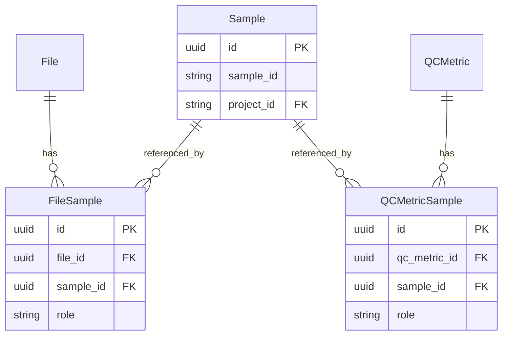

# Sample FK Migration Plan

> Convert `FileSample` and `QCMetricSample` from freeform `sample_name` text to `sample_id` UUID FK → `sample.id`, with auto-creation of stub Sample records.

## 1. Overview

The `filesample` and `qcmetricsample` junction tables currently store sample associations as freeform text (`sample_name VARCHAR(255)`) instead of proper foreign key references to the `sample` table. This creates data integrity issues — sample names can drift, typos go undetected, and there is no referential guarantee that a referenced sample actually exists.

This plan converts both tables to use a `sample_id UUID` foreign key pointing to `sample.id`. When a caller references a `sample_name` that doesn't yet exist in the `sample` table for the given project, the system will **auto-create a stub `Sample` record** tagged with `SampleAttribute(key="auto_created_stub", value="true")`. This handles legacy data gracefully while establishing referential integrity going forward.

**Chosen approach: Option D — Auto-Create Sample Stubs**

### Key Design Decisions

1. **`role` stays on the junction tables** — it describes the sample's role *in the context of this file/metric* (e.g., tumor/normal), not a property of the sample itself.
2. **API input unchanged** — callers still send `sample_name` strings. Resolution to `sample.id` happens in the service layer.
3. **`project_id` is explicit** — the file creation layer never infers `project_id`. For QCMetrics, `QCRecord.project_id` is passed through. For the generic `POST /api/files` endpoint, `project_id` is required when samples are provided (422 error otherwise).
4. **Stub tagging** — auto-created samples get `SampleAttribute(key="auto_created_stub", value="true")` for later reconciliation.
5. **No OpenSearch indexing for stubs** — stubs can be indexed during a separate reconciliation process.

---

## 2. Current State

### `filesample` table

| Column | Type | Constraints |
|--------|------|-------------|
| `id` | UUID | PK |
| `file_id` | UUID | FK → `fileentity.id`, NOT NULL |
| `sample_name` | VARCHAR(255) | NOT NULL |
| `role` | VARCHAR(50) | nullable |

**Unique constraint:** `(file_id, sample_name)`

### `qcmetricsample` table

| Column | Type | Constraints |
|--------|------|-------------|
| `id` | UUID | PK |
| `qc_metric_id` | UUID | FK → `qcmetric.id`, NOT NULL |
| `sample_name` | VARCHAR(255) | NOT NULL |
| `role` | VARCHAR(50) | nullable |

**Unique constraint:** `(qc_metric_id, sample_name)`

Both tables use freeform text with no referential integrity to the `sample` table.

---

## 3. Target State

### `filesample` table (updated)

| Column | Type | Constraints |
|--------|------|-------------|
| `id` | UUID | PK |
| `file_id` | UUID | FK → `fileentity.id`, NOT NULL |
| `sample_id` | UUID | FK → `sample.id`, NOT NULL |
| `role` | VARCHAR(50) | nullable |

**Unique constraint:** `(file_id, sample_id)`

### `qcmetricsample` table (updated)

| Column | Type | Constraints |
|--------|------|-------------|
| `id` | UUID | PK |
| `qc_metric_id` | UUID | FK → `qcmetric.id`, NOT NULL |
| `sample_id` | UUID | FK → `sample.id`, NOT NULL, indexed |
| `role` | VARCHAR(50) | nullable |

**Unique constraint:** `(qc_metric_id, sample_id)`

### ERD



---

## 4. Implementation Steps

### Subtask 1: Foundation — Shared Utility + Model Changes

**Files:** `api/samples/services.py`, `api/files/models.py`, `api/qcmetrics/models.py`

#### 1.1 Add `resolve_or_create_sample()` utility

Add to `api/samples/services.py`:

```python
async def resolve_or_create_sample(
    session: AsyncSession,
    sample_name: str,
    project_id: str,
) -> uuid.UUID:
    """
    Resolve a sample_name to a Sample.id for the given project.

    - If a Sample with (sample_id=sample_name, project_id=project_id) exists → return its id.
    - If not → create a stub Sample + SampleAttribute(key="auto_created_stub", value="true").
    - Does NOT commit (caller manages transaction).
    - Does NOT index to OpenSearch.
    """
```

Key behaviors:
- Looks up `Sample` by `(sample_id=name, project_id=project_id)`
- If found → return `Sample.id`
- If not found → create `Sample(sample_id=name, project_id=project_id)` + `SampleAttribute(key="auto_created_stub", value="true")`
- Does **not** commit (caller manages transaction)
- Does **not** index to OpenSearch

#### 1.2 Update `FileSample` model

In `api/files/models.py`:

- Replace `sample_name: str` → `sample_id: uuid.UUID = Field(foreign_key="sample.id", nullable=False)`
- Update unique constraint: `(file_id, sample_name)` → `(file_id, sample_id)`

#### 1.3 Update `QCMetricSample` model

In `api/qcmetrics/models.py`:

- Replace `sample_name: str` → `sample_id: uuid.UUID = Field(foreign_key="sample.id", nullable=False, index=True)`
- Update unique constraint: `(qc_metric_id, sample_name)` → `(qc_metric_id, sample_id)`

#### 1.4 Add `project_id` to `FileCreate`

In `api/files/models.py`:

- Add `project_id: str | None = None` to `FileCreate`
- Add `@model_validator` that raises `ValueError` if `samples` is non-empty but `project_id` is `None`

```python
@model_validator(mode="after")
def validate_project_id_with_samples(self) -> "FileCreate":
    if self.samples and not self.project_id:
        raise ValueError(
            "project_id is required when samples are provided"
        )
    return self
```

#### 1.5 Preserve backward-compatible response models

Keep `FileSamplePublic.sample_name` and `MetricSamplePublic.sample_name` in response models for API backward compatibility. Values will be derived via FK join in the service layer.

#### 1.6 Update helper functions

Update `file_to_public()` and `file_to_summary()` helpers: temporarily use `str(s.sample_id)` as placeholder until the service layer properly resolves via join (addressed in Subtask 3).

---

### Subtask 2: Service Layer — File Services

**Files:** `api/files/services.py`

#### 2.1 Import the resolver

```python
from api.samples.services import resolve_or_create_sample
```

#### 2.2 Update `create_file()`

The function already receives `file_create: FileCreate` which now has `project_id`.

In the "Create sample associations" block:

1. Call `resolve_or_create_sample(session, sample_input.sample_name, file_create.project_id)` to get the UUID
2. Pass `sample_id=resolved_uuid` instead of `sample_name=sample_input.sample_name` to `FileSample()`

```python
# Before (current):
file_sample = FileSample(
    file_id=db_file.id,
    sample_name=sample_input.sample_name,
    role=sample_input.role,
)

# After:
resolved_uuid = await resolve_or_create_sample(
    session, sample_input.sample_name, file_create.project_id
)
file_sample = FileSample(
    file_id=db_file.id,
    sample_id=resolved_uuid,
    role=sample_input.role,
)
```

---

### Subtask 3: Service Layer — QCMetrics Services

**Files:** `api/qcmetrics/services.py`

#### 3.1 Import the resolver

```python
from api.samples.services import resolve_or_create_sample
```

#### 3.2 Update `_create_metric()`

- Add `project_id: str` parameter
- For each `sample_input` in `metric_input.samples`, call `resolve_or_create_sample(session, sample_name, project_id)`
- Pass `sample_id=resolved_uuid` to `QCMetricSample()`

#### 3.3 Update `_create_file_for_qcrecord()`

- Add `project_id: str` parameter
- Set `file_create.project_id = project_id` before creating file samples
- For each sample, call `resolve_or_create_sample(session, sample_input.sample_name, project_id)`

#### 3.4 Update `create_qcrecord()`

- Pass `project_id=qcrecord_create.project_id` to `_create_metric()` and `_create_file_for_qcrecord()`

#### 3.5 Update `_qcrecord_to_public()`

When building `FileSummary.samples` and `MetricPublic.samples`, resolve `sample_id` UUID back to `Sample.sample_id` (human-readable name) via DB lookup or join.

#### 3.6 Update `file_to_public()` and `file_to_summary()`

Load the `Sample` object via `sample_id` FK to get the human-readable `sample_id` (name) for the response. This completes the placeholder from Subtask 1.6.

---

### Subtask 4: Alembic Migration

**Files:** New file in `alembic/versions/`

#### Migration steps

1. **Add column** — Add `sample_id` UUID column (nullable initially) to both `filesample` and `qcmetricsample`

2. **Backfill** — For each row, look up `sample.id` from `sample.sample_id` matching the `sample_name`:
   - **For `filesample`:** derive `project_id` from `fileentity` → entity associations. This is complex in raw SQL and may require manual review.
   - **For `qcmetricsample`:** derive `project_id` from `qcmetricsample` → `qcmetric` → `qcrecord.project_id`
   - **For unmatched samples:** create stub `Sample` records with `auto_created_stub` attribute

3. **Make NOT NULL** — Alter `sample_id` to be NOT NULL on both tables

4. **Drop old column** — Drop `sample_name` column from both tables

5. **Add FK constraints** — Add foreign key constraints `sample_id → sample.id`

6. **Update unique constraints** — Replace `(file_id, sample_name)` → `(file_id, sample_id)` and `(qc_metric_id, sample_name)` → `(qc_metric_id, sample_id)`

> **⚠️ Note:** The migration backfill is complex because we need project context to create stub samples. The `filesample` backfill is especially tricky since project_id isn't directly accessible from the file table. This migration should be reviewed carefully and may need manual data verification. Consider a two-phase approach: add column as nullable, run a separate backfill script with validation, then apply the NOT NULL constraint.

---

### Subtask 5: Tests + Documentation

**Files:** `tests/api/test_qcmetrics.py`, `tests/api/test_files_create.py`, `docs/FILE_MODEL.md`

#### Tests

**`test_qcmetrics.py`:**
- Verify that creating a QCRecord with sample associations auto-creates stub `Sample` records with the `auto_created_stub` attribute
- Verify that existing samples are found and reused (no duplicate creation)

**`test_files_create.py`:**
- Verify that `FileCreate` with samples but no `project_id` raises 422
- Verify FK behavior — created `FileSample` records reference valid `Sample.id`
- Verify that existing samples are reused

**Unit test for `resolve_or_create_sample`:**
- Test creation of new stub with attribute tagging
- Test resolution of existing sample (returns existing UUID)
- Test that no commit is issued (caller manages transaction)

#### Documentation

Update `docs/FILE_MODEL.md`:
- Update schema tables for `filesample` and `qcmetricsample` to reflect `sample_id` FK
- Update ERD diagrams
- Document the auto-stub behavior and `SampleAttribute(key="auto_created_stub", value="true")` tagging
- Document the `project_id` requirement on `FileCreate` when samples are provided

---

## 5. Risk Assessment

| Risk | Mitigation |
|------|------------|
| Migration backfill complexity — need project context to create stubs | Document clearly; consider a two-phase approach (add column nullable, run backfill script, then make NOT NULL) |
| Circular import risk — `FileSample` FK to `sample.id` | Use string-based FK references (`foreign_key="sample.id"`) — SQLModel/SQLAlchemy handles this without Python imports |
| API backward compatibility | Keep `sample_name` in request/response Pydantic models; only the DB column changes |
| Performance of `resolve_or_create_sample` | Single indexed lookup per sample; negligible for typical file counts |
| `filesample` backfill project_id derivation | Complex join through entity associations; may require manual verification or a conservative approach (skip rows without clear project context) |

---

## 6. Files Changed Summary

| File | Change Type |
|------|------------|
| `api/samples/services.py` | Add `resolve_or_create_sample()` |
| `api/files/models.py` | `FileSample` FK change; `FileCreate` `project_id` + validator; helper updates |
| `api/qcmetrics/models.py` | `QCMetricSample` FK change |
| `api/files/services.py` | Use `resolve_or_create_sample` in `create_file()` |
| `api/qcmetrics/services.py` | Pass `project_id` through; use `resolve_or_create_sample` |
| `alembic/versions/` | New migration file |
| `tests/api/test_qcmetrics.py` | Test stub auto-creation |
| `tests/api/test_files_create.py` | Test FK behavior, 422 validation |
| `docs/FILE_MODEL.md` | Updated schema docs |
