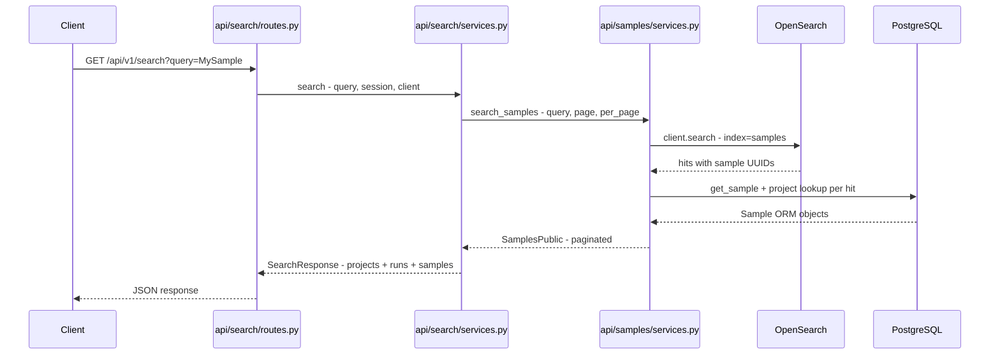

# Add Samples to Unified `/api/v1/search` Endpoint

## Problem

The unified search endpoint (`GET /api/v1/search?query=...`) returns projects and runs but **not samples**. The infrastructure is mostly in place — a `"samples"` OpenSearch index is created at startup, samples are indexed on creation — but there is no `search_samples()` function and `SearchResponse` doesn't include a samples field.

## Current State

| Piece | Status | Location |
|-------|--------|----------|
| OpenSearch index `"samples"` | ✅ Created at startup | `core/opensearch.py:9` |
| `Sample.__searchable__` | ⚠️ Only `["sample_id"]` — missing `project_id` | `api/samples/models.py:32` |
| Index on single create | ✅ Works | `api/samples/services.py:136-138` |
| Index on bulk create | ✅ Works | `api/samples/services.py:562-569` |
| `reindex_samples()` | ⚠️ Uses one-at-a-time indexing (not bulk) | `api/samples/services.py:236-246` |
| `search_samples()` function | ❌ Does not exist | — |
| `SearchResponse.samples` | ❌ Not included | `api/search/models.py:50-52` |
| Unified search wiring | ❌ Not called | `api/search/services.py:129-146` |

## Architecture — Follow Existing Pattern

The projects and runs search implementations are identical in structure. Samples should follow the same pattern:



## Implementation Steps

### Step 1: Expand `Sample.__searchable__`

**File:** `api/samples/models.py`

Change `__searchable__ = ["sample_id"]` to `__searchable__ = ["sample_id", "project_id"]`.

This means when a sample is indexed to OpenSearch, both `sample_id` and `project_id` are stored as searchable fields. A user searching for "P-1234" will find matching samples.

### Step 2: Create `search_samples()` in sample services

**File:** `api/samples/services.py`

Add a `search_samples()` function following the exact pattern of `search_projects()` in `api/project/services.py:427-461`:

1. Call `define_search_body(query, page, per_page, sort_by, sort_order)` from `core/utils.py`
2. Execute `client.search(index="samples", body=search_body)`
3. For each hit, look up the full `Sample` from the DB by UUID (the `_id` field in OpenSearch)
4. Map to `SamplePublic` and return `SamplesPublic` with pagination metadata

The sort_by default should be `"sample_id"` since that's the primary human-readable identifier.

### Step 3: Add samples to `SearchResponse`

**File:** `api/search/models.py`

Add `samples: SamplesPublic` to the `SearchResponse` model:

```python
class SearchResponse(BaseModel):
    projects: ProjectsPublic
    runs: SequencingRunsPublic
    samples: SamplesPublic  # NEW
```

This requires importing `SamplesPublic` from `api.samples.models`.

### Step 4: Wire `search_samples()` into unified search

**File:** `api/search/services.py`

In the `search()` function, add a call to `search_samples()` alongside the existing `search_projects()` and `search_runs()` calls:

```python
from api.samples.services import search_samples

def search(...) -> SearchResponse:
    args = {"session": session, "client": client, "query": query, "page": 1, "per_page": n_results}
    return SearchResponse(
        projects=search_projects(**args),
        runs=search_runs(**args),
        samples=search_samples(**args),  # NEW
    )
```

### Step 5: Modernize `reindex_samples()` to use bulk indexing

**File:** `api/samples/services.py`

The current `reindex_samples()` indexes one document at a time. Projects and runs use `reset_index()` + `add_objects_to_index()` for bulk operation. Align samples with that pattern:

```python
def reindex_samples(session: Session, client: OpenSearch):
    samples = session.exec(select(Sample)).all()
    search_docs = [SearchDocument(id=str(s.id), body=s) for s in samples]
    reset_index(client, "samples")
    add_objects_to_index(client, search_docs, "samples")
```

### Step 6: Add/update tests

**File:** `tests/api/test_search.py`

Update the existing `test_search()` test to:
1. Create a project with samples before searching
2. Assert `"samples"` key exists in the response alongside `"projects"` and `"runs"`
3. Verify sample data structure matches `SamplesPublic` schema
4. Verify that searching for a sample name returns matching results

## Files Changed Summary

| File | Change |
|------|--------|
| `api/samples/models.py` | Expand `__searchable__` to include `project_id` |
| `api/samples/services.py` | Add `search_samples()`, modernize `reindex_samples()` |
| `api/search/models.py` | Add `samples: SamplesPublic` to `SearchResponse` |
| `api/search/services.py` | Wire `search_samples()` into unified `search()` |
| `tests/api/test_search.py` | Add sample assertions to unified search test |

## Risks / Notes

- **Reindex required:** After deploying, existing samples won't have `project_id` in OpenSearch until a reindex is triggered via `POST /api/v1/samples/search`. Consider triggering this as a post-deploy step.
- **No breaking changes:** Adding `samples` to `SearchResponse` is additive — existing clients consuming `projects` and `runs` are unaffected.
- **OpenSearch availability:** The pattern gracefully handles OpenSearch being unavailable (returns empty results), consistent with project/run behavior.
