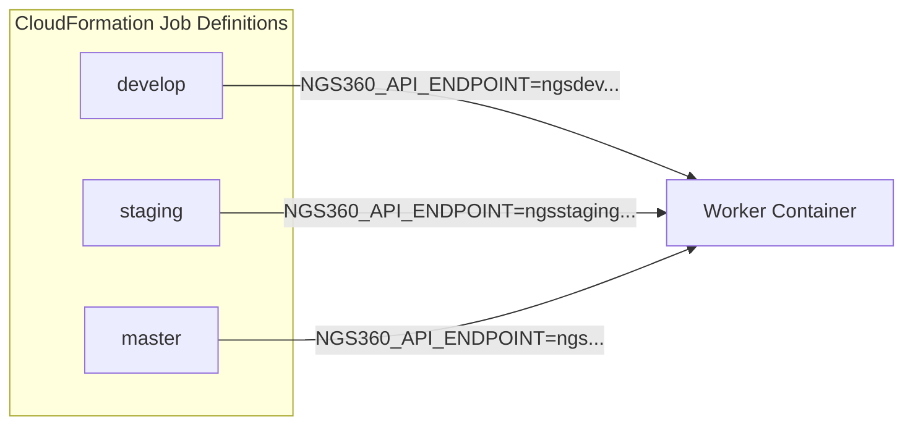
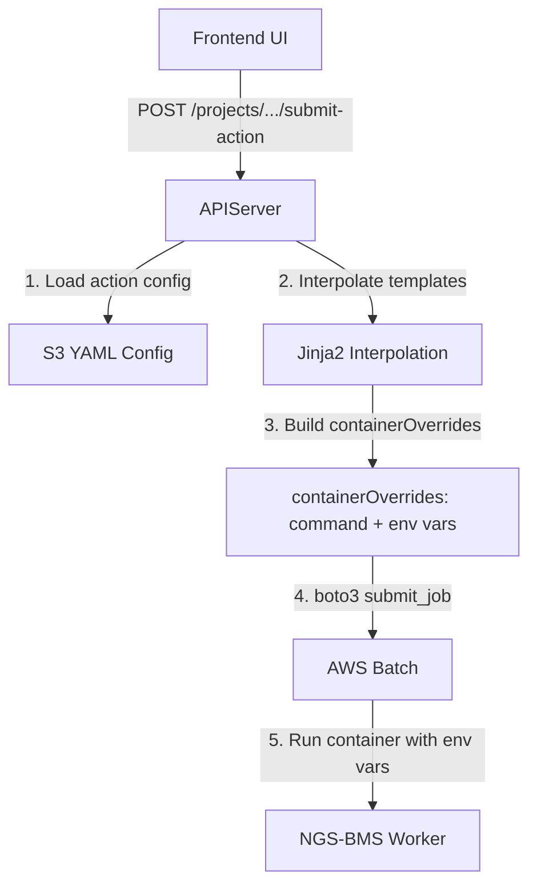
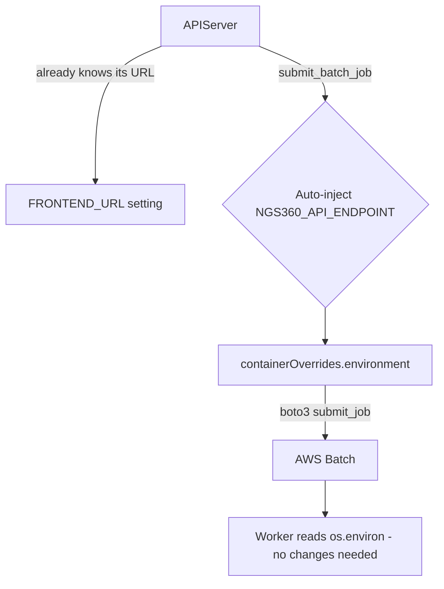
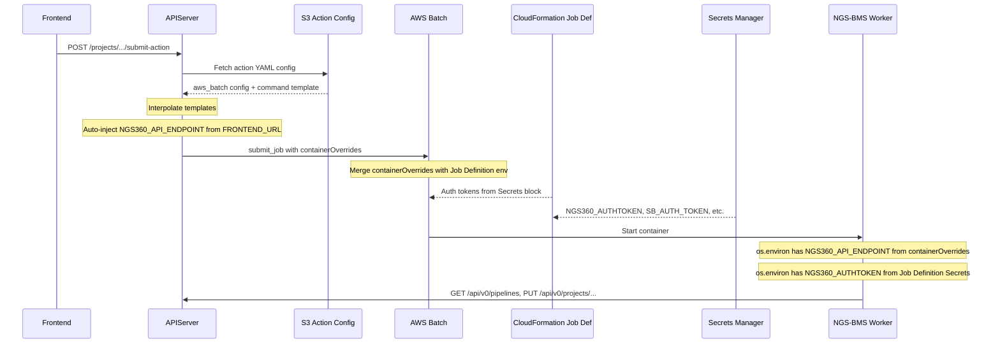

# Plan: Passing API Endpoint to AWS Batch Worker Nodes

## Problem Statement

When the APIServer dispatches long-running jobs to AWS Batch, the worker container (NGS-BMS) needs to know the API endpoint URL so it can:
1. Query for supported project types/pipelines via `NGS360.getPipelines()`
2. POST updates back to projects via `NGS360.putProject()`
3. Search samples via `SamplesDB.get_samples()`

The frontend already knows the API URL via `VITE_API_URL`, and the APIServer knows how to submit batch jobs — but there is currently no mechanism to tell the *worker container* where to find the API.

---

## Current Architecture

### How the Frontend Knows the API URL

The React frontend uses a Vite build-time environment variable set via `.env` or `docker-compose.yml`:

```
VITE_API_URL=http://localhost:3000/
```

Consumed in `frontend-ui/src/hey-api.ts`:
```typescript
const API_URL = import.meta.env.VITE_API_URL
```

### How the Legacy System Passes the API URL to Workers

The CloudFormation template `NGS360-BackEnd.yaml` defines **per-environment AWS Batch Job Definitions**, each with the API URL hardcoded:



Auth tokens are pulled from AWS Secrets Manager via the `Secrets` block in each job definition. **We will leave auth tokens in CloudFormation for now**, since it gives us managed secret handling.

### How Workers Consume the API URL

Multiple CLI classes in NGS-BMS read `NGS360_API_ENDPOINT` from `os.environ` at init time:

| File | Line | Code |
|------|------|------|
| `BMS/SevenBridgesCLI.py` | 60 | `os.environ.get("NGS360_API_ENDPOINT", 'https://ngsstaging.rdcloud.bms.com')` |
| `BMS/ArvadosCLI.py` | 35 | `os.environ.get("NGS360_API_ENDPOINT", 'https://ngsstaging.rdcloud.bms.com')` |
| `BMS/SamplesCLI.py` | 31 | `os.environ.get("NGS360_API_ENDPOINT", 'https://ngsstaging.rdcloud.bms.com')` |

The URL is then threaded through to:
- `NGS360.getPipelines(ngs360_url)` — GET `/api/v0/pipelines`
- `NGS360.putProject(ngs360_url, projectid, data)` — PUT `/api/v0/projects/{id}`
- `SamplesDB.get_samples(url, ...)` — POST `/api/v0/samples/search`
- `NGSProjectFactory.get_project(..., ngs360_url)` — passed through the factory

### How the New APIServer Submits Jobs

The APIServer has a job submission pipeline that loads action configs from S3 YAML files, interpolates template variables, and submits to AWS Batch:



The `submit_batch_job()` function in `api/jobs/services.py` already passes `containerOverrides` to AWS Batch — including an `environment` list. **It just does not inject `NGS360_API_ENDPOINT` yet.**

---

## Solution: Automatic Server-Side Injection

The APIServer will automatically inject `NGS360_API_ENDPOINT` into every batch job's `containerOverrides.environment` at submit time. The server derives the URL from the existing `FRONTEND_URL` setting — which is already configured per-environment in the CloudFormation deployment (`NGS360-APIServer.yaml`).

### Why `FRONTEND_URL` is the right source

The NGINX proxy configuration (`.platform/nginx/conf.d/elasticbeanstalk/00_application.conf`) serves both the React frontend and the FastAPI API from the **same hostname**:
- Frontend: `GET /` → serves static files from `/var/app/current/static`
- API: `GET /api/` → proxies to `http://127.0.0.1:8000`

So the `FRONTEND_URL` (e.g., `https://ngsdev.rdcloud.bms.com`) is also the API's externally-reachable URL. This is already set per-environment in the CloudFormation EB environment properties:

```yaml
# From NGS360-APIServer.yaml, dev environment
- Namespace: aws:elasticbeanstalk:application:environment
  OptionName: FRONTEND_URL
  Value: https://ngsdev.rdcloud.bms.com
```

No new config variable is needed.



### Why This Works

- The APIServer **already has** `FRONTEND_URL` configured per-environment via CloudFormation
- The frontend and API share the **same hostname** (NGINX proxies `/api/` to the backend)
- The APIServer **already has** the infrastructure to inject env vars into batch jobs
- The workers **already read** `NGS360_API_ENDPOINT` from `os.environ`
- The `containerOverrides.environment` in the AWS Batch API **merges with** the job definition's environment — so injected values override or supplement the CloudFormation defaults
- Auth tokens continue to come from the CloudFormation Secrets block — no change needed

---

## Changes By Codebase

### APIServer — 1 change

#### Auto-inject `NGS360_API_ENDPOINT` in `api/jobs/services.py`

In the `submit_batch_job()` function, inject the env var before calling `batch_client.submit_job()`:

```python
# Auto-inject API endpoint for worker containers
settings = get_settings()
auto_env_vars = [
    {"name": "NGS360_API_ENDPOINT", "value": settings.FRONTEND_URL},
]
container_overrides.setdefault("environment", [])

# Only inject if not already explicitly set by the action config
existing_env_names = {e["name"] for e in container_overrides["environment"]}
for env_var in auto_env_vars:
    if env_var["name"] not in existing_env_names:
        container_overrides["environment"].append(env_var)
```

The "don't override if explicitly set" guard ensures that per-action YAML configs can still override the auto-injected value if needed.

No changes needed to `core/config.py`, `.env.example`, or `docker-compose.yml` — `FRONTEND_URL` already has the correct default (`http://localhost:3000`) and is already set in production via CloudFormation EB environment properties.

### NGS-BMS Worker Code — No changes needed

The worker code already reads `NGS360_API_ENDPOINT` from `os.environ` with a fallback default. When the APIServer injects the env var via `containerOverrides`, the workers will pick it up automatically.

**No code changes required.**

### CloudFormation `NGS360-BackEnd.yaml` — No changes needed

AWS Batch **merges** `containerOverrides.environment` (from the APIServer's `submit_job` call) with the job definition's environment (from CloudFormation), with container overrides winning for same-named keys:

| Source | Variable | Behavior |
|--------|----------|----------|
| containerOverrides from APIServer | `NGS360_API_ENDPOINT` | **Wins** — container sees this value |
| Job Definition from CloudFormation | `NGS360_API_ENDPOINT` | **Overridden** — becomes a fallback for non-APIServer job submissions |
| Job Definition Secrets block | `NGS360_AUTHTOKEN`, `SB_AUTH_TOKEN`, etc. | **Preserved** — separate mechanism, not affected by env overrides |
| Job Definition from CloudFormation | `XPRESS_API_URL`, `SB_API_ENDPOINT`, etc. | **Preserved** — not overridden |

This means:
- Jobs submitted by the **new APIServer** → get the auto-injected URL pointing to the new API
- Jobs submitted **directly to AWS Batch** (legacy path, manual testing) → still use the CloudFormation default
- **Auth tokens** from Secrets Manager → continue to work in both paths

### Frontend — No changes needed

The frontend's `VITE_API_URL` is a build-time value for client-side API calls. It has no bearing on batch worker configuration.

### Action Config YAMLs (S3) — No changes needed

The S3-based action configs do not need to include `NGS360_API_ENDPOINT` in their `environment` block since it will be auto-injected. However, any config **can** explicitly set it to override the auto-injected value.

---

## How It All Fits Together



## Implementation Checklist

- [ ] Auto-inject `NGS360_API_ENDPOINT` in `api/jobs/services.py` `submit_batch_job()` using `settings.FRONTEND_URL`
- [ ] Add unit test for auto-injection behavior in `tests/api/test_jobs.py`
- [ ] Add unit test verifying explicit `NGS360_API_ENDPOINT` is not overridden
- [ ] Verify existing tests still pass (containerOverrides should now include the env var)
- [ ] Deploy (no new env vars needed — `FRONTEND_URL` is already set per-environment)
