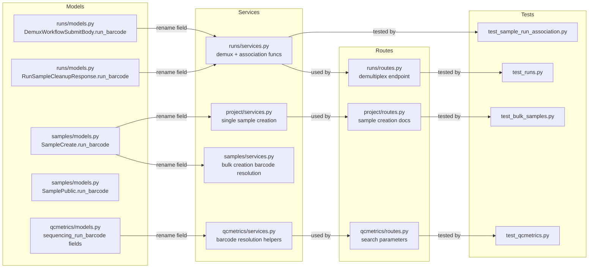

# Barcode → run_id Migration Plan

## Background

The collaborator's branch `bugfix/illumina_run_id` removed the computed `barcode` property from `SequencingRun` entirely and replaced it with a persisted `run_id` field (see alembic migration `1cc1c6be0725`). The `barcode` property and `parse_barcode()` class method no longer exist on the model.

Our branch (`bugfix-handle-new-illumina-run-format`) still references `run_barcode` / `sequencing_run_barcode` / `.barcode` / `parse_barcode()` extensively across routes, services, models, and tests. This plan covers all the changes needed to align with the collaborator's approach — no legacy support, no barcode at all.

## Key Principle

**Every occurrence of `run_barcode` or `sequencing_run_barcode` becomes `run_id`** — the string identifier stored in `SequencingRun.run_id`. The `get_run()` service function already queries by `run_id`, so the lookup logic is correct; only the naming needs to change.

---

## Objective 1: Demultiplex Endpoint (`GET /api/v1/runs/demultiplex/{workflow_id}`)

### Files Changed
- `api/runs/routes.py` (lines 200-219)
- `api/runs/services.py` (lines 562-621)

### Changes

**Route** — `run_barcode` query parameter → `run_id`:
```python
# Before
run_barcode: str = Query(None, description="Run barcode to prepopulate s3_run_folder_path")
# After
run_id: str = Query(None, description="Run ID to prepopulate s3_run_folder_path")
```

Pass `run_id=run_id` instead of `run_barcode=run_barcode` to the service.

**Service** `get_demux_workflow_config()` — rename parameter and internal usage:
- Function signature: `run_barcode: str = None` → `run_id: str = None`
- Docstring references
- Internal call: `get_run(session=session, run_barcode=run_barcode)` → `get_run(session=session, run_id=run_id)`

---

## Objective 2: Test Updates (qcmetrics + bulk samples)

### 2a. `tests/api/test_qcmetrics.py`

**Broken references:**
- `_create_sequencing_run()` helper (line 81-95) uses `sr.barcode` — property no longer exists. Must create the run with an explicit `run_id` and return that.
- All test payloads use `sequencing_run_barcode` key — rename to `sequencing_run_id` (the human-facing name in the new world, but see Objective 3c for the API-side rename).
- All assertions checking `sequencing_run_barcode` in responses must change.

**Missing docstrings** — many tests lack "Test that..." docstrings:
- `test_search_qcrecords_empty` — no "Test that" phrasing
- `test_search_qcrecords_by_project_id` — incomplete
- `test_search_by_workflow_run_id` — has a good one
- `test_search_by_sequencing_run_id` — incomplete
- `test_get_qcrecord_by_id` — could be clearer
- `test_get_qcrecord_not_found` — fine
- `test_delete_qcrecord` — fine
- `test_delete_qcrecord_not_found` — fine
- `test_duplicate_detection` — fine
- `test_create_metric_with_sequencing_run` — fine
- Various Phase 3b tests — many have good ones already

Each test should have a docstring starting with "Test that ..." explaining the expected behavior.

### 2b. `tests/api/test_bulk_samples.py`

**Broken references:**
- `_create_run()` helper (line 30-50) uses `run.barcode` — must use `run.run_id` instead
- All test JSON payloads use `"run_barcode"` key — rename to `"run_id"`
- All assertions checking `run_barcode` in responses — rename to `run_id`
- `_create_second_run()` similarly affected

**Missing docstrings:**
- `test_bulk_create_basic` — has one
- `test_bulk_create_with_run_barcode` — good but name references barcode
- `test_bulk_create_with_attributes` — good
- Other `TestBulkSampleCreation` methods — mostly good
- `TestBulkSampleWithFiles` and `TestSingleSampleWithFiles` — need review

---

## Objective 3: All Other Barcode References

### 3a. `api/runs/services.py` — Sample-Run Association Functions

Functions that accept `run_barcode` parameter:
- `associate_sample_with_run()` (line 728) — rename param + internal usage + error messages
- `get_samples_for_run()` (line 780) — rename param + internal usage + error messages
- `remove_sample_from_run()` (line 810) — rename param + internal usage + error messages
- `clear_samples_for_run()` (line 843) — rename param + internal usage + error messages

All call `get_run(session=session, run_barcode=...)` → `get_run(session=session, run_id=...)`

Note: `get_run()` already takes `run_id` as its parameter name (line 89-105), so these callers are already passing with the wrong kwarg name. This is the core fix.

### 3b. `api/runs/models.py` — Pydantic Models

- `DemuxWorkflowSubmitBody.run_barcode` (line 260) → `run_id`
- `RunSampleCleanupResponse.run_barcode` (line 296) → `run_id`

### 3c. QCMetrics — Models, Services, Routes

**`api/qcmetrics/models.py`:**
- `MetricInput.sequencing_run_barcode` (line 237) → `sequencing_run_id` (or just use the UUID directly since barcode is gone)
- `QCRecordCreate.sequencing_run_barcode` (line 254) → `sequencing_run_id` (accept run_id string)
- `propagate_ids()` validator (lines 279-284) — update key references
- `validate_scope()` validator (lines 288-300) — update field name check
- `QCRecordCreated.sequencing_run_barcode` (line 321) → remove (already has `sequencing_run_id`)
- `MetricPublic.sequencing_run_barcode` (line 321) → remove (already has `sequencing_run_id`)
- `QCRecordPublic.sequencing_run_barcode` (line 333) → remove (already has `sequencing_run_id`)

**Decision:** Since barcode is being removed entirely:
- **Create payloads:** `sequencing_run_barcode` → `sequencing_run_id` accepting a `run_id` **string** (not UUID). The service layer resolves this to a SequencingRun UUID internally.
- **Responses:** Replace `sequencing_run_barcode` with `sequencing_run_id` returning the **string** `run_id` (not UUID). Users don't need the UUID — the string `run_id` is the useful identifier. The internal UUID FK remains in the DB model but is not exposed in public response schemas.

**`api/qcmetrics/services.py`:**
- `_resolve_barcode_to_run()` (line 51) → rename to `_resolve_run_id_to_run()`, change parameter name
- Import alias `from api.runs.services import get_run as get_sequencing_run` (line 44) — call with `run_id=` kwarg
- `create_qcrecord()` (line 83-91) — `qcrecord_create.sequencing_run_barcode` → `qcrecord_create.sequencing_run_id`
- `_resolve_run_barcode()` (line 608) — this resolves UUID→barcode for display; remove entirely since we no longer need barcode strings in responses
- `_to_public_record()` (line 620) — stop resolving/including `sequencing_run_barcode` in output
- Search filter (line 444-448) — `sequencing_run_barcode` → `sequencing_run_id`

**`api/qcmetrics/routes.py`:**
- Search endpoint query parameter `sequencing_run_barcode` → `sequencing_run_id` (line 101-103)
- Filter key mapping (line 142-143)
- Docstrings and examples

### 3d. `api/samples/models.py`

- `SampleCreate.run_barcode` (line 60) → `run_id`
- `SamplePublic.run_barcode` (line 69) → `run_id`
- `BulkSampleItemResponse.run_barcode` (line 134) → `run_id`

### 3e. `api/samples/services.py`

- `create_samples_bulk()` (lines 409-431) — all `item.run_barcode` → `item.run_id`
- Variable name `unique_barcodes` → `unique_run_ids`
- Variable name `barcode_to_run` → `run_id_to_run`
- Variable name `invalid_barcodes` → `invalid_run_ids`
- Error message "Run barcode(s) not found" → "Run ID(s) not found"
- Variable name `run_barcode_echo` → `run_id_echo`

### 3f. `api/project/services.py` and `api/project/routes.py`

**services.py:**
- `create_sample()` (line 697-707) — `sample_in.run_barcode` → `sample_in.run_id`
- Error message "Run with barcode '...' not found." → "Run with ID '...' not found."
- `get_run(session=session, run_barcode=...)` → `get_run(session=session, run_id=...)`

**routes.py:**
- Docstring references to `run_barcode` → `run_id` (lines 227, 244, 264)
- Route code: `run_barcode=sample_in.run_barcode` → `run_id=sample_in.run_id`

### 3g. `tests/api/test_sample_run_association.py`

- `_create_run()` helper — `return run.barcode` → `return run.run_id`
- `_get_run_id()` helper — uses `SequencingRun.parse_barcode()` which no longer exists; rewrite to query by `run_id` directly
- `_create_second_run()` helper — same fix
- `_associate()` helper — uses `parse_barcode()` to decompose; rewrite to query by `run_id`
- All test URL paths use `{barcode}` but routes already use `{run_id}` — these should already work since the route parameter is `run_id`, but the values passed were barcode strings. Now they'll be `run_id` strings.
- Response assertion `data["run_barcode"]` → `data["run_id"]`
- All SequencingRun creations need explicit `run_id` field

### 3h. `tests/api/test_runs.py`

- Demux submit test payloads contain `"run_barcode"` key (lines 1216, 1304, 1348, 1398, 1473, 1542, 1577, 1665) → `"run_id"`

### 3i. `api/qcmetrics/services.py` Import Alias

Line 44: `from api.runs.services import get_run as get_sequencing_run`

All call sites use `get_sequencing_run(session=session, run_barcode=barcode)` → must change kwarg to `run_id=run_id_str`.

---

## Diagram: What Changes Where



## Run Helper Changes in Tests

Every test file that creates a `SequencingRun` does NOT currently pass a `run_id` field. Since the collaborator's migration makes `run_id` a required `NOT NULL` column, all test helpers must provide it explicitly:

```python
# Before — relies on computed .barcode property
run = SequencingRun(
    run_date=date(2024, 3, 15),
    machine_id="M00001",
    run_number="42",
    flowcell_id="HXXXXXXXXX",
)
return run.barcode  # no longer exists

# After — explicit run_id
run = SequencingRun(
    run_id="240315_M00001_0042_HXXXXXXXXX",
    run_date=date(2024, 3, 15),
    machine_id="M00001",
    run_number="42",
    flowcell_id="HXXXXXXXXX",
)
return run.run_id
```

## Risk Areas

1. **QCMetrics API contract change** — `sequencing_run_barcode` is used in both create requests and responses. Dropping it from responses is safe since `sequencing_run_id` UUID is already returned. For create requests, the field name changes from `sequencing_run_barcode` to accepting a `run_id` string.

2. **Bulk samples API contract** — `run_barcode` field in request/response bodies changes to `run_id`. Any external callers must update.

3. **Test helpers using `parse_barcode()`** — This class method no longer exists. All helpers must be rewritten to query by `run_id` directly.
