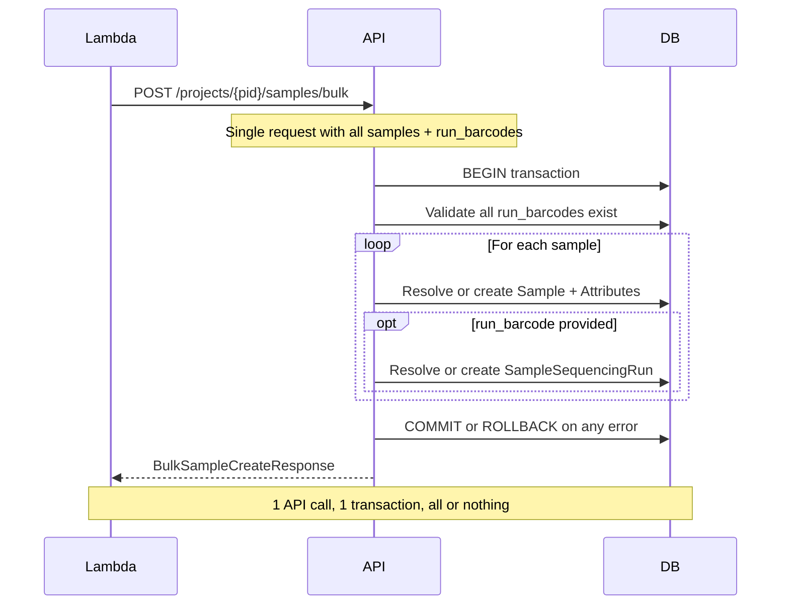
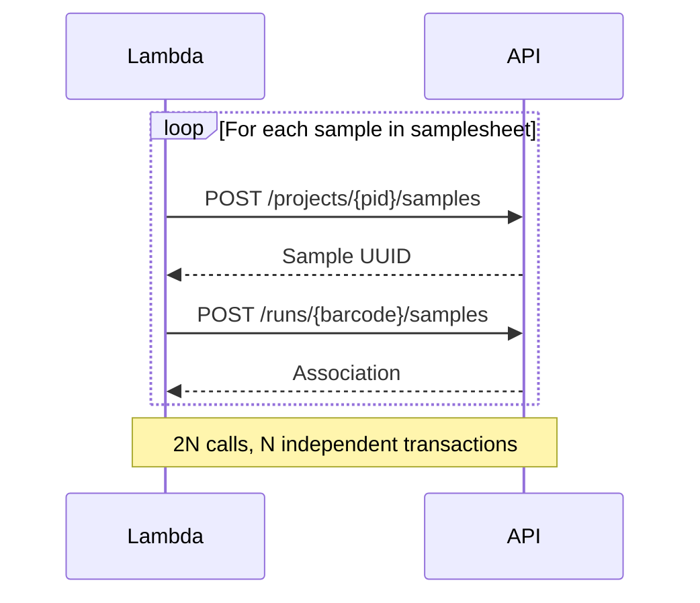
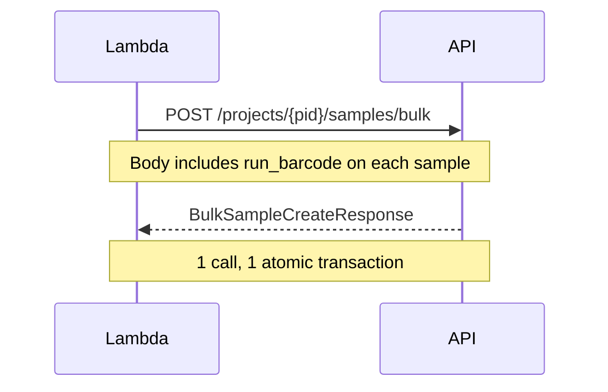

# Bulk Sample Creation with Optional Run Association

## Problem Statement

The Lambda function that processes demultiplexing samplesheets currently requires **two separate API calls per sample**:

1. `POST /projects/{project_id}/samples` — creates the [`Sample`](api/samples/models.py:30) record via [`add_sample_to_project()`](api/project/services.py:565)
2. `POST /runs/{run_barcode}/samples` — creates the [`SampleSequencingRun`](api/runs/models.py:318) junction row via [`associate_sample_with_run()`](api/runs/services.py:702)

This has two issues:

- **No atomicity**: If sample creation succeeds but run association fails, the database is in an inconsistent state. There is no mechanism to roll back partial progress across 2N HTTP calls.
- **Inefficiency**: A NovaSeq run with 384 samples requires ~768 API calls from the Lambda.

## Goals

1. **Allow associating samples with their sequencing run at creation time** — on both the single-sample and bulk endpoints.
2. **Provide a bulk endpoint under `/projects/{project_id}/samples/bulk`** with all-or-nothing transaction semantics.

---

## Change 1: Enrich SampleCreate with Optional Run Barcode

### Current Model

```python
# api/samples/models.py
class SampleCreate(SQLModel):
    sample_id: str
    attributes: list[Attribute] | None = None
    model_config = ConfigDict(extra="forbid")
```

### Proposed Model

```python
class SampleCreate(SQLModel):
    sample_id: str
    attributes: list[Attribute] | None = None
    run_barcode: str | None = None  # NEW: optional sequencing run association
    model_config = ConfigDict(extra="forbid")
```

### Behavior Change

When `run_barcode` is provided on `POST /projects/{project_id}/samples`:

1. The service resolves the barcode to a [`SequencingRun`](api/runs/models.py:25) — returns 404 if not found
2. Creates the [`Sample`](api/samples/models.py:30) and attributes as before
3. Creates a [`SampleSequencingRun`](api/runs/models.py:318) association in the **same transaction**
4. Single `session.commit()` at the end

When `run_barcode` is `None` (the default), behavior is **identical to today** — fully backward compatible.

### Affected Code

[`add_sample_to_project()`](api/project/services.py:565) gains an optional `run_barcode` parameter. The route handler at [`api/project/routes.py:170`](api/project/routes.py:170) passes `sample_in.run_barcode` through.

The route also needs to accept `CurrentUser` for the `created_by` field on [`SampleSequencingRun`](api/runs/models.py:318) — but only when `run_barcode` is provided. The service can default `created_by` to `"api"` or accept it as a parameter from the route.

### Updated SamplePublic Response

```python
class SamplePublic(SQLModel):
    sample_id: str
    project_id: str
    attributes: list[Attribute] | None
    run_barcode: str | None = None  # NEW: included when association was created
```

---

## Change 2: Bulk Endpoint — POST /projects/{project_id}/samples/bulk

### Why Under Projects, Not Runs?

A bulk sample creation endpoint is useful beyond just the samplesheet/demux workflow. Placing it under `/projects/{project_id}/samples/bulk` makes it a **general-purpose bulk sample creation endpoint** that happens to support optional run association. Use cases:

- Lambda samplesheet processing (with `run_barcode`)
- Bulk manifest imports (without `run_barcode`)
- Vendor data ingestion (without `run_barcode`)
- Any programmatic sample registration

### Endpoint

```
POST /projects/{project_id}/samples/bulk
```

**Authentication**: Required (uses `CurrentUser` for `created_by` on any associations).

### Request Model

The request body is simply a list of [`SampleCreate`](api/samples/models.py:45) — the same model used by the single-sample endpoint, now enriched with optional `run_barcode`:

```python
class BulkSampleCreateRequest(SQLModel):
    samples: list[SampleCreate]
```

**Example request — samplesheet scenario** (all samples associated with one run):

```json
{
  "samples": [
    {
      "sample_id": "SampleA",
      "run_barcode": "240315_A00001_0001_BHXXXXXXX",
      "attributes": [
        {"key": "index", "value": "ATCACG"},
        {"key": "index2", "value": "CGATGT"}
      ]
    },
    {
      "sample_id": "SampleB",
      "run_barcode": "240315_A00001_0001_BHXXXXXXX"
    },
    {
      "sample_id": "SampleC",
      "run_barcode": "240315_A00001_0001_BHXXXXXXX"
    }
  ]
}
```

**Example request — bulk import** (no run association):

```json
{
  "samples": [
    {"sample_id": "SampleX"},
    {"sample_id": "SampleY", "attributes": [{"key": "tissue", "value": "blood"}]},
    {"sample_id": "SampleZ"}
  ]
}
```

### Response Model

```python
class BulkSampleItemResponse(SQLModel):
    sample_id: str
    sample_uuid: uuid.UUID
    project_id: str
    created: bool          # True if newly created, False if already existed
    run_barcode: str | None = None  # Echoed back if association was created

class BulkSampleCreateResponse(SQLModel):
    project_id: str
    samples_created: int
    samples_existing: int
    associations_created: int
    associations_existing: int
    items: list[BulkSampleItemResponse]
```

### Service Function: `bulk_create_samples()`

Located in [`api/samples/services.py`](api/samples/services.py) (since it is primarily about samples, not runs).

Operates in a **single database transaction**:

1. **Validate the project** — the project is already validated by the `ProjectDep` dependency in the route, so this is guaranteed.

2. **Pre-validate all run barcodes** — collect unique `run_barcode` values from the request. Resolve each to a [`SequencingRun`](api/runs/models.py:25) in one pass. Return 422 if any barcode is not found, listing the invalid barcodes.

3. **Pre-validate for duplicates** — check for duplicate `sample_id` values within the request. Return 422 if any duplicates found.

4. **For each sample item**:
   a. Look up existing [`Sample`](api/samples/models.py:30) by `(sample_id, project_id)` unique constraint.
   b. If not found, create a new `Sample` row and any [`SampleAttribute`](api/samples/models.py:20) rows. Increment `samples_created`.
   c. If found, reuse the existing sample. Increment `samples_existing`.
   d. If `run_barcode` is set:
      - Check if a [`SampleSequencingRun`](api/runs/models.py:318) already exists for this `(sample.id, run.id)` pair.
      - If not, create the association. Increment `associations_created`.
      - If yes, skip. Increment `associations_existing`.

5. **Commit** — single `session.commit()`. If anything fails, the session context manager rolls back everything.

6. **Index in OpenSearch** — after commit, index newly created samples. Best-effort, outside the DB transaction.

### Flow Diagram



### Idempotency

The endpoint is designed to be **idempotent**:

- Re-submitting the same request produces the same result.
- Existing samples are reused, not duplicated — leverages `UNIQUE(sample_id, project_id)` on [`Sample`](api/samples/models.py:42).
- Existing associations are skipped, not conflicted — leverages `UNIQUE(sample_id, sequencing_run_id)` on [`SampleSequencingRun`](api/runs/models.py:322).
- The response distinguishes newly created vs. already existing resources.

### Error Scenarios

| Scenario | HTTP Status | Behavior |
|----------|-------------|----------|
| Project not found | 404 | Via `ProjectDep`, no changes |
| One or more run_barcodes not found | 422 | No changes, lists invalid barcodes |
| Duplicate sample_id within request | 422 | Fail fast before any DB writes |
| Empty samples list | 422 | Validation error |
| Database constraint violation | 500 | Transaction rolled back, no partial state |

---

## Summary of All Changes

### Models — [`api/samples/models.py`](api/samples/models.py)

| Change | Description |
|--------|-------------|
| Add `run_barcode: str | None = None` to [`SampleCreate`](api/samples/models.py:45) | Optional run association at creation time |
| Add `run_barcode: str | None = None` to [`SamplePublic`](api/samples/models.py:51) | Echo run association in response |
| Add `BulkSampleCreateRequest` | Request model for bulk endpoint |
| Add `BulkSampleItemResponse` | Per-item response in bulk |
| Add `BulkSampleCreateResponse` | Aggregate response for bulk endpoint |

### Services — [`api/samples/services.py`](api/samples/services.py)

| Change | Description |
|--------|-------------|
| Add `bulk_create_samples()` | New service function for bulk creation with optional run association |

### Services — [`api/project/services.py`](api/project/services.py)

| Change | Description |
|--------|-------------|
| Modify [`add_sample_to_project()`](api/project/services.py:565) | Accept optional `run_barcode` + `created_by`; create `SampleSequencingRun` in same transaction when provided |

### Routes — [`api/project/routes.py`](api/project/routes.py)

| Change | Description |
|--------|-------------|
| Modify [`add_sample_to_project`](api/project/routes.py:170) route | Pass `run_barcode` and `CurrentUser` through to service |
| Add `POST /{project_id}/samples/bulk` | New bulk endpoint |

### Tests — [`tests/api/test_samples.py`](tests/api/test_samples.py)

| Test Case | Description |
|-----------|-------------|
| Single sample with `run_barcode` | Verify association is created atomically |
| Single sample with invalid `run_barcode` | Returns 404, no sample created |
| Single sample without `run_barcode` | Backward-compatible, no association |

### Tests — New file or appended to [`tests/api/test_samples.py`](tests/api/test_samples.py)

| Test Case | Description |
|-----------|-------------|
| Bulk: happy path, all new samples | All samples created, all associations created |
| Bulk: idempotent retry | Second submission shows `samples_existing` / `associations_existing` |
| Bulk: with run_barcode | Associations created atomically |
| Bulk: without run_barcode | Pure bulk sample creation, no associations |
| Bulk: mixed - some with run, some without | Both paths work in one request |
| Bulk: invalid run_barcode | Returns 422, no samples created |
| Bulk: empty samples list | Returns 422 |
| Bulk: duplicate sample_id in request | Returns 422 |
| Bulk: partial pre-existing samples | Some reused, others created |
| Bulk: sample attributes | Attributes created for new samples |
| Bulk: re-demux flow | Clear + bulk creates correct new state |

---

## Backward Compatibility

| Concern | Status |
|---------|--------|
| `POST /projects/{pid}/samples` without `run_barcode` | **Unchanged behavior** — field defaults to `None` |
| `POST /runs/{barcode}/samples` single association endpoint | **Unchanged** — still useful for associating pre-existing samples |
| `DELETE /runs/{barcode}/samples` cleanup endpoint | **Unchanged** — still used for re-demux cleanup |
| Existing Lambda code | **Works until updated** — can continue using the two-step flow |
| New Lambda code | **Simplified** — single `POST /projects/{pid}/samples/bulk` call |

---

## Lambda Workflow: Before and After

### Before (2N API calls)



### After (1 API call)



---

## Open Considerations

1. **Max batch size**: Should we enforce a limit? Typical samplesheets have at most ~384 samples. We can add a max limit later if needed (e.g., 1000).

2. **Attribute upsert on existing samples**: When a sample already exists, should we update its attributes from the new request? Current design says no — reuse as-is. Updates can be done via `PUT /projects/{pid}/samples/{sid}`.

3. **Multi-project samplesheets**: A single samplesheet may have samples from multiple projects. The Lambda would need to group samples by project and make one bulk call per project. Alternatively, we could later add a cross-project bulk endpoint, but per-project is cleaner for now since the project_id is in the URL path.

4. **Lambda code changes**: Outside the scope of this API change but should be coordinated. The Lambda needs to switch from the two-step per-sample flow to a single bulk call.
