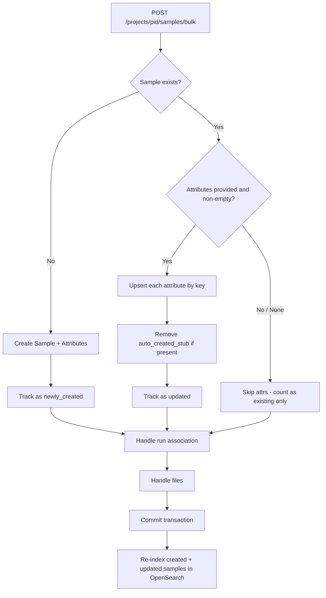

# Plan: Bulk Samples Endpoint – Upsert Metadata on Existing Samples

## Problem

When a user submits a manifest to `POST /projects/{project_id}/samples/bulk` and the samples **already exist** (e.g., files were previously copied and the manifest was already processed once), the current implementation **silently skips attribute/metadata updates**. The user expects that resubmitting a manifest with changed sample metadata would update those attributes.

### Root Cause

In [`bulk_create_samples()`](api/samples/services.py:463), when an existing sample is found (lines 474–476), the code simply does:

```python
if existing:
    sample = existing
    samples_existing += 1
```

It never examines `item.attributes` for existing samples. Attributes are only written for **newly created** samples (lines 486–493). The same applies to OpenSearch re-indexing — only newly created samples are indexed post-commit (lines 548–556).

### Manifest Flow

The manifest validator lambda ([`api_client.py`](../NGS360-manifest-validator-lambda/src/manifest_validator/api_client.py:93)) transforms manifest rows into the bulk payload. Each sample gets:
- `sample_id` – derived from VENDORNAME + VRUNID
- `attributes` – all non-file manifest columns (BMSPROJECTID, STUDYID, ASSAYMETHOD, etc.)
- `files` – URI, md5 hash, mate tags

So when a user resubmits a manifest with corrected metadata (e.g., changed STUDYID, ASSAYMETHOD), those attributes arrive in the payload but are discarded for existing samples.

## Design Decision: Merge/PATCH Semantics

The bulk endpoint has **two callers with different intent**:

| Caller | Attributes Sent | Intent |
|--------|----------------|--------|
| Manifest lambda - vendor ingest | Full set from DTS12.1 - BMSPROJECTID, STUDYID, ASSAYMETHOD, etc. | Update all metadata |
| Demux worker | Just `source_uri` + `run_barcode`/`run_id` | Additive enrichment |

A sample is either created by manifest OR by demultiplexing, never both. With **merge/upsert** semantics:
- **Manifest resubmit**: sends the full DTS12.1 column set, so merge effectively replaces all manifest keys.
- **Demux re-run**: sends `source_uri` → added without destroying existing manifest metadata.

We chose merge over replace because the **cost of destructive action is greater than the risk of stale data** (which is ~0 since the DTS12.1 column set is stable).

## Existing Patterns

The codebase already has merge/upsert-by-key logic:

1. **[`patch_project()`](api/project/services.py:354)** – iterates supplied attributes, checks for existing `ProjectAttribute` by key, updates value if found or inserts new.
2. **[`update_sample_in_project()`](api/project/services.py:894)** – single-attribute upsert on a single sample via `PUT /projects/{pid}/samples/{sid}`.

The [`SampleAttribute`](api/samples/models.py:20) table has a `UniqueConstraint("sample_id", "key")`, so upsert-by-key is the correct approach.

## Proposed Changes

### 1. Add Attribute Merge/Upsert in `bulk_create_samples()` – [`api/samples/services.py`](api/samples/services.py:463)

When the sample already exists and `item.attributes` is provided (non-None, non-empty), upsert each attribute by key:

```
if existing and item.attributes:
    for attr in item.attributes:
        existing_attr = query SampleAttribute where sample_id=sample.id AND key=attr.key
        if existing_attr:
            if existing_attr.value != attr.value:
                existing_attr.value = attr.value
        else:
            session.add(SampleAttribute(sample_id=sample.id, key=attr.key, value=attr.value))
    # Track as updated
```

When `item.attributes` is `None` or empty, existing attributes are untouched — supporting callers that only submit files or run associations.

This follows the same merge semantics as [`patch_project()`](api/project/services.py:372).

### 2. Add `samples_updated` Counter to Response Models – [`api/samples/models.py`](api/samples/models.py:128)

Add a `samples_updated` field to:
- [`BulkSampleCreateResponse`](api/samples/models.py:139) – aggregate count
- [`BulkSampleItemResponse`](api/samples/models.py:128) – per-item boolean `updated`

This lets the caller distinguish between "existing and untouched" vs. "existing and metadata was updated".

### 3. Re-index Updated Samples in OpenSearch – [`api/samples/services.py`](api/samples/services.py:548)

Currently only `newly_created_samples` are indexed. Maintain a second list `updated_samples` and index those post-commit as well. This ensures search reflects the latest metadata.

### 4. Handle `auto_created_stub` Tag

When a sample was auto-created as a stub by [`resolve_or_create_sample()`](api/samples/services.py:26), it has `auto_created_stub=true`. With merge semantics, the manifest submission will add real attributes alongside it. We should explicitly remove the `auto_created_stub` tag when real attributes arrive — add a check: if the sample has an `auto_created_stub` attribute and new attributes are being upserted, delete the stub tag.

## Flow Diagram



## Files to Modify

| File | Change |
|------|--------|
| [`api/samples/services.py`](api/samples/services.py) | Add attribute upsert logic in `bulk_create_samples()` for existing samples; track updated samples for OpenSearch re-indexing |
| [`api/samples/models.py`](api/samples/models.py) | Add `samples_updated` to `BulkSampleCreateResponse`; add `updated` bool to `BulkSampleItemResponse` |
| [`tests/api/test_bulk_samples.py`](tests/api/test_bulk_samples.py) | Add tests for metadata upsert scenarios |

## Tests to Add

1. **test_bulk_upsert_attributes_on_existing_sample** – Create samples with attrs {Tissue: Liver, Condition: Healthy}, then resubmit with {Tissue: Heart, Stage: III}. Verify DB has {Tissue: Heart, Condition: Healthy, Stage: III} — Tissue updated, Condition preserved, Stage added. Verify `samples_updated > 0`.
2. **test_bulk_no_attributes_field_preserves_existing** – Existing sample has attributes; resubmit without `attributes` key (None). Verify existing attributes are untouched and `samples_updated == 0`.
3. **test_bulk_empty_attributes_list_preserves_existing** – Existing sample has attributes; resubmit with `attributes: []`. Verify existing attributes are untouched (empty list = no-op, same as None).
4. **test_bulk_mixed_new_and_existing_with_attributes** – Batch contains both new and existing samples with attributes. Verify correct `samples_created`, `samples_updated`, and `samples_existing` counts.
5. **test_bulk_removes_auto_created_stub_tag** – Stub sample created by `resolve_or_create_sample()` has `auto_created_stub=true`; resubmit via bulk with real manifest attributes. Verify `auto_created_stub` tag is removed.
6. **test_bulk_idempotent_resubmission_same_attributes** – Resubmit identical payload (same attributes, same values). Verify `samples_updated == 0` since no values actually changed.
7. **test_bulk_demux_adds_source_uri_preserves_manifest_attrs** – Create sample via manifest-like payload with full attribute set. Then resubmit with just `source_uri` attribute (demux scenario). Verify all original manifest attrs still present plus new `source_uri`.

## Backward Compatibility

- The new `samples_updated` field defaults to `0` and `updated` defaults to `False`, so existing callers that don't inspect these fields are unaffected.
- **When `attributes` is not provided or empty**: existing attributes are preserved. The demux worker and other callers that don't submit attributes see zero behavior change.
- **When `attributes` is provided with values**: each key is upserted (merge semantics). Existing keys not in the request are preserved. This is the key change — previously attributes were silently ignored for existing samples.
- Files and run associations continue to work exactly as before.
