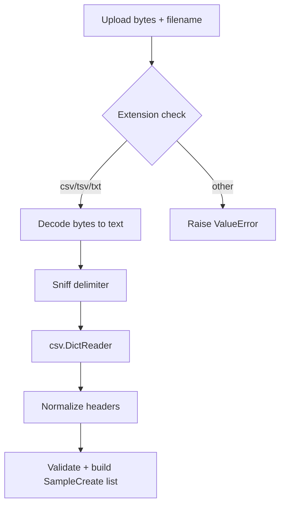
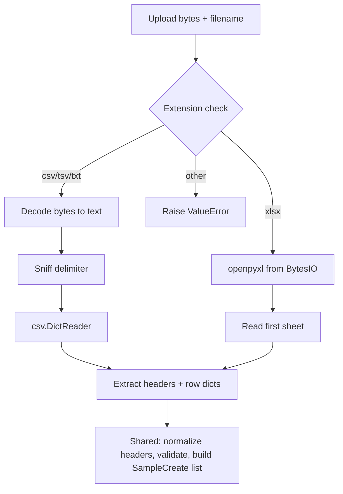

# Excel File Parsing Support for Sample Upload

## Status: Future — Not yet scheduled

## Context

The sample file parsing module ([`api/samples/parsing.py`](../api/samples/parsing.py)) currently supports CSV, TSV, and TXT files via the stdlib `csv` module. Users occasionally export sample manifests from Excel, requiring a manual save-as-CSV step before upload. Adding native `.xlsx` support would remove that friction.

This is **deferred** because it introduces an external dependency (`openpyxl`) that is not currently in the project.

## Current Architecture



## Proposed Architecture



## Dependency

- **`openpyxl`** — pure Python, well-maintained, no C extensions. Add to [`requirements.txt`](../requirements.txt).
- Legacy `.xls` support would require a second dependency (`xlrd`) — not recommended unless there is a concrete user need.

## Implementation Steps

### 1. Add `xlsx` to `ALLOWED_EXTENSIONS`

In [`api/samples/parsing.py`](../api/samples/parsing.py), change:

```python
ALLOWED_EXTENSIONS = {"csv", "tsv", "txt"}
```

to:

```python
ALLOWED_EXTENSIONS = {"csv", "tsv", "txt", "xlsx"}
```

### 2. Extract shared row-processing helper

Extract lines 107–168 of [`parsing.py`](../api/samples/parsing.py) into a helper function:

```python
def _build_samples(
    original_headers: list[str],
    rows: Iterable[dict[str, str]],
) -> list[SampleCreate]:
```

This function handles:
- Building the `normalized_map`
- Validating the `samplename` column exists
- Iterating rows, checking for empty/duplicate sample names
- Building `Attribute` lists, skipping empty cells
- Returning the final `list[SampleCreate]`

Both the CSV and Excel code paths will call this shared helper.

### 3. Add the Excel branch

After the extension check and before the text-decode step, branch on extension:

```python
if ext == "xlsx":
    import openpyxl
    wb = openpyxl.load_workbook(io.BytesIO(file_content), read_only=True, data_only=True)
    ws = wb.active
    row_iter = ws.iter_rows(values_only=True)
    headers = [str(c) if c is not None else "" for c in next(row_iter)]
    rows = [
        {h: (str(v).strip() if v is not None else "") for h, v in zip(headers, row)}
        for row in row_iter
    ]
    wb.close()
    return _build_samples(headers, rows)
```

Key decisions:
- **First sheet only** (`wb.active`) — matches user expectation for simple manifests.
- **`data_only=True`** — returns computed values, not formulas.
- **`read_only=True`** — memory-efficient for large files.
- **All cell values coerced to `str`** — Excel cells are typed; ints, floats, and dates all become strings to match the existing CSV behavior.

### 4. Add tests

Create test cases in [`tests/api/test_sample_file_parsing.py`](../tests/api/test_sample_file_parsing.py):

- **Happy path**: Generate a `.xlsx` in-memory with `openpyxl`, parse it, verify `SampleCreate` output matches equivalent CSV test.
- **Single-column `.xlsx`**: Only `SampleName`, no attributes.
- **Empty cells**: Verify sparse attribute handling.
- **Missing samplename column**: Verify `ValueError`.
- **Empty workbook**: Verify `ValueError`.
- **Typed cells**: Verify that numeric and date cells are converted to strings.

Fixture files can be generated in-memory during tests using `openpyxl.Workbook()` — no static fixture files needed.

### 5. Update `requirements.txt`

Add:

```
openpyxl>=3.1,<4
```

## What Does Not Change

- [`SampleCreate`](../api/samples/models.py) and [`Attribute`](../api/samples/models.py) models
- Route layer ([`api/samples/routes.py`](../api/samples/routes.py))
- Service layer ([`api/samples/services.py`](../api/samples/services.py))
- All existing CSV/TSV tests — the refactor extracts but does not alter their logic

## Risks and Edge Cases

| Concern | Mitigation |
|---|---|
| Multi-sheet workbooks | Read only `wb.active`; document that only the first sheet is used |
| Formulas | `data_only=True` returns cached computed values |
| Merged cells | `openpyxl` returns `None` for non-anchor cells in a merge; these become empty strings and are skipped |
| Very large Excel files | `read_only=True` streams rows without loading entire workbook into memory |
| Password-protected files | `openpyxl` raises an exception; catch and re-raise as `ValueError` with a clear message |
