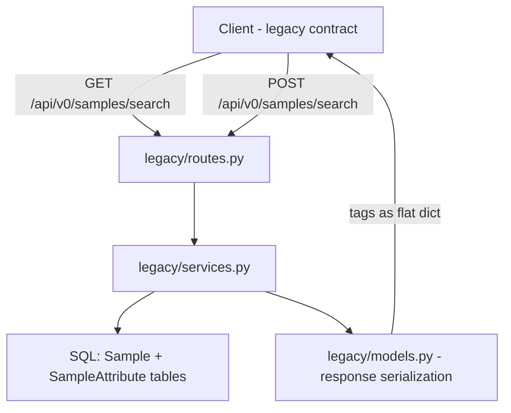

# Legacy `/api/v0/samples/search` Compatibility Endpoints

## Problem

Client applications still depend on the legacy Flask app's sample search endpoints and response format. The legacy endpoints at `GET /samples/search` and `POST /samples/search` accept different inputs and return a different response shape than the current `GET /api/v1/projects/{project_id}/samples` endpoint.

Additionally, the current `Sample` model is missing standard audit timestamps (`created_at`, `updated_at`) that every other entity in the system has. One legacy client queries samples by creation date (`?created_on=2026-01-21`), which requires `created_at` to exist as a first-class column. Since we no longer store sample versions, `updated_at` is needed to track when a sample was last modified.

---

## Phase 1: Add Timestamp Columns to Sample Model

### Why

The `sample` table is the only entity missing timestamps:

| Entity | Has `created_at` | Has `updated_at` |
|--------|:-:|:-:|
| Pipeline | ✓ | — |
| Workflow | ✓ | — |
| WorkflowRun | ✓ | — |
| File | ✓ | — |
| QCRecord | ✓ | — |
| Setting | ✓ | ✓ |
| User | ✓ | ✓ |
| **Sample** | **✗** | **✗** |

> **Decision**: No `created_by` or `updated_by` fields — most clients use agent keys so the user context is not meaningful.

### Schema Change

Add two nullable columns to `sample`:

```sql
ALTER TABLE sample ADD COLUMN created_at TIMESTAMP;
ALTER TABLE sample ADD COLUMN updated_at TIMESTAMP;
```

Nullable because existing rows have no value. Legacy samples may have `CREATED_ON` as a `SampleAttribute` row that can be backfilled.

### Model Change — `api/samples/models.py`

```python
class Sample(SQLModel, table=True):
    id: uuid.UUID | None = Field(default_factory=uuid.uuid4, primary_key=True)
    sample_id: str
    project_id: str = Field(foreign_key="project.project_id")
    created_at: datetime | None = Field(default=None)   # NEW
    updated_at: datetime | None = Field(default=None)    # NEW
    attributes: ...
```

### Service Changes

| Service | Change |
|---------|--------|
| `api/project/services.py` — `add_sample_to_project()` | Set `created_at=datetime.now(UTC)` on new sample |
| `api/samples/services.py` — `bulk_create_samples()` | Set `created_at=datetime.now(UTC)` on each new sample |
| `api/samples/services.py` — `resolve_or_create_sample()` | Set `created_at=datetime.now(UTC)` on stub samples |
| `api/project/services.py` — `update_sample_in_project()` | Set `updated_at=datetime.now(UTC)` before commit |

### Migration

New Alembic migration: `add_sample_timestamps.py`

```python
def upgrade():
    op.add_column("sample", sa.Column("created_at", sa.DateTime(), nullable=True))
    op.add_column("sample", sa.Column("updated_at", sa.DateTime(), nullable=True))

def downgrade():
    op.drop_column("sample", "updated_at")
    op.drop_column("sample", "created_at")
```

### Backfill Strategy

For existing samples with `CREATED_ON` as a `SampleAttribute`:

```sql
UPDATE sample s
SET created_at = (
    SELECT CAST(sa.value AS TIMESTAMP)
    FROM sampleattribute sa
    WHERE sa.sample_id = s.id AND UPPER(sa.key) = 'CREATED_ON'
);
```

This can be included in the migration or run separately. Safe because columns are nullable.

---

## Phase 2: Legacy Compatibility Endpoints

### Schema Mapping

| Legacy Field | Current Source | Notes |
|---|---|---|
| `samplename` | `Sample.sample_id` | Top-level column → mapped in response |
| `projectid` | `Sample.project_id` | Top-level column → mapped in response |
| `tags` | `SampleAttribute` rows | Flattened: `[{key,value}]` → `{key: value}` |
| `created_on` | `Sample.created_at` *(Phase 1)* | First-class column after migration |
| `created_by` | `SampleAttribute(key=CREATED_BY)` | Only for legacy migrated data, in tags dict |
| `assay_method` | `SampleAttribute(key=ASSAY_METHOD)` | In tags dict |
| `source_uri` | `SampleAttribute(key=SOURCE_URI)` | In tags dict |
| `runid` | `SampleSequencingRun` join | Available via join |
| `uuid` | `Sample.id` | Internal UUID |

> **Note on legacy vs. new samples**: Migrated legacy samples have fields like
> `ASSAY_METHOD`, `CREATED_BY`, `CREATED_ON`, `SOURCE_URI` stored as `SampleAttribute`
> rows with uppercased keys. These naturally appear in the `tags` dict. New samples
> will have `created_at` as a column and only whatever attributes the caller explicitly provided.

### Response Shape Differences

**Current** `GET /api/v1/projects/{project_id}/samples`:
```json
{
  "data": [
    {
      "sample_id": "Sample_1",
      "project_id": "P-0001",
      "attributes": [
        {"key": "Tissue", "value": "Liver"},
        {"key": "USUBJID", "value": "CA123012-01-234"}
      ]
    }
  ],
  "total_items": 1,
  "total_pages": 1,
  "current_page": 1,
  "per_page": 20,
  "has_next": false,
  "has_prev": false
}
```

**Legacy** `GET /api/v0/samples/search`:
```json
{
  "total": 1,
  "hits": [
    {
      "samplename": "Sample_1",
      "projectid": "P-0001",
      "tags": {
        "Tissue": "Liver",
        "USUBJID": "CA123012-01-234"
      }
    }
  ]
}
```

**Legacy** `POST /api/v0/samples/search`:
```json
{
  "total": 1,
  "page": 1,
  "per_page": 100,
  "hits": [
    {
      "samplename": "Sample_1",
      "projectid": "P-0001",
      "tags": {
        "Tissue": "Liver",
        "USUBJID": "CA123012-01-234"
      }
    }
  ]
}
```

### Endpoint Contracts

#### `GET /api/v0/samples/search`

Accepts query-string parameters for field matching:

```
GET /api/v0/samples/search?projectid=P-1234&samplename=Sample_1
```

**Supported query params** — all optional, combined as AND:
- `projectid` → filters `Sample.project_id`
- `samplename` → filters `Sample.sample_id`
- `created_on` → filters `Sample.created_at` by date prefix match

Any unrecognized query param is treated as an attribute/tag key and matched against `SampleAttribute` rows. **Key matching is case-insensitive** so `?assay_method=RNA-Seq` matches `ASSAY_METHOD`.

**Response**: `{"total": N, "hits": [...]}`

No pagination — returns all matching results matching legacy `search.scan()` behavior.

#### `POST /api/v0/samples/search`

Accepts JSON body:

```json
{
  "filter_on": {
    "projectid": "P-1234",
    "samplename": "Sample_1",
    "tags": {
      "USUBJID": "CA123012-01-234"
    }
  },
  "page": 1,
  "per_page": 100
}
```

**`filter_on` handling:**
- `projectid` — str or list → `Sample.project_id`
- `samplename` — str or list → `Sample.sample_id`
- `created_on` — str → date prefix match on `Sample.created_at`
- `tags` — dict → joins `SampleAttribute` rows with AND matching on key/value (case-insensitive keys)
- String values: exact match
- List values: OR match — any of the listed values

**Response**: `{"total": N, "page": P, "per_page": PP, "hits": [...]}`

### Architecture



### New Files

| File | Purpose |
|------|---------|
| `api/legacy/__init__.py` | Module init |
| `api/legacy/models.py` | Pydantic request/response models for legacy format |
| `api/legacy/services.py` | Query logic translating legacy params to SQL queries |
| `api/legacy/routes.py` | GET and POST `/samples/search` endpoints |
| `tests/api/test_legacy_samples_search.py` | Test coverage for both endpoints |
| `alembic/versions/xxxx_add_sample_timestamps.py` | Migration for `created_at`/`updated_at` |

### Modified Files

| File | Change |
|------|--------|
| `api/samples/models.py` | Add `created_at`, `updated_at` columns to `Sample` |
| `api/project/services.py` | Set `created_at` in `add_sample_to_project()`; set `updated_at` in `update_sample_in_project()` |
| `api/samples/services.py` | Set `created_at` in `bulk_create_samples()` and `resolve_or_create_sample()` |
| `main.py` | Register `legacy_router` under `/api/v0` prefix |

### No Route Conflicts

- Current `POST /api/v1/samples/search` is the reindex endpoint — lives under `/api/v1` prefix
- Legacy endpoints register under `/api/v0` prefix — no collision

### Implementation Details

#### `api/legacy/models.py`

```python
class LegacySampleHit(SQLModel):
    samplename: str
    projectid: str
    tags: dict[str, str] | None = None

class LegacySampleSearchResponse(SQLModel):
    total: int
    hits: list[LegacySampleHit]

class LegacySampleSearchPaginatedResponse(SQLModel):
    total: int
    page: int
    per_page: int
    hits: list[LegacySampleHit]

class LegacySampleSearchRequest(SQLModel):
    filter_on: dict      # flexible dict matching legacy format
    page: int = 1
    per_page: int = 100
```

#### `api/legacy/services.py`

Core query builder logic:

1. Map known top-level fields: `projectid` → `Sample.project_id`, `samplename` → `Sample.sample_id`, `created_on` → `Sample.created_at` date prefix
2. For `tags` dict entries or unknown query params, join `SampleAttribute` and add WHERE clauses — key matching is **case-insensitive** via `func.upper()`
3. Support str values as exact match, list values as IN/OR
4. Convert result rows to legacy format: `sample.attributes` list → flat `tags` dict, `sample_id` → `samplename`, `project_id` → `projectid`

#### `api/legacy/routes.py`

Two endpoints on a router with `prefix="/samples"`:
- `GET /search` — reads `request.query_params`, calls service, returns unpaginated response
- `POST /search` — reads JSON body, calls service, returns paginated response

#### `main.py` Registration

```python
from api.legacy.routes import router as legacy_router
app.include_router(legacy_router, prefix="/api/v0")
```

### Test Plan

| Test Case | Endpoint | Description |
|-----------|----------|-------------|
| Search by projectid | GET | `?projectid=P-0001` returns matching samples |
| Search by samplename | GET | `?samplename=Sample_1` returns matching sample |
| Combined search | GET | `?projectid=P-0001&samplename=Sample_1` returns intersection |
| Search by tag as query param | GET | `?Tissue=Liver` searches attributes case-insensitively |
| Search by created_on | GET | `?created_on=2026-01-21` matches date prefix |
| Empty results | GET | Non-matching query returns `{"total": 0, "hits": []}` |
| POST basic filter | POST | `filter_on: {projectid: ...}` works |
| POST tag filter | POST | `filter_on: {tags: {USUBJID: ...}}` works |
| POST combined filter | POST | projectid + tags combined |
| POST list values - OR | POST | `filter_on: {projectid: [P-1, P-2]}` matches either |
| POST pagination | POST | page/per_page respected, total is full count |
| Response shape | Both | Verify `tags` is flat dict, fields are `samplename`/`projectid` |
| Case-insensitive keys | Both | `?assay_method=X` matches `ASSAY_METHOD` attribute |
| No body POST | POST | Returns 422 or 400 |
| Timestamps on create | v1 | `created_at` populated on new samples |
| Timestamps on update | v1 | `updated_at` set when attribute modified |
