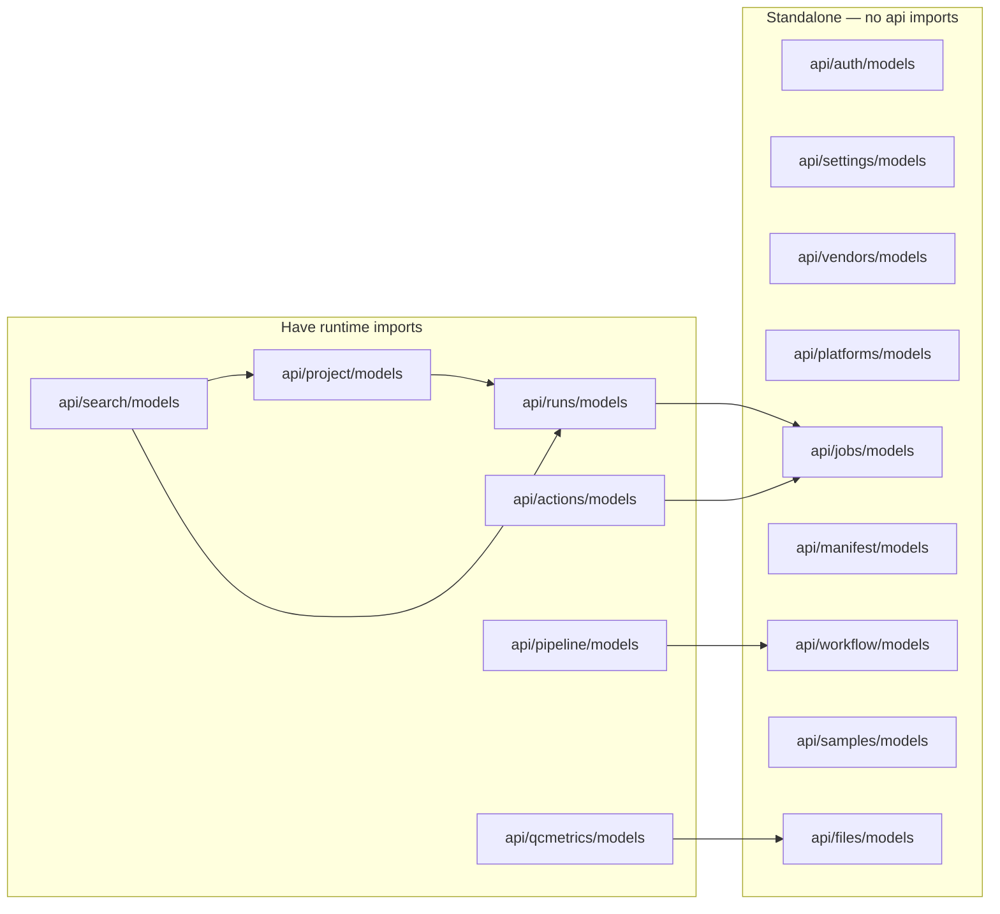
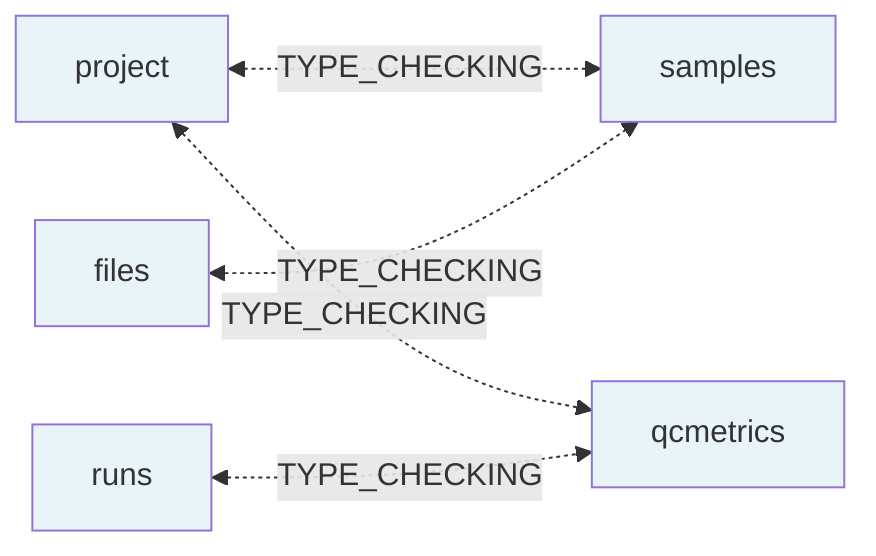

# Model Layer — Circular Dependency Analysis (Complete)

**Date**: 2026-04-24  
**Scope**: All 15 model modules in the project  
**Verdict**: ✅ **No circular dependencies exist anywhere in the model layer.**

All bidirectional ORM relationships are correctly handled using the `if TYPE_CHECKING:` guard pattern, which is the standard approach for SQLModel/SQLAlchemy.

## All Model Modules — Classification

### Fully Standalone (no imports from other `api/` modules)

| Module | Notes |
|--------|-------|
| `api/auth/models.py` | User, tokens, OAuth — no relationships to other domain models |
| `api/settings/models.py` | Key-value settings — standalone |
| `api/vendors/models.py` | Vendor config — standalone |
| `api/platforms/models.py` | Single-column Platform table — standalone |
| `api/jobs/models.py` | BatchJob, AwsBatchConfig — standalone |
| `api/manifest/models.py` | Pydantic-only response models — standalone |
| `api/workflow/models.py` | Workflow, WorkflowRegistration, WorkflowRun — standalone |

### Runtime Imports from Other `api/` Modules

| Module | Imports at runtime | What it uses |
|--------|-------------------|--------------|
| `api/pipeline/models.py` | `api.workflow.models` | `Attribute` schema class |
| `api/runs/models.py` | `api.jobs.models` | `AwsBatchConfig` for `DemuxWorkflowConfig` |
| `api/actions/models.py` | `api.jobs.models` | `AwsBatchConfig` for `ActionConfig` |
| `api/project/models.py` | `api.runs.models` | `SequencingRunPublic` for `ProjectPublic` response |
| `api/qcmetrics/models.py` | `api.files.models` | `FileCreate`, `FileSummary` for output_files |
| `api/search/models.py` | `api.project.models`, `api.runs.models` | `ProjectPublic`, `SequencingRunPublic` for search responses |
| `api/samples/models.py` | *(none)* | — |
| `api/files/models.py` | *(none)* | — |

## Runtime Import Graph



**All arrows are unidirectional. No cycles exist.**

The longest chain is: `search` → `project` → `runs` → `jobs` (depth 3).

## TYPE_CHECKING Import Graph

These imports are inside `if TYPE_CHECKING:` blocks — they are **never executed at runtime**. They exist solely for IDE/type-checker support and for SQLModel/SQLAlchemy's string-based `Relationship()` resolution.



### All Bidirectional ORM Pairs — Verified Correct

| Pair | Side A | Side B | Status |
|------|--------|--------|--------|
| `project ↔ samples` | `project/models.py:11` imports `Sample` | `samples/models.py:11` imports `Project` | ✅ Both guarded |
| `project ↔ qcmetrics` | `project/models.py:12` imports `QCRecord` | `qcmetrics/models.py:20` imports `Project` | ✅ Both guarded |
| `runs ↔ qcmetrics` | `runs/models.py:14` imports `QCRecord` | `qcmetrics/models.py:21` imports `SequencingRun` | ✅ Both guarded |
| `files ↔ samples` | `files/models.py:27` imports `Sample` | `samples/models.py:12` imports `FileSample` | ✅ Both guarded |

### Modules with NO `TYPE_CHECKING` imports

These 11 modules have no deferred imports at all:

- `api/auth/models.py`
- `api/settings/models.py`
- `api/vendors/models.py`
- `api/platforms/models.py`
- `api/jobs/models.py`
- `api/manifest/models.py`
- `api/workflow/models.py`
- `api/pipeline/models.py`
- `api/actions/models.py`
- `api/search/models.py`

## Combined Dependency Matrix

Rows import from columns. **R** = runtime, **T** = TYPE_CHECKING only.

| Module ↓ imports → | auth | settings | vendors | platforms | jobs | manifest | workflow | pipeline | runs | project | samples | files | qcmetrics | search | actions |
|---|---|---|---|---|---|---|---|---|---|---|---|---|---|---|---|
| **auth** | | | | | | | | | | | | | | | |
| **settings** | | | | | | | | | | | | | | | |
| **vendors** | | | | | | | | | | | | | | | |
| **platforms** | | | | | | | | | | | | | | | |
| **jobs** | | | | | | | | | | | | | | | |
| **manifest** | | | | | | | | | | | | | | | |
| **workflow** | | | | | | | | | | | | | | | |
| **pipeline** | | | | | | | R | | | | | | | | |
| **runs** | | | | | R | | | | | | | | T | | |
| **actions** | | | | | R | | | | | | | | | | |
| **project** | | | | | | | | | R | | T | | T | | |
| **samples** | | | | | | | | | | T | | T | | | |
| **files** | | | | | | | | | | | T | | | | |
| **qcmetrics** | | | | | | | | | T | | | R | | | |
| **search** | | | | | | | | | R | R | | | | | |

**Key observation**: Every cell marked **T** has a corresponding **T** in the transposed position (bidirectional TYPE_CHECKING). No cell marked **R** has an **R** in the transposed position (no runtime cycles).

## How TYPE_CHECKING Guards Work

```python
# In api/project/models.py
from typing import TYPE_CHECKING

if TYPE_CHECKING:
    from api.samples.models import Sample   # Only for type checkers and IDE
    from api.qcmetrics.models import QCRecord

class Project(SQLModel, table=True):
    # SQLModel resolves "Sample" as a string at ORM init time,
    # not at import time — so no circular import occurs.
    samples: List["Sample"] = Relationship(back_populates="project")
    qcrecords: List["QCRecord"] = Relationship(back_populates="project")
```

SQLModel/SQLAlchemy resolves the string `"Sample"` lazily when the mapper is configured (after all modules have loaded), so the actual class reference is never needed at import time.

## Standalone Script Pitfall

When writing standalone scripts outside the FastAPI app (e.g., migration scripts, data fixups), you must ensure **all model classes in the relationship graph** are imported before any DB operations. The app handles this automatically via router imports in `main.py`, and Alembic handles it via explicit imports in `alembic/env.py`.

For a script touching `SequencingRun`, the transitive relationship graph requires:

```
SequencingRun
  → QCRecord (via .qcrecords relationship)
    → Project (via QCRecord.project)
    → QCMetric → QCMetricSample → Sample
  → SampleSequencingRun → Sample
    → Project (via Sample.project)
    → FileSample → File
```

Simplest fix: `from main import app` (triggers all model registration as a side effect).

## Coupling Notes (Non-Circular, but Worth Tracking)

1. **`project/models.py` → `runs/models.py`** (runtime) — `SequencingRunPublic` used in `ProjectPublic` response. Could be decoupled by extracting shared response schemas.

2. **`search/models.py` → `project/models.py` + `runs/models.py`** (runtime) — Aggregates response types. This is expected for a cross-cutting search module.

3. **`qcmetrics/models.py` → `files/models.py`** (runtime) — Uses `FileCreate` and `FileSummary` for output file handling in QCRecord creation/response.

4. **`actions/models.py` → `jobs/models.py`** and **`runs/models.py` → `jobs/models.py`** (runtime) — Both use `AwsBatchConfig` for AWS Batch job configuration.

None of these are problematic — they all flow in one direction.

## Conclusion

- **15 model modules analyzed** — zero circular dependencies found
- **4 bidirectional TYPE_CHECKING pairs** — all correctly guarded
- **6 runtime import chains** — all acyclic and unidirectional
- **No action required** — the codebase follows best practices
