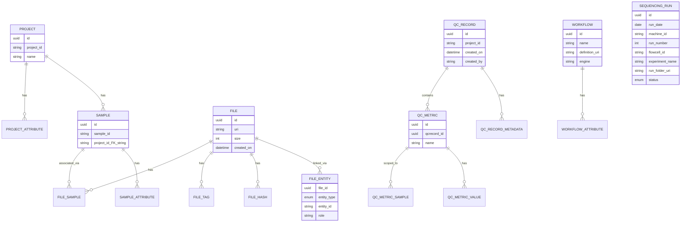
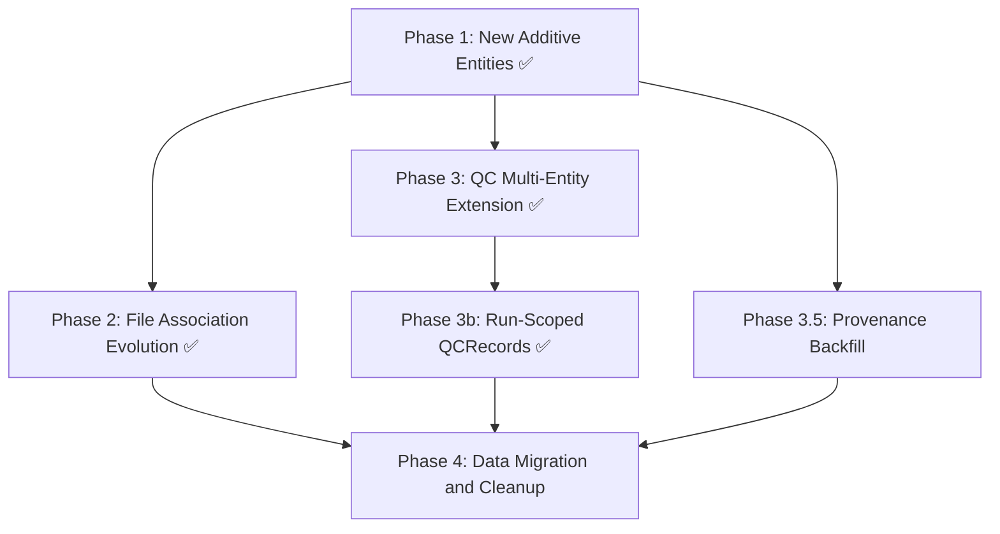

# Model Migration Gap Analysis & Phased Plan

## Overview

This document compares the **current application models** against the **desired state** described in [`Entities and Relationships Discussion.md`](plans/Entities and Relationships Discussion.md) and proposes a phased migration strategy.

---

## 1. Current State Summary

### Database Tables (SQLModel `table=True`)

| Entity | Table | Key Fields | Notes |
|--------|-------|------------|-------|
| [`Project`](api/project/models.py:29) | `project` | uuid `id`, str `project_id` (unique), str `name` | Has `ProjectAttribute` KV child table |
| [`Sample`](api/samples/models.py:30) | `sample` | uuid `id`, str `sample_id`, str `project_id` FK→`project.project_id` | **String FK**, not uuid FK. Has `SampleAttribute` KV child |
| [`SequencingRun`](api/runs/models.py:22) | `sequencingrun` | uuid `id`, date `run_date`, str `machine_id`, int `run_number`, str `flowcell_id`, `RunStatus` enum | Rich Illumina/ONT barcode parsing. No `platform` field. **No relationship to Sample** |
| [`Workflow`](api/workflow/models.py:24) | `workflow` | uuid `id`, str `name`, str `definition_uri`, str `engine`, str `engine_id`, str `engine_version` | Has `WorkflowAttribute` KV child. **No `version` field** |
| [`File`](api/files/models.py:151) | `file` | uuid `id`, str `uri`, str `original_filename`, int `size`, datetime `created_on`, str `created_by`, str `source`, str `storage_backend` | Rich model with child tables: `FileHash`, `FileTag`, `FileSample`, `FileEntity` |
| [`FileEntity`](api/files/models.py:119) | `fileentity` | uuid `file_id` FK, enum `entity_type`, str `entity_id`, str `role` | **Polymorphic** pattern — entity_type is `PROJECT/RUN/SAMPLE/QCRECORD` |
| [`FileSample`](api/files/models.py:93) | `filesample` | uuid `file_id` FK, uuid `sample_id` FK, str `role` | Direct FK to `sample.id` — supports tumor/normal roles |
| [`QCRecord`](api/qcmetrics/models.py:128) | `qcrecord` | uuid `id`, datetime `created_on`, str `created_by`, str `project_id` | Container for pipeline QC. **`project_id` is plain string, not FK** |
| [`QCMetric`](api/qcmetrics/models.py:97) | `qcmetric` | uuid `id`, uuid `qcrecord_id` FK, str `name` | Named metric group within a QCRecord |
| [`QCMetricValue`](api/qcmetrics/models.py:45) | `qcmetricvalue` | uuid `qc_metric_id` FK, str `key`, str `value_string`, float `value_numeric`, str `value_type` | Dual-storage: string + numeric for queries |
| [`QCMetricSample`](api/qcmetrics/models.py:73) | `qcmetricsample` | uuid `qc_metric_id` FK, uuid `sample_id` FK, str `role` | Sample associations per metric group |
| [`QCRecordMetadata`](api/qcmetrics/models.py:25) | `qcrecordmetadata` | uuid `qcrecord_id` FK, str `key`, str `value` | Pipeline-level KV metadata |
| [`BatchJob`](api/jobs/models.py:23) | `batchjob` | uuid `id`, str `name`, str `command`, str `user`, `JobStatus` enum | AWS Batch job tracking |
| [`Vendor`](api/vendors/models.py:10) | `vendor` | uuid `id`, str `vendor_id`, str `name` | External vendor registry |
| [`Setting`](api/settings/models.py:11) | `setting` | str `key` (PK), str `value`, str `name` | App-level configuration |
| Auth tables | `users`, `refresh_tokens`, `oauth_providers`, `password_reset_tokens`, `email_verification_tokens` | Various | Full auth system |

> **Note:** [`api/platforms/routes.py`](api/platforms/routes.py:8) imports from `api.platforms.models` but no `models.py` file exists in `api/platforms/`. This appears to be an incomplete/in-progress feature.

### Current ER Diagram

---

## 2. Desired State Summary (from Discussion)

The target introduces several **new entities** and extends QC to cover multiple entity types.

> **Note:** The original discussion in [`Entities and Relationships Discussion.md`](plans/Entities and Relationships Discussion.md) proposed `QC_ENTITY` + `QC_ENTITY_MEMBER`. After analysis (see [`qcmetrics-multi-entity-extension.md`](plans/qcmetrics-multi-entity-extension.md)), that approach was rejected in favor of extending the existing QC model with typed junction tables. The items below reflect the **revised** desired state.

### Key New Concepts
- **`WORKFLOW_RUN`** — An execution of a workflow ✅ Implemented in Phase 1
- **`PIPELINE`** — A composed set of workflows ✅ Implemented in Phase 1
- **`SAMPLE ↔ SEQUENCING_RUN` many-to-many** ✅ Implemented in Phase 1
- **`QCRecord.workflow_run_id`** — Provenance FK linking QC data to the execution that produced it
- **`QCMetricSequencingRun` / `QCMetricWorkflowRun`** — Typed junction tables to scope metrics to non-sample entities (with real FK constraints)
- **Direct File→Entity FKs** — File can belong to Run, Sample, WorkflowRun, Pipeline, or Project directly

---

## 3. Detailed Gap Analysis

### 3.1 Entities That Need to Be Created

| New Entity | Purpose | Relationships | Status |
|-----------|---------|---------------|--------|
| **`WorkflowRun`** | Execution record of a Workflow | FK→`Workflow`, FK→`Platform` | ✅ Phase 1 |
| **`Pipeline`** | Composed set of Workflows | Has Workflows via junction table | ✅ Phase 1 |
| **`SampleSequencingRun`** | Junction table: Sample ↔ SequencingRun M:N | FK→`Sample`, FK→`SequencingRun` | ✅ Phase 1 |
| **`PipelineWorkflow`** | Junction table: Pipeline consists_of Workflows | FK→`Pipeline`, FK→`Workflow` | ✅ Phase 1 |
| **`Platform`** | Workflow execution engine registry | PK `name`, referenced by WorkflowDeployment/WorkflowRun | ✅ Phase 1 |
| **`WorkflowDeployment`** | Platform-specific deployment of a workflow | FK→`Workflow`, FK→`Platform` | ✅ Phase 1 |
| **`QCMetricSequencingRun`** | Typed junction: QCMetric ↔ SequencingRun | FK→`QCMetric`, FK→`SequencingRun` | Phase 3 |
| **`QCMetricWorkflowRun`** | Typed junction: QCMetric ↔ WorkflowRun | FK→`QCMetric`, FK→`WorkflowRun` | Phase 3 |

> **Superseded:** The original discussion proposed `QCEntity` and `QCEntityMember` as polymorphic containers. After analysis, these were rejected in favor of typed junction tables with real FK constraints. See [`qcmetrics-multi-entity-extension.md`](plans/qcmetrics-multi-entity-extension.md) §3 for the full options analysis.

### 3.2 Entities That Need Modification

| Entity | Current | Desired | Change Type | Status |
|--------|---------|---------|-------------|--------|
| **`Workflow`** | Had `engine`, `engine_id`, `engine_version` | Restructured: platform fields moved to `WorkflowDeployment`, added `version` | Done | ✅ Phase 1 |
| **`SequencingRun`** | Rich Illumina/ONT fields, no `platform` | Added `sequencing_platform` field | Done | ✅ Phase 1 |
| **`Sample`** | `project_id` is **string FK** → `project.project_id` | Keep as-is — string FK is valid and enforced | No change needed | ✅ Resolved |
| **`File`** | Polymorphic `FileEntity` associations | Direct FK relationships per entity type | **Major refactor** of association model | Phase 2 |
| **`QCRecord`** | No provenance FK | Add nullable `workflow_run_id` FK→`workflowrun.id` | **Additive** — low risk | Phase 3 |

### 3.3 Entities That May Be Retired

| Entity | Replacement | Migration Complexity |
|--------|------------|---------------------|
| `FileEntity` | Direct FK columns on `File` or typed junction tables | Medium — polymorphic → typed FKs |

> **Superseded:** The original analysis listed `QCRecord`, `QCRecordMetadata`, `QCMetricValue`, and `QCMetricSample` as candidates for retirement. After analysis, **none of these will be retired**. The existing QC model is well-designed and will be extended in place. See [`qcmetrics-multi-entity-extension.md`](plans/qcmetrics-multi-entity-extension.md) §4 for the detailed design.

### 3.4 Entities Unchanged

| Entity | Notes |
|--------|-------|
| `Project` | Core fields match. Desired state shows only `id` + `name`; existing `project_id` and attributes remain |
| `BatchJob` | Not mentioned in desired state — infrastructure concern, keep as-is |
| `Vendor` | Not mentioned — keep as-is |
| `Setting` | Not mentioned — keep as-is |
| Auth tables | Not mentioned — keep as-is |
| `FileHash`, `FileTag` | Not mentioned in desired state but are valuable — likely keep |
| `FileSample` | Overlap with new File→Sample direct FK; needs decision |

---

## 4. Open Questions for Discussion

Before finalizing the migration plan, these design decisions need alignment:

### Q1: QCMetric — Single Value vs. Key-Value Groups? ✅ RESOLVED

**Decision:** Keep the current key-value child table approach (`QCMetric` → `QCMetricValue`). The grouped structure is semantically valuable — a single `sample_qc` metric group with 37 key-value pairs is far more usable than 37 individual metric rows. Flattening would lose the semantic grouping and massively inflate the table.

See [`qcmetrics-multi-entity-extension.md`](plans/qcmetrics-multi-entity-extension.md) §3 Option A analysis for full rationale.

### Q2: File Association Model — Direct FKs vs. Current Polymorphic?
The desired state shows `File` with direct relationships to each entity. The current `FileEntity` polymorphic pattern is flexible but loosely coupled.

**Options:**
- **(A)** Add nullable FK columns to `File` (`project_id`, `run_id`, `sample_id`, `workflow_run_id`, `pipeline_id`) — simple but many nullable columns.
- **(B)** Keep junction tables but make them typed (e.g., `FileProject`, `FileRun`, `FileSample`, `FileWorkflowRun`, `FilePipeline`) — normalized but more tables.
- **(C)** Keep `FileEntity` polymorphic pattern but update the enum to include new entity types (`WORKFLOW_RUN`, `PIPELINE`). Lowest change, but doesn't add referential integrity.

### Q3: Sample.project_id — String FK or UUID FK? ✅ RESOLVED

**Decision:** Keep the current string FK. The string FK to `project.project_id` is valid, enforces referential integrity, and provides human-readable queries and simpler code. The `project_id` value is system-generated and immutable (no rename API exists), so the main risk of natural key FKs does not apply. The migration to UUID FK would be a breaking change with real cost and risk for primarily aesthetic benefit. Schema consistency is a minor concern that does not justify the migration effort at this stage.

See [`q3-sample-project-id-fk-analysis.md`](plans/q3-sample-project-id-fk-analysis.md) for the full pros/cons analysis.

### Q4: QCRecord Data Migration ✅ RESOLVED

**Decision:** No data migration needed. `QCRecord` is **not being replaced**. The existing QC model is extended in place:
- Add `workflow_run_id` nullable FK to `QCRecord` (existing records get null — acceptable)
- Add typed junction tables (`QCMetricSequencingRun`, `QCMetricWorkflowRun`) alongside existing `QCMetricSample`
- All existing API endpoints, data, and behavior remain 100% backward compatible

See [`qcmetrics-multi-entity-extension.md`](plans/qcmetrics-multi-entity-extension.md) §4 for the full design.

### Q5: Existing Rich Fields ✅ RESOLVED

**Decision:** The discussion diagram shows only key identifying fields; existing fields are **preserved and extended**, not replaced. Confirmed during Phase 1 implementation — `SequencingRun` kept all its rich fields and gained `sequencing_platform`.

### Q6: Platform Model ✅ RESOLVED

**Decision:** [`Platform`](api/platforms/models.py:11) model was created in Phase 1 as a single-column table (PK `name`). It is referenced by [`WorkflowDeployment.engine`](api/workflow/models.py:64) and [`WorkflowRun.engine`](api/workflow/models.py:92) as FKs. The `sequencing_platform` field on `SequencingRun` is a plain string, not an FK to `Platform` — these are separate concepts (sequencing platforms like Illumina/ONT vs. workflow execution platforms like Arvados/SevenBridges).

---

## 5. Proposed Phased Migration

### Phase 1: New Additive Entities (No Breaking Changes) ✅ COMPLETED

**Goal:** Add new tables and relationships without modifying existing ones.

- [x] Restructure `Workflow` — remove `engine`/`engine_id`/`engine_version`, add `version`, `created_at`, `created_by`
- [x] Create `Platform` model + table (str `name` PK)
- [x] Create `WorkflowDeployment` model + table (workflow_id FK, engine FK→Platform, external_id)
- [x] Create `WorkflowRun` model + table (workflow_id FK, engine FK→Platform, external_run_id)
- [x] Create `WorkflowRunAttribute` KV child table
- [x] Create `Pipeline` model + table (uuid id, name, version, created_at, created_by)
- [x] Create `PipelineAttribute` KV child table (following existing pattern)
- [x] Create `PipelineWorkflow` junction table (pipeline_id FK, workflow_id FK) — simple membership
- [x] Create `SampleSequencingRun` junction table (sample_id FK, sequencing_run_id FK)
- [x] Add `sequencing_platform` field to `SequencingRun` model (nullable)
- [x] Write Alembic migration for all new tables/columns
- [x] Create CRUD routes/services for Pipeline, WorkflowRun, WorkflowDeployment, Platform
- [x] Create route to associate Samples with SequencingRuns
- [x] Add tests for all new models and endpoints
- [x] Register new routers in [`main.py`](main.py)

> **Implementation details:** See [`phase1-additive-entities.md`](plans/phase1-additive-entities.md) for the full plan. Key models are in [`api/workflow/models.py`](api/workflow/models.py), [`api/pipeline/models.py`](api/pipeline/models.py), [`api/platforms/models.py`](api/platforms/models.py), and [`api/runs/models.py`](api/runs/models.py).

### Phase 2: File Association Evolution ✅ COMPLETED

**Goal:** Replace polymorphic `FileEntity` with typed junction tables for referential integrity and type safety.

> **Design reference:** See [`phase2-file-association-evolution.md`](plans/phase2-file-association-evolution.md) for the full design.

- [x] Decided on typed junction tables approach (one table per entity type)
- [x] Created 5 typed junction tables: `FileProject`, `FileSequencingRun`, `FileQCRecord`, `FileWorkflowRun`, `FilePipeline`
- [x] Removed `FileEntity`, `FileEntityType`, `EntityInput` from models
- [x] Updated [`FileCreate`](api/files/models.py:398) and [`FileUploadCreate`](api/files/models.py:437) with typed entity fields
- [x] Updated [`FilePublic`](api/files/models.py:549) and [`file_to_public()`](api/files/models.py:619) response model
- [x] Updated file services ([`create_file()`](api/files/services.py:54), [`create_file_upload()`](api/files/services.py:165), [`list_files_by_entity()`](api/files/services.py:387))
- [x] Updated QCMetrics service ([`_create_file_for_qcrecord()`](api/qcmetrics/services.py:197)) to use `FileQCRecord`
- [x] Updated Runs service ([`clear_samples_for_run()`](api/runs/services.py:817)) to use `FileSequencingRun`
- [x] Updated file upload route with typed entity form fields
- [x] Written Alembic migration [`9427dcbe7514`](alembic/versions/9427dcbe7514_replace_fileentity_with_typed_junction_.py) with data migration
- [x] Updated tests (344 passing)
- [x] Updated documentation ([`docs/ER_DIAGRAM.md`](docs/ER_DIAGRAM.md), [`docs/FILE_MODEL.md`](docs/FILE_MODEL.md))

### Phase 3: QC Multi-Entity Extension ✅ COMPLETED

**Goal:** Extend the existing QC model to support metrics scoped to SequencingRuns and WorkflowRuns, and add execution provenance to QCRecord.

> **Design reference:** See [`qcmetrics-multi-entity-extension.md`](plans/qcmetrics-multi-entity-extension.md) for the original options analysis. The implementation chose **direct FKs on QCMetric** instead of junction tables — a metric is about at most one sequencing run and one workflow run (many-to-one), so junction tables were over-engineered. `QCMetricSample` remains a junction table because samples are truly many-to-many (e.g., tumor/normal pairs).

#### Database Changes
- [x] Add `workflow_run_id` nullable FK column to `qcrecord` table (provenance: which run produced this data)
- [x] Add `sequencing_run_id` nullable FK column to `qcmetric` table (subject: what this metric is about)
- [x] Add `workflow_run_id` nullable FK column to `qcmetric` table (subject: what this metric is about)
- [x] Add indexes on all new FK columns
- [x] Write Alembic migration — autogenerated, trimmed to Phase 3 changes only

#### Model Changes
- [x] Add `workflow_run_id` field to [`QCRecord`](api/qcmetrics/models.py) SQLModel class
- [x] Add `sequencing_run_id` and `workflow_run_id` nullable FK fields to [`QCMetric`](api/qcmetrics/models.py) SQLModel class
- [x] Extend [`MetricInput`](api/qcmetrics/models.py) with `sequencing_run_id` and `workflow_run_id` fields
- [x] Extend [`QCRecordCreate`](api/qcmetrics/models.py) with `workflow_run_id` field
- [x] Extend [`MetricPublic`](api/qcmetrics/models.py) and [`QCRecordPublic`](api/qcmetrics/models.py) response models

#### Service & Route Changes
- [x] Update [`create_qcrecord`](api/qcmetrics/services.py) to store `workflow_run_id` provenance
- [x] Update [`_create_metric`](api/qcmetrics/services.py) to validate and store direct FK references
- [x] Update [`_qcrecord_to_public`](api/qcmetrics/services.py) to include entity FK fields in responses
- [x] Update [`search_qcrecords`](api/qcmetrics/services.py) to support filtering by `sequencing_run_id` and `workflow_run_id`

#### Tests
- [x] Test creating QCRecord with `workflow_run_id` provenance
- [x] Test creating metric with `sequencing_run_id` and `workflow_run_id` scoping
- [x] Test mixed scoping (sample + run in same QCRecord)
- [x] Test search by new entity filters
- [x] Test FK validation — referencing non-existent entities returns 422
- [x] Test cascade deletes propagate correctly

> **Test file:** [`tests/api/test_qcmetrics_multi_entity.py`](tests/api/test_qcmetrics_multi_entity.py) — 13 tests covering provenance, entity scoping, FK validation, search filters, and cascade deletes.

#### Documentation
- [x] Update [`docs/ER_DIAGRAM.md`](docs/ER_DIAGRAM.md) with new FK columns
- [x] Update [`docs/QCMETRICS.md`](docs/QCMETRICS.md) with entity scoping patterns

#### Design Decision: Direct FKs vs Junction Tables
The original design (Option C in the extension plan) proposed junction tables `QCMetricSequencingRun` and `QCMetricWorkflowRun` for many-to-many associations. During implementation review, we determined that a metric is always about **at most one** sequencing run and one workflow run — making the relationship many-to-one, not many-to-many. Direct nullable FK columns on `QCMetric` are simpler, faster (no JOINs), and semantically accurate. `QCMetricSample` remains a junction table because samples genuinely support many-to-many (tumor/normal pairs).

### Phase 3b: Run-Scoped QCRecords ✅ COMPLETED

**Goal:** Enable QCRecords scoped to a SequencingRun (e.g., demux stats) without requiring a project_id. Extend re-demux cleanup to delete run-scoped QCRecords. Accept human-readable barcode in API, store UUID in DB.

> **Design reference:** See [`qcrecord-run-scoped-design.md`](plans/qcrecord-run-scoped-design.md) for full design document with options analysis, rejected alternatives, and scenario walkthroughs.

**Key decisions:**
- `QCRecord.project_id` becomes nullable — run-scoped records have no project
- `QCRecord.sequencing_run_id` added as nullable FK to `sequencingrun.id`
- CHECK constraint: at least one of `project_id` or `sequencing_run_id` must be non-null
- API accepts barcode string (`sequencing_run_barcode`), service resolves to UUID via `get_run()`
- `MetricInput.sequencing_run_id` renamed to `sequencing_run_barcode` (string) for consistency
- Auto-propagation: record-level barcode fills metrics that omit it (like `propagate_project_id_to_files()`)
- Re-demux cleanup: `clear_samples_for_run()` extended to delete run-scoped QCRecords (Option 3: cleanup-only)
- Responses return both UUID and barcode

#### Database Changes
- [x] Make `qcrecord.project_id` nullable (drop NOT NULL)
- [x] Add `qcrecord.sequencing_run_id` nullable FK to `sequencingrun.id` + index
- [x] Add CHECK constraint: `project_id IS NOT NULL OR sequencing_run_id IS NOT NULL`
- [x] Fold into existing migration [`0b9dc33bc33f`](alembic/versions/0b9dc33bc33f_qc_multi_entity_extension.py)

#### Model Changes
- [x] Make `QCRecord.project_id` nullable (`str | None`)
- [x] Add `QCRecord.sequencing_run_id` nullable FK + ORM Relationship
- [x] Add `QCRecordCreate.sequencing_run_barcode` (`str | None`) + scope validator
- [x] Rename `MetricInput.sequencing_run_id` → `sequencing_run_barcode` (`str | None`)
- [x] Add auto-propagation validator: record barcode → metric barcode
- [x] Update response models (`QCRecordPublic`, `QCRecordCreated`, `MetricPublic`) with both UUID and barcode

#### Service & Route Changes
- [x] `create_qcrecord()`: resolve barcode → UUID via `get_run()`, 422 on not found
- [x] `_create_metric()`: accept resolved UUID from parent, resolve independently if metric has different barcode
- [x] `_check_duplicate_record()`: branch on project-scoped vs run-scoped
- [x] `search_qcrecords()`: run-scoped `latest=true` grouping, `sequencing_run_barcode` filter with resolution
- [x] `_qcrecord_to_public()`: include barcode in response (via ORM Relationship)
- [x] `clear_samples_for_run()`: delete run-scoped QCRecords + add `qcrecords_deleted` to response
- [x] Search GET route: add `sequencing_run_barcode` query param

#### Tests
- [x] Create run-scoped QCRecord with barcode (happy path)
- [x] Create with invalid barcode (422)
- [x] Create with neither project nor barcode (422)
- [x] Auto-propagation of barcode from record to metrics
- [x] Metric with explicit barcode different from record
- [x] Search by `sequencing_run_barcode`
- [x] Search `latest=true` groups by `sequencing_run_id` for run-scoped records
- [x] Duplicate detection for run-scoped records
- [x] Get run-scoped record by ID returns barcode in response
- [x] Re-demux cleanup deletes run-scoped QCRecords
- [x] Update existing metric entity tests (UUID → barcode)
- [x] Existing project-scoped tests still pass (no regression)

#### Documentation
- [x] Update [`docs/QCMETRICS.md`](docs/QCMETRICS.md) with run-scoped patterns and examples
- [x] Update [`docs/ER_DIAGRAM.md`](docs/ER_DIAGRAM.md) with SequencingRun → QCRecord relationship

> **Implementation details:** Phase 3b was implemented as part of the same PR as Phase 3 since nothing had shipped. Multi-entity extension tests were merged into [`tests/api/test_qcmetrics.py`](tests/api/test_qcmetrics.py). Run-scoped tests are in lines 1188–1470 of that file. The `clear_samples_for_run()` cleanup is in [`api/runs/services.py`](api/runs/services.py:817).

### Phase 3.5: Provenance Backfill (Existing Entities)

**Goal:** Add `created_at`/`created_by` to existing entities that lack provenance tracking.

- [ ] Add nullable `created_at` and `created_by` columns to: `Project`, `Sample`, `SequencingRun`
- [ ] Standardize `File.created_on` → alias or rename to `created_at` (coordinate with `QCRecord.created_on`)
- [ ] Update service layers to capture authenticated user on creation
- [ ] Write Alembic migration for new columns

### Phase 4: Data Migration & Cleanup

**Goal:** Migrate remaining data and clean up legacy patterns.

- [ ] Migrate existing `FileEntity` data to new association model (if changed in Phase 2)
- [ ] Remove `FileEntity` table if replaced in Phase 2
- [ ] Update search/indexing to include new entities
- [ ] Clean up unused models, services, routes
- [ ] Full regression test pass

> **Note:** No QC data migration is needed. Phase 3 is fully additive and backward compatible — existing QCRecord data continues to work unchanged. New QC records can optionally use the new provenance and entity association fields.

---

## 6. Dependency Graph

Phase 1, Phase 2, Phase 3, and Phase 3b are complete. Phase 3b was implemented as part of the same PR as Phase 3. **Phase 3.5** (Provenance Backfill) and **Phase 4** (Data Migration & Cleanup) remain as future work — they are independent of the core entity model migration.

---

## 7. Risk Assessment

| Risk | Severity | Mitigation |
|------|----------|------------|
| ~~Sample.project_id string→uuid FK~~ | ~~Medium~~ | ✅ Resolved — keeping string FK; see [`q3-sample-project-id-fk-analysis.md`](plans/q3-sample-project-id-fk-analysis.md) |
| FileEntity polymorphic removal | Medium | Map all existing data before dropping; validate no orphaned records |
| Large number of Alembic migrations | Low | Group related changes; test migration chain thoroughly |
| QC extension breaks existing behavior | Low | Phase 3 is 100% additive — no tables modified or dropped; all existing tests must continue to pass |
