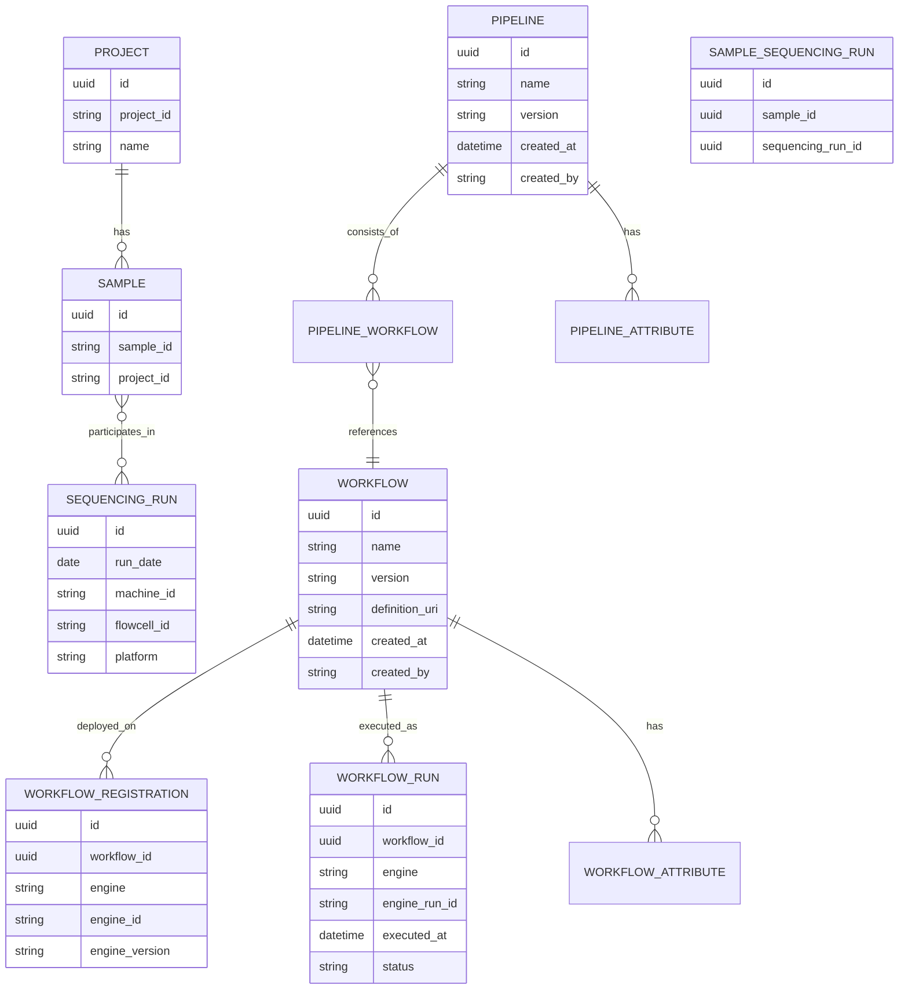

# Phase 1: New Entities — Implementation Plan

**Context:** No production data exists, so we can make clean changes including restructuring existing models.

**Key Decisions:**
- Pipeline→Workflow: Simple membership (Option A) — see [`phase1-decisions-pipeline-workflow-relationships.md`](plans/phase1-decisions-pipeline-workflow-relationships.md)
- Workflow Identity: Normalized (Option 1) — see [`phase1-decisions-workflow-identity-cross-platform.md`](plans/phase1-decisions-workflow-identity-cross-platform.md)
- Provenance: `created_at` + `created_by` on all new entities. No `updated_at`/`updated_by`.
- WorkflowRun.status is mutable (updated in place for status transitions).

---

## Scope

Phase 1 adds new entities and restructures the Workflow model to separate identity from platform deployment.

### Deliverables
1. **Restructure `Workflow`** — remove `engine`/`engine_id`/`engine_version`, add `version`
2. **New `WorkflowDeployment`** — platform-specific workflow deployment table
3. **New `WorkflowRun`** — execution record with platform tracking + attribute table
4. **New `Pipeline`** — model + attribute table + CRUD API
5. **New `PipelineWorkflow`** — junction table (simple membership)
6. **New `SampleSequencingRun`** — junction table for Sample↔SequencingRun M:N
7. **Add `platform` column** on `SequencingRun`
8. Alembic migration for all schema changes
9. Tests for all new and modified models/endpoints

---

## 1. Models

### 1.1 Workflow Restructure (`api/workflow/models.py` — modify existing)

**Current model fields being restructured:**
- `engine` → moves to `WorkflowDeployment`
- `engine_id` → moves to `WorkflowDeployment`
- `engine_version` → moves to `WorkflowDeployment`
- `definition_uri` → stays (defines the logical workflow)
- `name` → stays
- `version` → **new** (nullable)

```python
# MODIFIED — platform fields removed, version + provenance added
class Workflow(SQLModel, table=True):
    """Platform-agnostic workflow definition."""
    id: uuid.UUID (PK)
    name: str
    version: str | None
    definition_uri: str
    created_at: datetime  # auto-set to now(utc)
    created_by: str       # username from authenticated user
    # Relationships: deployments, attributes, runs

# EXISTING — unchanged
class WorkflowAttribute(SQLModel, table=True):
    id: uuid.UUID (PK)
    workflow_id: uuid.UUID (FK → workflow.id)
    key: str
    value: str

# NEW — platform-specific deployment of a workflow
class WorkflowDeployment(SQLModel, table=True):
    __tablename__ = "workflowdeployment"
    id: uuid.UUID (PK)
    workflow_id: uuid.UUID (FK → workflow.id)
    engine: str                   # Arvados, SevenBridges, etc.
    engine_id: str                # External ID on that platform
    engine_version: str | None
    created_at: datetime  # auto-set to now(utc)
    created_by: str       # username from authenticated user
    # UniqueConstraint on (workflow_id, engine)
    # Relationship: workflow

# NEW — execution record
class WorkflowRunStatus(str, Enum):
    PENDING = "Pending"
    RUNNING = "Running"
    SUCCEEDED = "Succeeded"
    FAILED = "Failed"
    CANCELLED = "Cancelled"

class WorkflowRun(SQLModel, table=True):
    """Execution record of a workflow on a specific platform."""
    __tablename__ = "workflowrun"
    id: uuid.UUID (PK)
    workflow_id: uuid.UUID (FK → workflow.id)   # Links to logical workflow
    engine: str                                  # Which platform executed this run
    engine_run_id: str | None                    # External run/job ID on that platform
    executed_at: datetime
    status: WorkflowRunStatus                    # Mutable — updated in place for status transitions
    created_at: datetime  # auto-set to now(utc)
    created_by: str       # username from authenticated user
    # Relationships: workflow, attributes

class WorkflowRunAttribute(SQLModel, table=True):
    __tablename__ = "workflowrunattribute"
    id: uuid.UUID (PK)
    workflow_run_id: uuid.UUID (FK → workflowrun.id)
    key: str
    value: str

# Request/Response models — Workflow (updated)
class WorkflowCreate(SQLModel):
    name: str
    version: str | None = None
    definition_uri: str
    attributes: List[Attribute] | None = None

class WorkflowPublic(SQLModel):
    id: uuid.UUID
    name: str
    version: str | None
    definition_uri: str
    created_at: datetime
    created_by: str
    attributes: List[Attribute] | None
    registrations: List[WorkflowDeploymentPublic] | None

# Request/Response models — WorkflowDeployment (new)
class WorkflowDeploymentCreate(SQLModel):
    engine: str
    engine_id: str
    engine_version: str | None = None

class WorkflowDeploymentPublic(SQLModel):
    id: uuid.UUID
    engine: str
    engine_id: str
    engine_version: str | None

# Request/Response models — WorkflowRun (new)
class WorkflowRunCreate(SQLModel):
    workflow_id: uuid.UUID
    engine: str                               # Which platform to run on
    engine_run_id: str | None = None          # External run ID (may be set later)
    executed_at: datetime | None = None       # Defaults to now
    status: WorkflowRunStatus = WorkflowRunStatus.PENDING
    attributes: List[Attribute] | None = None

class WorkflowRunUpdate(SQLModel):
    status: WorkflowRunStatus | None = None
    engine_run_id: str | None = None          # May be set after submission

class WorkflowRunPublic(SQLModel):
    id: uuid.UUID
    workflow_id: uuid.UUID
    workflow_name: str | None    # Denormalized from parent Workflow
    engine: str
    engine_run_id: str | None
    executed_at: datetime
    status: WorkflowRunStatus
    created_at: datetime
    created_by: str
    attributes: List[Attribute] | None

class WorkflowRunsPublic(SQLModel):  # Paginated
    data: List[WorkflowRunPublic]
    total_items: int
    total_pages: int
    current_page: int
    per_page: int
    has_next: bool
    has_prev: bool
```

### 1.2 Pipeline (`api/pipeline/models.py` — new module)

```python
# Database tables
class Pipeline(SQLModel, table=True):
    id: uuid.UUID (PK)
    name: str
    version: str | None
    created_at: datetime  # auto-set to now(utc)
    created_by: str       # username from authenticated user
    # Relationships: attributes, workflows (via PipelineWorkflow)

class PipelineAttribute(SQLModel, table=True):
    id: uuid.UUID (PK)
    pipeline_id: uuid.UUID (FK → pipeline.id)
    key: str
    value: str
    # UniqueConstraint on (pipeline_id, key)

# Junction table (Option A — simple membership, no DAG edges)
# See plans/phase1-decisions-pipeline-workflow-relationships.md for rationale
class PipelineWorkflow(SQLModel, table=True):
    __tablename__ = "pipelineworkflow"
    id: uuid.UUID (PK)
    pipeline_id: uuid.UUID (FK → pipeline.id)
    workflow_id: uuid.UUID (FK → workflow.id)
    created_at: datetime  # auto-set to now(utc)
    created_by: str       # username from authenticated user
    # UniqueConstraint on (pipeline_id, workflow_id)

# Request/Response models
class PipelineCreate(SQLModel):
    name: str
    version: str | None = None
    attributes: List[Attribute] | None = None
    workflow_ids: List[uuid.UUID] | None = None  # Optional: link workflows at creation

class PipelinePublic(SQLModel):
    id: uuid.UUID
    name: str
    version: str | None
    created_at: datetime
    created_by: str
    attributes: List[Attribute] | None
    workflows: List[WorkflowSummary] | None  # Lightweight workflow refs

class PipelinesPublic(SQLModel):  # Paginated
    data: List[PipelinePublic]
    total_items: int
    total_pages: int
    current_page: int
    per_page: int
    has_next: bool
    has_prev: bool
```

### 1.3 SampleSequencingRun Junction (`api/runs/models.py` — extend)

```python
class SampleSequencingRun(SQLModel, table=True):
    __tablename__ = "samplesequencingrun"
    id: uuid.UUID (PK)
    sample_id: uuid.UUID (FK → sample.id)
    sequencing_run_id: uuid.UUID (FK → sequencingrun.id)
    created_at: datetime  # auto-set to now(utc)
    created_by: str       # username from authenticated user
    # UniqueConstraint on (sample_id, sequencing_run_id)
```

### 1.4 Additive Column on SequencingRun

In [`SequencingRun`](api/runs/models.py:22):
```python
platform: str | None = Field(default=None, max_length=50)  # e.g., "Illumina", "ONT"
```

---

## 2. API Endpoints

### 2.1 Workflow Endpoints (update existing `api/workflow/routes.py`)

| Method | Path | Description |
|--------|------|-------------|
| `POST` | `/api/v1/workflows` | Create a workflow (updated — no engine fields) |
| `GET` | `/api/v1/workflows` | List workflows (updated — includes registrations) |
| `GET` | `/api/v1/workflows/{id}` | Get workflow by ID (updated) |
| `POST` | `/api/v1/workflows/{id}/deployments` | **NEW** Deploy workflow on a platform |
| `GET` | `/api/v1/workflows/{id}/deployments` | **NEW** List platform deployments |
| `DELETE` | `/api/v1/workflows/{id}/deployments/{deployment_id}` | **NEW** Remove a deployment |

### 2.2 WorkflowRun Endpoints (new endpoints in `api/workflow/routes.py`)

| Method | Path | Description |
|--------|------|-------------|
| `POST` | `/api/v1/workflows/{workflow_id}/runs` | Create a workflow run |
| `GET` | `/api/v1/workflows/{workflow_id}/runs` | List runs for a workflow (paginated) |
| `GET` | `/api/v1/workflow-runs/{id}` | Get a single workflow run by ID |
| `PUT` | `/api/v1/workflow-runs/{id}` | Update workflow run (status, engine_run_id) |

### 2.3 Pipeline Endpoints (`api/pipeline/routes.py` — new)

| Method | Path | Description |
|--------|------|-------------|
| `POST` | `/api/v1/pipelines` | Create a pipeline with optional attributes and workflow links |
| `GET` | `/api/v1/pipelines` | List pipelines (paginated) |
| `GET` | `/api/v1/pipelines/{id}` | Get a single pipeline by ID |
| `POST` | `/api/v1/pipelines/{id}/workflows` | Add a workflow to a pipeline |
| `DELETE` | `/api/v1/pipelines/{id}/workflows/{workflow_id}` | Remove a workflow from a pipeline |

### 2.4 Sample↔Run Association Endpoints (extend `api/runs/routes.py`)

| Method | Path | Description |
|--------|------|-------------|
| `POST` | `/api/v1/runs/{barcode}/samples` | Associate samples with a run |
| `GET` | `/api/v1/runs/{barcode}/samples` | List samples associated with a run |
| `DELETE` | `/api/v1/runs/{barcode}/samples/{sample_id}` | Remove a sample association |

> Note: There is already a `POST /{run_barcode}/samples` endpoint for posting samples after demux. We need to review whether to extend it or create a separate association endpoint.

---

## 3. Service Layer

### 3.1 `api/workflow/services.py` (update existing + add new functions)

**Updated:**
- `create_workflow()` — Updated: no engine fields, add provenance
- `get_workflows()` — Updated: include deployments in response
- `get_workflow_by_workflow_id()` — Updated: include deployments

**New:**
- `create_workflow_deployment()` — Deploy a workflow on a platform
- `get_workflow_deployments()` — List deployments for a workflow
- `delete_workflow_deployment()` — Remove a deployment
- `create_workflow_run()` — Create a WorkflowRun linked to a Workflow
- `get_workflow_runs()` — Paginated list filtered by workflow_id
- `get_workflow_run_by_id()` — Single lookup with 404
- `update_workflow_run()` — Update status/engine_run_id

### 3.2 `api/pipeline/services.py` (new)

- `create_pipeline()` — Create pipeline + attributes + optional workflow links
- `get_pipelines()` — Paginated list with sorting
- `get_pipeline_by_id()` — Single lookup with 404
- `add_workflow_to_pipeline()` — Create PipelineWorkflow junction row
- `remove_workflow_from_pipeline()` — Delete junction row

### 3.3 `api/runs/services.py` (extend)

- `associate_sample_with_run()` — Create SampleSequencingRun row
- `get_samples_for_run()` — List associated samples
- `remove_sample_from_run()` — Delete junction row

---

## 4. Alembic Migration

Single migration file covering all Phase 1 changes:

### Restructured Tables
- `workflow` — DROP COLUMNS `engine`, `engine_id`, `engine_version`; ADD COLUMNS `version`, `created_at`, `created_by`

### New Tables
- `workflowdeployment` — id, workflow_id FK, engine, engine_id, engine_version, created_at, created_by
- `workflowrun` — id, workflow_id FK, engine, engine_run_id, executed_at, status, created_at, created_by
- `workflowrunattribute` — id, workflow_run_id FK, key, value
- `pipeline` — id, name, version, created_at, created_by
- `pipelineattribute` — id, pipeline_id FK, key, value
- `pipelineworkflow` — id, pipeline_id FK, workflow_id FK, created_at, created_by
- `samplesequencingrun` — id, sample_id FK, sequencing_run_id FK, created_at, created_by

### Altered Tables
- `sequencingrun` — ADD COLUMN `platform` VARCHAR(50) NULL

---

## 5. Registration in main.py

Add to [`main.py`](main.py:115):
```python
from api.pipeline.routes import router as pipeline_router
# ...
app.include_router(pipeline_router, prefix=API_PREFIX)
```

WorkflowRun and WorkflowDeployment routes live in the existing `api/workflow/routes.py` (keeps related things together).

Run↔Sample association routes extend the existing [`api/runs/routes.py`](api/runs/routes.py).

---

## 6. Tests

### New Test Files
- `tests/api/test_pipelines_crud.py` — Pipeline CRUD + workflow association
- `tests/api/test_workflow_runs.py` — WorkflowRun CRUD + status updates
- `tests/api/test_workflow_deployments.py` — WorkflowDeployment CRUD

### Extended Test Files
- `tests/api/test_workflows.py` — Updated for restructured model (no engine fields, has version + deployments)
- `tests/api/test_runs.py` — Add tests for sample↔run associations + platform field

### Test Coverage Targets
- Workflow CRUD with new structure (no engine fields)
- WorkflowDeployment create/list/delete
- WorkflowRun create, list, get-by-id, update status
- Pipeline create, list, get-by-id
- Pipeline ↔ Workflow association add/remove
- Run ↔ Sample association add/remove/list
- Validation: duplicate associations, non-existent FKs, invalid status values
- Cross-platform queries: runs of same logical workflow across platforms
- Pagination and sorting for all list endpoints

---

## 7. File Structure (New/Modified)

```
api/
  pipeline/              # NEW directory
    __init__.py
    models.py            # Pipeline, PipelineAttribute, PipelineWorkflow + request/response
    routes.py            # Pipeline CRUD + workflow association endpoints
    services.py          # Pipeline business logic

  workflow/
    models.py            # MODIFIED: restructure Workflow (remove engine fields, add version + provenance)
                         #           add WorkflowDeployment, WorkflowRun, WorkflowRunStatus,
                         #           WorkflowRunAttribute + all request/response models
    routes.py            # MODIFIED: update Workflow endpoints, add Deployment + Run endpoints
    services.py          # MODIFIED: update Workflow CRUD, add Deployment + Run functions

  runs/
    models.py            # MODIFIED: add SampleSequencingRun + platform to SequencingRun
    routes.py            # MODIFIED: add sample association endpoints
    services.py          # MODIFIED: add sample association functions

alembic/versions/
    xxxx_phase1_entities.py  # NEW migration

tests/api/
    test_pipelines_crud.py            # NEW
    test_workflow_runs.py              # NEW
    test_workflow_deployments.py     # NEW
```

---

## 8. Implementation Order

1. **Models first** — Restructure Workflow, define all new SQLModel classes
2. **Alembic migration** — Generate and review the migration (drop + create, not alter, since no production data)
3. **Services** — Update Workflow services, implement new entity services
4. **Routes** — Update Workflow endpoints, wire up new endpoints
5. **Register routers** — Update main.py with Pipeline router
6. **Tests** — Write tests for all new and modified functionality
7. **Verify** — Run full test suite to confirm no regressions

---

## 9. Relationship Diagram (Phase 1 Target State)


