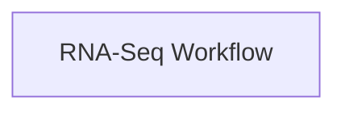
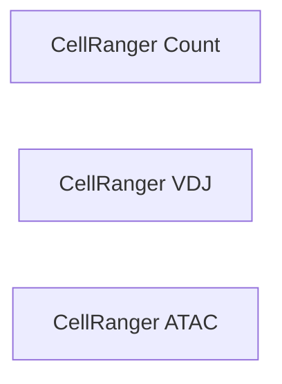
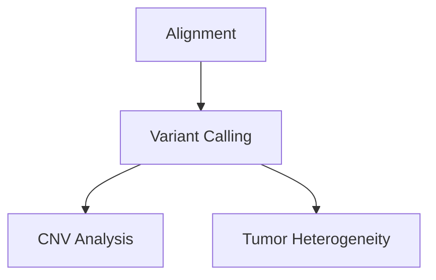

# Phase 1 Decisions: Pipeline and Workflow Relationships

## Context

The desired-state model introduces a **Pipeline** entity that consists of one or more **Workflows**. The original Phase 1 plan proposed a `PipelineWorkflow` junction table with a `step_order` integer column, but this implies a linear sequence. In reality, pipelines and workflows form **directed acyclic graphs** — a simple ordering column cannot represent branches, parallelism, or convergence.

## Real-World Use Cases

Three representative pipelines illustrate the variety of topologies we need to support:

### 1. RNA-Seq Pipeline — Single Node

- 1 pipeline, 1 workflow
- Simplest case

### 2. 10X Single Cell Pipeline — Independent Parallel

- 1 pipeline, multiple workflows
- **No dependencies** between workflows — all can run independently
- Grouped for organizational/business logic purposes

### 3. WES Pipeline — True DAG

- 1 pipeline, multiple workflows
- **Dependency chain**: alignment must complete before variant calling
- **Fan-out**: variant calling feeds into both CNV and tumor heterogeneity
- Could have fan-in patterns in future

## Options Evaluated

### Option A: Simple Membership Only

**Schema:**
```
PipelineWorkflow
  - pipeline_id  FK → pipeline.id
  - workflow_id   FK → workflow.id
  - UNIQUE(pipeline_id, workflow_id)
```

| Strengths | Weaknesses |
|-----------|------------|
| Simplest to implement | Cannot distinguish 10X-style parallelism from WES-style dependencies |
| Works for all cases as a catalog | Cannot answer: what runs after alignment finishes? |
| No risk of modeling something incorrectly | Pipeline structure must be managed entirely outside the application |

**Best fit:** DB is purely for cataloging/tracking; execution orchestration happens elsewhere.

---

### Option B: Membership + Dependency Edges — Two Tables

**Schema:**
```
PipelineWorkflow
  - pipeline_id  FK → pipeline.id
  - workflow_id   FK → workflow.id
  - UNIQUE(pipeline_id, workflow_id)

PipelineWorkflowDependency
  - pipeline_id      FK → pipeline.id
  - workflow_id       FK → workflow.id
  - depends_on_workflow_id  FK → workflow.id
  - UNIQUE(pipeline_id, workflow_id, depends_on_workflow_id)
```

**How it handles each use case:**

| Use Case | PipelineWorkflow rows | Dependency rows |
|----------|----------------------|-----------------|
| RNA-Seq | 1 | 0 |
| 10X Single Cell | N workflows | 0 — all independent |
| WES | N workflows | M edges — alignment→variant_calling, variant_calling→CNV, variant_calling→tumor_het |

**Querying the graph:**
- **Root workflows** — those in `PipelineWorkflow` with no incoming edges in `PipelineWorkflowDependency`
- **Next to run** — given a completed set, find workflows whose dependencies are all satisfied
- **Independent workflows** — those with 0 rows in the dependency table

| Strengths | Weaknesses |
|-----------|------------|
| Captures all three topologies accurately | Two tables instead of one |
| Supports fan-in and fan-out naturally | Need to validate DAG integrity — no cycles |
| Simple cases remain simple — 0 dependency rows | More API complexity |
| DB can be source of truth for pipeline structure | |
| Can drive orchestration or visualization | |

**Best fit:** Pipeline structure should be queryable and potentially drive orchestration or UI visualization.

---

### Option C: Self-Referencing Dependencies — Single Table

**Schema:**
```
PipelineWorkflow
  - pipeline_id  FK → pipeline.id
  - workflow_id   FK → workflow.id
  - depends_on_pipeline_workflow_id  FK → self (nullable)
```

Workflows with `depends_on = NULL` are roots. Others point to their predecessor.

| Strengths | Weaknesses |
|-----------|------------|
| Single table | Only supports single-parent dependencies per row |
| Simple for linear and parallel cases | Fan-in requires multiple rows for the same pipeline+workflow pair, breaking the unique constraint |
| Clean root detection | Awkward for true DAGs |

**Problem:** If a workflow depends on 2+ predecessors, the model breaks down. Not recommended.

---

### Option D: Membership + Category Label

**Schema:**
```
PipelineWorkflow
  - pipeline_id  FK → pipeline.id
  - workflow_id   FK → workflow.id
  - category      VARCHAR (nullable) — e.g. alignment, variant_calling, downstream
```

| Strengths | Weaknesses |
|-----------|------------|
| Very simple | Does not capture actual dependencies |
| Human-readable grouping for UI | Categories are informal and unstructured |
| | Cannot derive execution order programmatically |

**Best fit:** Only if you want lightweight labeling with no execution semantics.

---

## Recommendation

**Option B: Membership + Dependency Edges** is the recommended approach.

### Rationale

1. **Correctly models all three pipeline topologies** without compromise
2. **The dependency table is additive and optional** — you populate it only when there are dependencies, leave it empty when there are none (10X, RNA-Seq). Simple cases stay simple.
3. **No CWL-level pipeline definition exists today** — the DB becomes the source of truth for how workflows relate within a pipeline
4. **Naturally supports fan-in and fan-out** — the WES case (variant_calling→CNV and variant_calling→tumor_het) works cleanly
5. **Future-proof** — if an orchestrator needs to traverse the graph, the edges are already there

### Fallback Position

If Option B feels premature, **Option A with a plan to add dependency edges later** is a viable starting point. The membership table is identical in both options — Option B just adds the dependency table on top. This means upgrading from A→B is a purely additive migration.

---

## Decision

**Status: ✅ Decided — 2026-03-02**

- [x] **Option A now, Option B later** — Start with simple membership (`PipelineWorkflow` junction table). Add `PipelineWorkflowDependency` edge table in a future phase when orchestration or visualization needs arise.

**Rationale:** No pipeline orchestration logic exists yet. Simple membership captures which workflows belong to a pipeline, which is sufficient for cataloging and tracking. The upgrade path to Option B is purely additive — no schema changes to existing tables.

---

## Implementation Impact

Regardless of decision, the `PipelineWorkflow` membership table is the same. The only variable is whether `PipelineWorkflowDependency` is included in Phase 1 or deferred.

### If Option B:
```python
class PipelineWorkflow(SQLModel, table=True):
    __tablename__ = "pipelineworkflow"
    id: uuid.UUID = Field(default_factory=uuid.uuid4, primary_key=True)
    pipeline_id: uuid.UUID = Field(foreign_key="pipeline.id")
    workflow_id: uuid.UUID = Field(foreign_key="workflow.id")
    __table_args__ = (UniqueConstraint("pipeline_id", "workflow_id"),)

class PipelineWorkflowDependency(SQLModel, table=True):
    __tablename__ = "pipelineworkflowdependency"
    id: uuid.UUID = Field(default_factory=uuid.uuid4, primary_key=True)
    pipeline_id: uuid.UUID = Field(foreign_key="pipeline.id")
    workflow_id: uuid.UUID = Field(foreign_key="workflow.id")
    depends_on_workflow_id: uuid.UUID = Field(foreign_key="workflow.id")
    __table_args__ = (
        UniqueConstraint("pipeline_id", "workflow_id", "depends_on_workflow_id"),
    )
```

### If Option A:
```python
class PipelineWorkflow(SQLModel, table=True):
    __tablename__ = "pipelineworkflow"
    id: uuid.UUID = Field(default_factory=uuid.uuid4, primary_key=True)
    pipeline_id: uuid.UUID = Field(foreign_key="pipeline.id")
    workflow_id: uuid.UUID = Field(foreign_key="workflow.id")
    __table_args__ = (UniqueConstraint("pipeline_id", "workflow_id"),)
```
