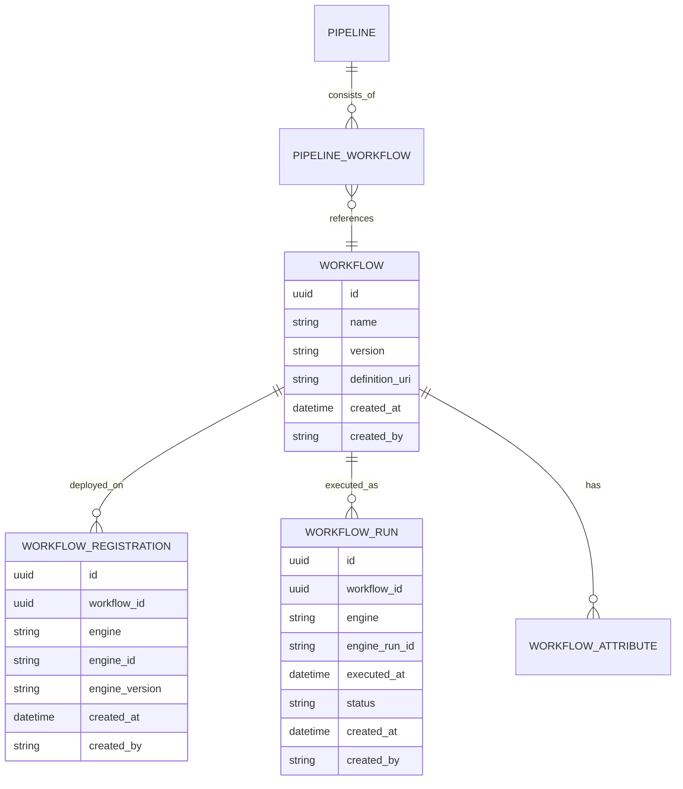

# Phase 1 Decisions: Workflow Identity and Cross-Platform Equivalence

## Context

The application runs the same CWL workflow definitions across multiple execution platforms (e.g., Arvados, SevenBridges). A single workflow like "Alignment v2.0" may be deployed on multiple platforms, each with its own external identifier. The outputs of these executions should be considered equivalent regardless of which platform ran them.

The current [`Workflow`](api/workflow/models.py:24) model stores platform-specific details directly:

```python
class Workflow(SQLModel, table=True):
    id: uuid.UUID
    name: str
    definition_uri: str    # Path to the CWL file
    engine: str            # Platform name: Arvados, SevenBridges, etc.
    engine_id: str | None  # External ID on that specific platform
    engine_version: str | None
```

This means registering the same CWL workflow on two platforms creates **two separate Workflow rows** — which are logically the same workflow but have no formal relationship in the data model.

## Problem Statement

### Current State: Same Workflow = Multiple Rows

| id | name | definition_uri | engine | engine_id |
|----|------|---------------|--------|-----------|
| aaa | Alignment v2.0 | cwl/alignment.cwl | Arvados | zzzzz-7fd4e-abc123 |
| bbb | Alignment v2.0 | cwl/alignment.cwl | SevenBridges | sb-project/alignment |

### Consequences

1. **WorkflowRun isolation** — Runs of `aaa` and `bbb` look unrelated, even though they execute the same logic
2. **Pipeline composition ambiguity** — When a Pipeline includes "Alignment v2.0", which row does it reference?
3. **Cross-platform aggregation** — Cannot easily query "all runs of the Alignment workflow" across platforms
4. **QC metrics scoping** — Metrics from Arvados runs vs SevenBridges runs of the same workflow appear disconnected

## Options Evaluated

### Option 1: Normalize — Separate Identity from Deployment

Split the current `Workflow` into two concerns:

```
Workflow                          # Platform-agnostic logical identity
  id: uuid
  name: str
  version: str | None
  definition_uri: str             # CWL/Nextflow definition path

WorkflowDeployment              # Platform-specific deployment
  id: uuid
  workflow_id: uuid FK → Workflow
  engine: str                     # Arvados, SevenBridges, etc.
  engine_id: str                  # External ID on that platform
  engine_version: str | None

WorkflowRun                       # Execution record
  id: uuid
  workflow_id: uuid FK → Workflow  # Links to logical workflow
  engine: str                      # Which platform ran this execution
  engine_run_id: str | None        # External run ID on that platform
  ...
```

**Data example:**
```
Workflow: {id: xxx, name: "Alignment", version: "2.0", definition_uri: "cwl/alignment.cwl"}
  WorkflowDeployment: {workflow_id: xxx, engine: "Arvados", engine_id: "zzzzz-7fd4e-abc123"}
  WorkflowDeployment: {workflow_id: xxx, engine: "SevenBridges", engine_id: "sb-project/alignment"}
  WorkflowRun: {workflow_id: xxx, engine: "Arvados", engine_run_id: "zzzzz-xvhdp-run456"}
  WorkflowRun: {workflow_id: xxx, engine: "SevenBridges", engine_run_id: "sb-run-789"}
```

| Strengths | Weaknesses |
|-----------|------------|
| Cleanest normalization — one row = one logical workflow | Breaking change to existing Workflow model |
| Pipeline composition references the logical workflow | Adds a new table |
| Cross-platform aggregation of runs is trivial | WorkflowRun needs `engine` field since same workflow can run on different platforms |
| QC metrics can scope to the logical workflow | |
| `definition_uri` is unambiguously unique per workflow | |

---

### Option 2: Add Grouping Key to Current Model

Keep `Workflow` as-is, add a grouping column:

```
Workflow
  id: uuid
  name: str
  definition_uri: str
  engine: str
  engine_id: str | None
  engine_version: str | None
  canonical_id: uuid | None       # Groups equivalent cross-platform deployments
```

Rows with the same `canonical_id` are the same logical workflow on different platforms.

| Strengths | Weaknesses |
|-----------|------------|
| Additive change — just a nullable column | Duplicates name, version, definition_uri across rows |
| Simple to implement | Pipeline composition still ambiguous — link to which row? |
| Can aggregate via canonical_id JOIN | Data integrity depends on keeping groups consistent |
| | No enforcement that grouped rows are truly equivalent |

---

### Option 3: Convention-Based — definition_uri as Equivalence Key

No schema change. Two `Workflow` rows with the same `definition_uri` are considered equivalent by application convention.

| Strengths | Weaknesses |
|-----------|------------|
| Zero schema change | Relies on discipline — no enforcement |
| Works for existing data | definition_uri paths may vary (relative vs absolute, different repos) |
| | Pipeline composition still ambiguous |
| | Fragile — string matching for equivalence |

---

## Analysis: Impact on Related Entities

### Pipeline Composition

| Approach | Pipeline references... | Implication |
|----------|----------------------|-------------|
| **Option 1** | `Workflow.id` (logical) | Clean — pipeline is platform-agnostic, can run on any platform where workflows are deployed |
| **Option 2** | `Workflow.id` (one specific deployment) or `canonical_id` | Awkward — either platform-specific or needs custom resolution |
| **Option 3** | `Workflow.id` (one specific deployment) | Platform-locked — pipeline is tied to a specific platform |

### WorkflowRun

| Approach | WorkflowRun tracks platform via... |
|----------|-----------------------------------|
| **Option 1** | `engine` field on WorkflowRun itself (necessary since same logical workflow can execute on different platforms) |
| **Option 2** | Inherited from parent Workflow row (but must pick the right Workflow row) |
| **Option 3** | Inherited from parent Workflow row |

### Cross-Platform Queries

*"Show me all runs of the Alignment workflow, regardless of platform"*

| Approach | Query pattern |
|----------|--------------|
| **Option 1** | `WHERE workflow_id = xxx` — direct, single ID |
| **Option 2** | `JOIN Workflow ON canonical_id = ... WHERE ...` — extra join |
| **Option 3** | `JOIN Workflow ON definition_uri = ... WHERE ...` — fragile string match |

---

## Recommendation

**Option 1: Normalize** is the recommended approach.

### Rationale

1. **No production data** — the restructuring cost is near zero. This is the right time to do it.
2. **Pipeline composition only makes sense at the logical level** — a pipeline is "alignment then variant calling", not "alignment on Arvados specifically"
3. **Cross-platform equivalence is a core requirement** — the design should make it trivial, not require workarounds
4. **`engine` on WorkflowRun is correct and necessary** — since the same logical workflow can execute on different platforms, the run record must capture which platform was used for that specific execution
5. **Clean separation of concerns** — identity vs deployment vs execution are three distinct concepts

### Impact on Phase 1

This changes Phase 1 from "additive only" to "additive + restructure Workflow":

- **Current `Workflow` table** is restructured:
  - `engine`, `engine_id`, `engine_version` move to new `WorkflowDeployment` table
  - `version` field is added (was already planned)
- **New `WorkflowDeployment` table** created
- **New `WorkflowRun` table** includes `engine` + `engine_run_id`
- **Existing `WorkflowAttribute`** stays as-is (attached to logical Workflow)
- **Existing Workflow routes/services** need updating

Since there is no production data, this restructuring is a clean replacement rather than a migration.

---

## Decision

**Status: ✅ Decided — 2026-03-02**

- [x] **Option 1** — Normalize: separate Workflow identity from platform deployment

**Rationale:** No production data exists, making this the ideal time to restructure. The normalized model cleanly supports pipeline composition at the logical level, cross-platform run aggregation, and proper separation of identity vs deployment vs execution.

**Impact on Phase 1:** Changes from "additive only" to "additive + restructure Workflow". The existing `Workflow` table has `engine`, `engine_id`, `engine_version` moved to a new `WorkflowDeployment` table. `WorkflowRun` includes `engine` + `engine_run_id` to track which platform executed each run.

---

## Implementation Detail (if Option 1 is chosen)

### Revised Model

```python
class Workflow(SQLModel, table=True):
    """Platform-agnostic workflow definition."""
    id: uuid.UUID (PK)
    name: str
    version: str | None
    definition_uri: str           # Path to CWL/Nextflow definition
    created_at: datetime
    created_by: str
    # Relationships: deployments, attributes, runs

class WorkflowDeployment(SQLModel, table=True):
    """Platform-specific deployment of a workflow."""
    __tablename__ = "workflowdeployment"
    id: uuid.UUID (PK)
    workflow_id: uuid.UUID (FK → workflow.id)
    engine: str                   # Arvados, SevenBridges, etc.
    engine_id: str                # External ID on that platform
    engine_version: str | None
    created_at: datetime
    created_by: str
    # UniqueConstraint on (workflow_id, engine) — one deployment per platform

class WorkflowRun(SQLModel, table=True):
    """Execution record of a workflow."""
    __tablename__ = "workflowrun"
    id: uuid.UUID (PK)
    workflow_id: uuid.UUID (FK → workflow.id)   # Logical workflow
    engine: str                                  # Which platform executed this
    engine_run_id: str | None                    # External run ID on that platform
    executed_at: datetime
    status: WorkflowRunStatus                    # Mutable for status transitions
    created_at: datetime
    created_by: str
    # Relationships: workflow, attributes
```

### Relationship Diagram


