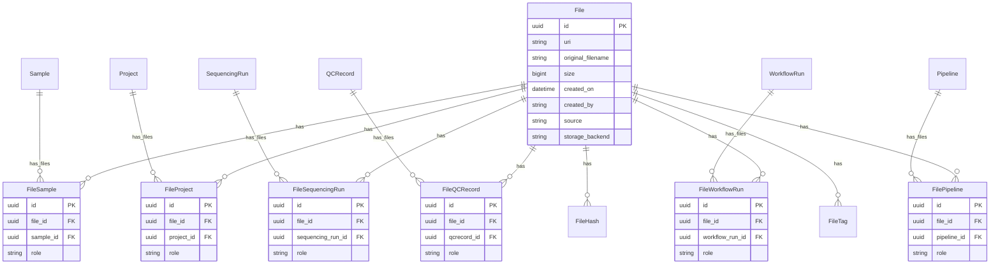

# Phase 2: File Association Evolution

**Status:** Draft — awaiting review
**Date:** 2026-03-05
**Context:** Phase 1 entities are implemented. This document scopes Phase 2 from the [gap analysis](plans/model-migration-gap-analysis.md:248) — replacing the polymorphic [`FileEntity`](api/files/models.py:119) pattern with typed junction tables that have real FK constraints.

**Design Principle:** More tables with referential guarantees over loose polymorphism.

**Key dependency:** Phase 3 ([`qcmetrics-multi-entity-extension.md`](plans/qcmetrics-multi-entity-extension.md)) also modifies `api/qcmetrics/services.py`. See [§10 Phase 3 Coordination](#103-phase-3-coordination-shared-qcmetrics-code) for sequencing requirements.

---

## 1. Problem Statement

The current [`FileEntity`](api/files/models.py:119) table uses a polymorphic pattern to associate files with entities:

```
FileEntity:
  file_id: uuid FK → file.id
  entity_type: enum  -- PROJECT, RUN, SAMPLE, QCRECORD
  entity_id: str     -- string identifier (no FK constraint)
  role: str | None
```

### Weaknesses

| Issue | Impact |
|-------|--------|
| **No referential integrity** | `entity_id` is a bare string — the database cannot enforce that the referenced entity exists |
| **No cascade deletes** | Deleting a Project/Run/QCRecord does not automatically clean up FileEntity rows |
| **String ID mismatch** | Most entities use UUID PKs, but `entity_id` is a string. For Project it stores `project_id` (business key), for QCRecord it stores the UUID as a string |
| **No JOIN efficiency** | Cannot do typed JOINs; queries require filtering by `entity_type` + casting `entity_id` |
| **Cannot reference new entities** | Phase 1 added [`WorkflowRun`](api/workflow/models.py:86) and [`Pipeline`](api/pipeline/models.py:36) — these cannot be associated with files via FileEntity without extending the enum, and would still lack FK integrity |

### What Works Well

[`FileSample`](api/files/models.py:93) already demonstrates the correct pattern — a typed junction table with a real FK to `sample.id`, cascade deletes, and role support. This is the pattern to follow.

---

## 2. Current State

### File Association Tables

| Table | Pattern | FK Integrity | Role Support | Status |
|-------|---------|-------------|-------------|--------|
| [`FileSample`](api/files/models.py:93) | Typed junction | ✅ FK → `sample.id` | ✅ `role` column | Keep as-is |
| [`FileEntity`](api/files/models.py:119) | Polymorphic | ❌ String `entity_id` | ✅ `role` column | Replace |

### FileEntity Usage by Entity Type

| `entity_type` | `entity_id` format | Used by | Replacement |
|--------------|-------------------|---------|-------------|
| `PROJECT` | `project.project_id` (string business key) | Standalone project files (manifests) | `FileProject` |
| `RUN` | Run barcode string | Run files (samplesheets) | `FileSequencingRun` |
| `SAMPLE` | Sample UUID as string | Legacy pattern — largely superseded by `FileSample` | Already covered by `FileSample` |
| `QCRECORD` | QCRecord UUID as string | Pipeline output files | `FileQCRecord` |

### Entities Needing New File Association (from Phase 1)

| Entity | Table | File Association Needed |
|--------|-------|----------------------|
| [`WorkflowRun`](api/workflow/models.py:86) | `workflowrun` | Input/output files of an execution |
| [`Pipeline`](api/pipeline/models.py:36) | `pipeline` | Definition files, documentation |

---

## 3. Design: Typed Junction Tables

### 3.1 New Tables

Each entity type gets its own junction table with real FK constraints, following the [`FileSample`](api/files/models.py:93) pattern.

#### FileProject

```python
class FileProject(SQLModel, table=True):
    """Associates a file with a project."""
    __tablename__ = "fileproject"
    __table_args__ = (
        UniqueConstraint("file_id", "project_id", name="uq_fileproject"),
    )

    id: uuid.UUID = Field(default_factory=uuid.uuid4, primary_key=True)
    file_id: uuid.UUID = Field(foreign_key="file.id", nullable=False)
    project_id: uuid.UUID = Field(foreign_key="project.id", nullable=False)
    role: str | None = Field(default=None, max_length=50)  # e.g., manifest, samplesheet
```

#### FileSequencingRun

```python
class FileSequencingRun(SQLModel, table=True):
    """Associates a file with a sequencing run."""
    __tablename__ = "filesequencingrun"
    __table_args__ = (
        UniqueConstraint("file_id", "sequencing_run_id", name="uq_filesequencingrun"),
    )

    id: uuid.UUID = Field(default_factory=uuid.uuid4, primary_key=True)
    file_id: uuid.UUID = Field(foreign_key="file.id", nullable=False)
    sequencing_run_id: uuid.UUID = Field(foreign_key="sequencingrun.id", nullable=False)
    role: str | None = Field(default=None, max_length=50)  # e.g., samplesheet, stats
```

#### FileQCRecord

```python
class FileQCRecord(SQLModel, table=True):
    """Associates a file with a QC record (pipeline output files)."""
    __tablename__ = "fileqcrecord"
    __table_args__ = (
        UniqueConstraint("file_id", "qcrecord_id", name="uq_fileqcrecord"),
    )

    id: uuid.UUID = Field(default_factory=uuid.uuid4, primary_key=True)
    file_id: uuid.UUID = Field(foreign_key="file.id", nullable=False)
    qcrecord_id: uuid.UUID = Field(foreign_key="qcrecord.id", nullable=False)
    role: str | None = Field(default=None, max_length=50)  # e.g., output, log
```

#### FileWorkflowRun

```python
class FileWorkflowRun(SQLModel, table=True):
    """Associates a file with a workflow execution."""
    __tablename__ = "fileworkflowrun"
    __table_args__ = (
        UniqueConstraint("file_id", "workflow_run_id", name="uq_fileworkflowrun"),
    )

    id: uuid.UUID = Field(default_factory=uuid.uuid4, primary_key=True)
    file_id: uuid.UUID = Field(foreign_key="file.id", nullable=False)
    workflow_run_id: uuid.UUID = Field(foreign_key="workflowrun.id", nullable=False)
    role: str | None = Field(default=None, max_length=50)  # e.g., input, output, log
```

#### FilePipeline

```python
class FilePipeline(SQLModel, table=True):
    """Associates a file with a pipeline."""
    __tablename__ = "filepipeline"
    __table_args__ = (
        UniqueConstraint("file_id", "pipeline_id", name="uq_filepipeline"),
    )

    id: uuid.UUID = Field(default_factory=uuid.uuid4, primary_key=True)
    file_id: uuid.UUID = Field(foreign_key="file.id", nullable=False)
    pipeline_id: uuid.UUID = Field(foreign_key="pipeline.id", nullable=False)
    role: str | None = Field(default=None, max_length=50)  # e.g., definition, documentation
```

### 3.2 Summary: All File Association Tables (Post-Phase 2)

| Table | FK Target | Role Support | Cascade Delete | Status |
|-------|-----------|-------------|----------------|--------|
| `filesample` | `sample.id` | ✅ | ✅ | Existing — no change |
| `fileproject` | `project.id` | ✅ | ✅ | **New** |
| `filesequencingrun` | `sequencingrun.id` | ✅ | ✅ | **New** |
| `fileqcrecord` | `qcrecord.id` | ✅ | ✅ | **New** |
| `fileworkflowrun` | `workflowrun.id` | ✅ | ✅ | **New** |
| `filepipeline` | `pipeline.id` | ✅ | ✅ | **New** |
| `fileentity` | *(none)* | ✅ | ❌ | **Dropped** in this phase |

---

## 4. Entity Relationship Diagram (Post-Phase 2)



---

## 5. API Changes

### 5.1 Request Model: FileCreate

The current [`FileCreate`](api/files/models.py:324) uses an `entities` list with polymorphic [`EntityInput`](api/files/models.py:311). This needs to be replaced with typed association inputs.

**Current:**
```python
class FileCreate(SQLModel):
    uri: str
    entities: List[EntityInput] | None = None      # polymorphic
    samples: List[SampleInput] | None = None        # typed (stays)
    ...
```

**Proposed:**
```python
class FileCreate(SQLModel):
    uri: str
    # Typed entity associations (replaces entities/EntityInput)
    project_id: uuid.UUID | None = None                          # single project
    sequencing_run_id: uuid.UUID | None = None                   # single run
    qcrecord_id: uuid.UUID | None = None                        # single QC record
    workflow_run_id: uuid.UUID | None = None                     # single workflow run
    pipeline_id: uuid.UUID | None = None                        # single pipeline
    # Existing
    samples: List[SampleInput] | None = None                    # stays as-is
    hashes: dict[str, str] | None = None
    tags: dict[str, str] | None = None
    ...
```

**Design rationale:** A file is typically produced by or belongs to a single execution context. Using scalar IDs rather than lists keeps the API simple for the common case. If a file needs to be associated with multiple entities of the same type, that can be done through separate API calls (or we can revisit if a real use case arises).

**Alternative considered:** Using `List[uuid.UUID]` for each entity type. Rejected because:
- The common case is 1 association per type (a file belongs to 1 QCRecord, produced by 1 WorkflowRun)
- Multiple associations of the same type are rare
- Scalar fields are simpler for callers

### 5.2 Response Model: FilePublic

**Current [`FilePublic`](api/files/models.py:399):**
```python
class FilePublic(SQLModel):
    entities: List[EntityPublic]        # polymorphic list
    samples: List[FileSamplePublic]     # typed
    ...
```

**Proposed:**
```python
class FileAssociationPublic(SQLModel):
    """Typed entity association in file responses."""
    entity_type: str          # PROJECT, SEQUENCING_RUN, QCRECORD, WORKFLOW_RUN, PIPELINE
    entity_id: uuid.UUID
    role: str | None

class FilePublic(SQLModel):
    id: uuid.UUID
    uri: str
    filename: str
    original_filename: str | None
    size: int | None
    created_on: datetime
    created_by: str | None
    source: str | None
    storage_backend: str | None
    associations: List[FileAssociationPublic]    # unified typed output
    samples: List[FileSamplePublic]              # stays as-is
    hashes: List[HashPublic]
    tags: List[TagPublic]
```

**Design rationale:** The response model unifies all typed junction tables into a single `associations` list for easy consumption. Each entry has the real UUID and entity type. This is display-only — the underlying storage uses proper FKs. Samples remain separate because they have the `role` semantic and are the most commonly queried association.

### 5.3 Role Values

Standard role values per entity type:

| Junction Table | Common Roles |
|---------------|-------------|
| `fileproject` | `manifest`, `samplesheet`, `documentation` |
| `filesequencingrun` | `samplesheet`, `stats`, `interop`, `runinfo` |
| `fileqcrecord` | `output`, `log`, `report` |
| `fileworkflowrun` | `input`, `output`, `log`, `intermediate` |
| `filepipeline` | `definition`, `documentation`, `config` |
| `filesample` | `tumor`, `normal`, `case`, `control`, *(null for single-sample)* |

Roles remain free-text strings (not enums) for flexibility — different pipelines and workflows produce different file types.

### 5.4 Clean Break — No Backward Compatibility

This system is fully in development with no production consumers. There is no need for deprecated fields, dual-write, or transition periods.

**What this means:**
- The `entities` field is **removed** from [`FileCreate`](api/files/models.py:324) — not deprecated, deleted
- [`EntityInput`](api/files/models.py:311) and [`FileEntityType`](api/files/models.py:31) are **deleted**
- The [`FileEntity`](api/files/models.py:119) model and table are **dropped** in the same migration that creates the typed tables
- The service layer writes **only** to typed junction tables — no dual-write path
- Existing dev data in `fileentity` is migrated to typed tables, then the table is dropped

---

## 6. Service Layer Changes

### 6.1 Modified: [`create_file()`](api/files/services.py:48)

The core file creation function needs to:
1. Accept typed entity IDs (project_id, sequencing_run_id, etc.)
2. Validate that referenced entities exist (the FK will enforce this, but we want good error messages)
3. Create rows in the appropriate typed junction tables

```python
def create_file(session: Session, file_create: FileCreate) -> File:
    # ... existing file record creation ...

    # Create typed entity associations
    if file_create.project_id:
        _validate_exists(session, Project, file_create.project_id)
        session.add(FileProject(
            file_id=file_record.id,
            project_id=file_create.project_id,
            role=None,  # or from a role field if needed
        ))

    if file_create.sequencing_run_id:
        _validate_exists(session, SequencingRun, file_create.sequencing_run_id)
        session.add(FileSequencingRun(
            file_id=file_record.id,
            sequencing_run_id=file_create.sequencing_run_id,
        ))

    if file_create.qcrecord_id:
        _validate_exists(session, QCRecord, file_create.qcrecord_id)
        session.add(FileQCRecord(
            file_id=file_record.id,
            qcrecord_id=file_create.qcrecord_id,
            role="output",
        ))

    if file_create.workflow_run_id:
        _validate_exists(session, WorkflowRun, file_create.workflow_run_id)
        session.add(FileWorkflowRun(
            file_id=file_record.id,
            workflow_run_id=file_create.workflow_run_id,
        ))

    if file_create.pipeline_id:
        _validate_exists(session, Pipeline, file_create.pipeline_id)
        session.add(FilePipeline(
            file_id=file_record.id,
            pipeline_id=file_create.pipeline_id,
        ))
```

### 6.2 Modified: [`file_to_public()`](api/files/models.py:469)

Updated to read from typed junction tables instead of `FileEntity`:

```python
def file_to_public(file: File) -> FilePublic:
    associations = []
    for fp in file.projects:
        associations.append(FileAssociationPublic(
            entity_type="PROJECT", entity_id=fp.project_id, role=fp.role
        ))
    for fsr in file.sequencing_runs:
        associations.append(FileAssociationPublic(
            entity_type="SEQUENCING_RUN", entity_id=fsr.sequencing_run_id, role=fsr.role
        ))
    for fqr in file.qcrecords:
        associations.append(FileAssociationPublic(
            entity_type="QCRECORD", entity_id=fqr.qcrecord_id, role=fqr.role
        ))
    for fwr in file.workflow_runs:
        associations.append(FileAssociationPublic(
            entity_type="WORKFLOW_RUN", entity_id=fwr.workflow_run_id, role=fwr.role
        ))
    for fpl in file.pipelines:
        associations.append(FileAssociationPublic(
            entity_type="PIPELINE", entity_id=fpl.pipeline_id, role=fpl.role
        ))
    # ... rest of conversion
```

### 6.3 Modified: Entity-based File Queries

Current queries like `GET /api/files?entity_type=RUN&entity_id=<barcode>` need to route to the correct typed table:

```python
def get_files_by_entity(session, entity_type: str, entity_id: str) -> List[File]:
    if entity_type == "SEQUENCING_RUN":
        # Resolve barcode to UUID, then query FileSequencingRun
        ...
    elif entity_type == "PROJECT":
        # Resolve project_id string to UUID, then query FileProject
        ...
    # etc.
```

### 6.4 Impact on QCMetrics Service

The [`create_qcrecord()`](api/qcmetrics/services.py) function currently creates `FileEntity` rows for output files. This needs to be updated to create `FileQCRecord` rows instead.

### 6.5 Impact on Run Cleanup

The [`clear_samples_for_run()`](api/runs/services.py) function currently deletes File records by querying FileEntity for `entity_type=RUN`. This needs to be updated to query `FileSequencingRun` instead.

---

## 7. Migration Strategy

### 7.1 Alembic Migration (Phase 2)

Single migration covering:

**New tables:**
- `fileproject` — id, file_id FK, project_id FK, role
- `filesequencingrun` — id, file_id FK, sequencing_run_id FK, role
- `fileqcrecord` — id, file_id FK, qcrecord_id FK, role
- `fileworkflowrun` — id, file_id FK, workflow_run_id FK, role
- `filepipeline` — id, file_id FK, pipeline_id FK, role

**Data migration within the migration:**
- Migrate existing `FileEntity` rows to the appropriate typed tables (see §7.2)
- **Drop** the `fileentity` table after data migration completes

**Dropped tables:**
- `fileentity` — all data moved to typed tables, then table is dropped

**Cascade delete configuration:**
- All new tables: `ON DELETE CASCADE` on both `file_id` and the entity FK

### 7.2 Data Migration Logic

```sql
-- PROJECT: entity_id is project.project_id (string) → need to resolve to project.id (UUID)
INSERT INTO fileproject (id, file_id, project_id, role)
SELECT UUID(), fe.file_id, p.id, fe.role
FROM fileentity fe
JOIN project p ON fe.entity_id = p.project_id
WHERE fe.entity_type = 'PROJECT';

-- RUN: entity_id is barcode string → need to resolve via barcode components
-- This is complex because SequencingRun has no barcode column — it is computed.
-- See Open Question Q1.

-- QCRECORD: entity_id is UUID string → cast to UUID
INSERT INTO fileqcrecord (id, file_id, qcrecord_id, role)
SELECT UUID(), fe.file_id, CAST(fe.entity_id AS CHAR(36)), fe.role
FROM fileentity fe
WHERE fe.entity_type = 'QCRECORD'
  AND EXISTS (SELECT 1 FROM qcrecord WHERE id = CAST(fe.entity_id AS CHAR(36)));

-- SAMPLE: entity_id via FileEntity is largely redundant with FileSample
-- Skip — FileSample already handles sample associations with proper FKs
```

---

## 8. Open Questions

### Q1: FileEntity RUN Resolution ✅ RESOLVED

**Problem:** `FileEntity` rows with `entity_type=RUN` store the run barcode (e.g., `240315_A00001_0001_BHXXXXXXX`) as the `entity_id`. The [`SequencingRun`](api/runs/models.py:22) table has no `barcode` column — the barcode is a computed property from `run_date`, `machine_id`, `run_number`, and `flowcell_id`.

**Decision:** Option B — Python migration script using [`SequencingRun.parse_barcode()`](api/runs/models.py:54). The barcode parsing logic already exists and handles both Illumina and ONT formats. Run once as a standalone script, not embedded in the Alembic migration.

### Q2: FileProject FK Target ✅ RESOLVED

**Decision:** FK to `project.id` (UUID). Consistent with every other typed junction table in the system ([`FileSample`](api/files/models.py:93), [`SampleSequencingRun`](api/runs/models.py:312), [`PipelineWorkflow`](api/pipeline/models.py:49), etc.). The service layer resolves the human-readable `project_id` string to the UUID at the API boundary. This also aligns with the decision in [`q3-sample-project-id-fk-analysis.md`](plans/q3-sample-project-id-fk-analysis.md) — string business keys are used at the API level, UUID FKs are used at the storage level.

### Q3: FileCreate Input Shape ✅ RESOLVED

**Decision:** Scalar fields (see section 5.1). A file typically belongs to one entity of each type (one project, one run, one QCRecord, etc.). Scalar IDs keep the API simple for the common case. If a file needs to be associated with additional entities of the same type, that can be done through separate API calls (e.g., `POST /files/{id}/associations`) — though no such use case exists today.

**Note:** `FileCreate` is also used inside [`QCRecordCreate.output_files`](api/qcmetrics/models.py:199). Phase 3 does not modify `FileCreate`, but changes to its shape affect how output files are submitted in QCRecord creation requests. Currently the QCMetrics service auto-populates `FileEntity(entity_type=QCRECORD)` associations — after Phase 2, this internal logic creates `FileQCRecord` rows instead, and the `FileCreate` objects inside `output_files` do NOT need `qcrecord_id` set by the caller (the service handles it). This is consistent with how it works today.

### Q4: Response Shape Change ✅ RESOLVED

**Decision:** Option B — clean rename (`entities` → `associations`). No production consumers exist. The gap analysis confirms no external API consumers are in place, and the Phase 3 plan shows no dependency on the old `entities` response field name.

### Q5: FileUploadCreate Update ✅ RESOLVED

**Decision:** Yes, update [`FileUploadCreate`](api/files/models.py:353) to use typed fields. Replace `entity_type`/`entity_id` with typed fields like `project_id`, `sequencing_run_id`, etc. — only one will be populated per upload.

### Q6: Cascade Delete Direction ✅ RESOLVED

**Decision:** `ON DELETE CASCADE` in both directions on all new tables:
- `file_id` FK → cascade when file is deleted
- Entity FK → cascade when entity is deleted

This matches [`FileSample`](api/files/models.py:93) behavior and is consistent with the Phase 3 plan for [`QCMetricSequencingRun`](plans/qcmetrics-multi-entity-extension.md:224) and [`QCMetricWorkflowRun`](plans/qcmetrics-multi-entity-extension.md:246).

**Important for Phase 3:** The `FileQCRecord` cascade means that when a QCRecord is deleted, its junction rows are automatically cleaned up. The [`create_qcrecord()`](api/qcmetrics/services.py) delete path currently also explicitly deletes the `File` records themselves (since QCRecord output files typically have no other entity associations). This explicit File deletion logic must be preserved in Phase 2 — cascade only removes the junction row, not the File itself.

---

## 9. Implementation Checklist

### Database Changes
- [ ] Create `fileproject` table with FK constraints and unique constraint
- [ ] Create `filesequencingrun` table with FK constraints and unique constraint
- [ ] Create `fileqcrecord` table with FK constraints and unique constraint
- [ ] Create `fileworkflowrun` table with FK constraints and unique constraint
- [ ] Create `filepipeline` table with FK constraints and unique constraint
- [ ] Configure `ON DELETE CASCADE` on all FKs in all new tables
- [ ] Add indexes on entity FK columns in all new tables
- [ ] Write Alembic migration for new tables + `fileentity` drop
- [ ] Write data migration to populate typed tables from existing `FileEntity` data
- [ ] Drop `fileentity` table after data migration

### Model Changes (`api/files/models.py`)
- [ ] Add `FileProject` SQLModel class
- [ ] Add `FileSequencingRun` SQLModel class
- [ ] Add `FileQCRecord` SQLModel class
- [ ] Add `FileWorkflowRun` SQLModel class
- [ ] Add `FilePipeline` SQLModel class
- [ ] Add relationships on [`File`](api/files/models.py:151) for new junction tables
- [ ] Add `FileAssociationPublic` response model
- [ ] Replace [`FileCreate`](api/files/models.py:324) `entities` with typed entity ID scalar fields
- [ ] Update [`FilePublic`](api/files/models.py:399) to use `associations` from typed tables
- [ ] Update [`FileUploadCreate`](api/files/models.py:353) with typed entity ID fields
- [ ] Update [`file_to_public()`](api/files/models.py:469) to read from typed junction tables
- [ ] Update [`file_to_summary()`](api/files/models.py:503) if needed
- [ ] Delete [`FileEntityType`](api/files/models.py:31) enum
- [ ] Delete [`EntityInput`](api/files/models.py:311) model
- [ ] Delete [`FileEntity`](api/files/models.py:119) model class
- [ ] Remove `entities` relationship from [`File`](api/files/models.py:184)

### Service Changes (`api/files/services.py`)
- [ ] Update [`create_file()`](api/files/services.py:48) to create typed junction rows
- [ ] Add entity existence validation with clear error messages
- [ ] Remove all `FileEntity` creation logic
- [ ] Update entity-based file query logic to use typed tables
- [ ] Update file upload service to use typed entity IDs

### QCMetrics Integration (`api/qcmetrics/services.py`)
- [ ] Update [`create_qcrecord()`](api/qcmetrics/services.py) to create `FileQCRecord` instead of `FileEntity`
- [ ] Update QCRecord delete logic to use `FileQCRecord` for file cleanup
- [ ] Update [`_qcrecord_to_public()`](api/qcmetrics/services.py) to read file associations from `FileQCRecord`

### Run Cleanup Integration (`api/runs/services.py`)
- [ ] Update [`clear_samples_for_run()`](api/runs/services.py) to query `FileSequencingRun` instead of `FileEntity`
- [ ] Update run file upload to create `FileSequencingRun` rows

### Route Changes
- [ ] Update file creation endpoints to accept typed entity IDs
- [ ] Update file query endpoints to route to typed tables
- [ ] Keep `entity_type`/`entity_id` query params working (resolve internally to typed tables)

### Tests
- [ ] Test creating files with each typed entity association
- [ ] Test FK validation — referencing non-existent entity returns 404
- [ ] Test cascade delete — deleting entity removes junction rows
- [ ] Test cascade delete — deleting file removes all junction rows
- [ ] Test file query by each entity type
- [ ] Test QCRecord file association via new `FileQCRecord` table
- [ ] Test run cleanup uses `FileSequencingRun`
- [ ] Test file upload with typed entity IDs
- [ ] Update existing file tests to use typed fields (remove `entities`/`EntityInput` usage)

### Documentation
- [ ] Update [`docs/ER_DIAGRAM.md`](docs/ER_DIAGRAM.md) with new junction tables
- [ ] Update [`docs/FILE_MODEL.md`](docs/FILE_MODEL.md) with typed association pattern
- [ ] Update [`plans/model-migration-gap-analysis.md`](plans/model-migration-gap-analysis.md) Phase 2 to reflect this plan

---

## 10. Relationship to Other Phases

### 10.1 Depends On
- **Phase 1** ✅ (completed) — Provides [`WorkflowRun`](api/workflow/models.py:86), [`Pipeline`](api/pipeline/models.py:36), [`Platform`](api/platforms/models.py:11) entities

### 10.2 Parallel With
- **Phase 3 (QCMetrics Extension)** — described in [`qcmetrics-multi-entity-extension.md`](plans/qcmetrics-multi-entity-extension.md). Uses the same typed junction table pattern. See §10.3 below for coordination details.
- **Phase 3.5 (Provenance Backfill)** — adding `created_at`/`created_by` to existing entities is independent.

### 10.3 Phase 3 Coordination — Shared QCMetrics Code

Phase 2 and Phase 3 both modify code in `api/qcmetrics/`. This section identifies the specific interactions and ensures nothing built in Phase 2 is immediately undone by Phase 3.

#### What Phase 2 Changes in QCMetrics

| Component | Phase 2 Change | Why |
|-----------|---------------|-----|
| [`create_qcrecord()`](api/qcmetrics/services.py) | Replace `FileEntity` creation with `FileQCRecord` creation for output files | File association migration |
| QCRecord delete logic | Query `FileQCRecord` instead of `FileEntity` to find files to delete | File association migration |
| [`_qcrecord_to_public()`](api/qcmetrics/services.py) | Read file associations from `FileQCRecord` instead of `FileEntity` | Response assembly |

#### What Phase 3 Changes in QCMetrics

| Component | Phase 3 Change | Why |
|-----------|---------------|-----|
| [`QCRecord`](api/qcmetrics/models.py:128) | Add `workflow_run_id` nullable FK | Provenance link |
| [`create_qcrecord()`](api/qcmetrics/services.py) | Accept and store `workflow_run_id`; create `QCMetricSequencingRun`/`QCMetricWorkflowRun` rows | Multi-entity scoping |
| [`_qcrecord_to_public()`](api/qcmetrics/services.py) | Include new associations in response | Response assembly |
| Search endpoints | Filter by `sequencing_run_id`, `workflow_run_id` | New query patterns |

#### Conflict Analysis

| Area | Conflict? | Resolution |
|------|-----------|-----------|
| `create_qcrecord()` — file storage | ❌ No conflict | Phase 2 changes *how files are stored* (FileQCRecord vs FileEntity). Phase 3 changes *what metadata is stored* (workflow_run_id, metric associations). These are independent code paths within the same function. |
| `_qcrecord_to_public()` | ❌ No conflict | Phase 2 changes the *file association section*. Phase 3 changes the *metric association section*. Different parts of the response. |
| QCRecord model | ❌ No conflict | Phase 2 does not modify the QCRecord model. Phase 3 adds `workflow_run_id`. |
| `QCRecordCreate` request model | ⚠️ Mild overlap | Phase 2 may affect `output_files` handling (inside FileCreate). Phase 3 adds `workflow_run_id`. Both add new fields — no removal. **Order does not matter.** |
| Phase 3 ER diagram | ⚠️ Needs update | The Phase 3 ER diagram in [`qcmetrics-multi-entity-extension.md`](plans/qcmetrics-multi-entity-extension.md:294) still shows `QCRecord ||--o{ FileEntity : has_files`. After Phase 2, this should read `QCRecord ||--o{ FileQCRecord : has_files`. **This is a documentation fix, not a code conflict.** |

#### Recommended Sequencing

Either phase can go first. However, implementing Phase 2 first is slightly preferable because:

1. Phase 2 changes the file storage mechanism (`FileEntity` → `FileQCRecord`) which Phase 3's code will then naturally use
2. If Phase 3 goes first, its code would write to `FileEntity` (the old way), and then Phase 2 would need to refactor that code again
3. The Phase 3 ER diagram correction is simpler if Phase 2 is already done

**Bottom line:** Phase 2 first avoids double-touching `create_qcrecord()` file logic. Phase 3 code can be written against the already-migrated `FileQCRecord` pattern.

#### What Phase 2 Must NOT Do (to avoid Phase 3 rework)

1. **Do NOT modify [`QCRecord`](api/qcmetrics/models.py:128) model fields** — Phase 3 adds `workflow_run_id`. Phase 2 should not touch the model beyond what's needed for file storage.
2. **Do NOT change the [`QCRecordCreate`](api/qcmetrics/models.py:189) request schema** beyond the `output_files` handling changes needed for `FileCreate` updates. Phase 3 adds `workflow_run_id` to this model.
3. **Do NOT modify [`MetricInput`](api/qcmetrics/models.py:183)** — Phase 3 adds `sequencing_runs` and `workflow_runs` fields. Phase 2 has no reason to touch this.
4. **Do NOT change QCMetrics search logic** — Phase 3 adds new filter capabilities. Phase 2 only changes file storage internals.

### 10.4 Feeds Into
- **Phase 4 (Data Migration & Cleanup)** — `FileEntity` is already dropped in this phase, so Phase 4 focuses on remaining non-file cleanup tasks (provenance backfill verification, index optimization, etc.)

### 10.5 Pattern Consistency

This plan uses the same **typed junction table** pattern as:
- [`FileSample`](api/files/models.py:93) (existing)
- [`SampleSequencingRun`](api/runs/models.py:312) (Phase 1)
- [`QCMetricSequencingRun`](plans/qcmetrics-multi-entity-extension.md:224) (Phase 3, planned)
- [`QCMetricWorkflowRun`](plans/qcmetrics-multi-entity-extension.md:246) (Phase 3, planned)

Every cross-entity relationship in the system will use proper FK-backed junction tables — no polymorphic `entity_type` + `entity_id` patterns remain after Phase 2.
