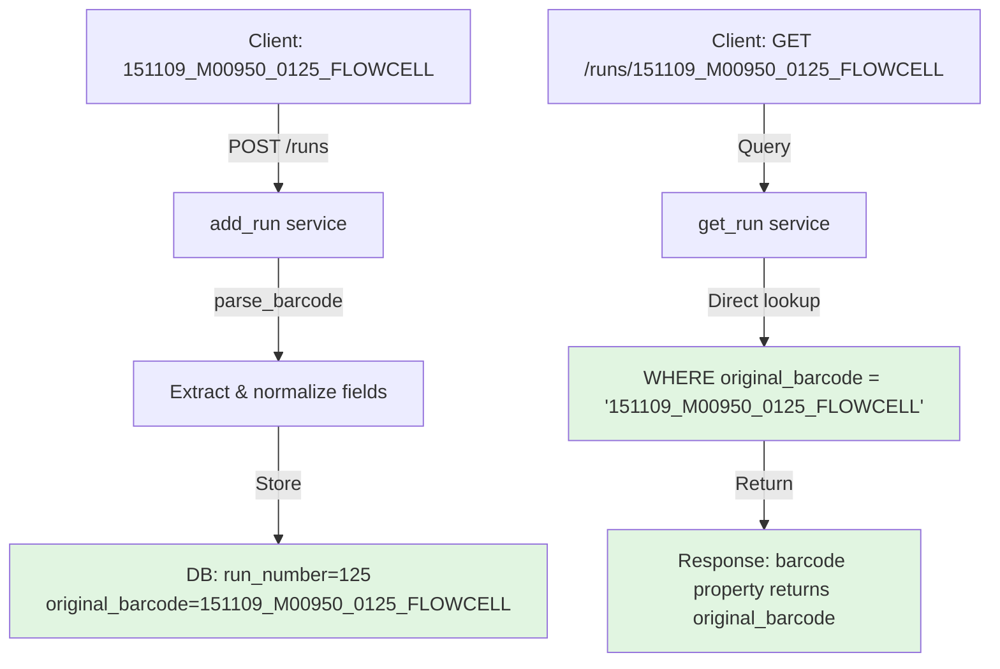

# Production Fix: Query Runs by original_barcode

## Problem Statement

**Production Issues:**
1. Lambda sends padded `run_number` (e.g., "0125") but API normalizes to unpadded (e.g., "125"), causing query mismatches
2. Users query with exact machine output `151109_M00950_0125_FLOWCELL` but get 404 because [`get_run()`](../api/runs/services.py:89) parses the barcode and queries normalized fields

**Root Cause:**
Current [`get_run()`](../api/runs/services.py:89) implementation:
- Calls `parse_barcode()` to extract normalized fields
- Queries by normalized `run_number` (padding stripped)
- Fails when user queries with padded barcode but DB has unpadded value

## Solution: Query by original_barcode

### Core Principle
- **Storage**: Normalize `run_number` internally (strip padding) - optimizes storage
- **Query**: Use `original_barcode` directly - no parsing, exact match lookup
- **Exposure**: Always return `original_barcode` as submitted - preserves user expectations

### Architecture



### Implementation Plan

## Phase 1: Database Migration (Backfill Legacy Data)

**Goal:** Populate `original_barcode` for thousands of existing runs

### Migration Script
Create Alembic migration:
```python
def upgrade():
    # Step 1: Backfill original_barcode for all runs where it's NULL
    connection = op.get_bind()
    result = connection.execute(text("""
        SELECT id, run_date, machine_id, run_number, flowcell_id
        FROM sequencingrun
        WHERE original_barcode IS NULL
    """))
    
    for row in result:
        # Reconstruct with 4-digit zero-padding
        run_date_str = row.run_date.strftime('%y%m%d')  # 6-digit format for legacy
        run_number_padded = str(row.run_number).zfill(4)
        reconstructed_barcode = f"{run_date_str}_{row.machine_id}_{run_number_padded}_{row.flowcell_id}"
        
        connection.execute(text("""
            UPDATE sequencingrun
            SET original_barcode = :barcode
            WHERE id = :run_id
        """), {"barcode": reconstructed_barcode, "run_id": row.id})
    
    # Step 2: Add unique constraint
    op.create_unique_constraint('uq_sequencingrun_original_barcode', 
                               'sequencingrun', 
                               ['original_barcode'])
```

**Why 4-digit padding?**
- Legacy runs from Illumina machines use format `YYMMDD_MACHINE_NNNN_FLOWCELL`
- Run numbers are padded to 4 digits (e.g., 0125, not 125)
- ETL stripped padding when converting to integer, but original machine output had padding
- Reconstruction must match original machine format for consistency

**Verification:**
```sql
-- Before migration
SELECT run_number, original_barcode FROM sequencingrun WHERE id = 6067;
-- Result: run_number=125, original_barcode=NULL

-- After migration
SELECT run_number, original_barcode FROM sequencingrun WHERE id = 6067;
-- Result: run_number=125, original_barcode='151109_M00950_0125_000000000-AKDLF'
```

## Phase 2: Fix Query Logic (Critical Production Fix)

### Current Implementation (BROKEN)
[`api/runs/services.py:89-111`](../api/runs/services.py:89-111):
```python
def get_run(*, session: Session, run_barcode: str) -> SequencingRun | None:
    """Retrieve a sequencing run from the database."""
    (run_date, run_time, machine_id, run_number, flowcell_id) = (
        SequencingRun.parse_barcode(run_barcode)  # ← NORMALIZES run_number
    )
    try:
        run = session.exec(
            select(SequencingRun).where(
                SequencingRun.run_date == run_date,
                SequencingRun.machine_id == machine_id,
                SequencingRun.run_number == run_number,  # ← Queries normalized "125"
                SequencingRun.flowcell_id == flowcell_id,
            )
        ).one_or_none()
```

**Problem:** 
- User queries with `151109_M00950_0125_FLOWCELL` (padded)
- `parse_barcode()` strips padding → `run_number = "125"`
- Query fails if user expects padding or if there's any mismatch

### New Implementation (FIXED)
```python
def get_run(*, session: Session, run_barcode: str) -> SequencingRun | None:
    """Retrieve a sequencing run by its original barcode.
    
    Args:
        session: Database session
        run_barcode: The exact barcode as submitted by the machine or user
        
    Returns:
        SequencingRun if found, None otherwise
    """
    try:
        run = session.exec(
            select(SequencingRun).where(
                SequencingRun.original_barcode == run_barcode
            )
        ).one_or_none()
    except Exception as e:
        logger.error(f"Error retrieving run {run_barcode}: {e}")
        return None
    return run
```

**Benefits:**
- ✅ No parsing/normalization → no padding mismatches
- ✅ Exact match lookup → predictable behavior
- ✅ Unique constraint on `original_barcode` → fast indexed query
- ✅ Simpler code → fewer bugs

## Phase 3: Ensure Proper Data Flow

### Client Behavior (Already Correct)

**runs_cp.sh** ([`../NGS360-IlluminaCleanUpScripts/runs_cp.sh:119`](../NGS360-IlluminaCleanUpScripts/runs_cp.sh:119)):
```bash
# Strips padding from run_number for normalized storage
_run_number=$((10#$_run_number))

# BUT also sends original_barcode for query/display
local _json="{
  \"run_number\": \"${_run_number}\",           # ← Normalized: "125"
  \"original_barcode\": \"${_run_id}\",        # ← Padded: "151109_M00950_0125_..."
  ...
}"
```
✅ Already correct!

**collectRunMetrics Lambda** ([`../NGS360-collectRunMetrics-lambda/collect_run_metrics/collect_run_metrics.py:439`](../NGS360-collectRunMetrics-lambda/collect_run_metrics/collect_run_metrics.py:439)):
```python
# Currently sends padded run_number from XML (e.g., "0125")
run_number = run_info["RunInfo"]["Run"]["@Number"]

data = {
    "run_number": run_number,              # ← Padded: "0125"
    "original_barcode": run_barcode,       # ← Padded: "151109_M00950_0125_..."
}
```

**Issue:** Lambda sends padded `run_number`, but API's `add_run()` service uses `parse_barcode()` which expects it to be normalized.

**Fix Options:**
1. **Option A (Recommended):** API's `add_run()` accepts padded run_number and normalizes it
2. **Option B:** Lambda normalizes before sending (breaks separation of concerns)

**Recommendation:** Keep lambda sending exact machine output, let API normalize. This is already the design!

### API add_run() Service

[`api/runs/services.py:54-86`](../api/runs/services.py:54-86):
```python
def add_run(
    *,
    session: Session,
    run: SequencingRunCreate,
) -> SequencingRun:
    """Add a new sequencing run to the database and index it in OpenSearch."""
    # Parse barcode to extract and normalize fields
    (run_date, run_time, machine_id, run_number, flowcell_id) = (
        SequencingRun.parse_barcode(run.run_barcode)
    )
    
    # Check if run already exists (using normalized fields)
    existing_run = get_run_by_composite_key(
        session=session, 
        run_date=run_date,
        machine_id=machine_id,
        run_number=run_number,  # Normalized
        flowcell_id=flowcell_id
    )
```

**Current Issue:** The `run` object from Pydantic might have padded `run_number` in its dict, but `parse_barcode()` provides normalized values.

**Solution:** Ensure `SequencingRun` creation uses parsed normalized fields:
```python
db_run = SequencingRun(
    run_date=run_date,           # From parse_barcode
    run_time=run_time,           # From parse_barcode
    machine_id=machine_id,       # From parse_barcode
    run_number=run_number,       # From parse_barcode (normalized!)
    flowcell_id=flowcell_id,     # From parse_barcode
    original_barcode=run.original_barcode,  # From request (as submitted)
    experiment_name=run.experiment_name,
    run_folder_uri=run.run_folder_uri,
    status=run.status,
)
```

This is already the pattern used! ✅

## Phase 4: Testing Strategy

### Test Cases

**1. POST with padded barcode, GET with same padded barcode**
```python
def test_post_get_with_padded_barcode(client: TestClient):
    # POST run with padded run_number
    response = client.post("/api/v1/runs", json={
        "run_date": "2025-01-10",
        "machine_id": "M00950",
        "run_number": "0125",  # Padded
        "flowcell_id": "FLOWCELL123",
        "original_barcode": "250110_M00950_0125_FLOWCELL123",
        "status": "Ready"
    })
    assert response.status_code == 200
    
    # Verify normalized storage
    run_data = response.json()
    assert run_data["run_number"] == "125"  # Stored normalized
    assert run_data["barcode"] == "250110_M00950_0125_FLOWCELL123"  # Exposed as submitted
    
    # GET with original padded barcode
    get_response = client.get("/api/v1/runs/250110_M00950_0125_FLOWCELL123")
    assert get_response.status_code == 200
    assert get_response.json()["barcode"] == "250110_M00950_0125_FLOWCELL123"
```

**2. Legacy run queryable after backfill**
```python
def test_legacy_run_after_migration(client: TestClient, session: Session):
    # Simulate legacy run (normalized run_number, no original_barcode)
    legacy_run = SequencingRun(
        run_date=datetime.date(2015, 11, 9),
        machine_id="M00950",
        run_number="125",  # Unpadded (from ETL)
        flowcell_id="000000000-AKDLF",
        original_barcode=None,  # Legacy: no original_barcode
        status="Ready",
    )
    session.add(legacy_run)
    session.commit()
    
    # Run migration (backfill original_barcode)
    # ... migration logic ...
    
    # Verify reconstructed barcode
    session.refresh(legacy_run)
    assert legacy_run.original_barcode == "151109_M00950_0125_000000000-AKDLF"
    
    # Query with reconstructed barcode
    response = client.get("/api/v1/runs/151109_M00950_0125_000000000-AKDLF")
    assert response.status_code == 200
    assert response.json()["barcode"] == "151109_M00950_0125_000000000-AKDLF"
```

**3. Lambda can query run it just created**
```python
def test_lambda_workflow(client: TestClient):
    # Lambda posts run with padded run_number from XML
    post_response = client.post("/api/v1/runs", json={
        "run_date": "2025-01-10",
        "machine_id": "HISEQ",
        "run_number": "0012",  # Padded (from XML)
        "flowcell_id": "FLOWCELLXYZ",
        "original_barcode": "250110_HISEQ_0012_FLOWCELLXYZ",
        "status": "Ready"
    })
    assert post_response.status_code == 200
    
    # Lambda queries with same barcode
    get_response = client.get("/api/v1/runs/250110_HISEQ_0012_FLOWCELLXYZ")
    assert get_response.status_code == 200
    run_data = get_response.json()
    assert run_data["run_number"] == "12"  # Normalized storage
    assert run_data["barcode"] == "250110_HISEQ_0012_FLOWCELLXYZ"  # Exposed as submitted
```

## Phase 5: Schema Enforcement (Post-Migration)

After migration completes and backfill is verified:

### Make original_barcode Required

**Migration:**
```python
def upgrade():
    # Make NOT NULL
    op.alter_column('sequencingrun', 'original_barcode',
                   existing_type=sa.String(length=100),
                   nullable=False)
```

**Model Update:**
```python
class SequencingRun(SQLModel, table=True):
    original_barcode: str = Field(max_length=100)  # Remove | None
```

**Pydantic Validation:**
```python
class SequencingRunCreate(SQLModel):
    original_barcode: str  # Required
```

## Benefits Summary

| Aspect | Before | After |
|--------|--------|-------|
| **Query method** | Parse + normalize + field-based lookup | Direct lookup by original_barcode |
| **404 errors** | Frequent (padding mismatches) | Eliminated (exact match) |
| **Code complexity** | High (parse logic in query path) | Low (simple WHERE clause) |
| **Client coordination** | Required (must normalize) | Not required (send as-is) |
| **Performance** | 4 field comparisons | 1 indexed unique key lookup |
| **Maintenance** | Fragile (padding conventions vary) | Robust (exact string match) |

## Migration Risk Assessment

**Low Risk:**
- ✅ Non-breaking change (queries continue to work during migration)
- ✅ Backfill is idempotent (can re-run safely)
- ✅ Unique constraint prevents duplicates
- ✅ No data loss (only adding information)

**Rollback Plan:**
- Drop unique constraint
- Revert `get_run()` to old implementation
- `original_barcode` column can remain (nullable)

## Deployment Steps

1. **Deploy migration** (add unique constraint + backfill)
2. **Verify** all runs have `original_barcode` populated
3. **Deploy API change** (update `get_run()` to query by original_barcode)
4. **Monitor** for 404s (should decrease immediately)
5. **Phase 2 migration** (make `original_barcode` NOT NULL)
6. **Update client validation** to require original_barcode

## Conclusion

This solution:
- ✅ Fixes production 404 issues immediately
- ✅ Simplifies query logic (remove parsing)
- ✅ Maintains normalized storage (efficient)
- ✅ Always exposes barcode as submitted (user-friendly)
- ✅ No breaking changes to clients (they already send original_barcode)
- ✅ Single code path for all queries (no legacy branches)
