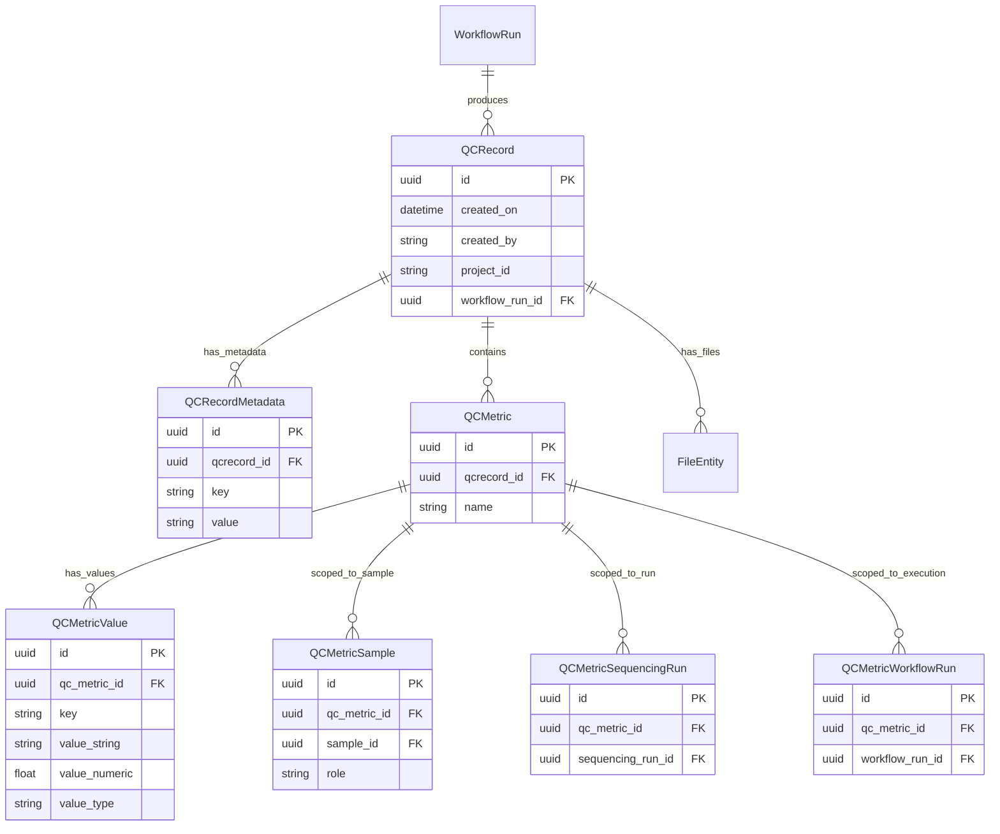

# QCMetrics Multi-Entity Extension Plan

**Status:** Draft — awaiting review  
**Date:** 2026-03-05  
**Context:** Phase 1 entities (WorkflowRun, Pipeline, SampleSequencingRun, Platform) are implemented. This document addresses Phase 3 from the [gap analysis](plans/model-migration-gap-analysis.md) — extending QCMetrics to support multiple entity types beyond samples.

---

## 1. Problem Statement

The current QC model associates metrics only with **Samples** (via [`QCMetricSample`](api/qcmetrics/models.py:73)). In practice, QC metrics are produced for and describe many entity types:

| Entity | Example Metrics | Current Support |
|--------|----------------|-----------------|
| **Sample** | alignment_rate, read_count, coverage | ✅ Via QCMetricSample |
| **Sample pair** | TMB, somatic variant count (tumor/normal) | ✅ Via QCMetricSample with roles |
| **Workflow-level** | runtime, total_samples_processed | ✅ Via QCMetric with 0 sample rows |
| **SequencingRun** | yield_gbp, cluster_density, percent_q30 | ❌ No association path |
| **WorkflowRun** | peak_memory_gb, cpu_hours, exit_code | ❌ No association path |

Additionally, there is no way to track **which execution produced** a set of QC metrics — the current [`QCRecord`](api/qcmetrics/models.py:128) stores pipeline provenance as free-text KV pairs in [`QCRecordMetadata`](api/qcmetrics/models.py:25) rather than a proper FK to [`WorkflowRun`](api/workflow/models.py:86).

---

## 2. Current Model Review

### Strengths (to preserve)

The current QC hierarchy in [`api/qcmetrics/models.py`](api/qcmetrics/models.py:1) has several well-considered design decisions:

1. **Named metric groups** — [`QCMetric.name`](api/qcmetrics/models.py:112) groups related values semantically (e.g., `sample_qc` with 37 KV pairs). This is crucial for usability — querying "all QC for sample X" returns a few grouped metrics, not hundreds of individual rows.

2. **Dual-storage values** — [`QCMetricValue`](api/qcmetrics/models.py:45) stores both `value_string` and `value_numeric` with `value_type`, enabling both string matching and numeric range queries.

3. **Flexible sample cardinality** — [`QCMetricSample`](api/qcmetrics/models.py:73) supports 0 (workflow-level), 1 (single-sample), or N (paired) associations via the same mechanism.

4. **Batch container** — [`QCRecord`](api/qcmetrics/models.py:128) serves as a batch container for a pipeline execution, grouping all metrics and output files from one run.

5. **Versioning** — Multiple QCRecords per project are allowed, differentiated by `created_on`, giving full history.

### Weaknesses (to address)

1. **No provenance FK** — [`QCRecord.project_id`](api/qcmetrics/models.py:144) is a plain string (not even a FK to Project), and pipeline identity is stored as free-text metadata. There is no structured link to the execution that produced the data.

2. **Sample-only scoping** — Metrics can only be associated with samples. There is no way to say "this metric describes SequencingRun X" or "this metric describes WorkflowRun Y."

3. **QCRecord.project_id is not a FK** — It is a loose string with no referential integrity to the Project table. (This was a deliberate choice to allow QC records for projects not yet registered, but it means no cascading or validation.)

---

## 3. Options Analysis

### Option A: QC_ENTITY + QC_ENTITY_MEMBER (from Discussion doc)

This is the approach proposed in [`Entities and Relationships Discussion.md`](plans/Entities and Relationships Discussion.md:44).

**Design:**
```
QC_ENTITY (id, entity_scope, entity_type)
QC_ENTITY_MEMBER (qc_entity_id FK, member_id uuid, member_type str, role str)
QC_METRIC (id, qc_entity_id FK, name, value float, unit str, tool_name, tool_version, ...)
```

**How it works:** A `QC_ENTITY` is created as a container for one measurement context. `QC_ENTITY_MEMBER` links domain entities (Sample, SequencingRun, WorkflowRun, etc.) to the container via polymorphic `member_id` + `member_type`. Each `QC_METRIC` row stores a single value.

**Pros:**
- Fully generic — any entity type can be a member without schema changes
- Single unified QC model for all scoping patterns
- Clean conceptual separation: "QC Entity" is the measured context

**Cons:**
- **No referential integrity** — `member_id` is a bare UUID with `member_type` as a string discriminator. The database cannot enforce that the referenced entity exists. This is the same polymorphic anti-pattern the [gap analysis criticizes about FileEntity](plans/model-migration-gap-analysis.md:149).
- **Flattened metrics lose grouping** — The proposal shows `QC_METRIC` with a single `float value` + `string unit`. Converting the current model where 1 `QCMetric` + 37 `QCMetricValue` rows represent one metric group would produce 37 individual `QC_METRIC` rows, losing the semantic grouping. To reconstruct "show me the sample_qc metrics for sample X," you would need to know which individual metrics belong to the `sample_qc` group — requiring either a `group_name` column (reinventing `QCMetric.name`) or an application-level convention.
- **Replaces working code** — All current QC endpoints, services, tests, and ETL would need to be rewritten.
- **Extra indirection layer** — Querying "all metrics for Sample X" requires: find QC_ENTITY_MEMBER rows → get QC_ENTITY ids → join to QC_METRIC. The current path is: find QCMetricSample rows → get QCMetric ids → done.
- **Conflates provenance and subject** — "This WorkflowRun produced these metrics" vs "these metrics describe this WorkflowRun" are different relationships, but both use the same QC_ENTITY_MEMBER mechanism.

**Verdict:** ❌ Not recommended. The abstraction cost outweighs the flexibility benefit, especially given the loss of referential integrity and metric grouping.

---

### Option B: Single Polymorphic QCMetricEntity Table

**Design:** Replace `QCMetricSample` with a single polymorphic junction table:

```
QCMetricEntity (NEW — replaces QCMetricSample):
  id: uuid PK
  qc_metric_id: uuid FK → qcmetric.id
  entity_type: enum  -- SAMPLE, SEQUENCING_RUN, WORKFLOW_RUN
  entity_id: uuid    -- ID of the referenced entity (no FK constraint)
  role: str | None
```

**How it works:** Same pattern as current [`FileEntity`](api/files/models.py:119) — a single junction table with a type discriminator.

**Pros:**
- Single table for all entity associations — simple schema
- Easy to add new entity types (just add an enum value)
- Minimal schema change from current model (rename QCMetricSample → QCMetricEntity, add entity_type)

**Cons:**
- **No referential integrity** — same as Option A; `entity_id` cannot have an FK constraint because it references different tables depending on `entity_type`
- **Inconsistent with future direction** — the gap analysis [identifies the FileEntity polymorphic pattern as a weakness](plans/model-migration-gap-analysis.md:149) to eventually replace. Adopting the same pattern for QC would double down on a known problem.
- **Breaking change** — `QCMetricSample` has `sample_id` as a proper FK today; this would be a regression in data integrity
- **Loses the typed Sample relationship** — existing code that directly JOINs `QCMetricSample.sample_id` to `sample.id` would need to add a WHERE clause on `entity_type`

**Verdict:** ❌ Not recommended. Trades referential integrity for marginally less schema, and moves in the opposite direction from the project's stated goal of replacing polymorphic patterns with typed relationships.

---

### Option C: Typed Junction Tables (Recommended) ✅

**Design:** Keep [`QCMetricSample`](api/qcmetrics/models.py:73) unchanged. Add parallel typed junction tables for each new entity type. Add a provenance FK on [`QCRecord`](api/qcmetrics/models.py:128).

**New/modified tables:**

```
QCRecord (MODIFIED):
  id, created_on, created_by, project_id  -- existing, unchanged
  + workflow_run_id: uuid FK → workflowrun.id (nullable)  -- NEW: provenance

QCMetricSample (EXISTING — no changes):
  qc_metric_id FK → qcmetric.id
  sample_id FK → sample.id
  role: str | None

QCMetricSequencingRun (NEW):
  id: uuid PK
  qc_metric_id: uuid FK → qcmetric.id
  sequencing_run_id: uuid FK → sequencingrun.id
  UniqueConstraint on qc_metric_id, sequencing_run_id

QCMetricWorkflowRun (NEW):
  id: uuid PK
  qc_metric_id: uuid FK → qcmetric.id
  workflow_run_id: uuid FK → workflowrun.id
  UniqueConstraint on qc_metric_id, workflow_run_id
```

**How it works:** Each entity type gets its own small junction table with real FK constraints. The existing sample association pattern is preserved identically. The QCRecord gains a nullable FK to WorkflowRun for provenance tracking.

**Pros:**
- **Full referential integrity** — every FK is validated by the database; no orphaned references possible
- **Follows existing patterns** — matches [`FileSample`](api/files/models.py:93), [`SampleSequencingRun`](api/runs/models.py:312), and other typed junctions already in the codebase
- **Zero breaking changes** — all current QCMetricSample data, endpoints, queries, and tests remain valid
- **Additive only** — new tables and one nullable column; no modifications to existing tables
- **Clear semantics** — separate provenance (QCRecord.workflow_run_id) from subject (QCMetricSequencingRun, etc.)
- **Efficient queries** — each junction table is small, with proper FK indexes; query for "metrics for Run X" is a single JOIN

**Cons:**
- **More tables** — adding a new entity type requires a new junction table + Alembic migration (but this is infrequent)
- **No single polymorphic query** — "find all entities associated with this metric" requires LEFT JOINing multiple tables (but in practice, you almost always query from the entity side, not the metric side)

**Verdict:** ✅ **Recommended.** Maximizes data integrity, minimizes risk, and follows established patterns in the codebase.

---

### Option D: Hybrid — Typed Tables + Soft Polymorphic View

**Design:** Same as Option C for the physical tables, but add a database view or application-level abstraction that presents a unified interface.

```sql
-- Read-only view for convenience queries
CREATE VIEW qcmetric_entity_associations AS
  SELECT qc_metric_id, 'SAMPLE' as entity_type, sample_id as entity_id, role
  FROM qcmetricsample
  UNION ALL
  SELECT qc_metric_id, 'SEQUENCING_RUN', sequencing_run_id, NULL
  FROM qcmetricsequencingrun
  UNION ALL
  SELECT qc_metric_id, 'WORKFLOW_RUN', workflow_run_id, NULL
  FROM qcmetricworkflowrun;
```

**Pros:** All of Option C's benefits, plus a unified query interface when needed.

**Cons:** View maintenance overhead; potential confusion about which to use (view vs direct table).

**Verdict:** ⚠️ Acceptable enhancement to Option C, but not essential for initial implementation. Can be added later if cross-entity queries become common.

---

## 4. Detailed Design (Option C)

### 4.1 Modified: QCRecord

Add a nullable FK to [`WorkflowRun`](api/workflow/models.py:86) for execution provenance.

```python
# In api/qcmetrics/models.py — QCRecord class

class QCRecord(SQLModel, table=True):
    __tablename__ = "qcrecord"
    __searchable__ = ["project_id"]

    id: uuid.UUID = Field(default_factory=uuid.uuid4, primary_key=True)
    created_on: datetime = Field(
        default_factory=lambda: datetime.now(timezone.utc),
        nullable=False
    )
    created_by: str = Field(max_length=100, nullable=False)
    project_id: str = Field(max_length=50, nullable=False, index=True)

    # NEW: Optional provenance link to the execution that produced this data
    workflow_run_id: uuid.UUID | None = Field(
        default=None,
        foreign_key="workflowrun.id",
        nullable=True,
        index=True,
    )
```

**Notes:**
- Nullable because: (a) existing records have no workflow_run_id, (b) some QC data comes from external tools that are not tracked as WorkflowRuns, (c) run-level QC like demux stats may not have a formal WorkflowRun.
- Indexed for efficient lookups of "all QC data from this execution."
- [`QCRecordMetadata`](api/qcmetrics/models.py:25) is retained for additional pipeline metadata that does not map to WorkflowRun fields (e.g., configuration parameters, reference genome version).

### 4.2 New: QCMetricSequencingRun

Associates a metric group with a sequencing run.

```python
class QCMetricSequencingRun(SQLModel, table=True):
    """Associates a QCMetric group with a SequencingRun."""
    __tablename__ = "qcmetricsequencingrun"
    __table_args__ = (
        UniqueConstraint(
            "qc_metric_id", "sequencing_run_id",
            name="uq_qcmetric_seqrun"
        ),
    )

    id: uuid.UUID = Field(default_factory=uuid.uuid4, primary_key=True)
    qc_metric_id: uuid.UUID = Field(
        foreign_key="qcmetric.id", nullable=False, index=True
    )
    sequencing_run_id: uuid.UUID = Field(
        foreign_key="sequencingrun.id", nullable=False, index=True
    )
```

**Use case:** Storing demux statistics, per-lane yield, cluster density, %Q30, etc.

### 4.3 New: QCMetricWorkflowRun

Associates a metric group with a workflow execution.

```python
class QCMetricWorkflowRun(SQLModel, table=True):
    """Associates a QCMetric group with a WorkflowRun execution."""
    __tablename__ = "qcmetricworkflowrun"
    __table_args__ = (
        UniqueConstraint(
            "qc_metric_id", "workflow_run_id",
            name="uq_qcmetric_wfrun"
        ),
    )

    id: uuid.UUID = Field(default_factory=uuid.uuid4, primary_key=True)
    qc_metric_id: uuid.UUID = Field(
        foreign_key="qcmetric.id", nullable=False, index=True
    )
    workflow_run_id: uuid.UUID = Field(
        foreign_key="workflowrun.id", nullable=False, index=True
    )
```

**Use case:** Execution-specific metrics like runtime, peak memory, CPU hours, exit code.

### 4.4 Unchanged Components

| Component | File | Why Unchanged |
|-----------|------|---------------|
| [`QCRecordMetadata`](api/qcmetrics/models.py:25) | `api/qcmetrics/models.py` | Still useful for arbitrary pipeline KV metadata |
| [`QCMetric`](api/qcmetrics/models.py:97) | `api/qcmetrics/models.py` | Named metric groups remain semantically valuable |
| [`QCMetricValue`](api/qcmetrics/models.py:45) | `api/qcmetrics/models.py` | Dual string/numeric storage is well-designed |
| [`QCMetricSample`](api/qcmetrics/models.py:73) | `api/qcmetrics/models.py` | Already handles sample scoping perfectly |
| All existing endpoints | `api/qcmetrics/routes.py` | 100% backward compatible |

---

## 5. Entity Relationship Diagram (Post-Extension)



---

## 6. Real-World Usage Examples

### 6.1 SequencingRun-level QC (Demux Stats)

Run-level QC data from Illumina Stats.json or ONT summary:

```
QCRecord(project_id=null or "FACILITY", workflow_run_id=null)
└── QCMetric(name="run_qc")
    ├── QCMetricSequencingRun(sequencing_run_id=<run-uuid>)
    ├── QCMetricValue(key="yield_gbp", value_numeric=100.5)
    ├── QCMetricValue(key="cluster_density", value_numeric=1200000)
    ├── QCMetricValue(key="percent_q30", value_numeric=92.3)
    └── QCMetricValue(key="total_reads", value_numeric=800000000)
```

**API call:**
```json
POST /api/v1/qcmetrics
{
  "project_id": "FACILITY",
  "metrics": [
    {
      "name": "run_qc",
      "sequencing_runs": [{"sequencing_run_id": "<run-uuid>"}],
      "values": {
        "yield_gbp": 100.5,
        "cluster_density": 1200000,
        "percent_q30": 92.3
      }
    }
  ]
}
```

### 6.2 Per-Lane QC (Multiple Metrics per Run)

```
QCRecord(project_id="FACILITY")
├── QCMetric(name="lane_qc")  -- Lane 1
│   ├── QCMetricSequencingRun(sequencing_run_id=<run-uuid>)
│   ├── QCMetricValue(key="lane_number", value_numeric=1)
│   ├── QCMetricValue(key="yield_gbp", value_numeric=25.1)
│   └── QCMetricValue(key="percent_q30", value_numeric=93.5)
│
├── QCMetric(name="lane_qc")  -- Lane 2
│   ├── QCMetricSequencingRun(sequencing_run_id=<run-uuid>)
│   ├── QCMetricValue(key="lane_number", value_numeric=2)
│   ├── QCMetricValue(key="yield_gbp", value_numeric=24.8)
│   └── QCMetricValue(key="percent_q30", value_numeric=91.2)
```

### 6.3 Per-Sample QC from a Pipeline (Existing Pattern — Unchanged)

```
QCRecord(project_id="P-1234", workflow_run_id=<wfrun-uuid>)
├── QCMetric(name="sample_qc")
│   ├── QCMetricSample(sample_id=<sample-uuid>, role=null)
│   ├── QCMetricValue(key="reads", value_numeric=50000000)
│   └── QCMetricValue(key="alignment_rate", value_numeric=97.0)
```

### 6.4 Paired Tumor/Normal (Existing Pattern — Unchanged)

```
QCRecord(project_id="P-1234", workflow_run_id=<wfrun-uuid>)
└── QCMetric(name="somatic_variants")
    ├── QCMetricSample(sample_id=<tumor-uuid>, role="tumor")
    ├── QCMetricSample(sample_id=<normal-uuid>, role="normal")
    ├── QCMetricValue(key="tmb", value_numeric=8.5)
    └── QCMetricValue(key="snv_count", value_numeric=15234)
```

### 6.5 WorkflowRun Execution Metrics

Metrics about the execution itself (not the biological data):

```
QCRecord(project_id="P-1234", workflow_run_id=<wfrun-uuid>)
└── QCMetric(name="execution_stats")
    ├── QCMetricWorkflowRun(workflow_run_id=<wfrun-uuid>)
    ├── QCMetricValue(key="runtime_hours", value_numeric=4.5)
    ├── QCMetricValue(key="peak_memory_gb", value_numeric=32.0)
    └── QCMetricValue(key="cpu_hours", value_numeric=180.0)
```

### 6.6 Mixed Scoping (Sample + Run in Same QCRecord)

A pipeline that produces both sample-level and run-level QC:

```
QCRecord(project_id="P-1234", workflow_run_id=<wfrun-uuid>)
├── QCMetric(name="sample_qc")
│   ├── QCMetricSample(sample_id=<sample1-uuid>)
│   └── QCMetricValue(key="reads", value_numeric=50000000)
│
├── QCMetric(name="sample_qc")
│   ├── QCMetricSample(sample_id=<sample2-uuid>)
│   └── QCMetricValue(key="reads", value_numeric=45000000)
│
└── QCMetric(name="run_summary")
    ├── QCMetricSequencingRun(sequencing_run_id=<run-uuid>)
    └── QCMetricValue(key="demux_yield_gbp", value_numeric=100.5)
```

---

## 7. Query Patterns

### Find all QC metrics for a SequencingRun

```sql
SELECT qm.name, qmv.key, qmv.value_string, qmv.value_numeric
FROM qcmetric qm
JOIN qcmetricsequencingrun qmsr ON qm.id = qmsr.qc_metric_id
JOIN qcmetricvalue qmv ON qm.id = qmv.qc_metric_id
WHERE qmsr.sequencing_run_id = '<run-uuid>';
```

### Find all QC metrics for a WorkflowRun

```sql
SELECT qm.name, qmv.key, qmv.value_string, qmv.value_numeric
FROM qcmetric qm
JOIN qcmetricworkflowrun qmwr ON qm.id = qmwr.qc_metric_id
JOIN qcmetricvalue qmv ON qm.id = qmv.qc_metric_id
WHERE qmwr.workflow_run_id = '<wfrun-uuid>';
```

### Find all QC records produced by a specific WorkflowRun

```sql
SELECT qr.*
FROM qcrecord qr
WHERE qr.workflow_run_id = '<wfrun-uuid>';
```

### Existing sample query (unchanged)

```sql
SELECT qm.name, qmv.key, qmv.value_string, qmv.value_numeric
FROM qcmetric qm
JOIN qcmetricsample qms ON qm.id = qms.qc_metric_id
JOIN qcmetricvalue qmv ON qm.id = qmv.qc_metric_id
WHERE qms.sample_id = '<sample-uuid>';
```

---

## 8. API Changes

### 8.1 Modified: MetricInput (Request Model)

Extend [`MetricInput`](api/qcmetrics/models.py:183) to accept new entity associations:

```python
class SequencingRunRef(SQLModel):
    """Reference to a sequencing run for metric association."""
    sequencing_run_id: uuid.UUID

class WorkflowRunRef(SQLModel):
    """Reference to a workflow run for metric association."""
    workflow_run_id: uuid.UUID

class MetricInput(SQLModel):
    """Input model for a metric group."""
    name: str
    samples: List[MetricSampleInput] | None = None            # existing
    sequencing_runs: List[SequencingRunRef] | None = None      # NEW
    workflow_runs: List[WorkflowRunRef] | None = None          # NEW
    values: dict[str, str | int | float]
```

### 8.2 Modified: QCRecordCreate (Request Model)

Extend [`QCRecordCreate`](api/qcmetrics/models.py:189) to accept optional provenance:

```python
class QCRecordCreate(BaseModel):
    project_id: str
    workflow_run_id: uuid.UUID | None = None                   # NEW
    metadata: dict[str, str] | None = None
    metrics: List[MetricInput] | None = None
    output_files: List[FileCreate] | None = None
```

### 8.3 Modified: Response Models

Extend [`MetricPublic`](api/qcmetrics/models.py:229) and [`QCRecordPublic`](api/qcmetrics/models.py:235):

```python
class MetricPublic(SQLModel):
    name: str
    samples: List[MetricSamplePublic]
    sequencing_runs: List[SequencingRunRef] | None = None      # NEW
    workflow_runs: List[WorkflowRunRef] | None = None          # NEW
    values: List[MetricValuePublic]

class QCRecordPublic(BaseModel):
    id: uuid.UUID
    created_on: datetime
    created_by: str
    project_id: str
    workflow_run_id: uuid.UUID | None = None                   # NEW
    metadata: List[MetadataKeyValue]
    metrics: List[MetricPublic]
    output_files: List[FileSummary]
```

### 8.4 New Search Capabilities

Add entity-based filtering to search endpoints:

```json
POST /api/v1/qcmetrics/search
{
  "filter_on": {
    "sequencing_run_id": "<run-uuid>",
    "workflow_run_id": "<wfrun-uuid>"
  }
}
```

### 8.5 Backward Compatibility

All existing API calls remain valid:
- POST with only `samples` in metrics — works identically
- POST with no `workflow_run_id` — works identically (null provenance)
- GET responses for existing records — new fields appear as `null` or empty lists
- Search by `project_id` — works identically

---

## 9. Open Questions

### Q1: Should QCRecord.project_id become a proper FK?

**Current state:** `project_id` is a plain `VARCHAR(50)` string with no FK constraint.  
**Original rationale:** Allow QC records for projects not yet registered in the system.

**Options:**
- **(A)** Keep as string — preserves flexibility for external/future projects
- **(B)** Make it a nullable FK to `project.project_id` — adds integrity but prevents pre-registration QC

**Recommendation:** Keep as string for now (Option A). The flexibility is valuable, and the QCRecord is about to gain a `workflow_run_id` FK for provenance. We can revisit this when/if `Sample.project_id` is also converted to a proper FK.

### Q2: Do we need QCMetricProject or QCMetricPipeline junction tables?

**For Project:** Unlikely needed. QCRecord already has `project_id`, and sample→project traversal covers most cases.

**For Pipeline:** Could be useful for pipeline-level benchmarking metrics. However, Pipeline is a static definition (like Workflow), not an execution. Metrics about a pipeline run would more naturally associate with the WorkflowRun.

**Recommendation:** Do not add these now. If the need arises, adding a new typed junction table is a straightforward additive change.

### Q3: Should lane-level QC use a separate "lane" column or be stored as a metric value?

**Options:**
- **(A)** Store `lane_number` as a `QCMetricValue` key — simpler, no schema change
- **(B)** Add a `lane` column to `QCMetricSequencingRun` — more structured, enables direct lane queries

**Recommendation:** Option A (store as value) for now. Lane is one attribute among many; promoting it to a column implies it is always relevant, but many run-level metrics are not per-lane.

---

## 10. Implementation Checklist

### Database Changes
- [ ] Add `workflow_run_id` nullable FK column to `qcrecord` table
- [ ] Create `qcmetricsequencingrun` table with FK constraints and unique constraint
- [ ] Create `qcmetricworkflowrun` table with FK constraints and unique constraint
- [ ] Add indexes on new FK columns
- [ ] Write Alembic migration

### Model Changes
- [ ] Add `workflow_run_id` field to [`QCRecord`](api/qcmetrics/models.py:128) SQLModel class
- [ ] Add `QCMetricSequencingRun` SQLModel class
- [ ] Add `QCMetricWorkflowRun` SQLModel class
- [ ] Add `SequencingRunRef` and `WorkflowRunRef` request models
- [ ] Extend [`MetricInput`](api/qcmetrics/models.py:183) with `sequencing_runs` and `workflow_runs` fields
- [ ] Extend [`QCRecordCreate`](api/qcmetrics/models.py:189) with `workflow_run_id` field
- [ ] Extend [`MetricPublic`](api/qcmetrics/models.py:229) and [`QCRecordPublic`](api/qcmetrics/models.py:235) response models

### Service Changes
- [ ] Update [`create_qcrecord`](api/qcmetrics/services.py:49) to accept and store `workflow_run_id`
- [ ] Update [`_create_metric`](api/qcmetrics/services.py:133) to create SequencingRun and WorkflowRun associations
- [ ] Validate that referenced `workflow_run_id`, `sequencing_run_id` exist (FK will enforce, but provide good error messages)
- [ ] Update [`_qcrecord_to_public`](api/qcmetrics/services.py:450) to include new association data in responses
- [ ] Update [`search_qcrecords`](api/qcmetrics/services.py:305) to support filtering by `sequencing_run_id` and `workflow_run_id`

### Route Changes
- [ ] Update create endpoint to accept `workflow_run_id`
- [ ] Update search endpoints to accept new filter parameters
- [ ] No new endpoints needed — existing CRUD pattern covers all use cases

### Tests
- [ ] Test creating QCRecord with `workflow_run_id` provenance
- [ ] Test creating metric with `sequencing_runs` association
- [ ] Test creating metric with `workflow_runs` association
- [ ] Test mixed scoping (sample + run in same QCRecord)
- [ ] Test search by `sequencing_run_id`
- [ ] Test search by `workflow_run_id`
- [ ] Test backward compatibility — all existing test cases still pass unchanged
- [ ] Test FK validation — referencing non-existent run/workflow returns proper error

### Documentation
- [ ] Update [`docs/ER_DIAGRAM.md`](docs/ER_DIAGRAM.md) with new tables and relationships
- [ ] Update [`docs/QCMETRICS.md`](docs/QCMETRICS.md) with new entity association patterns
- [ ] Update [`plans/model-migration-gap-analysis.md`](plans/model-migration-gap-analysis.md) Phase 3 to reflect evolutionary approach

---

## 11. Comparison Summary

| Criterion | Option A: QC_ENTITY | Option B: Polymorphic | Option C: Typed Junctions ✅ |
|-----------|---------------------|----------------------|---------------------------|
| Referential integrity | ❌ None | ❌ None | ✅ Full FK constraints |
| Metric value grouping | ❌ Lost (flat) | ✅ Preserved | ✅ Preserved |
| Backward compatibility | ❌ Full rewrite | ⚠️ Breaking change | ✅ 100% compatible |
| Schema complexity | Medium (3 new tables) | Low (1 modified table) | Medium (2 new tables + 1 column) |
| Query efficiency | ⚠️ Extra JOIN layer | ✅ Single JOIN | ✅ Single JOIN |
| Adding new entity types | ✅ Just add enum value | ✅ Just add enum value | ⚠️ New table + migration |
| Codebase consistency | ❌ New pattern | ❌ Doubles down on FileEntity pattern | ✅ Matches FileSample, SampleSequencingRun |
| Provenance tracking | ⚠️ Mixed with subject | ⚠️ Not addressed | ✅ Separate FK on QCRecord |

---

## 12. Impact on Gap Analysis Phase 3

This plan **replaces** Phase 3 in [`model-migration-gap-analysis.md`](plans/model-migration-gap-analysis.md:255). Key differences:

| Gap Analysis Phase 3 | This Plan |
|----------------------|-----------|
| Create `QCEntity` model | Not needed — extend QCRecord |
| Create `QCEntityMember` model | Not needed — use typed junction tables |
| Create new `QCMetric` with inline `value`/`unit` | Not needed — keep QCMetric + QCMetricValue |
| Build parallel API under `/api/v1/qc/` | Not needed — extend existing `/api/v1/qcmetrics/` |
| Document migration path for API consumers | Not needed — fully backward compatible |
| **Tables retired:** QCRecord, QCRecordMetadata, QCMetricValue, QCMetricSample | **Nothing retired** — all tables preserved and extended |

This reduces Phase 3 from a "major refactor" to an "additive extension" with significantly less risk and implementation effort.
