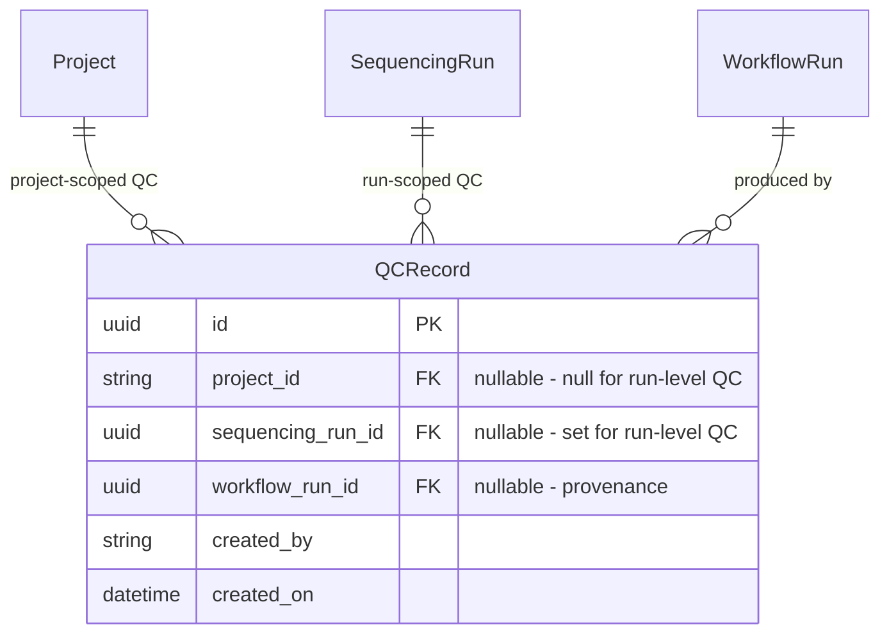
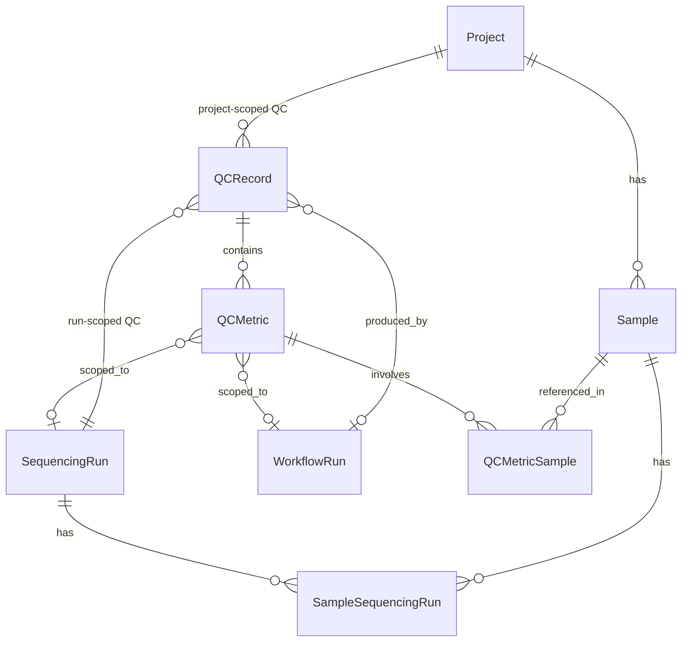

# QCRecord Run-Scoped Design: Nullable project_id

## Status: Decisions Finalized — Ready for Implementation

### Decisions Made

| Decision | Choice | Rationale |
|----------|--------|-----------|
| Re-demux behavior | **Option 3: Cleanup-only** | Explicit control; matches existing `cleanup_run_samples_and_files()` pattern |
| API input format | **Accept barcode string at both record and metric level** | More user-friendly; consistent with how Runs API accepts barcodes in URL paths |
| MetricInput consistency | **Change `sequencing_run_id` → `sequencing_run_barcode` + auto-propagate from record** | Eliminates UUID/barcode inconsistency in same request body; reduces redundancy |
| DB storage format | **Store UUID** | FK to `sequencingrun.id`; barcode is a computed property, not a stored column |
| Response format | **Return both UUID and barcode** | UUID for programmatic use, barcode for human readability |

---

## Problem Statement

Illumina demux stats (from `Stats.json` / `ConversionResults`) are **run-scoped**, not project-scoped. One flowcell produces demux metrics for all samples across all projects on that run.

The current [`QCRecord`](api/qcmetrics/models.py:142) model requires [`project_id`](api/qcmetrics/models.py:158) as a non-nullable FK to `project.project_id`. This forces awkward workarounds for storing demux QC data.

### Why demux stats don't fit the current model

| Approach | Description | Problem |
|----------|-------------|---------|
| One QCRecord per project | Split demux data by project | Lane-level stats like TotalClustersRaw and Undetermined belong to no project. Must duplicate or arbitrarily assign. |
| One QCRecord, pick a project | Assign all demux data to one project | Violates FK semantics — Sample S3s demux stats from Project P-BBB dont belong to P-AAA |
| Synthetic run project | Create a Project for each run | Defeats the purpose of the project model |

### Root cause

[`SequencingRun`](api/runs/models.py:22) has **no project_id column**. It only has physical attributes: `run_date`, `machine_id`, `run_number`, `flowcell_id`. A single run can contain samples from multiple projects via the [`SampleSequencingRun`](api/runs/models.py:312) junction table. This is by design — one flowcell often has samples from different studies.

---

## Design: Make project_id nullable, add sequencing_run_id to QCRecord

### Schema change



- [`QCRecord.project_id`](api/qcmetrics/models.py:158): `str | None`, FK to `project.project_id`, nullable
- `QCRecord.sequencing_run_id`: `uuid | None`, FK to `sequencingrun.id`, nullable (new field at record level)
- Validation: at least one of `project_id` or `sequencing_run_id` must be set

### API Input: Barcode → UUID Resolution

The API accepts a **human-readable barcode string** in the request body and resolves it to a UUID internally. This is consistent with how the Runs API accepts barcodes in URL path parameters (e.g., `GET /runs/{run_barcode}`).

**Why barcode, not UUID?**

- `SequencingRun.barcode` is a [`@computed_field @property`](api/runs/models.py:95), **not a stored column** — it cannot be a FK target
- All existing FK references to SequencingRun use `sequencingrun.id` (UUID) in the DB
- But the Runs API itself uses barcode as the primary external identifier in all URL paths
- For QCRecord creation, the barcode is what users know and work with

**Resolution flow:**

```
API caller sends:   { "sequencing_run_barcode": "240101_M00001_0001_ABC123" }
                                    ↓
Service calls:      get_run(session, run_barcode="240101_M00001_0001_ABC123")
                                    ↓
                    Parses barcode → queries by run_date + machine_id + run_number + flowcell_id
                                    ↓
                    Returns SequencingRun object → extracts run.id (UUID)
                                    ↓
DB stores:          QCRecord.sequencing_run_id = UUID
                                    ↓
API returns:        { "sequencing_run_id": "uuid-...", "sequencing_run_barcode": "240101_M00001_0001_ABC123" }
```

**Cross-module dependency:** `qcmetrics.services` → `runs.services.get_run()`. No circular import risk — `runs.services` imports from `qcmetrics.models` (not services).

### MetricInput: Barcode + Auto-propagation

[`MetricInput`](api/qcmetrics/models.py:212) is part of the external HTTP API — it's nested inside [`QCRecordCreate`](api/qcmetrics/models.py:221) which is the POST body that external callers (like the demux pipeline) construct. Since nothing has shipped, we change `MetricInput.sequencing_run_id` (UUID) to `sequencing_run_barcode` (string) for consistency.

**Auto-propagation:** If a metric omits `sequencing_run_barcode`, it inherits the value from the record-level `sequencing_run_barcode`. This follows the existing pattern of [`propagate_project_id_to_files()`](api/qcmetrics/models.py:238). Metrics can still override with an explicit barcode if they reference a different run.

```python
# In QCRecordCreate model_validator:
@model_validator(mode="before")
def propagate_sequencing_run_barcode(cls, data):
    barcode = data.get("sequencing_run_barcode")
    if barcode and data.get("metrics"):
        for m in data["metrics"]:
            if isinstance(m, dict) and not m.get("sequencing_run_barcode"):
                m["sequencing_run_barcode"] = barcode
    return data
```

**Note:** `workflow_run_id` remains UUID at both levels — [`WorkflowRun`](api/workflow/models.py:86) has a UUID PK and no human-readable barcode equivalent.

### Example demux stats submission

Minimal form — barcode auto-propagates from record to metrics:

```json
{
  "sequencing_run_barcode": "240101_M00001_0001_ABC123",
  "metadata": {"pipeline": "bclconvert", "version": "4.2"},
  "metrics": [
    {
      "name": "lane_summary",
      "values": {"total_clusters_raw": 350000000, "total_clusters_pf": 320000000}
    },
    {
      "name": "demux_sample",
      "samples": [{"sample_name": "S1"}],
      "values": {"number_reads": 80000000, "yield": 24000000000, "q30_pct": 92.1}
    }
  ]
}
```

Explicit form — each metric can override with a different barcode if needed:

```json
{
  "sequencing_run_barcode": "240101_M00001_0001_ABC123",
  "metrics": [
    {
      "name": "lane_summary",
      "sequencing_run_barcode": "240101_M00001_0001_ABC123",
      "values": {"total_clusters_raw": 350000000}
    }
  ]
}
```

No `project_id` needed — samples own `project_id` FKs provide project association when needed.

---

## Re-demux Handling: Option 3 — Cleanup-only (CHOSEN)

QCRecord creation always versions (accumulates records). Run-scoped QCRecords are explicitly deleted via [`cleanup_run_samples_and_files()`](api/runs/services.py:817) when called before re-demux.

### How it works

1. **Create**: Always creates a new QCRecord. Duplicate detection still applies (if metadata matches exactly, returns existing record).
2. **Re-demux prep**: Caller invokes `DELETE /runs/{run_barcode}/samples` which calls `cleanup_run_samples_and_files()`.
3. **Cleanup extended**: In addition to deleting files and sample associations, this function now also deletes all QCRecords where `sequencing_run_id = run.id`.
4. **New demux**: After cleanup, new QCRecord is created fresh.

### Why Option 3

| Dimension | Why it fits |
|-----------|------------|
| Explicit control | Caller decides when to clean up — no surprise deletions |
| Matches existing pattern | `cleanup_run_samples_and_files()` already deletes files and samples on re-demux |
| Audit trail | QC history preserved until explicit cleanup |
| Simple creation logic | `create_qcrecord()` doesnt need special run-scoped replacement logic |

### Cleanup implementation

```python
# In cleanup_run_samples_and_files(), after file/sample deletion:
run_qcrecords = session.exec(
    select(QCRecord).where(
        QCRecord.sequencing_run_id == run.id,
    )
).all()
qcrecords_deleted = len(run_qcrecords)
for qr in run_qcrecords:
    session.delete(qr)  # CASCADE handles metrics, metadata, files
```

### Duplicate detection update

[`_check_duplicate_record()`](api/qcmetrics/services.py:304) branches on scope:
- **Project-scoped** (existing): match by `project_id` + metadata comparison
- **Run-scoped** (new): match by `sequencing_run_id` + metadata comparison

### Search update

[`search_qcrecords()`](api/qcmetrics/services.py:348) with `latest=true`:
- **Project-scoped** (existing): returns latest per `project_id`
- **Run-scoped** (new): returns latest per `sequencing_run_id`
- Filter by `sequencing_run_barcode` query param: resolve barcode → UUID, filter by `QCRecord.sequencing_run_id`

---

## Implementation Plan

### 1. Model changes — [`api/qcmetrics/models.py`](api/qcmetrics/models.py)

**DB table model:**

| Change | Details |
|--------|---------|
| `QCRecord.project_id` | Change to `str \| None`, `nullable=True` |
| `QCRecord.sequencing_run_id` | New `uuid.UUID \| None` FK to `sequencingrun.id`, nullable, indexed |
| `QCRecord.sequencing_run` | ORM Relationship back to SequencingRun |

**Request models (input):**

| Change | Details |
|--------|---------|
| `QCRecordCreate.project_id` | Change to `str \| None = None` |
| `QCRecordCreate.sequencing_run_barcode` | New `str \| None = None` |
| `QCRecordCreate` scope validator | Require at least one of `project_id` or `sequencing_run_barcode` |
| `QCRecordCreate` propagation validator | Auto-propagate `sequencing_run_barcode` from record to metrics that omit it |
| `MetricInput.sequencing_run_id` | **Rename** to `sequencing_run_barcode: str \| None = None` (was UUID) |
| `MetricInput.workflow_run_id` | Unchanged (UUID — WorkflowRun has no barcode equivalent) |

**Response models (output):**

| Change | Details |
|--------|---------|
| `QCRecordPublic.project_id` | Change to `str \| None` |
| `QCRecordPublic.sequencing_run_id` | New `uuid.UUID \| None` |
| `QCRecordPublic.sequencing_run_barcode` | New `str \| None` |
| `QCRecordCreated.project_id` | Change to `str \| None` |
| `QCRecordCreated.sequencing_run_barcode` | New `str \| None` |
| `MetricPublic.sequencing_run_id` | Keep `uuid.UUID \| None` (DB value) |
| `MetricPublic.sequencing_run_barcode` | New `str \| None` (computed from UUID) |
| `QCRecordSearchRequest` | Add `sequencing_run_barcode` filter, update `latest` grouping description |

### 2. Service changes — [`api/qcmetrics/services.py`](api/qcmetrics/services.py)

| Change | Details |
|--------|---------|
| New import | `from api.runs.services import get_run` |
| `create_qcrecord()` | If `sequencing_run_barcode` provided: resolve via `get_run()` → 422 if not found → store `run.id` as UUID. Cache resolved run to reuse for metrics. |
| `create_qcrecord()` | Skip project_id validation when null (run-scoped record) |
| `_create_metric()` | Accept resolved `sequencing_run_id` (UUID) from parent. If metric has its own barcode different from record, resolve separately. |
| `_check_duplicate_record()` | Branch: if `sequencing_run_id` set → match by run; else match by project |
| `search_qcrecords()` | Handle `sequencing_run_barcode` filter: resolve → UUID → filter. Update `latest=true` to group by run for run-scoped records |
| `_qcrecord_to_public()` | Load SequencingRun via relationship, compute barcode for response. Also compute barcode for each metric. |

### 3. Route changes — [`api/qcmetrics/routes.py`](api/qcmetrics/routes.py)

| Change | Details |
|--------|---------|
| Search GET | Add `sequencing_run_barcode` query param |
| Search POST | Already handled via `filter_on` dict |

### 4. Re-demux cleanup — [`api/runs/services.py`](api/runs/services.py)

| Change | Details |
|--------|---------|
| `clear_samples_for_run()` | After file/sample deletion, query and delete all QCRecords where `sequencing_run_id == run.id`. Add `qcrecords_deleted` count. |
| `RunSampleCleanupResponse` | Add `qcrecords_deleted: int` field |

### 5. Migration — [`alembic/versions/0b9dc33bc33f`](alembic/versions/0b9dc33bc33f_qc_multi_entity_extension.py)

| Change | Details |
|--------|---------|
| `qcrecord.project_id` | ALTER to nullable (drop NOT NULL) |
| `qcrecord.sequencing_run_id` | ADD nullable UUID column + FK to `sequencingrun.id` + index |
| CHECK constraint | At least one of `project_id` or `sequencing_run_id` must be non-null |

### 6. Tests — [`tests/api/test_qcmetrics.py`](tests/api/test_qcmetrics.py)

| Test | What it validates |
|------|-------------------|
| Create run-scoped QCRecord with barcode | Barcode resolved to UUID, stored correctly |
| Create run-scoped QCRecord — barcode not found | 422 response |
| Create QCRecord — neither project nor barcode | 422 validation error |
| Search by sequencing_run_barcode | Returns run-scoped records |
| Search latest=true with run-scoped records | Groups by sequencing_run_id |
| Duplicate detection for run-scoped records | Metadata match returns existing |
| Get run-scoped record by ID | Response includes both UUID and barcode |
| Re-demux cleanup deletes run-scoped QCRecords | `DELETE /runs/{barcode}/samples` removes QCRecords |
| Existing project-scoped tests still pass | No regression |

### 7. Documentation

| File | Changes |
|------|---------|
| [`docs/QCMETRICS.md`](docs/QCMETRICS.md) | Schema table update, new examples, run-scoped section |
| [`docs/ER_DIAGRAM.md`](docs/ER_DIAGRAM.md) | New SequencingRun → QCRecord relationship line |

---

## Existing Entity Relationship Context



Key relationship: [`SequencingRun`](api/runs/models.py:22) has **no project_id**. The link to projects is indirect via `SampleSequencingRun` → `Sample.project_id`. A single run can span multiple projects.

---

## Re-demux Scenario Walkthroughs

### Scenario 1: Same run, same settings (idempotent retry)

| Step | What happens |
|------|-------------|
| 1st demux of SR-001 | QCRecord created: `project_id=null, sequencing_run_id=SR-001` |
| 2nd demux, same metadata | Duplicate detection matches → returns existing record with `is_duplicate=true` |

### Scenario 2: Same run, different settings (no cleanup)

| Step | What happens |
|------|-------------|
| 1st demux, settings A | QR-1 created |
| 2nd demux, settings B, no cleanup called | QR-2 created alongside QR-1 (versioned) |
| Search with `latest=true` | Returns QR-2 only |
| Search with `latest=false` | Returns both QR-1 and QR-2 |

### Scenario 3: Same run, re-demux with cleanup

| Step | What happens |
|------|-------------|
| 1st demux | QR-1 created with metrics for S1, S2 |
| `DELETE /runs/{barcode}/samples` | Deletes files, samples, QR-1 and all its metrics/metadata |
| 2nd demux | QR-2 created fresh with metrics for S1, S3 |

### Scenario 4: Mixed scoping — project QCRecords alongside run QCRecord

| Step | What happens |
|------|-------------|
| Demux of SR-001 | Run-scoped QR-1: `project_id=null, sequencing_run_id=SR-001` |
| Alignment pipeline for P-AAA | Project-scoped QR-2: `project_id=P-AAA, sequencing_run_id=null` |
| `DELETE /runs/{barcode}/samples` | Deletes QR-1 only (run-scoped). QR-2 preserved (project-scoped). |

---

## Rejected Alternatives

### Option 1: Replace-on-create
Automatically delete existing run-scoped QCRecords when creating a new one for the same run. Rejected because implicit deletion may surprise callers and is inconsistent with the existing cleanup-first pattern.

### Option 2: Version-only (no cleanup integration)
Always accumulate records, never delete via cleanup. Rejected because stale QCRecords would accumulate after re-demux when samples and files are already deleted, creating orphaned QC data.

### Accept UUID instead of barcode in API
Store UUID and accept UUID in the API. Rejected because barcode is the primary human-readable identifier users work with, and the Runs API already establishes barcode as the external identifier pattern.
