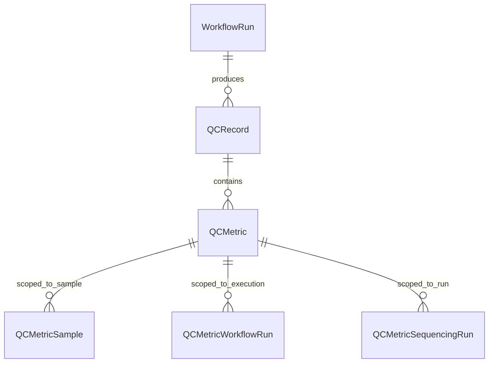

# Analysis: WorkflowRun ↔ QCRecord Relationship

**Status:** Analysis complete  
**Date:** 2026-03-05  
**Context:** Examining whether [`QCRecord`](../api/qcmetrics/models.py:128) (which pre-dated [`WorkflowRun`](../api/workflow/models.py:86)) is still a useful concept, or could be superseded by QCMetrics directly associated with a WorkflowRun.

---

## 1. Current State: Completely Disconnected

Today, [`WorkflowRun`](../api/workflow/models.py:86) and [`QCRecord`](../api/qcmetrics/models.py:128) have **zero connection** in code or schema. They exist as independent entities:

- [`QCRecord`](../api/qcmetrics/models.py:128) identifies its pipeline provenance via free-text KV pairs in [`QCRecordMetadata`](../api/qcmetrics/models.py:25) (e.g., `{"pipeline": "RNA-Seq", "version": "2.0"}`) — no FK, no structured link
- [`WorkflowRun`](../api/workflow/models.py:86) has no relationship to QCRecord, QCMetric, files, or samples — it's purely a provenance stub with [`WorkflowRunAttribute`](../api/workflow/models.py:73) KV pairs
- The [`FileEntityType`](../api/files/models.py:31) enum doesn't even include `WORKFLOW_RUN`, so files can't be associated with runs either

---

## 2. Core Question: Could QCRecord Be Replaced by QCMetrics Directly on WorkflowRun?

**Short answer: No — QCRecord still earns its keep, but its role is shifting.**

When QCRecord pre-dated WorkflowRun, it served **dual duty**: both provenance ("which pipeline ran?") and results container ("what did it produce?"). Now that WorkflowRun exists, provenance belongs there. But QCRecord remains valuable as a **results batch / receipt** concept. Here's why:

### What QCRecord Does That WorkflowRun Cannot

| Capability | QCRecord | WorkflowRun | Notes |
|-----------|----------|-------------|-------|
| **Batch grouping** | ✅ Groups N metric groups + M output files from one execution into one atomic unit | ❌ Has no metrics or file relationships | A single pipeline execution produces `sample_qc × 48 samples + somatic_variants × 24 pairs + pipeline_summary` = 73 [`QCMetric`](../api/qcmetrics/models.py:97) rows. QCRecord is the container. |
| **Non-workflow QC** | ✅ `project_id` string allows QC from external vendors, manual entry, demux stats | ❌ WorkflowRun requires a [`Workflow`](../api/workflow/models.py:40) FK + engine + external_run_id | Illumina Stats.json, ONT summary — these aren't "workflow runs" |
| **Versioning** | ✅ Multiple QCRecords per project, differentiated by `created_on` | Not applicable | Re-running a pipeline creates a new QCRecord; "latest" query is built-in |
| **Duplicate detection** | ✅ Compares metadata to prevent re-ingestion | Not applicable | |
| **Pipeline metadata** | ✅ [`QCRecordMetadata`](../api/qcmetrics/models.py:25) stores config params, reference genome, etc. | ⚠️ [`WorkflowRunAttribute`](../api/workflow/models.py:73) could store this, but semantically it's "about the run" not "about the results" | |

### The Conceptual Distinction

```
WorkflowRun  = "an execution happened"    (provenance event)
QCRecord     = "here are the results"     (curated results receipt)
```

These are **not 1:1**:
- A WorkflowRun with no QCRecord → the run hasn't finished, or produces no QC
- A QCRecord with no WorkflowRun → external QC data, manual entry, demux stats
- A WorkflowRun with multiple QCRecords → different QC stages, or re-processing

---

## 3. What If You Went Direct (QCMetric → WorkflowRun, No QCRecord)?

You'd need to solve:

1. **Batch grouping** — Which of the 73 QCMetric rows belong together? You'd need a `batch_id` or `group_id` column, which is just reinventing QCRecord
2. **Non-workflow QC** — Where do demux stats go? You'd need a fake "external" WorkflowRun, which pollutes the workflow provenance
3. **Output files** — Currently linked via [`FileEntity(entity_type=QCRECORD)`](../api/files/models.py:38). Without QCRecord, they'd attach to WorkflowRun (which is fine, but means mixing "input files" and "QC output files" on the same entity)
4. **Pipeline metadata** — Would go into [`WorkflowRunAttribute`](../api/workflow/models.py:73), conflating execution metadata with results metadata

---

## 4. The Right Connection (Already Planned)

The [`qcmetrics-multi-entity-extension.md`](qcmetrics-multi-entity-extension.md) plan already nails the correct design:



Two distinct relationships:

1. **`QCRecord.workflow_run_id` FK** (nullable) — "this batch of results was **produced by** this execution" — **provenance**
2. **`QCMetricWorkflowRun` junction table** — "this metric group **describes** this execution" (e.g., runtime, peak memory) — **subject scoping**

This cleanly separates provenance from subject. A metric saying `runtime_hours=4.5` is *about* the WorkflowRun (subject), while the whole QCRecord was *produced by* a WorkflowRun (provenance). These are sometimes the same WorkflowRun but conceptually different relationships.

---

## 5. Verdict

| Aspect | Recommendation |
|--------|---------------|
| **Keep QCRecord?** | ✅ Yes — it's the results batch container |
| **Keep QCRecordMetadata?** | ✅ Yes — stores pipeline config that doesn't belong on WorkflowRun |
| **Keep QCMetric/QCMetricValue?** | ✅ Yes — named metric groups with dual-storage values are well-designed |
| **Keep QCMetricSample?** | ✅ Yes — proper FK-backed sample scoping |
| **Add `QCRecord.workflow_run_id` FK?** | ✅ Yes — the missing provenance link |
| **Add QCMetricWorkflowRun?** | ✅ Yes — for metrics *about* an execution |
| **Replace QCRecord with direct WorkflowRun→QCMetric?** | ❌ No — loses batch semantics, breaks non-workflow QC, reinvents the container |

The existing plan in [`qcmetrics-multi-entity-extension.md`](qcmetrics-multi-entity-extension.md) (Option C: Typed Junction Tables) is the right approach. QCRecord evolves from "the only provenance we have" to "curated results receipt with optional provenance FK to WorkflowRun."

---

## 6. Related Documents

- [`qcmetrics-multi-entity-extension.md`](qcmetrics-multi-entity-extension.md) — Detailed implementation plan for extending QCMetrics with WorkflowRun/SequencingRun associations
- [`phase2-file-association-evolution.md`](phase2-file-association-evolution.md) — Replacing polymorphic FileEntity with typed junction tables
- [`model-migration-gap-analysis.md`](model-migration-gap-analysis.md) — Overall gap analysis and phased migration plan
- [`Entities and Relationships Discussion.md`](Entities%20and%20Relationships%20Discussion.md) — Original design discussion proposing QC_ENTITY model
