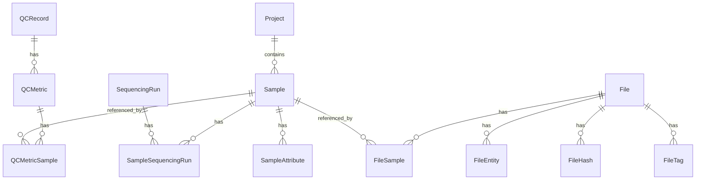
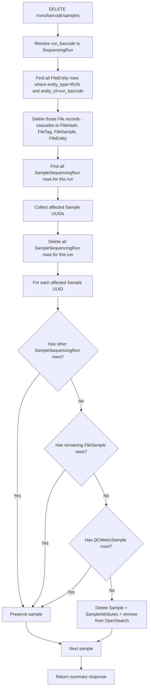

# Re-Demultiplexing Cleanup Plan

## Problem Statement

When a user demultiplexes a sequencing run with an incorrect samplesheet (e.g., wrong `project_id`), then uploads a corrected samplesheet and re-demultiplexes, the application leaves behind orphaned data from the first demux:

- **Sample records** under the wrong project
- **SampleSequencingRun** associations linking those wrong samples to the run
- **File records** pointing to deleted S3 objects
- **FileSample** associations linking files to the wrong samples
- **QCMetricSample** associations linking QC metrics to the wrong samples
- **SampleAttribute** records on the wrong samples

The batch job already handles cleaning up the run's output folder on S3 before re-demux. This plan adds an API endpoint the batch job can call to clean up the corresponding database records.

## Entity Relationship Context



## Chosen Approach: Smart Cascade Delete

**Always** perform a smart cascade delete — no optional flags. The logic:

1. Delete all **File records** associated with this run (via `FileEntity` where `entity_type=RUN`), since the batch job deletes the corresponding S3 objects. SQLAlchemy cascades handle `FileHash`, `FileTag`, `FileSample`, and `FileEntity` child rows.
2. Remove all **SampleSequencingRun** associations for this run.
3. For each affected **Sample**: if it has no remaining associations to any other entity (other runs, files from other sources, QC metrics), delete the Sample and its `SampleAttribute` rows. Otherwise, preserve the sample.

### Key Principle

A sample that only existed because of *this* run is garbage after re-demux and should be deleted. A sample that has data from other runs or pipelines should be preserved — we only sever its connection to *this* run.

## API Contract

```
DELETE /runs/{run_barcode}/samples
```

**No query parameters.** Always performs the full smart cleanup.

**Requires authentication** — `CurrentUser` is used for audit logging.

**Response** (`200 OK`):

```json
{
  "run_barcode": "240315_A00001_0001_BHXXXXXXX",
  "associations_removed": 12,
  "files_deleted": 45,
  "samples_deleted": 8,
  "samples_preserved": 4
}
```

## Detailed Cleanup Flow



### Order of Operations Matters

The File deletion in step D cascades to `FileSample`, which removes file-sample links for files belonging to this run **before** we check whether a sample is orphaned in step I-K. This is intentional: if a sample's only file associations were to files from this run, those `FileSample` rows are gone by the time we check, and the sample correctly appears orphaned.

## Implementation Details

### 1. Response Model: `RunSampleCleanupResponse`

Location: `api/runs/models.py`

```python
class RunSampleCleanupResponse(SQLModel):
    run_barcode: str
    associations_removed: int
    files_deleted: int
    samples_deleted: int
    samples_preserved: int
```

### 2. Service Function: `clear_samples_for_run()`

Location: `api/runs/services.py`

```python
def clear_samples_for_run(
    session: Session,
    run_barcode: str,
    opensearch_client: OpenSearch = None,
) -> RunSampleCleanupResponse:
```

Logic:
1. Resolve `run_barcode` → `SequencingRun` (404 if not found)
2. Find all `FileEntity` rows where `entity_type=RUN` and `entity_id=run_barcode`
3. For each, load the `File` record and `session.delete()` it (cascades handle children)
4. Count files deleted
5. Find all `SampleSequencingRun` rows for this run's UUID
6. Collect distinct `sample_id` UUIDs
7. Delete all `SampleSequencingRun` rows for this run
8. `session.flush()` to ensure FileSample cascades are visible
9. For each affected sample UUID:
   - Check for remaining `SampleSequencingRun` rows → if any, preserve
   - Check for remaining `FileSample` rows → if any, preserve
   - Check for remaining `QCMetricSample` rows → if any, preserve
   - If none of the above: delete `SampleAttribute` rows, delete `Sample`, remove from OpenSearch
10. `session.commit()`
11. Return `RunSampleCleanupResponse`

### 3. Route: `DELETE /runs/{run_barcode}/samples`

Location: `api/runs/routes.py`

This is a **bulk** delete (no `{sample_id}` in the path). The existing `DELETE /runs/{run_barcode}/samples/{sample_id}` remains for single-association removal.

### 4. Database Migration

**None required** — no schema changes. This is purely service-layer logic using existing tables.

### 5. Tests

New test cases in `tests/api/test_sample_run_association.py`:

| Test | Scenario |
|------|----------|
| Clear empty run | Run exists but has no sample associations — returns zeros |
| Orphan deletion | Samples only associated with this run and its files — all deleted |
| Preserve multi-run samples | Sample on run A and run B — clear run A preserves sample |
| Preserve samples with other files | Sample has files from another entity — preserved after clear |
| Preserve samples with QC data | Sample has QCMetricSample rows — preserved after clear |
| File cascade | Files associated with run are deleted along with their hashes, tags, samples |
| OpenSearch cleanup | Deleted samples are removed from the search index |
| Auth required | Endpoint requires authentication |

### 6. Batch Job Integration

The batch job's re-demux flow becomes:

```
1. DELETE /runs/{barcode}/samples     ← NEW - clean up DB records
2. Delete S3 run output folder        ← already exists
3. Run demultiplexing pipeline
4. POST /projects/{id}/samples        ← existing - create new samples
5. POST /runs/{barcode}/samples       ← existing - associate new samples with run
```

## Files to Modify

| File | Change |
|------|--------|
| `api/runs/models.py` | Add `RunSampleCleanupResponse` model |
| `api/runs/services.py` | Add `clear_samples_for_run()` function |
| `api/runs/routes.py` | Add `DELETE /runs/{run_barcode}/samples` route |
| `tests/api/test_sample_run_association.py` | Add cleanup test cases |
| `docs/SAMPLE_RUN_ASSOCIATIONS.md` | Document the cleanup endpoint |
