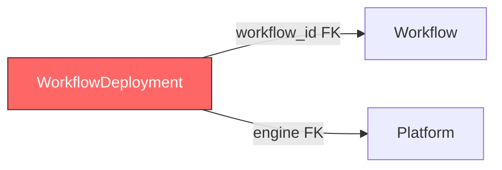

# Plan: Remove WorkflowDeployment

## Context

After discussion, the team decided that `WorkflowDeployment` is unnecessary because the external execution platform (e.g. Arvados, SevenBridges) already tracks its own workflow deployments. Maintaining a duplicate record in this API adds complexity without value.

**Kept intact:** `Workflow`, `WorkflowAttribute`, `WorkflowRun`, `WorkflowRunAttribute`, and all `Platform` entities.

## Impact Summary

| Layer | File | Change |
|-------|------|--------|
| **Models** | `api/workflow/models.py` | Remove `WorkflowDeployment` table class, `WorkflowDeploymentCreate`, `WorkflowDeploymentPublic` schemas, and `registrations` field from both `Workflow` and `WorkflowPublic` |
| **Services** | `api/workflow/services.py` | Remove 3 deployment service functions + deployment serialization in `workflow_to_public()` |
| **Routes** | `api/workflow/routes.py` | Remove 3 deployment endpoints (POST/GET/DELETE) |
| **Alembic env** | `alembic/env.py` | Remove `WorkflowDeployment` from import |
| **Migration** | `alembic/versions/<new>.py` | New migration to `DROP TABLE workflowdeployment` + drop unique constraint |
| **Tests** | `tests/api/test_workflow_deployments.py` | Delete entire file |
| **Tests** | `tests/api/test_workflows.py` | Remove `registrations` key assertion |
| **Docs** | `docs/WORKFLOWS.md` | Remove deployment sections |
| **Docs** | `docs/ER_DIAGRAM.md` | Remove entity, relationships, unique constraint |
| **Docs** | `docs/PIPELINES.md` | Remove deployment reference |
| **Plans** | `plans/model-migration-gap-analysis.md` | Minor — mark as removed (optional) |

## Dependency Diagram

No other entity has a foreign key **to** `workflowdeployment`. The only FKs are **from** it:



Removing `WorkflowDeployment` is a clean leaf-node deletion — nothing else breaks.

## Step-by-step Plan

### 1. Models — `api/workflow/models.py`

- Delete the `WorkflowDeployment` class (lines 55–70)
- Delete `WorkflowDeploymentCreate` and `WorkflowDeploymentPublic` schemas (lines 128–139)
- Remove `registrations` relationship from `Workflow` (line 51)
- Remove `registrations` field from `WorkflowPublic` (line 121)
- Update module docstring to remove WorkflowDeployment mention

### 2. Services — `api/workflow/services.py`

- Remove these imports: `WorkflowDeployment`, `WorkflowDeploymentCreate`, `WorkflowDeploymentPublic`
- Delete 3 functions:
  - `create_workflow_deployment()` (lines 163–202)
  - `get_workflow_deployments()` (lines 205–211)
  - `delete_workflow_deployment()` (lines 214–229)
- In `workflow_to_public()`: remove the `registrations` block (lines 127–139) and the `registrations=registrations` kwarg (line 155)
- Remove the `WorkflowDeployment CRUD` section header comment
- Update module docstring

### 3. Routes — `api/workflow/routes.py`

- Remove imports: `WorkflowDeploymentCreate`, `WorkflowDeploymentPublic`
- Delete 3 endpoint functions:
  - `create_workflow_deployment()` (lines 93–119)
  - `get_workflow_deployments()` (lines 122–144)
  - `delete_workflow_deployment()` (lines 147–162)
- Remove the `WorkflowDeployment` section header comment
- Update module docstring

### 4. Alembic env — `alembic/env.py`

- Change line 25 from `Workflow, WorkflowAttribute, WorkflowDeployment,` to `Workflow, WorkflowAttribute,`

### 5. New Alembic migration

Create a migration that:
- Drops the `uq_workflow_engine` unique constraint
- Drops the `workflowdeployment` table

### 6. Tests — delete + update

- **Delete** `tests/api/test_workflow_deployments.py` entirely (all 10 tests)
- **Update** `tests/api/test_workflows.py` line 35: remove `assert "registrations" in wf`

### 7. Documentation

**`docs/WORKFLOWS.md`:**
- Remove "Cross-platform deployment" from the Overview bullet list
- Remove the `WorkflowDeployment` entity from the Mermaid ER diagram and its relationships
- Remove the "Why separate Workflow and WorkflowDeployment?" design decision section
- Remove the `WorkflowDeployment` database model table
- Remove the entire "WorkflowDeployment Endpoints" section (POST/GET/DELETE)
- Remove `test_workflow_deployments.py` from the Source Files table
- Update the provenance summary to no longer mention registrations

**`docs/ER_DIAGRAM.md`:**
- Remove `Platform ||--o{ WorkflowDeployment : "hosts"` relationship
- Remove `Workflow ||--o{ WorkflowDeployment : "deployed on"` relationship
- Remove the `WorkflowDeployment` entity block (lines 338–345)
- Remove relationship #11 and #13 from the Key Relationships list
- Remove `WorkflowDeployment` unique constraint entry
- Remove mention from Table Descriptions and Workflow Provenance sections

**`docs/PIPELINES.md`:**
- Update line 61 to remove "registrations and" from the sentence about workflow independence

## Verification

After all changes, run:

```bash
# All tests pass (minus the deleted file)
make test

# Alembic migration applies cleanly
alembic upgrade head

# No stale references remain
grep -r "WorkflowDeployment\|workflowdeployment" --include="*.py" --include="*.md" .
```
