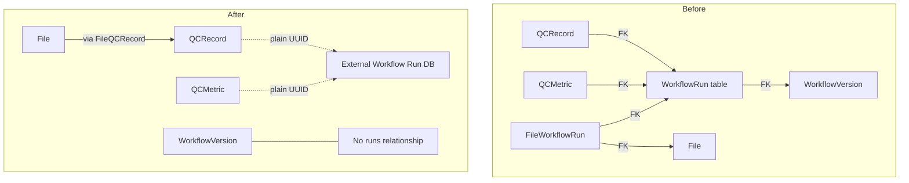

# Remove WorkflowRun Tables — External DB Migration

## Decision

WorkflowRun execution tracking will be handled by an **external database**. This API will no longer store workflow run records locally. Instead, QCRecords and QCMetrics will store a plain `workflow_run_id` UUID for provenance — a soft reference to the external system — with no foreign key constraint.

## Scope Summary

| Action | Entity | Rationale |
|--------|--------|-----------|
| **DROP table** | `workflowrun` | Moves to external DB |
| **DROP table** | `workflowrunattribute` | Child of workflowrun |
| **DROP table** | `fileworkflowrun` | Files inherit workflow_run context from QCRecord |
| **FK → plain UUID** | `qcrecord.workflow_run_id` | Soft reference to external system |
| **FK → plain UUID** | `qcmetric.workflow_run_id` | Soft reference to external system |
| **Remove endpoints** | `POST/GET /{workflow_id}/runs`, `GET /workflow-runs/{id}` | No local data to serve |
| **Keep unchanged** | `Workflow`, `WorkflowVersion`, `WorkflowVersionAlias`, `WorkflowDeployment` | Workflow definitions stay local |

## Architecture — Before vs After



## File-by-File Changes

### 1. Alembic Migration — new revision

Create a new migration that:

- Drops FK constraint `qcrecord.workflow_run_id → workflowrun.id`; keeps column as nullable UUID
- Drops FK constraint `qcmetric.workflow_run_id → workflowrun.id`; keeps column as nullable UUID
- Drops indexes `ix_qcrecord_workflow_run_id` and `ix_qcmetric_workflow_run_id` then recreates them without FK
- Drops table `fileworkflowrun`
- Drops table `workflowrunattribute`
- Drops table `workflowrun`

Order matters: drop FKs and child tables before parent table.

### 2. `api/workflow/models.py`

**Remove:**
- `WorkflowRunAttribute` class — lines 114-124
- `WorkflowRun` class — lines 127-140
- `WorkflowRunCreate` class — lines 237-241
- `WorkflowRunPublic` class — lines 244-253
- `WorkflowRunsPublic` class — lines 256-264
- `runs` relationship on `WorkflowVersion` — line 74
- Docstring reference to WorkflowRun — line 8

### 3. `api/workflow/services.py`

**Remove:**
- All imports related to WorkflowRun: `WorkflowRun`, `WorkflowRunAttribute`, `WorkflowRunCreate`, `WorkflowRunPublic`, `WorkflowRunsPublic`
- `create_workflow_run()` function — lines 621-674
- `get_workflow_runs()` function — lines 677-756
- `get_workflow_run_by_id()` function — lines 759-776
- `workflow_run_to_public()` function — lines 779-806
- Docstring reference — line 5

### 4. `api/workflow/routes.py`

**Remove:**
- Imports: `WorkflowRunCreate`, `WorkflowRunPublic`, `WorkflowRunsPublic`
- `create_workflow_run()` endpoint — lines 379-398
- `get_workflow_runs()` endpoint — lines 401-430
- `run_router` and `get_workflow_run_by_id()` — lines 434-451
- Docstring reference — line 5

### 5. `main.py`

**Remove:**
- Import: `from api.workflow.routes import run_router as workflow_run_router` — line 27
- Router inclusion: `app.include_router(workflow_run_router, prefix=API_PREFIX)` — line 139

### 6. `api/qcmetrics/models.py`

**Change `QCRecord.workflow_run_id`** — lines 183-188:
```python
# Before
workflow_run_id: uuid.UUID | None = Field(
    default=None,
    foreign_key="workflowrun.id",
    nullable=True,
    index=True,
)

# After
workflow_run_id: uuid.UUID | None = Field(
    default=None,
    nullable=True,
    index=True,
)
```

**Change `QCMetric.workflow_run_id`** — lines 125-130:
```python
# Before
workflow_run_id: uuid.UUID | None = Field(
    default=None,
    foreign_key="workflowrun.id",
    nullable=True,
    index=True,
)

# After
workflow_run_id: uuid.UUID | None = Field(
    default=None,
    nullable=True,
    index=True,
)
```

All request/response models (`QCRecordCreate`, `QCRecordPublic`, `QCRecordCreated`, `MetricInput`, `MetricPublic`) already treat `workflow_run_id` as a plain UUID — no changes needed there.

### 7. `api/qcmetrics/services.py`

**Remove:**
- Import: `from api.workflow.models import WorkflowRun` — line 45
- FK validation in `create_qcrecord()` — lines 133-145: Remove the `session.get(WorkflowRun, ...)` check
- FK validation in `_create_metric()` — lines 228-236: Remove the `session.get(WorkflowRun, wr_id)` check

The `workflow_run_id` will be accepted as-is — a plain UUID pointing to the external system. No local validation.

### 8. `api/files/models.py`

**Remove:**
- `FileWorkflowRun` class — lines 169-186
- `workflow_runs` relationship on `File` — lines 273-276
- `workflow_run_id` field from `FileCreate` — line 420
- `workflow_run_id` from `FileCreate.validate_at_least_one_entity()` — lines 437, 443
- `workflow_run_id` field from `FileUpload` — line 472
- `workflow_run_id` from `FileUpload.validate_at_least_one_entity()` — lines 490, 497
- `workflow_run_id` case from `entity_type_for_uri` property — lines 514-515
- `workflow_run_id` case from `entity_id_for_uri` property — lines 529-530
- `FileWorkflowRun` from workflow_runs iteration in `_build_associations()` — lines 652-654

### 9. `api/files/services.py`

**Remove:**
- Import: `FileWorkflowRun` — line 31
- `workflow_run_id` handling in `create_file()` — lines 110-115
- `FileWorkflowRun` join query in search/get functions — lines 454-456
- `WorkflowRun` entry in `_validate_exists_by_uuid()` mapping — line 561
- `workflow_run_id` handling in file upload service — lines 604-605, 646-650

### 10. `api/files/routes.py`

**Remove:**
- `workflow_run_id` Form parameter — line 83
- `workflow_run_id` in docstrings — lines 58, 101
- `workflow_run_id` passed to service — line 124

### 11. `alembic/env.py`

**Remove:**
- `FileWorkflowRun` from imports — line 17
- `WorkflowRun, WorkflowRunAttribute` from imports — line 26

### 12. Tests

**Delete:**
- `tests/api/test_workflow_runs.py` — entire file

**Update `tests/api/test_qcmetrics.py`:**
- Remove `_create_workflow_run()` helper — lines 62-79
- Remove `from api.workflow.models import Workflow, WorkflowVersion, WorkflowRun` import — use plain UUIDs instead
- Remove `from api.platforms.models import Platform` import — no longer needed for workflow run setup
- Update all tests that use `_create_workflow_run()` to use `str(uuid4())` instead — since workflow_run_id is now a plain UUID with no FK validation:
  - `test_search_by_workflow_run_id`
  - `test_create_qcrecord_with_workflow_run_provenance`
  - `test_create_metric_with_workflow_run`
  - `test_create_metric_with_both_run_and_workflow_run`
  - `test_cascade_delete_with_multi_entity`
- Update `test_create_qcrecord_invalid_workflow_run_id` — this test should now **pass** since any UUID is accepted; convert to a test that verifies any UUID is accepted
- Update `test_create_metric_invalid_workflow_run_id` — same as above

**Update `tests/api/test_files_create.py`:**
- Remove references to `workflow_run_id` in file creation tests

## Migration Ordering

The Alembic migration must execute in this order:

1. Drop FK constraints from `qcrecord` and `qcmetric` referencing `workflowrun`
2. Drop `fileworkflowrun` table - references `workflowrun`
3. Drop `workflowrunattribute` table - references `workflowrun`
4. Drop `workflowrun` table

## Risk Assessment

- **No data loss**: The tables being dropped (`workflowrun`, `workflowrunattribute`, `fileworkflowrun`) contain no production data — this feature is still in development.
- **No client impact**: No existing clients are consuming the workflow run endpoints being removed.
- **QC data preserved**: All existing `workflow_run_id` values on QCRecords and QCMetrics are preserved — they just become soft references to the external system.
