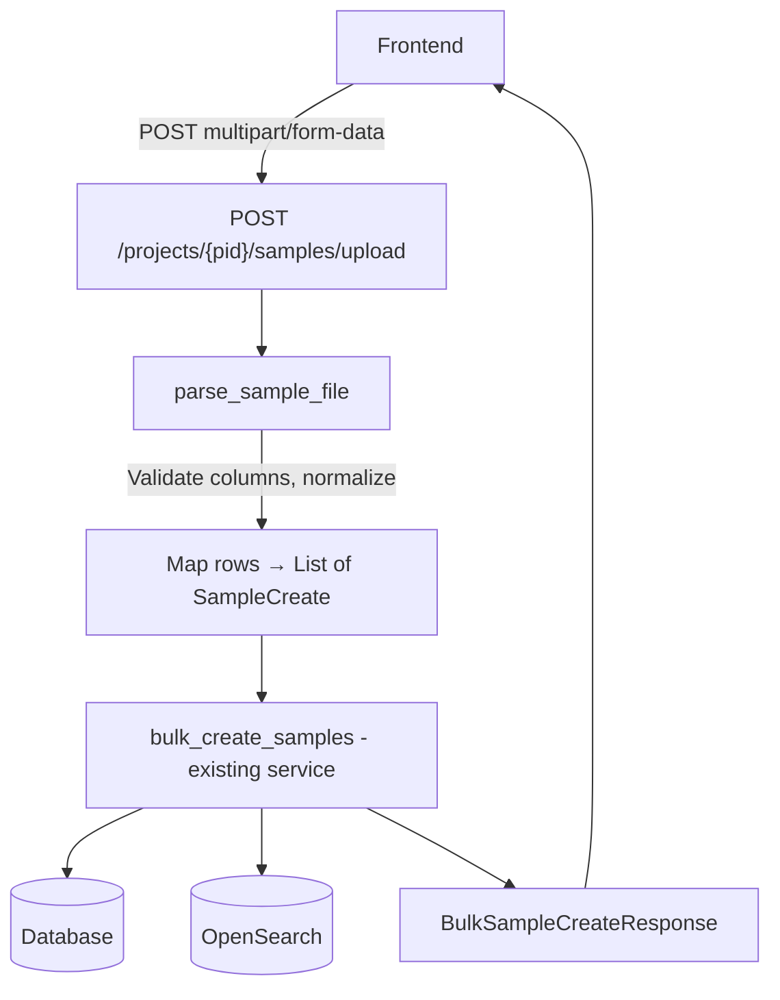

# Sample File Upload Endpoint

## Overview

Add a new endpoint that accepts a CSV/TSV file upload, parses it into sample records, and feeds them through the existing [`bulk_create_samples()`](api/samples/services.py:363) service — reusing all its upsert, dedup, and run-association logic.

The endpoint is a thin **parsing + transformation** layer on top of the existing bulk samples infrastructure. No changes to the service layer or data model are needed.

---

## Design Decisions

| Decision | Choice | Rationale |
|----------|--------|-----------|
| File formats | CSV and TSV only | No new dependency required; `csv.Sniffer` handles delimiter detection |
| `run_id` | Form field, not a file column | All samples in a file upload are an atomic unit tied to one run |
| Column matching | Case-insensitive, underscore-insensitive | Accept `SampleName`, `Sample_Name`, `samplename`, `SAMPLE_NAME`, etc. |
| Endpoint location | `POST /projects/{project_id}/samples/upload` | Sibling to existing `/samples/bulk` |
| Response model | Reuse [`BulkSampleCreateResponse`](api/samples/models.py:140) | Same downstream service, same response |

---

## Architecture



---

## Column Normalization Strategy

The parser normalizes column headers to canonical keys using a two-step process:

1. **Normalize**: lowercase and strip underscores/spaces → `sample_name` → `samplename`, `Sample Name` → `samplename`
2. **Match against known aliases**:

| Canonical key | Accepted variants |
|---------------|-------------------|
| `samplename` | `samplename`, `sample_name`, `sample name`, `Sample_Name`, `SampleName` |

Everything that is **not** a recognized special column becomes a sample attribute key-value pair, preserving the **original** column header as the attribute key.

### Special columns

| Normalized key | Maps to | Notes |
|----------------|---------|-------|
| `samplename` | `SampleCreate.sample_id` | **Required**. The sample identifier. |

All other columns become `SampleCreate.attributes` entries with `key=<original column header>` and `value=<cell value>`. Empty/NaN cells are skipped.

---

## New Files

### `api/samples/parsing.py`

Pure parsing module — no database, no FastAPI dependencies. Accepts file bytes + filename, returns a list of [`SampleCreate`](api/samples/models.py:57) objects.

```python
def parse_sample_file(
    file_content: bytes,
    filename: str,
) -> list[SampleCreate]:
    """
    Parse a CSV/TSV file into a list of SampleCreate objects.

    - Detects delimiter via csv.Sniffer
    - Normalizes column headers for matching
    - Validates required 'samplename' column exists
    - Validates no duplicate sample names
    - Skips empty/NaN cell values in attributes
    - Preserves original column header as attribute key

    Raises:
        ValueError: On validation failures
    """
```

Key implementation details:
- Use `csv.Sniffer().sniff()` on the first few KB to detect delimiter
- Use `csv.DictReader` for parsing
- Normalize function: `re.sub(r'[_\s]', '', header.lower())`
- After normalization, look for `samplename` in the normalized headers
- All other columns → attributes, using the **original** header text as the key

### Route addition in `api/project/routes.py`

```python
@router.post(
    "/{project_id}/samples/upload",
    tags=["Project Endpoints"],
    status_code=status.HTTP_201_CREATED,
    response_model=BulkSampleCreateResponse,
)
async def upload_samples_file(
    session: SessionDep,
    opensearch_client: OpenSearchDep,
    project: ProjectDep,
    current_user: CurrentUser,
    file: UploadFile,
    run_id: str | None = Form(default=None),
) -> BulkSampleCreateResponse:
```

The route handler:
1. Validates file extension is `.csv`, `.tsv`, or `.txt`
2. Reads file content via `await file.read()`
3. Calls `parse_sample_file()` to get `list[SampleCreate]`
4. Injects `run_id` into each `SampleCreate` if provided
5. Calls existing [`bulk_create_samples()`](api/samples/services.py:363)
6. Returns `BulkSampleCreateResponse`

---

## Test Plan

### Unit tests for parsing — `tests/api/test_sample_file_parsing.py`

| Test | Description |
|------|-------------|
| `test_parse_csv_basic` | Standard CSV with `SampleName` + attribute columns |
| `test_parse_tsv_basic` | Tab-delimited file with same content |
| `test_parse_case_insensitive_samplename` | Column header `samplename` works |
| `test_parse_underscore_variant` | Column header `Sample_Name` works |
| `test_parse_mixed_case` | Column header `SAMPLENAME` works |
| `test_parse_preserves_original_attribute_keys` | Non-sample columns keep original casing |
| `test_parse_skips_empty_cells` | Empty cells do not become attributes |
| `test_parse_missing_samplename_column` | Raises `ValueError` |
| `test_parse_samplename_only_file` | File with only a samplename column produces `SampleCreate` objects with no attributes |
| `test_parse_duplicate_sample_names` | Raises `ValueError` with row info |
| `test_parse_unsupported_extension` | Raises `ValueError` for `.xlsx` etc. |
| `test_parse_empty_file` | Raises `ValueError` |

### Integration tests for upload endpoint — `tests/api/test_sample_upload.py`

| Test | Description |
|------|-------------|
| `test_upload_csv_creates_samples` | Happy path: upload CSV → samples created with attributes |
| `test_upload_tsv_creates_samples` | Happy path with TSV |
| `test_upload_with_run_id` | Form field `run_id` is applied to all samples |
| `test_upload_upsert_existing_samples` | Re-upload updates attributes on existing samples |
| `test_upload_invalid_extension` | `.xlsx` returns 400 |
| `test_upload_missing_samplename_column` | Returns 400 |
| `test_upload_duplicate_sample_names` | Returns 400/422 |
| `test_upload_nonexistent_project` | Returns 404 |
| `test_upload_empty_file` | Returns 400 |

---

## No Changes Needed

- **No model changes** — reuses [`SampleCreate`](api/samples/models.py:57), [`BulkSampleCreateResponse`](api/samples/models.py:140)
- **No service changes** — reuses [`bulk_create_samples()`](api/samples/services.py:363) as-is
- **No new dependencies** — `csv` and `io` are stdlib
- **No database migrations** — no schema changes
