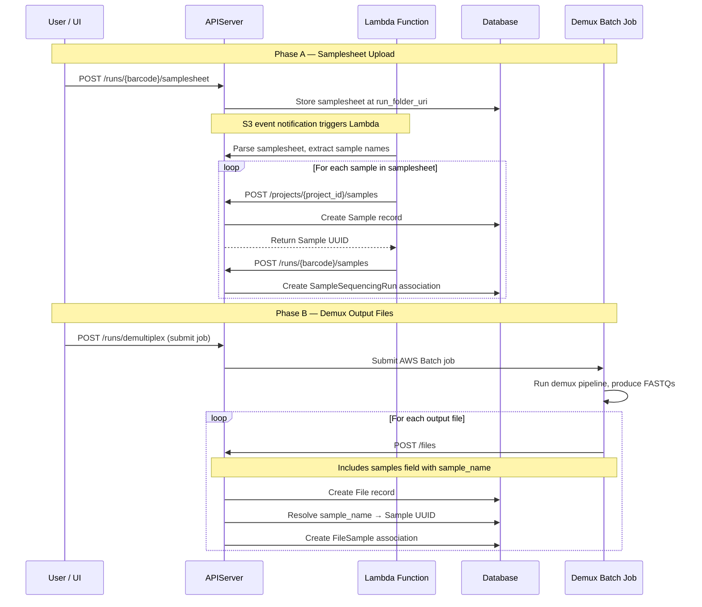
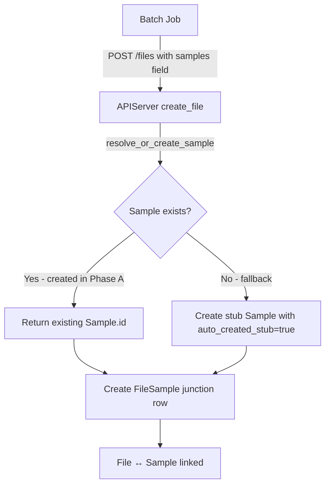
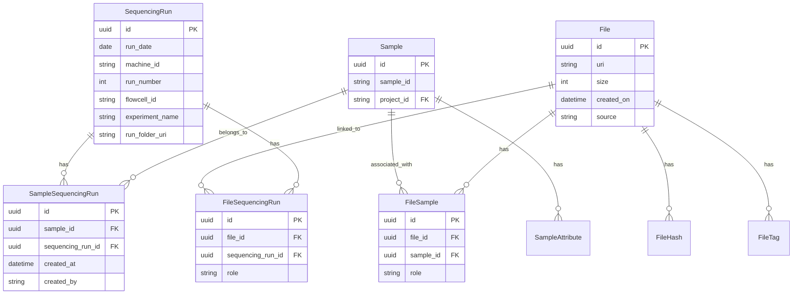
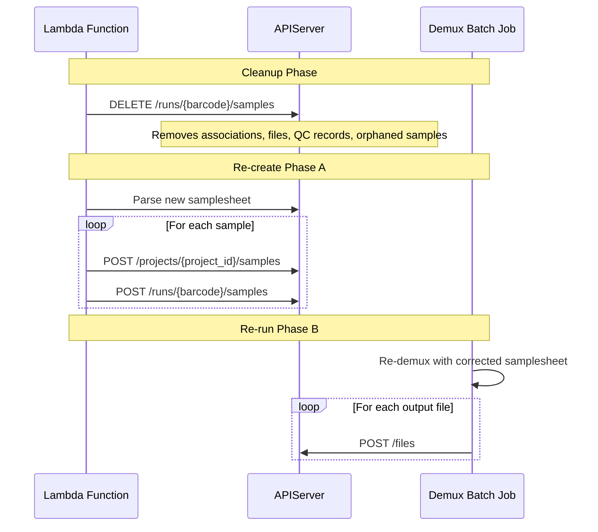

# Samplesheet-Driven Sample Creation & Demux File Association Workflow

## Overview

This document describes a two-phase workflow where:

1. **Phase A — Samplesheet Upload (Lambda):** When a user uploads a demux samplesheet to a sequencing run, a Lambda function parses the samplesheet, creates `Sample` records for each sample listed, and associates them with the sequencing run via the `SampleSequencingRun` junction table.

2. **Phase B — Demux Output (Batch Job):** After demultiplexing completes, the batch job registers the output files (FASTQs, etc.) in the `File` table and associates them with the pre-existing samples via the `FileSample` junction table.

This decoupling means samples exist in the database *before* demux begins, enabling the UI to show expected samples for a run immediately after samplesheet upload, and enabling the demux job to simply look up and associate rather than create.

---

## Architecture



---

## Phase A — Samplesheet Upload Creates Samples

### Trigger

The user uploads a samplesheet via the existing endpoint:

```
POST /runs/{run_barcode}/samplesheet
```

This stores the `SampleSheet.csv` at the run's `run_folder_uri` in S3 (handled by [`upload_samplesheet()`](api/runs/services.py:377)). After successful upload, a Lambda function is triggered.

### Lambda Responsibilities

The Lambda function:

1. **Parses the samplesheet** — Reads `SampleSheet.csv` from S3, extracts the `[Data]` section to get sample names and project IDs.

2. **Creates Sample records** — For each sample in the samplesheet, calls:
   ```
   POST /projects/{project_id}/samples
   ```
   Request body ([`SampleCreate`](api/samples/models.py:45)):
   ```json
   {
     "sample_id": "SampleName_from_samplesheet",
     "attributes": [
       {"key": "source", "value": "samplesheet"},
       {"key": "samplesheet_project", "value": "ProjectID_from_samplesheet"}
     ]
   }
   ```
   This calls [`add_sample_to_project()`](api/samples/services.py:70) which:
   - Validates the project exists
   - Creates a [`Sample`](api/samples/models.py:30) record with `sample_id` and `project_id`
   - Optionally creates [`SampleAttribute`](api/samples/models.py:20) rows
   - Indexes in OpenSearch
   - Returns the sample including its internal UUID

3. **Associates each sample with the run** — For each created sample, calls:
   ```
   POST /runs/{run_barcode}/samples
   ```
   Request body ([`SampleSequencingRunCreate`](api/runs/models.py:332)):
   ```json
   {
     "sample_id": "<uuid returned from step 2>"
   }
   ```
   This calls [`associate_sample_with_run()`](api/runs/services.py:702) which:
   - Resolves the barcode to a [`SequencingRun`](api/runs/models.py:25)
   - Validates the sample exists
   - Checks for duplicate associations (returns 409 if exists)
   - Creates a [`SampleSequencingRun`](api/runs/models.py:318) junction row

### Database State After Phase A

| Table | Records Created |
|---|---|
| `sample` | One row per sample in samplesheet |
| `sampleattribute` | Attribute rows per sample (e.g., source=samplesheet) |
| `samplesequencingrun` | One junction row per sample ↔ run pair |

At this point, the UI can display which samples are expected on the run, even though demux has not started yet.

### Error Handling

- **Duplicate samples**: If a sample with the same `sample_id` + `project_id` already exists (e.g., re-sequenced sample), the `UNIQUE(sample_id, project_id)` constraint on [`Sample`](api/samples/models.py:42) will cause a conflict. The Lambda should handle this by looking up the existing sample UUID and proceeding to the association step.

- **Duplicate associations**: If the same sample is already associated with the run, the API returns `409 Conflict` ([`associate_sample_with_run()`](api/runs/services.py:728)). The Lambda should treat this as idempotent success.

- **Re-demux cleanup**: If a samplesheet is re-uploaded (corrected project ID, etc.), the Lambda should first call:
  ```
  DELETE /runs/{run_barcode}/samples
  ```
  This triggers [`clear_samples_for_run()`](api/runs/services.py:817), which removes all associations, run-linked files, QC records, and orphaned samples — then the Lambda re-creates the correct samples.

---

## Phase B — Demux Job Registers Output Files

### Trigger

The user submits a demux job via:
```
POST /runs/demultiplex
```
This calls [`submit_demux_job()`](api/runs/services.py:638) which submits an AWS Batch job.

### Batch Job Responsibilities

After demultiplexing completes and FASTQ files are written to S3, the batch job registers each output file by calling:

```
POST /files
```

Request body ([`FileCreate`](api/files/models.py:398)):
```json
{
  "uri": "s3://bucket/runs/240315_A00001_0001_BH.../Sample1/Sample1_S1_L001_R1_001.fastq.gz",
  "size": 1234567890,
  "source": "demux-pipeline",
  "created_by": "demux-batch-job",
  "storage_backend": "S3",
  "project_id": "ProjectID",
  "sequencing_run_id": "<run-uuid>",
  "samples": [
    {"sample_name": "Sample1", "role": null}
  ],
  "hashes": {
    "md5": "abc123..."
  },
  "tags": {
    "type": "fastq",
    "format": "fastq.gz",
    "read": "R1",
    "lane": "L001"
  }
}
```

### How File ↔ Sample Association Works

The key is the `samples` field in [`FileCreate`](api/files/models.py:398). When the file is created via [`create_file()`](api/files/services.py:54), the service layer:

1. Iterates over each [`SampleInput`](api/files/models.py:392) in `samples`
2. Calls [`resolve_or_create_sample()`](api/samples/services.py:21) with `sample_name` and `project_id`
3. Since the sample already exists (created in Phase A), this resolves to the existing `Sample.id` UUID
4. Creates a [`FileSample`](api/files/models.py:82) junction row linking the file to the sample



### Important: `project_id` is Required for Sample Resolution

The [`FileCreate`](api/files/models.py:447) model enforces that `project_id` is required when `samples` are provided. This is because [`resolve_or_create_sample()`](api/samples/services.py:21) needs both `sample_name` and `project_id` to look up a sample (the uniqueness constraint on [`Sample`](api/samples/models.py:42) is on `(sample_id, project_id)`).

The batch job must know the project ID — this can be passed as an environment variable or derived from the samplesheet.

### Database State After Phase B

| Table | Records Created |
|---|---|
| `file` | One row per output file |
| `filesequencingrun` | Links each file to the sequencing run |
| `filesample` | Links each file to its sample |
| `filehash` | Hash records per file |
| `filetag` | Tag records per file |

---

## Complete Data Model

After both phases complete, the relationships look like this:



### Query: Get All Files for a Sample on a Run

```sql
SELECT f.*
FROM file f
JOIN filesample fs ON fs.file_id = f.id
JOIN sample s ON s.id = fs.sample_id
JOIN samplesequencingrun ssr ON ssr.sample_id = s.id
JOIN sequencingrun sr ON sr.id = ssr.sequencing_run_id
WHERE sr.run_date = '2026-02-27'
  AND sr.machine_id = 'A01234'
  AND sr.run_number = 191
  AND sr.flowcell_id = 'BHWGTNDMXY'
  AND s.sample_id = 'SampleName';
```

---

## Re-Demux Scenario

When a samplesheet is corrected and re-demux is needed:



The [`clear_samples_for_run()`](api/runs/services.py:817) endpoint handles the full cleanup:
- Deletes `File` records linked to the run (via `FileSequencingRun`)
- Deletes run-scoped `QCRecord` entries
- Removes all `SampleSequencingRun` associations
- Deletes orphaned `Sample` records (those with no other associations)

---

## API Endpoints Used

| Phase | Endpoint | Method | Purpose |
|-------|----------|--------|---------|
| A | `/runs/{barcode}/samplesheet` | `POST` | Upload samplesheet to S3 |
| A | `/projects/{project_id}/samples/bulk` | `POST` | **Create all samples + run associations atomically** |
| A | `/runs/{barcode}/samples` | `DELETE` | Cleanup before re-creation (re-demux) |
| B | `/runs/demultiplex` | `POST` | Submit demux batch job |
| B | `/files` | `POST` | Register output file with sample associations |
| Query | `/runs/{barcode}/samples` | `GET` | List samples for a run |

> **Bulk endpoint (new):** `POST /projects/{project_id}/samples/bulk` accepts a
> `BulkSampleCreateRequest` body with a list of `SampleCreate` items. Each item
> may include an optional `run_barcode` to associate the sample with a
> sequencing run in the same transaction. The entire batch succeeds or fails
> atomically, and the endpoint is idempotent — re-submitting the same payload
> reuses existing samples and associations.
>
> The single-sample endpoint `POST /projects/{project_id}/samples` also accepts
> an optional `run_barcode` field, eliminating the need for a separate
> association call.

### Recommended Lambda Flow (Phase A)

1. Parse the samplesheet — group samples by `project_id`.
2. For each project, issue **one** `POST /projects/{project_id}/samples/bulk`
   call containing all samples for that project, each with `run_barcode` set.
3. Upload the samplesheet via `POST /runs/{barcode}/samplesheet`.

This reduces the Lambda from **2N** API calls (create + associate per sample)
to **P + 1** calls, where **P** is the number of distinct projects in the
samplesheet (typically 1–3) and **1** is the samplesheet upload.

---

## Open Questions

1. **Multi-project samplesheets** — A single samplesheet may contain samples from multiple projects. The Lambda needs to handle grouping samples by project and creating them under the correct project. *(The bulk endpoint is per-project, so the Lambda groups and issues one call per project.)*

2. ~~**Bulk sample creation** — Currently, sample creation and run association require individual API calls per sample. For runs with many samples (e.g., 384-sample NovaSeq), this could mean ~768 API calls from the Lambda. A bulk endpoint could reduce this significantly.~~ **Resolved:** `POST /projects/{project_id}/samples/bulk` is now implemented.

3. **Sample metadata from samplesheet** — What additional samplesheet columns (Index, Index2, Description, etc.) should be stored as `SampleAttribute` records?
