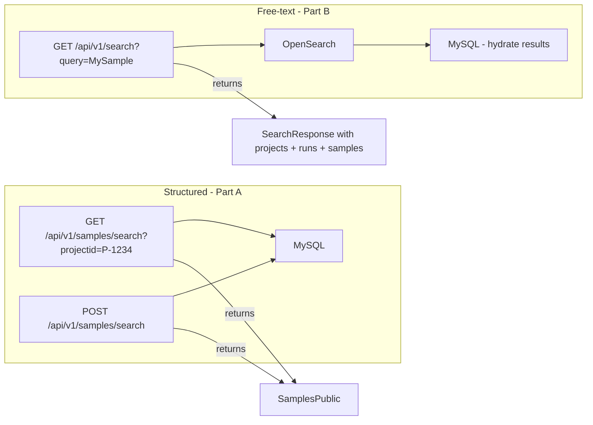

# Sample Search: Structured Filtering + Unified Free-Text

## Overview

Two complementary search capabilities for samples, each solving a different use case:

| Feature | Endpoint | Backed by | Use case |
|---------|----------|-----------|----------|
| **Part A: Structured search** | `GET/POST /api/v1/samples/search` | MySQL | Client applications filtering by exact projectid, samplename, created_on, tags/attributes |
| **Part B: Free-text search** | `GET /api/v1/search` | OpenSearch | Frontend UI search bar — type "MySample" and find matching projects, runs, AND samples |



---

## Part A: Structured SQL Search

### What it does

Exposes the legacy `/api/v0/samples/search` filtering interface on `/api/v1/samples/search` with v1 response format.

### Interface

**GET** — query params for filtering + pagination:
```
GET /api/v1/samples/search?projectid=P-1234&samplename=Sample_1&page=1&per_page=20
GET /api/v1/samples/search?created_on=2026-01-21
GET /api/v1/samples/search?assay_method=RNA-Seq
```

**POST** — JSON body with `filter_on`, `page`, `per_page`:
```json
POST /api/v1/samples/search
{
    "filter_on": {
        "projectid": "P-1234",
        "tags": {"USUBJID": "CA123012-01-234"}
    },
    "page": 1,
    "per_page": 20
}
```

**Response** — `SamplesPublic` format:
```json
{
    "data": [
        {
            "sample_id": "Sample_1",
            "project_id": "P-1234",
            "attributes": [{"key": "Tissue", "value": "Liver"}],
            "run_barcode": null
        }
    ],
    "data_cols": ["Tissue"],
    "total_items": 1,
    "total_pages": 1,
    "current_page": 1,
    "per_page": 20,
    "has_next": false,
    "has_prev": false
}
```

### Supported filters

| Filter | Behavior | Source |
|--------|----------|--------|
| `projectid` | Exact match on `Sample.project_id`; list values OR'd | Query param or `filter_on` |
| `samplename` | Exact match on `Sample.sample_id`; list values OR'd | Query param or `filter_on` |
| `created_on` | Date prefix match on `Sample.created_at` (YYYY-MM-DD) | Query param or `filter_on` |
| `tags` dict | Each key/value matched against `SampleAttribute`, case-insensitive key | `filter_on.tags` only |
| Any other key | Treated as `SampleAttribute` filter, case-insensitive key | Query param or `filter_on` |
| Multiple filters | AND'd together | All |

### Implementation steps

#### A1. Relocate reindex endpoint

**File:** `api/samples/routes.py`

The existing `POST /api/v1/samples/search` is a reindex trigger. Rename the route:
- Before: `POST /api/v1/samples/search` → `reindex_samples()`
- After: `POST /api/v1/samples/reindex` → `reindex_samples()`

#### A2. Extract shared query builder

**File:** `api/samples/services.py`

Move the `_build_query()` function from `api/legacy/services.py` into `api/samples/services.py` as `_build_sample_query()`. This is the canonical location for sample business logic.

The function handles:
- `FIELD_MAP` translation (`projectid` → `Sample.project_id`, `samplename` → `Sample.sample_id`)
- `created_on` date prefix matching
- Attribute/tag subquery filtering via `SampleAttribute`
- `selectinload(Sample.attributes)` for eager loading

No logic changes — just relocation.

#### A3. Update legacy services to import shared builder

**File:** `api/legacy/services.py`

Replace local `_build_query()` and `FIELD_MAP` with:
```python
from api.samples.services import _build_sample_query
```

Legacy `search_samples_get()` and `search_samples_post()` call the imported function. Behavior is identical; existing legacy tests pass without changes.

#### A4. Add `search_samples_v1()` service function

**File:** `api/samples/services.py`

New function that:
1. Calls `_build_sample_query()` to build the SQL statement
2. Executes a count query for `total_items`
3. Applies `offset`/`limit` for pagination
4. Maps results to `SamplePublic` objects
5. Computes `data_cols` from matched samples' attribute keys
6. Returns `SamplesPublic`

#### A5. Add `SampleSearchRequest` model

**File:** `api/samples/models.py`

```python
class SampleSearchRequest(SQLModel):
    filter_on: dict = {}
    page: int = 1
    per_page: int = 20
```

#### A6. Add GET + POST search routes

**File:** `api/samples/routes.py`

- `GET /api/v1/samples/search` — reads `request.query_params`, passes to `search_samples_v1()`
- `POST /api/v1/samples/search` — reads `SampleSearchRequest` body, passes to `search_samples_v1()`

Both return `SamplesPublic`.

#### A7. Write tests

**File:** `tests/api/test_samples_search.py` (new)

Mirror legacy test scenarios against `/api/v1/samples/search`, asserting v1 response shape:
1. GET by `projectid` 
2. GET by `samplename`
3. GET combined filters
4. GET by attribute key as query param (case-insensitive)
5. GET by `created_on`
6. GET empty results
7. GET no params returns all
8. GET with pagination params
9. POST with `filter_on` basic filter
10. POST with `filter_on.tags`
11. POST combined projectid + tags
12. POST list values (OR)
13. POST pagination
14. POST case-insensitive tag keys
15. POST empty filter returns all
16. Verify `data_cols` populated from attributes

---

## Part B: Free-Text Unified Search

### What it does

Adds samples to the existing unified search bar endpoint so typing "MySample" in the frontend also returns matching samples alongside projects and runs.

### Response change

Before:
```json
{"projects": {...}, "runs": {...}}
```

After:
```json
{"projects": {...}, "runs": {...}, "samples": {...}}
```

### Implementation steps

#### B1. Expand `Sample.__searchable__`

**File:** `api/samples/models.py`

```python
__searchable__ = ["sample_id", "project_id"]
```

This means OpenSearch documents for samples will contain both fields, so searching "P-1234" finds samples in that project.

#### B2. Add `search_samples_opensearch()` function

**File:** `api/samples/services.py`

New function following the exact pattern of `search_projects()` in `api/project/services.py`:
1. Call `define_search_body()` from `core/utils.py`
2. Execute `client.search(index="samples", body=search_body)`
3. For each hit, look up the full `Sample` from DB by UUID
4. Map to `SamplePublic`, return `SamplesPublic`

#### B3. Add `samples` to `SearchResponse`

**File:** `api/search/models.py`

```python
class SearchResponse(BaseModel):
    projects: ProjectsPublic
    runs: SequencingRunsPublic
    samples: SamplesPublic  # NEW
```

#### B4. Wire into unified search

**File:** `api/search/services.py`

```python
from api.samples.services import search_samples_opensearch

def search(...) -> SearchResponse:
    args = {session, client, query, page=1, per_page=n_results}
    return SearchResponse(
        projects=search_projects(**args),
        runs=search_runs(**args),
        samples=search_samples_opensearch(**args),
    )
```

#### B5. Modernize `reindex_samples()`

**File:** `api/samples/services.py`

Current implementation indexes one document at a time. Switch to bulk pattern:
```python
def reindex_samples(session, client):
    samples = session.exec(select(Sample)).all()
    search_docs = [SearchDocument(id=str(s.id), body=s) for s in samples]
    reset_index(client, "samples")
    add_objects_to_index(client, search_docs, "samples")
```

#### B6. Update unified search tests

**File:** `tests/api/test_search.py`

Update `test_search()` to:
1. Create a project with samples
2. Assert `"samples"` key in response
3. Verify sample data in results when searching for sample name
4. Verify empty samples when query doesn't match

---

## Files Changed Summary

| File | Part A | Part B |
|------|--------|--------|
| `api/samples/routes.py` | Rename reindex; add GET+POST search | — |
| `api/samples/services.py` | `_build_sample_query()`, `search_samples_v1()` | `search_samples_opensearch()`, modernize `reindex_samples()` |
| `api/samples/models.py` | `SampleSearchRequest` | Expand `__searchable__` |
| `api/legacy/services.py` | Import shared query builder | — |
| `api/search/models.py` | — | Add `samples` to `SearchResponse` |
| `api/search/services.py` | — | Wire `search_samples_opensearch()` |
| `tests/api/test_samples_search.py` | New: structured search tests | — |
| `tests/api/test_search.py` | — | Update unified search tests |

## Implementation Order

Part A and Part B are independent and can be done in either order. Part A is higher priority since it directly addresses the client API need. Part B is additive to the frontend.

Recommended sequence:
1. **Part A first** — delivers the primary user-facing feature
2. **Part B second** — enhances the frontend search bar

## Risks / Notes

- **Reindex endpoint rename** (A1) is a minor breaking change for admin callers of `POST /api/v1/samples/search`
- **Reindex needed after deploy** (B1/B5) — existing samples won't have `project_id` in OpenSearch until reindex is triggered
- **`SearchResponse` change** (B3) is additive — existing clients consuming `projects` and `runs` are unaffected
- **No attribute data in OpenSearch** — free-text search matches `sample_id` and `project_id` only, not attribute values. This is intentional; attribute-level search is handled by the structured SQL endpoint (Part A)
