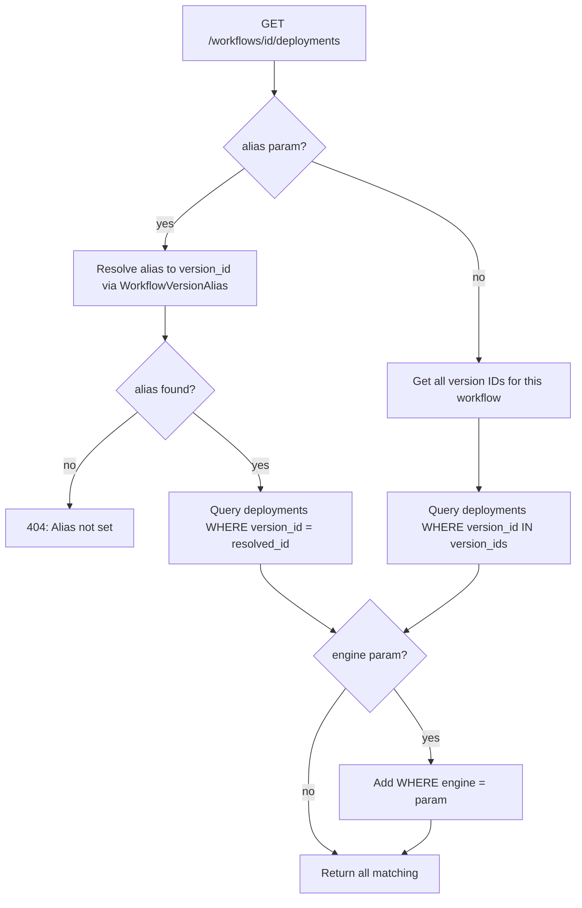

# Workflow Deployment Query Filters

## Problem

To retrieve the `external_id` of a workflow's production deployment on a specific platform, you currently need two API calls plus client-side filtering:

```
1. GET /workflows/{id}/aliases          → scan list for "production" → extract workflow_version_id
2. GET /workflows/{id}/versions/{ver}/deployments  → scan list for desired engine → extract external_id
```

**Goal:** Retrieve the production version of a workflow for a given platform with a **single API call**, without creating too many new endpoints, and with server-side filtering to avoid client-side scanning.

## Approach Evaluation: Query String Parameters

**Verdict: Query parameters are the right approach.**

### Why query params work well

| Factor | Assessment |
|--------|-----------|
| Codebase precedent | Already used throughout — `get_settings_by_tag()` in `api/settings/routes.py` uses required `Query()` params, `api/qcmetrics/routes.py` uses optional filter params, `api/files/routes.py` uses optional filter params |
| REST semantics | `GET` + optional query filters on a collection is standard REST. No params = list all; with params = server-side filter |
| Combinatorial scaling | alias × engine = 2 filter dimensions. Query params handle this cleanly. A dedicated endpoint per combination would explode |
| Backward compatibility | Optional params don't break existing callers |
| Response shape | Always returns `List[WorkflowDeploymentPublic]` — zero, one, or many items. Consistent regardless of filter combination |

### Why a dedicated endpoint would be worse

An alternative like `GET /workflows/{id}/aliases/{alias}/deployments?engine=...` was considered but:
- Adds a new deeply nested path (4 levels deep)
- Violates the "avoid too many endpoints" constraint
- Only works when you know the alias up front — doesn't help for "list all deployments across all versions"
- The alias is really a **filter dimension**, not a resource hierarchy level

### Edge case: single-result responses

With `?alias=production&engine=Arvados`, the `UNIQUE(workflow_version_id, engine)` constraint guarantees **at most one** result. The response is still a list (with 0 or 1 elements) — this keeps the contract uniform and avoids the need for a separate single-object endpoint.

## Changes

### 1. New endpoint: `GET /workflows/{id}/deployments`

A **workflow-level** registrations listing with optional query params:

```
GET /workflows/{workflow_id}/deployments
GET /workflows/{workflow_id}/deployments?alias=production
GET /workflows/{workflow_id}/deployments?engine=Arvados
GET /workflows/{workflow_id}/deployments?alias=production&engine=Arvados   ← single-call answer
```

**Query parameters:**

| Param | Type | Required | Description |
|-------|------|----------|-------------|
| `alias` | `VersionAlias` | no | Resolve alias to a version, filter deployments to that version |
| `engine` | `str` | no | Filter deployments by engine/platform name |

**Behavior matrix:**

| alias | engine | Result |
|-------|--------|--------|
| omitted | omitted | All deployments across all versions of this workflow |
| `production` | omitted | All deployments for the production version |
| omitted | `Arvados` | All Arvados deployments across all versions |
| `production` | `Arvados` | The single Arvados deployment for production version (0 or 1 items) |

**Error cases:**
- `404` if workflow not found
- `404` if `alias` specified but that alias isn't set for this workflow (semantically: "this alias doesn't exist" is different from "this alias points to a version with no deployments", which returns `[]`)

**Data flow:**



### 2. Add `?engine=` filter to existing version-level endpoint

Enhance `GET /workflows/{id}/versions/{ver}/deployments`:

```python
engine: str | None = Query(None, description="Filter by engine/platform name")
```

Minor convenience — when you already know the version UUID, you can filter by engine server-side instead of scanning the list client-side.

### 3. Add `?alias=` filter to `GET /workflows/{id}/aliases`

Enhance `GET /workflows/{id}/aliases`:

```python
alias: VersionAlias | None = Query(None, description="Filter to a specific alias")
```

When provided, returns a list with 0 or 1 elements. Lets clients resolve an alias in one call without scanning the list.

## Files to Modify

| File | Change |
|------|--------|
| `api/workflow/services.py` | Add `get_workflow_deployments_for_workflow()` service; add optional `engine` filter to `get_workflow_deployments()`; add optional `alias` filter to `get_workflow_version_aliases()` |
| `api/workflow/routes.py` | Add `GET /workflows/{id}/deployments` route with `alias` + `engine` Query params; add `engine` Query param to existing version-level deployments route; add `alias` Query param to existing aliases route |
| `tests/api/test_workflow_deployments.py` | Add tests for new workflow-level deployments endpoint, engine filtering, alias filtering |
| `tests/api/test_workflow_aliases.py` | Add test for `?alias=production` filter |
| `docs/WORKFLOWS_AND_PIPELINES.md` | Document new endpoint + query param filters |

### No schema changes needed

The response model `WorkflowDeploymentPublic` in `api/workflow/models.py` already has all the fields needed. No new Pydantic models required. No database migration needed.

## Implementation Checklist

- [ ] Add `get_workflow_deployments_for_workflow()` service function with alias + engine filtering
- [ ] Add optional `engine` param to existing `get_workflow_deployments()` service function
- [ ] Add optional `alias` param to existing `get_workflow_version_aliases()` service function
- [ ] Add `GET /workflows/{id}/deployments` route with `alias` + `engine` Query params
- [ ] Add `engine` Query param to existing version-level deployments route
- [ ] Add `alias` Query param to existing `GET /workflows/{id}/aliases` route
- [ ] Write tests for workflow-level deployments endpoint (no filter, alias only, engine only, alias+engine, alias not set → 404)
- [ ] Write tests for engine filter on version-level deployments
- [ ] Write test for alias filter on GET aliases
- [ ] Update `docs/WORKFLOWS_AND_PIPELINES.md` with new endpoint and query param docs
