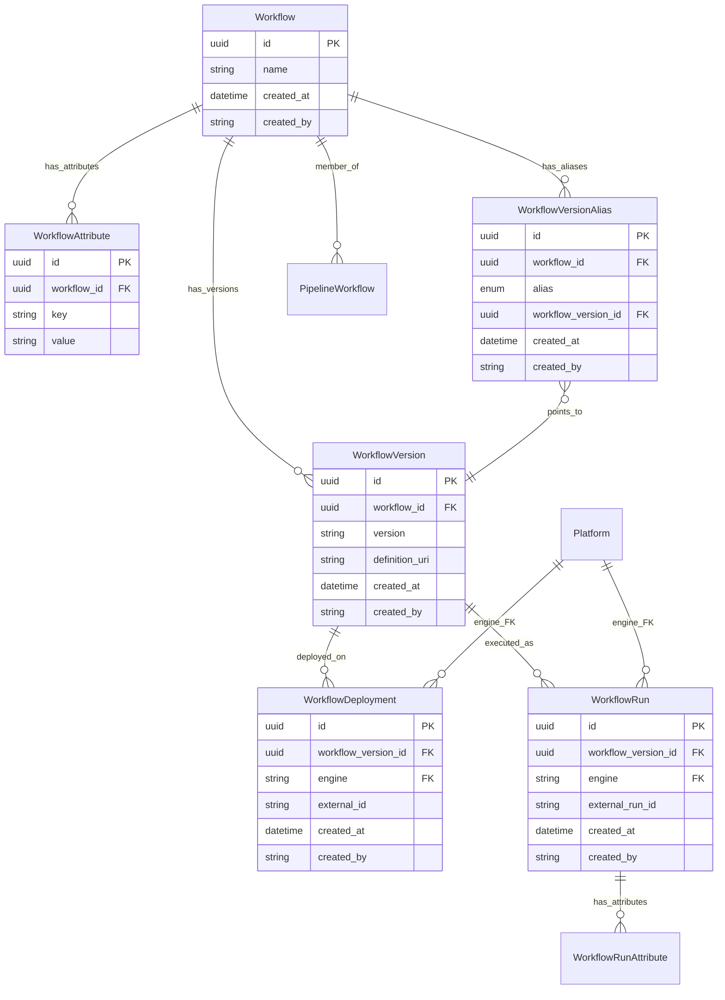
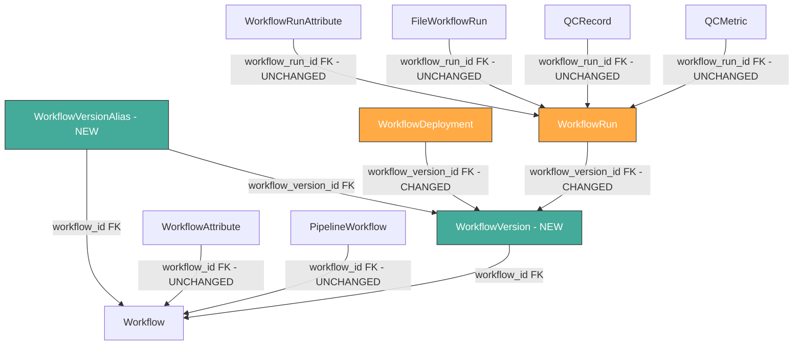

# Plan: Separate Workflow Version from Workflow

## Context

Currently, [`Workflow`](api/workflow/models.py:40) carries `version` and `definition_uri` directly on the table. This means creating a new version of the same logical workflow requires a brand-new `Workflow` row — losing the relationship between versions of the same workflow.

The team wants to:

1. **Extract version into its own table** — `WorkflowVersion` holds `version`, `definition_uri`, and FKs back to `Workflow`
2. **Add alias support** — like AWS Lambda aliases, mark specific versions as `production` or `development` via a `WorkflowVersionAlias` table with a fixed enum

## Design

### Entity Relationship Diagram (Proposed)



### Key Design Decisions

**1. `Workflow` becomes purely identity**

| Before | After |
|--------|-------|
| `id`, `name`, `version`, `definition_uri`, `created_at`, `created_by` | `id`, `name`, `created_at`, `created_by` |

`version` and `definition_uri` move to `WorkflowVersion`.

**2. `WorkflowVersion` — new table**

| Field | Type | Required | Description |
|-------|------|----------|-------------|
| `id` | UUID | auto | Primary key |
| `workflow_id` | UUID | yes | FK to `workflow.id` |
| `version` | string | yes | Semver string, e.g. `2.1.0` |
| `definition_uri` | string | yes | URI to the workflow definition file |
| `created_at` | datetime | auto | UTC timestamp |
| `created_by` | string | yes | Username of creator |

**Constraint:** `UNIQUE(workflow_id, version)` — no duplicate version strings per workflow.

**3. `WorkflowVersionAlias` — new table**

| Field | Type | Required | Description |
|-------|------|----------|-------------|
| `id` | UUID | auto | Primary key |
| `workflow_id` | UUID | yes | FK to `workflow.id` — scopes the alias |
| `alias` | enum | yes | Fixed enum: `production`, `development` |
| `workflow_version_id` | UUID | yes | FK to `workflowversion.id` |
| `created_at` | datetime | auto | UTC timestamp |
| `created_by` | string | yes | Username who set the alias |

**Constraint:** `UNIQUE(workflow_id, alias)` — one `production` pointer and one `development` pointer per workflow.

**4. `WorkflowDeployment` and `WorkflowRun` re-point to `WorkflowVersion`**

Both currently FK to `workflow.id`. Both change to FK to `workflowversion.id`:

- `WorkflowDeployment.workflow_id` → `WorkflowDeployment.workflow_version_id`
- `WorkflowRun.workflow_id` → `WorkflowRun.workflow_version_id`

The unique constraint on `WorkflowDeployment` changes from `UNIQUE(workflow_id, engine)` to `UNIQUE(workflow_version_id, engine)` — different versions can be deployed on the same engine.

**5. `PipelineWorkflow` stays at Workflow level**

Pipelines reference the logical workflow (`workflow.id`), not a specific version. Version resolution happens at execution time via aliases.

**6. `WorkflowAttribute` stays at Workflow level**

Attributes describe the workflow identity (e.g. `category=genomics`), not a specific version.

### API Changes

#### New Endpoints

| Method | Path | Description |
|--------|------|-------------|
| `POST` | `/workflows/{workflow_id}/versions` | Create a new version for a workflow |
| `GET` | `/workflows/{workflow_id}/versions` | List all versions of a workflow |
| `GET` | `/workflows/{workflow_id}/versions/{version_id}` | Get a specific version |
| `PUT` | `/workflows/{workflow_id}/aliases/{alias}` | Set/move an alias to a version |
| `GET` | `/workflows/{workflow_id}/aliases` | List aliases for a workflow |
| `DELETE` | `/workflows/{workflow_id}/aliases/{alias}` | Remove an alias |

#### Modified Endpoints

| Endpoint | Change |
|----------|--------|
| `POST /workflows` | No longer accepts `version` or `definition_uri` — just `name` and optional `attributes` |
| `GET /workflows` | Response no longer includes `version` / `definition_uri` directly; includes nested `versions` summary |
| `GET /workflows/{id}` | Same as above |
| `POST /workflows/{id}/deployments` | Now requires `workflow_version_id` in the body instead of registering against the workflow directly |
| `GET /workflows/{id}/deployments` | Returns deployments with `workflow_version_id` instead of `workflow_id` |
| `POST /workflows/{id}/runs` | Now requires `workflow_version_id` in the body |
| `GET /workflows/{id}/runs` | Returns runs with `workflow_version_id` |

#### Pipeline Impact

- [`WorkflowSummary`](api/pipeline/models.py:72) in pipeline responses currently includes `version`. After this change, it would include the workflow name but version would need to come from the alias or be omitted. Options:
  - Remove `version` from `WorkflowSummary` (simplest — pipeline references the workflow, not a version)
  - Include `production_version` from alias resolution (richer, but couples pipeline to alias system)

**Recommendation:** Remove `version` from `WorkflowSummary` for now. Pipelines are organizational and version-agnostic.

## Dependency Diagram



**Green** = new tables. **Orange** = FK changes. Everything else is unchanged.

## Impact Summary

| Layer | File | Change |
|-------|------|--------|
| **Models** | `api/workflow/models.py` | Add `WorkflowVersion`, `WorkflowVersionAlias`, `VersionAlias` enum. Remove `version`/`definition_uri` from `Workflow`. Re-point `WorkflowDeployment`/`WorkflowRun` FKs. Add new request/response schemas. |
| **Services** | `api/workflow/services.py` | Add version CRUD, alias CRUD. Update `create_workflow` to no longer accept version/definition_uri. Update deployment/run creation to use `workflow_version_id`. Update `workflow_to_public` serialization. |
| **Routes** | `api/workflow/routes.py` | Add 6 new endpoints for versions and aliases. Update existing workflow/deployment/run endpoints. |
| **Pipeline Models** | `api/pipeline/models.py` | Remove `version` from `WorkflowSummary` |
| **Pipeline Services** | `api/pipeline/services.py` | Update `pipeline_to_public` to build `WorkflowSummary` without `version` |
| **Alembic env** | `alembic/env.py` | Add `WorkflowVersion`, `WorkflowVersionAlias` to imports |
| **Migration** | `alembic/versions/<new>.py` | Create `workflowversion` and `workflowversionalias` tables. Migrate `version`/`definition_uri` data. Re-point FKs. Drop old columns. |
| **Tests** | `tests/api/test_workflows.py` | Update workflow creation tests — no longer pass version/definition_uri at workflow level |
| **Tests** | `tests/api/test_workflow_deployments.py` | Update to create version first, then register against version |
| **Tests** | `tests/api/test_workflow_runs.py` | Update to create version first, then run against version |
| **Tests** | New: `tests/api/test_workflow_versions.py` | New test file for version CRUD |
| **Tests** | New: `tests/api/test_workflow_aliases.py` | New test file for alias CRUD |
| **Tests** | `tests/api/test_pipeline_entity.py` | Update `WorkflowSummary` assertions if `version` is removed |
| **Docs** | `docs/WORKFLOWS.md` | Major rewrite — new entity descriptions, updated endpoints, new sections for versions and aliases |
| **Docs** | `docs/ER_DIAGRAM.md` | Add new entities, update relationships and FKs |
| **Docs** | `docs/PIPELINES.md` | Update `WorkflowSummary` description, note version-agnostic pipeline design |

## Verification

After all changes:

```bash
# All tests pass
make test

# Alembic migration applies cleanly
alembic upgrade head

# No stale references to old column patterns
grep -r "Workflow\.version\b" --include="*.py" api/
grep -r "Workflow\.definition_uri\b" --include="*.py" api/
```
